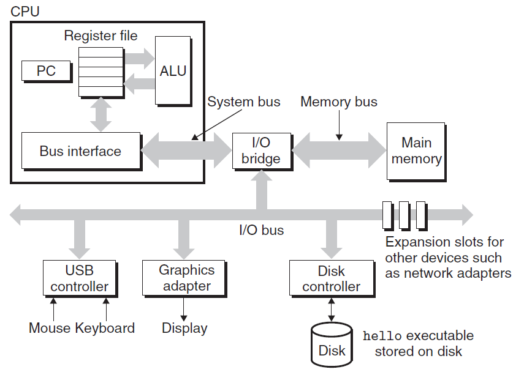
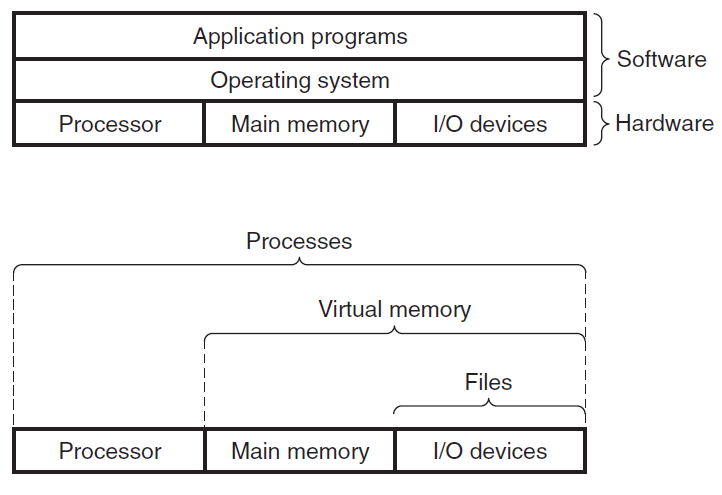

# 计算机漫游

> [《深入理解计算机系统》 - Randal E. Bryant - 第三版](https://1drv.ms/b/s!AkcJSyT7tq80bJdqo_mT5IeFTsg?e=W297XG)，第一章的读书笔记，本文中的所有代码可在[GitHub仓库](https://github.com/LittleBee1024/learning_book/tree/main/docs/booknotes/csapp/01/code)中找到

## 什么是信息
系统中所有的信息都是由一串比特表示的。例如，一个简单的["hello world"](./code/hello/main.c)程序，在计算机中被存储为一串数字。计算机在不同的上下文中，对同样的一串数字可能表示为一个整数、浮点数、字符串或者机器指令。
```bash
> hd main.c
00000000  23 69 6e 63 6c 75 64 65  20 3c 73 74 64 69 6f 2e  |#include <stdio.|
00000010  68 3e 0a 0a 69 6e 74 20  6d 61 69 6e 28 29 0a 7b  |h>..int main().{|
00000020  0a 20 20 20 70 72 69 6e  74 66 28 22 68 65 6c 6c  |.   printf("hell|
00000030  6f 2c 20 77 6f 72 6c 64  5c 6e 22 29 3b 0a 20 20  |o, world\n");.  |
00000040  20 72 65 74 75 72 6e 20  30 3b 0a 7d 0a           | return 0;.}.|
0000004d
```

因此，计算机中的信息，可以理解为**位+上下文**。当我们解释某个信息时，不仅要知道它是什么，还要知道它处于什么环境。

## 如何让程序跑起来
以["hello world"](https://github.com/LittleBee1024/learning_book/tree/main/docs/booknotes/csapp/01/code/hello/main.c)程序为例，计算机是如何通过一串数字，在屏幕上显式"hello, world"字样的？

### 生成可执行文件


上图显式了从源文件"hello.c"到可执行文件"hello"的过程，主要包括：

* 预处理阶段
* 编译阶段
* 汇编阶段
* 链接阶段

更详细的过程，可参考博文[《程序员的自我修养-编译》](../../cxydzwxy/compile/README.md)。

### 运行可执行文件



上图显式了一个完整的计算机系统需要包括的硬件，大致分为四种：

* 总线(Bus)
* I/O设备(Display, Disk)
* 主存(Memory)
* 处理器(CPU)

最初，可执行文件存在与磁盘(Disk)上。当运行程序后，会在显示器(Display)上出现"hello, world"字样。大致过程如下：

* 当我们敲击键盘输入命令，启动可执行文件后
* 在磁盘上的可执行文件通过总线，被加载到了主存
* 处理器执行主存中的一条条命令，最终将"hello, world"字符串写入寄存器文件
* 总线再从寄存器文件中复制"hello, world"字符串到显式器，最终显示在屏幕上



用户在编写应用程序的时候，并不需要知道如何和硬件打交道。那是因为，操作系统将上述硬件都做了抽象。如上图所示，操作系统位于应用层和硬件层之间。当用户工作在应用层时，他只需要知道当前操作系统的工作情况，而无需知道具体跑在什么硬件上。对于应用层的软件来说，

* I/O设备被抽象成了文件(Files)
    * 当需要操作I/O设备时，只需要知道如何读写文件即可
* 主存(包括部分I/O设备)被抽象成了虚拟地址(Virtual Memory)
    * 当需要读写主存时，只需要知道如何读写虚拟地址即可
* 一组完整的硬件操作被抽象成了进程(Process)
    * 当需要在不同硬件操作之间切换时，只需要知道如何切换进程即可

在[《Operating System Three Easy Pieces》](https://1drv.ms/b/s!AkcJSyT7tq80eXPgt-EEG122AvA)一书中，就对操作系统的这三种抽象做了详细的介绍，感兴趣的同学可以延伸阅读。
