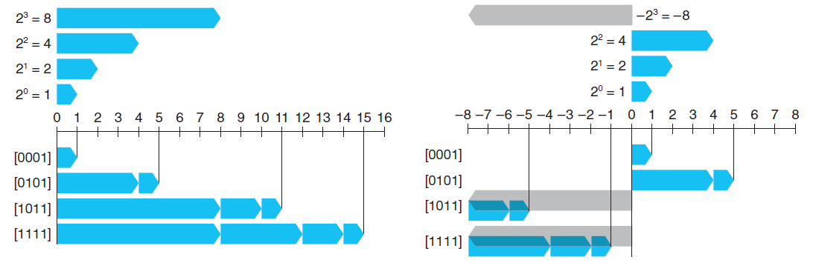
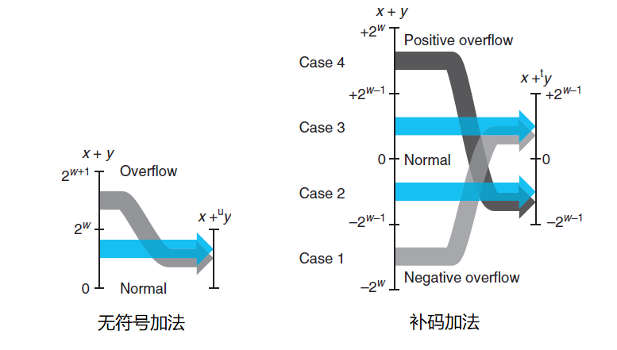

# 信息的表示和处理

> [《深入理解计算机系统》 - Randal E. Bryant - 第三版](https://1drv.ms/b/s!AkcJSyT7tq80bJdqo_mT5IeFTsg?e=W297XG)，第二章的读书笔记，本文中的所有代码可在[GitHub仓库](https://github.com/LittleBee1024/learning_book/tree/main/docs/booknotes/csapp/02/code)中找到

## 信息存储

### 数据大小

[例子"sizeof"](https://github.com/LittleBee1024/learning_book/tree/main/docs/booknotes/csapp/02/code/sizeof)打印了常见类型的大小。其中，`long`类型在32位机器上是"4 bytes"，在64位机器上是"8 bytes"。

```bash
> ./main
char: 1
short: 2
int: 4
long: 8
long long: 8
float: 4
double: 8
```
### 字节顺序

[例子"show_bytes"](https://github.com/LittleBee1024/learning_book/tree/main/docs/booknotes/csapp/02/code/show_bytes)按字节大小，打印了不同类型变量的在内存中的值。
```c++
int main()
{
    int ival = 0x3039;
    float fval = (float)ival;
    int *pval = &ival;
    show(ival);
    show(fval);
    show(pval);

    const char s[] = "abcd";
    show_bytes((byte_pointer)s, sizeof(s));
    return 0;
}
```
```bash
> ./main
 # 0x3039 int类型的变量在内存中的值
 39 30 00 00
 # 0x3039 float类型的变量在内存中的值
 00 e4 40 46
 # 0x3039 int类型的指针在内存中的值
 50 28 04 ee fe 7f 00 00
 # "abcd" 字符串在内存中的值
 61 62 63 64 00
```

上面例子中，存储字节顺序为**小端模式**，即低字节存在低地址位。

### 移位运算

| 操作 | 值 |
| --- | --- |
| 参数x | [0110_0011], [1001_0101] |
| x << 4 | [0011_0000], [0101_0000] |
| x >> 4 (逻辑右移) | [0000_0110], [0000_1001] |
| x >> 4 (算术右移) | [0000_0110], **[1111_1001]** |

上表显示了8位参数`x`的两个不同的值做不同的移位操作得到的结果。除了黑体条目之外，其他的位移操作都填充0。

在C语言中，

* 对有符号数，使用算术右移
* 对无符号说，使用逻辑右移

[例子"right_shift"](https://github.com/LittleBee1024/learning_book/tree/main/docs/booknotes/csapp/02/code/right_shift)分别对有符号树和无符号数进程了位移操作：
```c++
void logic_right_shift()
{
    printf("%s\n", __func__);
    uint8_t i = 0b10010000;
    uint8_t i2 = i >> 4;
    std::cout << "\ti: 0b" << to_bin_str(i)
        << ", (i >> 4): 0b" << to_bin_str(i2)
        << std::endl;
}

void arithmetic_right_shift()
{
    printf("%s\n", __func__);
    int8_t i = 0b10010000;
    int8_t i2 = i >> 4;
    std::cout << "\ti: 0b" << to_bin_str(i)
        << ", (i >> 4): 0b" << to_bin_str(i2)
        << std::endl;

    int8_t j = 0b01010000;
    int8_t j2 = j >> 4;
    std::cout << "\ti: 0b" << to_bin_str(j)
        << ", (i >> 4): 0b" << to_bin_str(j2)
        << std::endl;
}
```
```bash
> ./main
logic_right_shift
        i: 0b10010000, (i >> 4): 0b00001001
arithmetic_right_shift
        i: 0b10010000, (i >> 4): 0b11111001
        i: 0b01010000, (i >> 4): 0b00000101
```

## 整数

### 整数表示

对于无符号整数，采用常规二进制编码。对于有符号整数，采用补码(two's-complement)编码，将字的最高有效位解释为负权。下图显示了四位二进制的两种整数表示的结果：



### 整数转换

C语言中，无符号整数和有符号整数的规则是：

* 保持位置不变

[例子"conv"](https://github.com/LittleBee1024/learning_book/tree/main/docs/booknotes/csapp/02/code/conv)在无符号数和有符号数之间进行了转换：
```cpp
int main()
{
   short int v = -12345;
   unsigned short uv = (unsigned short) v;
   printf("v = %d, uv = %u\n", v, uv);

   unsigned short u = 0xFFFF;
   short int tu = (short int) u;
   printf("u = %u, tu = %d\n", u, tu);
   return 0;
}
```
```bash
# 53191 + 12345 = 2^16
# 65535 + 1 = 2^16
> ./main
v = -12345, uv = 53191
u = 65535, tu = -1
```

### 整数运算

下图显示了“无符号加法”和“补码加法”的各种溢出情况：

* 无符号加法会出现正溢出，导致最终结果少2^w
* 补码加法会出现正溢出和负溢出
    * 正溢出会使结果变为负数，导致最终结果相差2^w
    * 负溢出会使结果变为正数，导致最终结果也相差2^w



## 浮点数

### IEEE浮点表示

### 舍入

### 浮点运算
