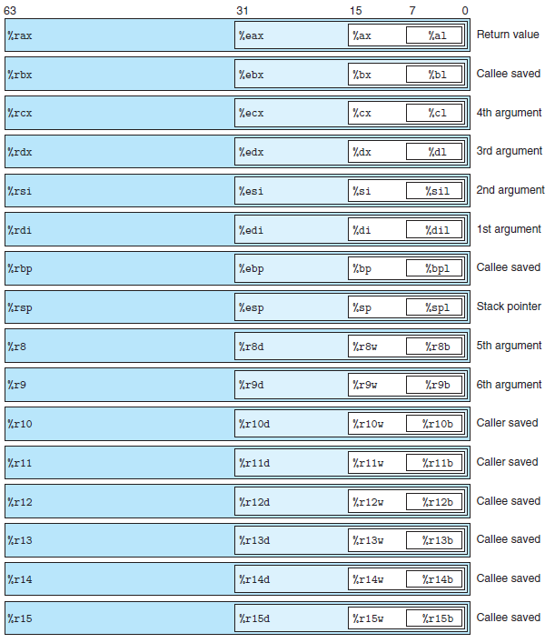
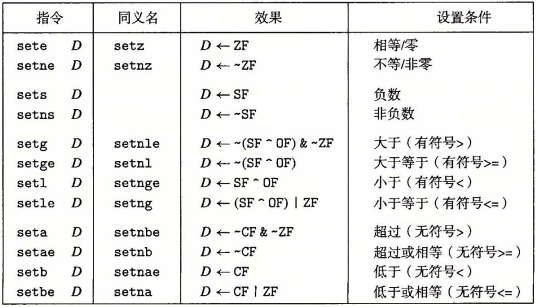
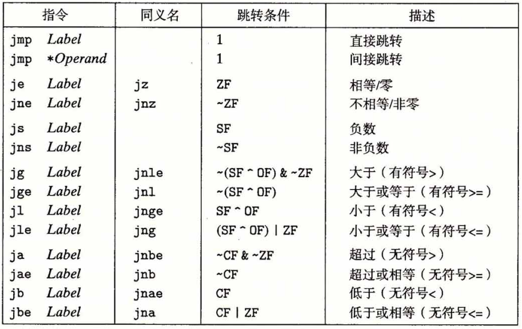
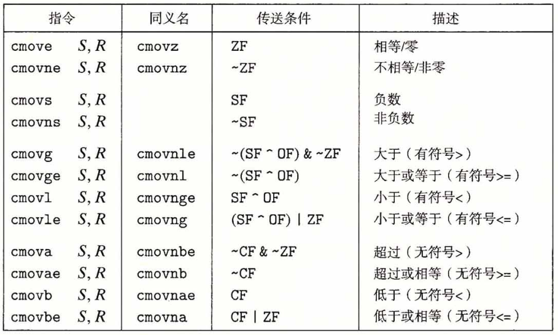
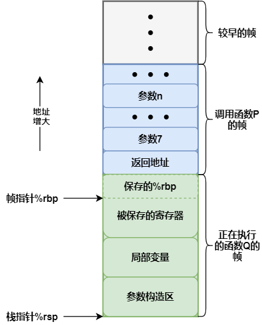
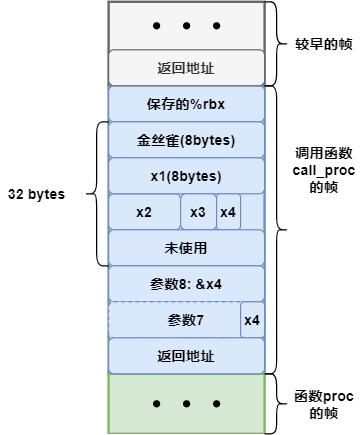

# 程序的机器表示

> [《深入理解计算机系统》 - Randal E. Bryant - 第三版](https://1drv.ms/b/s!AkcJSyT7tq80bJdqo_mT5IeFTsg?e=W297XG)，第三章的读书笔记，本文中的所有代码可在[GitHub仓库](https://github.com/LittleBee1024/learning_book/tree/main/docs/booknotes/csapp/03/code)中找到

## 程序编码

机器代码将对C语言程序员隐藏的处理器状态都变为可见，如：

* 程序计数器
    * 将要执行的下一条指令在内存中的地址，在x86-64中用`%rip`表示
* 整数寄存器文件
    * 16个命名的位置，分别存储64位的值，用来记录程序状态，如过程参数，函数返回值等
* 条件码寄存器
    * 保持最近执行的算术或逻辑指令的状态信息，用来实现`if`和`while`等语句
* 一组向量寄存器
    * 存放一共或多个整数或浮点数值，用于向量运算

[例子"mstore"](https://github.com/LittleBee1024/learning_book/tree/main/docs/booknotes/csapp/03/code/mstore)以[`-Og`编译器优化选项](https://gcc.gnu.org/onlinedocs/gcc/Optimize-Options.html)，得到`multstore`对应的汇编代码如下：

=== "链接前的汇编代码"

    ```asm
    # "objdump -d mstore.o"得到的反汇编信息
    # void multstore(long x, long y, long *dest)
    # x in %rdi, y in %rsi, dest in %rdx
    0000000000000000 <multstore>:
     0:   f3 0f 1e fa             endbr64
     4:   53                      push   %rbx               # 保存 %rbx
     5:   48 89 d3                mov    %rdx,%rbx          # 拷贝 dest 到 %rbx
     8:   e8 00 00 00 00          callq  d <multstore+0xd>  # 调用子函数
     d:   48 89 03                mov    %rax,(%rbx)        # 保存子函数返回值到 *dest
    10:   5b                      pop    %rbx               # 恢复 %rbx
    11:   c3                      retq 
    ```

=== "链接后的汇编代码"

    ```asm hl_lines="6"
    # "objdump -d main"得到的反汇编信息
    00000000000011d5 <multstore>:
        11d5:       f3 0f 1e fa             endbr64 
        11d9:       53                      push   %rbx
        11da:       48 89 d3                mov    %rdx,%rbx
        11dd:       e8 e7 ff ff ff          callq  11c9 <mult2>
        11e2:       48 89 03                mov    %rax,(%rbx)
        11e5:       5b                      pop    %rbx
        11e6:       c3                      retq   
        11e7:       66 0f 1f 84 00 00 00    nopw   0x0(%rax,%rax,1)
        11ee:       00 00
    ```

=== "C代码"

    ```cpp
    void multstore(long x, long y, long *dest)
    {
        long t = mult2(x, y);
        *dest = t;
    }
    ```

## 数据格式

| C声明 | Intel数据类型 | 汇编代码后缀 | 大小(字节) |
| --- | --- | --- | --- |
| char | 字节 | b | 1 |
| short | 字 | w | 2 |
| int | 双字 | l | 4 |
| long | 四字 | q | 8 |
| char* | 四字 | q | 8 |
| float | 单精度 | s | 4 |
| double | 双精度 | l | 8 |

如上表所示，大多数GCC生成的汇编代码指令都有一个字符的后缀，表明操作数的大小。例如，数据传送指令有四个变种：

* `movb`(传送字节，byte)
* `movw`(传送字，word)
* `movl`(传送双字，long word)
* `movq`(传送四字，quad word)。


## 访问信息

一个x86-64的中央处理器包含一组16个存储64位值的**通用目的寄存器**。

* 最初的8086中有8个16位的寄存器，即下图中的`%ax`到`%sp`
* 扩展到IA32架构时，这些寄存器也扩展成64位，标号从`%eax`到`%esp`
* 扩展到x86-64后，原来的8个寄存器扩展成64位，标号从`%rax`到`%rsp`，除此之外，还新增了8个寄存器，标号从`%r8`到`%r15`



指令可以对寄存器的低位字节中存放的不同大小的数据进行操作。当对寄存器部分字节进行操作时，其他字节遵循两条规则：

* 操作1字节和2字节的指令会保存剩下的字节不变
* 操作4字节的指令会把高位4个字节置为0

例如，下面的例子对不同字节位写入`-1`，会产生不同的结果：
```asm
movabsq $0011223344556677, %rax     # %rax = 0011223344556677
movb    $-1, %al                    # %rax = 00112233445566FF
movw    $-1, %ax                    # %rax = 001122334455FFFF
movl    $-1, %eax                   # %rax = 00000000FFFFFFFF
movq    $-1, %rax                   # %rax = FFFFFFFFFFFFFFFF
```

在常见的程序里，不同的寄存器扮演着不同的角色。例如，

* `%rsp`始终指向栈顶
* `%rbp`指向当前栈开始的地方
* 函数调用时，前6个参数依次存放在以下寄存器中
    * `%rdi`，`%rsi`，`%rdx`，`%rcx`，`%r8`，`%r9`
* `%rax`用户存放函数的返回值

更详细的介绍，可参考本文的["过程"](#_7)章节。

### 操作数指示符

x86-64支持多种操作数格式。源数据值可以是常数、或是寄存器或内存中的值。目的数据可以存放在寄存器或内存中。各种不同的操作数被分为三种类型：

* 立即数`Imm`
* 寄存器`R[ra]`
* 内存引用`M[Imm]`
    * 存在多种寻找方式

| 类型 | 格式 | 操作数值 | 名称 |
| --- | --- | --- | --- |
| 立即数 | $Imm | Imm | 立即数寻址 |
| 寄存啊 | ra | R[ra] | 寄存器寻址 |
| 存储器 | Imm | M[Imm] | 绝对寻址 |
| 存储器 | (ra) | M[R[ra]] | 间接寻址 |
| 存储器 | Imm(rb) | M[Imm + R[rb]] | (基址+偏移量)寻址 |
| 存储器 | (rb,ri) | M[R[rb]+ R[ri]] | 变址寻址 |
| 存储器 | Imm(rb,ri) | M[Imm + R[rb]+ R[ri]] | 变址寻址 |
| 存储器 | (,ri,s) | M[R[ri] * s] | 比例变址寻址 |
| 存储器 | Imm(,ri,s) | M[Imm + R[ri] * s] | 比例变址寻址 |
| 存储器 | (rb,ri,s) | M[R[rb]+ R[ri] * s] | 比例变址寻址 |
| 存储器 | Imm(rb,ri,s) | M[Imm + R[rb]+ R[ri] * s] | 比例变址寻址 |

### 数据传送指令

| 指令 | 描述 | 例子 |
| --- | --- | --- |
| mov S, D | 把数据`S`传送给`D` | movb, movw, movl, movq |
| movabsq I, R | 把四字立即数存储在寄存器`R`中 | `movabsq $0011223344556677, %rax` |
| movz S, R | 把数据`S`存储在寄存器`R`中，高位用零补齐 | movzbw, movzbl, movzwl, movzbq, movzwq |
| movs S, R | 把数据`S`存储在寄存器`R`中，高位用符号位补齐 | movsbw, movsbl, movswl, movsbq, movswq, movslq |
| cltq | 把`%eax`符号扩展到`%rax` | |

例如，下面的例子描述了不同传送指令的效果：
```asm
movabsq $0011223344556677, %rax     # %rax = 0011223344556677
movb    $0xAA, %dl                  # %dl  = AA
movb    %dl, %al                    # %rax = 00112233445566AA
movsbq  $dl, %rax                   # %rax = FFFFFFFFFFFFFFAA
movzbq  $dl, %rax                   # %rax = 00000000000000AA
```

[例子"mov"](https://github.com/LittleBee1024/learning_book/tree/main/docs/booknotes/csapp/03/code/asm_access/mov)中的`exchange`函数利用了`mov`指令，修改了指针`xp`指向的内容：

=== "汇编代码"

    ```asm
    # long exchange(long *xp, long y)
    # xp in %rdi, y in %rsi
    0000000000000000 <exchange>:
    0:   f3 0f 1e fa             endbr64
    4:   48 8b 07                mov    (%rdi),%rax     # 从地址是 %rdi 的内存中获取值(*xp)，并传递到返回值 %rax 中
    7:   48 89 37                mov    %rsi,(%rdi)     # (*xp = y)
    a:   c3                      retq
    ```

=== "C代码"

    ```cpp
    long exchange(long *xp, long y)
    {
        long x = *xp;
        *xp = y;
        return x;
    }
    ```

### 压入和弹出栈数据

| 指令 | 效果 | 描述 |
| --- | --- | --- |
| pushq S | R[%rsp] <- R[%rsp] - 8; M[R[%rsp]] <- S | 将四字压入栈 |
| popq D | D <- M[R[%rsp]]; R[%rsp] <- R[%rsp] + 8 | 将四字弹出栈 |

`pushq`和`popq`指令只有一个操作数 --- 压入的数据源和弹出的数据目的。

因为栈和程序代码都放在同以内存中，所以程序可以用标准的内存寻址方式访问栈内的任意位置。例如，假设栈顶元素是四字，指令`movq 8(%rsp), %rdx`会将第二个四字从栈中复制到寄存器`%rdx`中。

## 算术和逻辑操作

| 指令 | 效果 | 描述 |
| --- | --- | --- |
| leaq S,R | R ← &S    | 加载有效地址，目的地必须是寄存器 |
| inc  D   | D ← D+1   | 加1，可以是寄存器，也可以是一个内存位置 |
| dec  D   | D ← D−1   | 减1 |
| neg  D   | D ← -D    | 取负 |
| not  D   | D ← ~D    | 取补 |
| add  S,D | D ← D + S | 加，如果是写回内存的操作，第一个操作数必须是从内存读出 |
| sub  S,D | D ← D − S | 减 |
| imul S,D | D ← D ∗ S | 乘 |
| xor  S,D | D ← D ^ S | 异或 |
| or   S,D | D ← D | S | 或 |
| and  S,D | D ← D & S | 与 |
| sal  k,D | D ← D<<k  | 左移，移位量可以是立即数，或单字节寄存器`%cl` |
| shl  k,D | D ← D<<k  | 左移 (等同SAL) |
| sar  k,D | D ← D>>k  | 算术右移 |
| shr  k,D | D ← D>>k  | 逻辑右移 |

### 加载有效地址

加载有效地址(load effective address)指令`leaq`实际上是`movq`指令的变形，将有效地址写入目的操作数（必须是寄存器）。

[例子"lea"](https://github.com/LittleBee1024/learning_book/tree/main/docs/booknotes/csapp/03/code/asm_operate/lea)中的`scale`函数利用`leaq`指令，对`x + 4 * y + 12 * z`表达进行了求值：

=== "汇编代码"

    ```asm
    # long scale(long x, long y, long z)
    # x in %rdi, y in %rsi, z in %rdx
    0000000000000000 <scale>:
     0:   f3 0f 1e fa             endbr64 
     4:   48 8d 04 b7             lea    (%rdi,%rsi,4),%rax    # x + 4*y
     8:   48 8d 14 52             lea    (%rdx,%rdx,2),%rdx    # z + 2*z = 3*z
     c:   48 8d 04 90             lea    (%rax,%rdx,4),%rax    # (x+4*y)+4*(3*z) = x + 4*y + 12*z
    10:   c3                      retq
    ```

=== "C代码"

    ```cpp
    long scale(long x, long y, long z)
    {
        long t = x + 4 * y + 12 * z;
        return t;
    }
    ```

### 常见的算术操作

如上表所视，常见的算术操作包括：加载有效地址、一元和二元操作、移位操作等。

[例子"arith"](https://github.com/LittleBee1024/learning_book/tree/main/docs/booknotes/csapp/03/code/asm_operate/arith)中的`arith`函数对常见算术表达进行了求值：

=== "汇编代码"

    ```asm
    # long arith(long x, long y, long z)
    # x in %rdi, y in %rsi, z in %rdx
    0000000000000000 <arith>:
     0:   f3 0f 1e fa             endbr64 
     4:   48 31 f7                xor    %rsi,%rdi              # t1 = x ^ y
     7:   48 8d 04 52             lea    (%rdx,%rdx,2),%rax     # 3*z
     b:   48 c1 e0 04             shl    $0x4,%rax              # t2 = 16 * (3*z) = 48*z
     f:   81 e7 0f 0f 0f 0f       and    $0xf0f0f0f,%edi        # t3 = t1 & 0x0F0F0F0F
    15:   48 29 f8                sub    %rdi,%rax              # Return t2 - t3
    18:   c3                      retq
    ```

=== "C代码"

    ```cpp
    long arith(long x, long y, long z)
    {
        long t1 = x ^ y;
        long t2 = z * 48;
        long t3 = t1 & 0x0F0F0F0F;
        long t4 = t2 - t3;
        return t4;
    }
    ```

### 特殊的算术操作

| 指令 | 效果 | 描述 |
| --- | --- | --- |
| imulq S | R[%rdx]:R[%rax] ← S × R[%rax] | 有符号全乘法 |
| mulq S  | R[%rdx]:R[%rax] ← S × R[%rax] | 无符号全乘法 |
| cqto    | R[%rdx]:R[%rax] ← 符号扩展(R[%rax]) | 转换为八字 |
| idivq S | R[%rdx] ← R[%rdx]:R[%rax] mod S </br> R[%rax] ← R[%rdx]:R[%rax] ÷ S | 有符号除法 |
| divq S  | R[%rdx] ← R[%rdx]:R[%rax] mod S </br> R[%rax] ← R[%rdx]:R[%rax] ÷ S | 无符号除法 |

两个64位有符号或无符号整数相乘得到的乘积需要128位来表示。上表描述的是支持产生两个64位数字的全128位乘积以及整数除法的指令。

`imulq`指令有两种不同的形式：

* “双操作数”乘法指令
    * 从两个64位操作数产生一个64位乘积
* “单操作数”乘法指令
    * 计算两个64位值的全128位乘积
    * 一个参数必须在寄存器`%rax`中，另一个参数作为指令的源操作数
    * 乘积结果存放在`%rdx`(高64位)和`%rax`(低64位)中

[例子"mul"](https://github.com/LittleBee1024/learning_book/tree/main/docs/booknotes/csapp/03/code/asm_operate/mul)中的两个乘积函数分别利用了两种`imulq`指令，完成了乘法操作：

=== "“单操作数”乘法指令"

    ```asm hl_lines="6"
    # void multi_64(uint128_t *dest, uint64_t x, uint64_t y)
    # dest in %rdi, x in %rsi, y in %rdx
    0000000000000000 <multi_64>:
     0:   f3 0f 1e fa             endbr64 
     4:   48 89 f0                mov    %rsi,%rax      # x是第一个参数
     7:   48 f7 e2                mul    %rdx           # y是第二个参数，计算x*y，结果存放在 %rdx:%rax 中
     a:   48 89 07                mov    %rax,(%rdi)    # 将低64位拷贝到 dest 低位地址
     d:   48 89 57 08             mov    %rdx,0x8(%rdi) # 将高64位拷贝到 dest 高位地址
    11:   c3                      retq
    ```

=== "“双操作数”乘法指令"

    ```asm hl_lines="5"
    # void multi_32(uint64_t *dest, uint32_t a, uint32_t b)
    # dest in %rdi, a in %esi, b in %edx
    0000000000000012 <multi_32>:
    12:   f3 0f 1e fa             endbr64 
    16:   0f af f2                imul   %edx,%esi      # a*b, 结果存在 %rsi 中
    19:   48 89 37                mov    %rsi,(%rdi)    # 将结果存入 dest 中
    1c:   c3                      retq
    ```

=== "C代码"

    ```cpp
    typedef unsigned __int128 uint128_t;
    void multi_64(uint128_t *dest, uint64_t x, uint64_t y)
    {
        *dest = x * (uint128_t)y;
    }

    void multi_32(uint64_t *dest, uint32_t a, uint32_t b)
    {
        *dest = a * b;
    }
    ```

除法或取模操作都是由“单操作数”除法指令完成的，其规则如下：

* 寄存器`%rdx`(高64位)和`%rax`(低64位)中的128位数作为被除数，如果除数是一个64位的值
    * 无符号运算：`%rdx`应该设置为全0
    * 有符号运算：`%rdx`应该设置为`%rax`的符号位，可以用指令`cqto`来完成
* 除数作为指令的操作数给出
* 运算结果的商存储在寄存器`%rax`中，余数存储在寄存器`%rdx`中

[例子"div"](https://github.com/LittleBee1024/learning_book/tree/main/docs/booknotes/csapp/03/code/asm_operate/div)利用除法指令完成了无符号数`uremdiv`和有符号数`remdiv`的除法操作：

=== "“单操作数”除法指令"

    ```asm hl_lines="8 19 20"
    # void uremdiv(unsigned long x, unsigned long y, unsigned long *qp, unsigned long *rp)
    # x in %rdi, y in %rsi, qp in %rdx, rp in %rcx
    0000000000000000 <uremdiv>:
     0:   f3 0f 1e fa             endbr64 
     4:   48 89 f8                mov    %rdi,%rax      # 拷贝被除数 x 到 %rax
     7:   49 89 d0                mov    %rdx,%r8       # 保存 qp 地址，以腾出 %rdx 用于除法操作
     a:   ba 00 00 00 00          mov    $0x0,%edx      # 清零 %rdx
     f:   48 f7 f6                div    %rsi           # 执行除法操作，以 y 为除数
    12:   49 89 00                mov    %rax,(%r8)     # 将商存入 *qp
    15:   48 89 11                mov    %rdx,(%rcx)    # 将余数存入 *rp
    18:   c3                      retq   

    # void remdiv(long x, long y, long *qp, long *rp)
    # x in %rdi, y in %rsi, qp in %rdx, rp in %rcx
    0000000000000019 <remdiv>:
    19:   f3 0f 1e fa             endbr64 
    1d:   48 89 f8                mov    %rdi,%rax      # 拷贝被除数 x 到 %rax
    20:   49 89 d0                mov    %rdx,%r8       # 保存 qp 地址，以腾出 %rdx 用于除法操作
    23:   48 99                   cqto                  # 将 %rdx 设置为 %rax 的符号位
    25:   48 f7 fe                idiv   %rsi           # 执行除法操作，以 y 为除数
    28:   49 89 00                mov    %rax,(%r8)     # 将商存入 *qp
    2b:   48 89 11                mov    %rdx,(%rcx)    # 将余数存入 *rp
    2e:   c3                      retq
    ```

=== "C代码"

    ```cpp
    void uremdiv(unsigned long x, unsigned long y, unsigned long *qp, unsigned long *rp)
    {
        unsigned long q = x / y;
        unsigned long r = x % y;
        *qp = q;
        *rp = r;
    }

    void remdiv(long x, long y, long *qp, long *rp)
    {
        long q = x / y;
        long r = x % y;
        *qp = q;
        *rp = r;
    }
    ```

## 控制

### 条件码

除了前面描述的整数寄存器，CPU还维护着一组单个位的**条件码寄存器**，它们描述了**最近**的算术或逻辑操作的属性。最常见的条件码有：

* CF - 进位标志
* ZF - 零标志
* SF - 符号标志
* OF - 溢出标志

假如用`ADD`指令，完成表达式`t=a+b`的功能，会根据下面的表达式设置条件码：
```cpp
CF = (unsigned)t < (unsigned)a      // 无符号数发生溢出
ZF = (t==0)                         // 零
SF = (t<0)                          // 负数
OF = (a<0 == b<0) && (t<0 != a<0)   // 有符号数发生溢出
```

除了`leaq`指令不改变任何条件码外，其他指令都会设置条件码：

* 对于逻辑操作，例如`XOR`，进位标志和溢出标志会设置成0
* 对于移位操作，进位标志将设置为最后一个被移出的位，而溢出标志设置为0
* `INC`和`DEC`指令会设置溢出和零标志

`CMP`指令和`TEST`指令，只设置条件码而不改变任何其他寄存器。它们的操作如下：

| 指令 | 描述 |
| --- | --- |
| cmp S1, S2 | 比较(S2-S1)，根据两个操作数之差来设置条件码 |
| test S1, S2 | 测试(S1&S2)，用来指示哪些位应该被测试 |

条件码的使用方式有三种：

* 根据条件码的某种组合，将一个字节设置位0或者1，如`SET`指令
* 根据条件码跳转到程序的某个其他的部分，如`JMP`指令
* 根据条件码有条件的传送数，如`CMOV`指令

### 条件置位指令

下表是常见的`SET`指令，每条指令根据条件码的组合，将一个字节设置位0或者1：



[例子"cmp"](https://github.com/LittleBee1024/learning_book/tree/main/docs/booknotes/csapp/03/code/asm_control/cmp)通过`SET`指令和`CMP`指令，完成了两个数的比较过程：

=== "汇编代码"

    ```asm hl_lines="5 6"
    # int comp(long a, long b)
    # a in %rdi, b in %rsi
    0000000000000000 <comp>a
    0:   f3 0f 1e fa             endbr64 
    4:   48 39 f7                cmp    %rsi,%rdi   # 比较 a-b
    7:   0f 9c c0                setl   %al         # a<b 时被置1
    a:   0f b6 c0                movzbl %al,%eax    # 将结果返回，高位被清零
    d:   c3                      retq
    ```

=== "C代码"

    ```cpp
    int comp(long a, long b)
    {
        return a < b;
    }
    ```

### 条件跳转指令

下表是常见的`JMP`指令，当跳转条件满足时，跳转到一条带标号的目的地：

* 直接跳转
    * 跳转目标是作为指令的一部分编码，如：`jmp .L1`
* 间接跳转
    * 跳转目标是从寄存器或内存位置读出的，如：`jmp *%rax`，`jmp *(%rax)`



C语言中的`if-else`语句在汇编代码中被转换为`goto`版本：

=== "汇编代码的"if-else""

    ```asm
    t = test-expr;
    if (!t)
        goto false;
    then-statement
    goto done;

    false:
        else-statement
    done:
    ```

=== "C语言的"if-else""

    ```cpp
    if (test-expr)
        then-statement
    else
        else-statement
    ```

[例子"jmp"](https://github.com/LittleBee1024/learning_book/tree/main/docs/booknotes/csapp/03/code/asm_control/jmp)通过`JMP`指令和`CMP`指令，实现了`if-else`条件分支：

=== "汇编代码"

    ```asm hl_lines="6 7"
    # long absdiff(long x, long y)
    # x in %rdi, y in %rsi
    0000000000000000 <absdiff>:
     0:   f3 0f 1e fa             endbr64 
     4:   48 89 f0                mov    %rsi,%rax
     7:   48 39 f7                cmp    %rsi,%rdi              # 比较 x-y
     a:   7d 0c                   jge    18 <absdiff+0x18>      # x>=y，跳转置0x18位置
     c:   48 83 05 00 00 00 00    addq   $0x1,0x0(%rip)         # lt_cnt++
    13:   01 
    14:   48 29 f8                sub    %rdi,%rax              # result = y - x
    17:   c3                      retq   
    18:   48 83 05 00 00 00 00    addq   $0x1,0x0(%rip)         # ge_cnt++
    1f:   01 
    20:   48 29 f7                sub    %rsi,%rdi              # x = x - y
    23:   48 89 f8                mov    %rdi,%rax              # result = x
    26:   c3                      retq 
    ```

=== ""if-else"版本C代码"

    ```cpp
    long absdiff(long x, long y)
    {
        long result;
        if (x < y)
        {
            lt_cnt++;
            result = y - x;
        }
        else
        {
            ge_cnt++;
            result = x - y;
        }
        return result;
    }
    ```

=== ""goto"版本C代码"

    ```cpp
    long gotodiff(long x, long y)
    {
        long result;
        if (x >= y)
            goto x_ge_y;
        lt_cnt++;
        result = y - x;
        return result;
    x_ge_y:
        ge_cnt++;
        result = x - y;
        return result;
    }
    ```

### 条件传送指令

下表是常见的`CMOV`指令，当传送条件满足时，指令把源值S复制到目的R：



和条件跳转不同，处理器无需预测测试的结果就可以执行条件传送，因此可以避免处理器因错误预测导致性能下降。

然而，不是所有的条件表达式都可以用条件传送来编译。以`v = test-expr ? then-expr : else-expr`语句为例子，用条件传送编译这个表达式会得到以下描述：

```asm
v = then-expr;
ve = else-expr;
t = test-expr;
if (!t) v = ve;
```

条件传送的编译方式会同时对`then-expr`和`else-expr`求值。这和C语言的条件语句的执行过程是不一致的。

因此，条件传送只能用于非常受限制的情况，以提供代码运行的效率。[例子"cmov"](https://github.com/LittleBee1024/learning_book/tree/main/docs/booknotes/csapp/03/code/asm_control/cmov)只有开启了`-O1`优化选项，才能生成条件传送的汇编代码，默认情况下使用的是条件跳转指令：

=== "汇编代码"

    ```asm hl_lines="9 10"
    # long cmovdiff(long x, long y)
    # x in %rdi, y in %rsi
    0000000000000000 <cmovdiff>:
     0:   f3 0f 1e fa             endbr64 
     4:   48 89 f2                mov    %rsi,%rdx
     7:   48 29 fa                sub    %rdi,%rdx  # y-x
     a:   48 89 f8                mov    %rdi,%rax
     d:   48 29 f0                sub    %rsi,%rax  # rval = x-y
    10:   48 39 fe                cmp    %rdi,%rsi  # 比较 y-x
    13:   48 0f 4f c2             cmovg  %rdx,%rax  # 如果 y>x, rval = y-x
    17:   c3                      retq  
    ```

=== "C代码"

    ```cpp
    long cmovdiff(long x, long y)
    {
        long rval = y-x;
        long eval = x-y;
        long ntest = x >= y;
        if (ntest) rval = eval;
        return rval;
    }
    ```

### 循环

C语言提供了多种循环结构，即`do-while`、`while`和`for`。汇编中没有相应的指令存在，但可以用**条件测试**和**跳转**组合起来实现循环的效果。

* `do-while`循环

    === "汇编代码的"do-while""

        ```asm
        loop:
            body-statement
            t = test-expr;
            if (t)
                goto loop;
        ```

    === "C语言的"do-while""

        ```cpp
        do
            body-statement
            while(test-expr);
        ```

* `while`循环

    === "汇编代码的"while""

        ```asm
            goto test;
        loop:
            body-statement
        test:
            t = test-expr;
            if (t)
                goto loop;
        ```

    === "C语言的"while""

        ```cpp
        while(test-expr)
            body-statement
        ```

* `for`循环

    === "汇编代码的"for""

        ```asm
            init-expr;
            goto test;
        loop:
            body-statement
            update-expr;
        test:
            t = test-expr;
            if (t)
                goto loop;
        ```

    === "C语言的"for""

        ```cpp
        for (init-expr; test-expr; update-expr)
            body-statement
        ```

### switch语句

switch语句的关键步骤是通过**跳转表**来访问代码位置。和使用一组很长的`if-else`语句相比，使用跳转表的有点是执行开关语句的时间与开关的数量无关。

[例子"switch"](https://github.com/LittleBee1024/learning_book/tree/main/docs/booknotes/csapp/03/code/asm_control/switch)编译出的`switch`语句的汇编代码，包含一个跳转表，类似[switch_impl.c](./code/asm_control/switch/switch.c)中的`goto`版本的C代码实现：

=== "汇编代码"

    ```asm
    # void switch_eg(long x, long n, long *dest)
    # x in %rdi, n in %rsi, dest in %rdx
    switch_eg:
        subq    $100, %rsi              # index = n - 100
        cmpq    $6, %rsi                # 比较 index-6
        ja      .L8                     # 如果 index>6, 跳转到 default 分支
        leaq    .L4(%rip), %rcx         # 获取跳转表 .L4 起始地址
        movslq  (%rcx,%rsi,4), %rax     # 获取跳转表中(index-6)位置的值，即需要跳转的地址相对偏移
        addq    %rcx, %rax              # 计算出跳转地址
        notrack jmp *%rax               # 执行跳转
    .L4:
        .long    .L7-.L4                # Case 100: loc_A
        .long    .L8-.L4                # Case 101: loc_def
        .long    .L6-.L4                # Case 102: loc_B
        .long    .L5-.L4                # Case 103: loc_C
        .long    .L3-.L4                # Case 104: loc_D
        .long    .L8-.L4                # Case 105: loc_def
        .long    .L3-.L4                # Case 106: loc_D
    ```

=== "switch语句"

    ```cpp
    void switch_eg(long x, long n, long *dest)
    {
        long val = x;
        switch (n)
        {
        case 100:
            val *= 13;
            break;
        case 102:
            val += 10;
        case 103:
            val += 11;
            break;
        case 104:
        case 106:
            val *= val;
            break;
        default:
            val = 0;
        }
        *dest = val;
    }
    ```

=== ""goto"版本的switch语句"

    ```cpp
    void switch_eg_impl(long x, long n, long *dest)
    {
        static void *jt[7] = {
            &&loc_A, &&loc_def, &&loc_B, &&loc_C, &&loc_D, &&loc_def, &&loc_D
        };
        unsigned long index = n - 100;
        long val;
        if(index > 6)
            goto loc_def;
        goto *jt[index];

    loc_A:
        val = x * 13;
        goto done;
    loc_B:
        x = x + 10;
    loc_C:
        val = x + 11;
        goto done;
    loc_D:
        val = x * x;
        goto done;
    loc_def:
        val = 0;
    done:
        *dest = val;
    }
    ```

## 过程

过程是软件中一种很重要的抽象。假设过程P调用过程Q，Q执行后返回到P。这个动作包括了：

* 传递控制
* 传递数据
* 分配和释放内存

### 运行时栈

下图给出来运行时栈的通用结构：



* P的栈帧
    * 通过寄存器，过程P可以传递最多6个整数值，如果Q需要更多的参数，P需要在调用Q之前在自己的栈帧里存储好这些参数
    * 当过程P调用过程Q时，会把返回地址压入栈中，我们把这个返回地址当做P的栈帧的一部分，因为它存放的是与P相关的状态
* Q的栈帧
    * Q的代码在过程的开始，会分配它的栈帧所需的空间
        * 大多数过程的栈帧都是定长的，但有些过程需要变长的帧，在x86-64中，常用帧指针`%rbp`帮助栈帧的管理
    * 在这个空间中，Q可以保存寄存器的值，分配局部变量空间，为其调用的过程设置参数

### 控制转移

| 指令 | 描述 |
| --- | --- |
| call Label | 过程调用 |
| call *Operand | 过程调用 |
| ret | 从过程调用中返回 |

* `call`指令会执行两个动作
    * 将返回地址压入栈中，此地址是紧跟在`call`指令后面的那条指令的地址
    * 将PC寄存器设置为调用过程的起始地址
* `ret`指令也会执行两个动作
    * 从栈中弹出返回地址
    * 将PC寄存器设置为此返回地址

### 数据传送

| 操作数大小 | 参数1 | 参数2 | 参数3 | 参数4 | 参数5 | 参数6 |
| --- | --- | --- | --- | --- | --- | --- |
| 64 | %rdi | %rsi | %rdx | %rcx | %r8  | %r9  |
| 32 | %edi | %esi | %edx | %ecx | %r8d | %r9d |
| 16 | %di  | %si  | %dx  | %cx  | %r8w | %r9w |
| 8  | %dil | %sil | %dl  | %cl  | %r8b | %r9b |

x86-64中，通过寄存器最多可以传递6个整型参数。如上表所示，根据参数的位数和在函数调用中位置，会分配不同的寄存器。如果一个函数有大于6个整型参数，超出部分就要通过栈来传递。

[例子"proc_params"](https://github.com/LittleBee1024/learning_book/tree/main/docs/booknotes/csapp/03/code/proc_params)中的`proc`函数有8个参数，且大小各不相同，通过观察其汇编代码，和上面的描述是一致的：

=== "汇编代码"

    ```asm
    # void proc(long a1, long *a1p, int a2, int *a2p, short a3, short *a3p, char a4, char *a4p)
    # a1 in %rdi, a1p in %rsi
    # a2 in %edx, a2p in %rcx
    # a3 in %r8w, a3p in %r9
    # a4 at %rsp+8, a4p at %rsp+16
    0000000000000000 <proc>:
     0:   f3 0f 1e fa             endbr64 
     4:   48 8b 44 24 10          mov    0x10(%rsp),%rax    # 将 a4p 存入 %rax
     9:   48 01 3e                add    %rdi,(%rsi)        # *a1p += a1 (64位)
     c:   01 11                   add    %edx,(%rcx)        # *a2p += a2 (32位)
     e:   66 45 01 01             add    %r8w,(%r9)         # *a3p += a3 (16位)
    12:   8b 54 24 08             mov    0x8(%rsp),%edx     # 将 a4 存入 %edx (8位)
    16:   00 10                   add    %dl,(%rax)         # *a4p += a4 (8位)
    18:   c3                      retq
    ```

=== "C代码"

    ```cpp
    void proc(long a1, long *a1p, int a2, int *a2p, short a3, short *a3p, char a4, char *a4p)
    {
        *a1p += a1;
        *a2p += a2;
        *a3p += a3;
        *a4p += a4;
    }
    ```

### 栈上的局部存储

大多数情况下过程中的局部数据可存放在寄存器中，但有些情况下，局部数据必须存放在内存中：

* 寄存器不足够存放所有的本地数据
* 对一个局部变量使用了地址运算符`&`，需要产生一个地址
* 局部变量是数组或结构

[例子"proc_params"](https://github.com/LittleBee1024/learning_book/tree/main/docs/booknotes/csapp/03/code/proc_params)中的`call_proc`函数必须在栈上分配局部变量，以产生局部变量的地址，传入`proc`函数：

=== "汇编代码"

    ```asm
    # long call_proc()
    #   proc(x1, &x1, x2, &x2, x3, &x3, x4, &x4)
    0000000000000019 <call_proc>:
    19:   f3 0f 1e fa             endbr64 
    1d:   53                      push   %rbx               # 保存 %rbx 寄存器
    1e:   48 83 ec 20             sub    $0x20,%rsp         # 在栈上分配32字节空间
    22:   bb 28 00 00 00          mov    $0x28,%ebx
    27:   64 48 8b 03             mov    %fs:(%rbx),%rax    # 获取金丝雀值，用于保护栈溢出，详情参见后面的章节
    2b:   48 89 44 24 18          mov    %rax,0x18(%rsp)    # 在栈(%rsp+24)存入8字节的金丝雀值
    30:   31 c0                   xor    %eax,%eax          # 置零 %rax
    32:   48 c7 44 24 10 01 00    movq   $0x1,0x10(%rsp)    # 在栈(%rsp+16)存入8字节的x1
    39:   00 00 
    3b:   c7 44 24 0c 02 00 00    movl   $0x2,0xc(%rsp)     # 在栈(%rsp+12)存入4字节的x2
    42:   00 
    43:   66 c7 44 24 0a 03 00    movw   $0x3,0xa(%rsp)     # 在栈(%rsp+10)存入2字节的x3
    4a:   c6 44 24 09 04          movb   $0x4,0x9(%rsp)     # 在栈(%rsp+9)存入1字节的x4
    4f:   48 8d 4c 24 0c          lea    0xc(%rsp),%rcx     # 参数4寄存器 %rcx 存入&x2
    54:   48 8d 74 24 10          lea    0x10(%rsp),%rsi    # 参数2寄存器 %rsi 存入&x1
    59:   48 8d 44 24 09          lea    0x9(%rsp),%rax     # &x4 通过 %rax 入栈
    5e:   50                      push   %rax               # 入栈&x4，用于参数8，栈顶下移8字节
    5f:   6a 04                   pushq  $0x4               # 入栈x4，用于参数7，栈顶下移8字节
    61:   4c 8d 4c 24 1a          lea    0x1a(%rsp),%r9     # 参数6寄存器 %r9 存入&x3，&x3地址因栈顶变化需要更新
    66:   41 b8 03 00 00 00       mov    $0x3,%r8d          # 参数5寄存器 %r8d 存入x3
    6c:   ba 02 00 00 00          mov    $0x2,%edx          # 参数3寄存器 %edx 存入x2
    71:   bf 01 00 00 00          mov    $0x1,%edi          # 参数1寄存器 %edi 存入x1
    76:   e8 00 00 00 00          callq  7b <call_proc+0x62># 调用 proc 函数
    7b:   48 63 4c 24 1c          movslq 0x1c(%rsp),%rcx    # 将x2存入 %rcx, 函数调用前后栈顶位置不变
    80:   48 03 4c 24 20          add    0x20(%rsp),%rcx    # x1+x2
    85:   0f bf 54 24 1a          movswl 0x1a(%rsp),%edx    # 将x3存入 %edx
    8a:   0f be 44 24 19          movsbl 0x19(%rsp),%eax    # 将x4存入 %eax
    8f:   29 c2                   sub    %eax,%edx          # x3-x4
    91:   48 63 c2                movslq %edx,%rax
    94:   48 0f af c1             imul   %rcx,%rax          # (x1+x2)*(x3-x4)
    98:   48 83 c4 10             add    $0x10,%rsp         # 释放 call_proc 参数在栈上的空间
    9c:   48 8b 7c 24 18          mov    0x18(%rsp),%rdi
    a1:   64 48 33 3b             xor    %fs:(%rbx),%rdi    # 检查金丝雀值，确保栈没有被破坏
    a5:   75 06                   jne    ad <call_proc+0x94>
    a7:   48 83 c4 20             add    $0x20,%rsp         # 释放 proc 的栈空间
    ab:   5b                      pop    %rbx               # 恢复 %rbx 寄存器
    ac:   c3                      retq                      # 返回
    ad:   e8 00 00 00 00          callq  b2 <call_proc+0x99>
    ```

=== "C代码"

    ```cpp
    long call_proc()
    {
        long x1 = 1;
        int x2 = 2;
        short x3 = 3;
        char x4 = 4;
        proc(x1, &x1, x2, &x2, x3, &x3, x4, &x4);
        return (x1+x2)*(x3-x4);
    }
    ```

下图展示了`call_proc`函数的栈帧内容，其中“金丝雀”用于检验栈是否被破坏，详情可参见["栈破坏检测"](#_27)章节。



### 寄存器中的局部存储空间

根据惯例，寄存器`%rbx`、`%rbp`和`%r12~%r15`为**被调用这保存**寄存器。所有其他的寄存器，除了栈指针`%rsp`，都为**调用者保存**寄存器，任何函数都能修改他们。

[例子"proc_reg_save"](https://github.com/LittleBee1024/learning_book/tree/main/docs/booknotes/csapp/03/code/proc_reg_save)中的`P`函数在两次调用`Q`函数的过程中，利用**被调用这保存**寄存器`%rbx`和`%rbp`保存了局部变量，因此需要在调用结束时恢复寄存器`%rbx`和`%rbp`原来的值：

=== "汇编代码"

    ```asm
    # long P(long x, long y)
    # x in %rdi, y in %rsi
    0000000000000009 <P>:
     9:   f3 0f 1e fa             endbr64 
     d:   55                      push   %rbp           # 保存 %rbp
     e:   53                      push   %rbx           # 保存 %rbx
     f:   48 89 fd                mov    %rdi,%rbp      # 保存x到 %rbp
    12:   48 89 f7                mov    %rsi,%rdi      # 保存y到参数1寄存器 %rdi
    15:   e8 00 00 00 00          callq  1a <P+0x11>    # 调用 Q(y)
    1a:   48 89 c3                mov    %rax,%rbx      # 保存Q(y)的返回值
    1d:   48 89 ef                mov    %rbp,%rdi      # 保存x到参数1寄存器 %rdi
    20:   e8 00 00 00 00          callq  25 <P+0x1c>    # 调用 Q(x)
    25:   48 01 d8                add    %rbx,%rax      # 将Q(y)的返回值，加到Q(x)的返回值上
    28:   5b                      pop    %rbx           # 恢复 %rbx
    29:   5d                      pop    %rbp           # 恢复 %rbp
    2a:   c3                      retq
    ```

=== "C代码"

    ```cpp
    long P(long x, long y)
    {
        long u = Q(y);
        long v = Q(x);
        return u + v;
    }
    ```

### 递归过程

[例子"proc_reg_save"](https://github.com/LittleBee1024/learning_book/tree/main/docs/booknotes/csapp/03/code/proc_reg_save)使用寄存器`%rbx`来保存参数n，先把已有的值保存在栈上，在返回前恢复该值。因此，递归深度越深，所需要的栈空间就越大。

=== "汇编代码"

    ```asm
    # long rfact(long n)
    # n in %rdi
    0000000000000000 <rfact>:
     0:   f3 0f 1e fa             endbr64 
     4:   48 83 ff 01             cmp    $0x1,%rdi          # 比较 n-1
     8:   7f 06                   jg     10 <rfact+0x10>    # 如果n>1，跳转至0x10行
     a:   b8 01 00 00 00          mov    $0x1,%eax          # 如果n<=1，返回1
     f:   c3                      retq
    10:   53                      push   %rbx               # 入栈保存 %rbx
    11:   48 89 fb                mov    %rdi,%rbx          # 把 n 存入 %rbx
    14:   48 8d 7f ff             lea    -0x1(%rdi),%rdi    # 把 n-1 存入参数1寄存器 %rdi
    18:   e8 00 00 00 00          callq  1d <rfact+0x1d>    # 调用 rfact(n-1)
    1d:   48 0f af c3             imul   %rbx,%rax          # 将调用结果乘以 n
    21:   5b                      pop    %rbx               # 恢复 %rbx
    22:   c3                      retq                      # 返回
    ```

=== "C代码"

    ```cpp
    long rfact(long n)
    {
        long result;
        if (n <= 1)
            result = 1;
        else
            result = n * rfact(n-1);
        return result;
    }
    ```

## 缓冲区溢出保护

局部变量和状态信息都存放在栈中，C对于数组引用不进行任何边界检查，因此对数组的越界写操作会破坏栈中的状态信息。一种常见的状态破坏称为**缓冲区溢出**。现代编译器和操作系统实现了很多机制，限制入侵者通过缓冲区溢出攻击。

### 栈随机化
栈随机化的思想，利用了地址空间布局随机化(Address-Space Layout Randomization, ASLR)技术，使得栈的位置在程序每次运行时都有变化。因此，限制了对某一固定地址的攻击。其实现方式时：程序开始时，在栈上分配一段0~n字节之间的随机大小的空间。

[例子"protect_ASLR"](https://github.com/LittleBee1024/learning_book/tree/main/docs/booknotes/csapp/03/code/protect_ASLR)每次运行，都会打印不同的地址值。当然，如果利用```setarch `uname -m` -R ./main```，禁止ASLR功能，则每次打印的结构会变得一样。

```cpp
int main()
{
   long local;
   printf("local at %p\n", &local);
   return 0;
}
```
```bash
> ./main
local at 0x7ffda1b6c530
> ./main
local at 0x7ffded86af10

# 禁止ASLR运行程序
> setarch `uname -m` -R ./main
local at 0x7fffffffdf10
> setarch `uname -m` -R ./main
local at 0x7fffffffdf10
```

### 栈破坏检测

栈破坏检测能够检测到何时栈已经被破坏。其思想是在栈帧中任何局部缓冲区与栈状态之间存储一个特殊的**金丝雀**值(canary)，也称**哨兵**值(guard value)，是在程序每次运行时随机产生的。在恢复寄存器状态和从函数返回之前，程序检查这个金丝雀值是否被该函数的某个操作或者该函数调用的某个函数的某个操作改变了。如果是的，那么程序异常中止。

金丝雀值是通过指令参数`%fs:40`，用**段寻址**(segmented addressiong)从内存中读入的。将金丝雀值存放在一个特殊的段中，标志为“只读”，这样攻击者就不能覆盖存储的金丝雀值。

[例子"protect_canary"](https://github.com/LittleBee1024/learning_book/tree/main/docs/booknotes/csapp/03/code/protect_canary)默认情况下能产生拥有栈破坏检查的代码，利用`-fno-stack-protector`选项，也可以产生没有金丝雀值的代码：

=== "有"金丝雀"值的汇编代码"

    ```asm
    # void bar()
    #   foo(&x);
    #   &x in %rdi
    0000000000000021 <bar>:
    21:   f3 0f 1e fa             endbr64 
    25:   55                      push   %rbp               # 入栈保存 %rbp
    26:   48 89 e5                mov    %rsp,%rbp          # 设置帧指针 %rbp
    29:   48 83 ec 10             sub    $0x10,%rsp         # 分配16字节栈空间
    2d:   64 48 8b 04 25 28 00    mov    %fs:0x28,%rax      # 获取金丝雀值
    34:   00 00 
    36:   48 89 45 f8             mov    %rax,-0x8(%rbp)    # 将8字节金丝雀值写入栈
    3a:   31 c0                   xor    %eax,%eax
    3c:   48 c7 45 f0 01 00 00    movq   $0x1,-0x10(%rbp)   # 将8字节x值写入栈
    43:   00 
    44:   48 8d 45 f0             lea    -0x10(%rbp),%rax   # &x
    48:   48 89 c7                mov    %rax,%rdi          # 设置foo函数参数1为&x
    4b:   e8 00 00 00 00          callq  50 <bar+0x2f>      # 调用foo(&x)
    50:   90                      nop
    51:   48 8b 45 f8             mov    -0x8(%rbp),%rax    # 获取栈上的金丝雀值
    55:   64 48 33 04 25 28 00    xor    %fs:0x28,%rax      # 检测金丝雀值是否正确
    5c:   00 00 
    5e:   74 05                   je     65 <bar+0x44>
    60:   e8 00 00 00 00          callq  65 <bar+0x44>
    65:   c9                      leaveq 
    66:   c3                      retq 
    ```

=== "没有"金丝雀"值的汇编代码"

    ```asm
    # void bar()
    #   foo(&x);
    #   &x in %rdi
    0000000000000021 <bar>:
    21:   f3 0f 1e fa             endbr64 
    25:   55                      push   %rbp               # 入栈保存 %rbp
    26:   48 89 e5                mov    %rsp,%rbp          # 设置帧指针 %rbp
    29:   48 83 ec 10             sub    $0x10,%rsp         # 分配16字节栈空间
    2d:   48 c7 45 f8 01 00 00    movq   $0x1,-0x8(%rbp)    # 将8字节金丝雀值写入栈
    34:   00 
    35:   48 8d 45 f8             lea    -0x8(%rbp),%rax    # &x
    39:   48 89 c7                mov    %rax,%rdi          # 设置foo函数参数1为&x
    3c:   e8 00 00 00 00          callq  41 <bar+0x20>      # 调用foo(&x)
    41:   90                      nop
    42:   c9                      leaveq 
    43:   c3                      retq
    ```

=== "C代码"

    ```cpp
    void foo(long *x)
    {
        *x += 1;
    }

    void bar()
    {
        long x = 1;
        foo(&x);
    }
    ```

### 限制可执行代码区域

最后一招是消除攻击者向系统中插入可执行代码的能力。硬件支持多种形式的内存保护，能够指明用户程序和操作系统内核所允许的访问形式，包括：读、写和执行。栈可以被标记为可读和可写，但是不可执行，从而防止运行栈上的恶意代码。

## 其他

### 数据对齐

为了简化硬件设计，某种类型对象的地址必须是某个值K（通常时2、4或8）的倍数。

| K | 类型 |
| --- | --- |
| 1 | char |
| 2 | short |
| 4 | int, float |
| 8 | long, double, char* |

默认情况下，结构体数据对齐遵循两个原则：

* 成员变量间需要添加空隙，使每个成员变量的地址自身对齐，即自身类型大小的倍数
* 结构体末尾需要添加空隙，使结构体大小为其最大成员变量大小的倍数，这样结构体的**数组类型**也能满足对齐要求

`#pragma pack(n)`命令指定对齐值后，有效对齐值=min{自身对齐值，当前指定的对齐值}，因此可以减少结构体的大小。

[例子"data_size"](https://github.com/LittleBee1024/learning_book/tree/main/docs/booknotes/csapp/03/code/data_size)打印了不同结构体的大小：

```cpp
struct A
{
    char a;     // 0
    short b;    // 2
    int c;      // 4
};              // 8

struct B
{
    char a;     // 0
    int b;      // 4
    short c;    // 8
};              // 12

#pragma pack(2)
struct C
{
    char a;     // 0
    int b;      // 2
    short c;    // 6
};              // 8
#pragma pack()

struct D
{
    double a;   // 0
    char b;     // 8
};              // 16

#pragma pack(4)
struct E
{
    double a;   // 0
    char b;     // 8
};              // 12
#pragma pack()
```
```bash
>./main
size class A: 8
size class B: 12
size class C: 8
size class D: 16
size class E: 12
```
