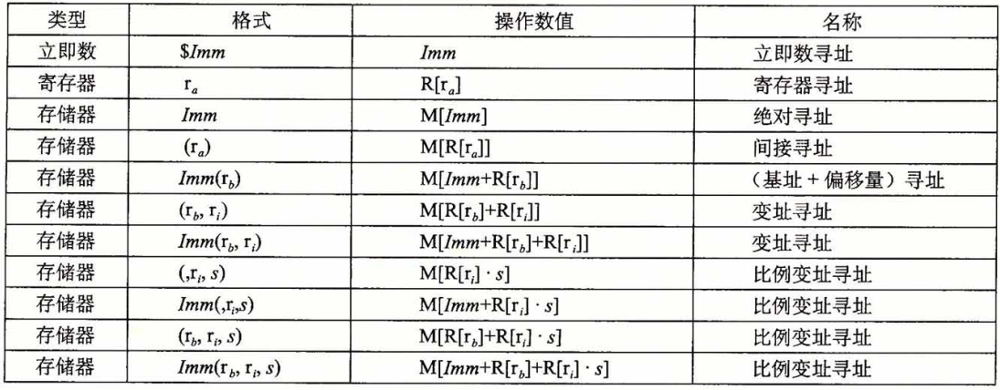

# 程序的机器表示

> [《深入理解计算机系统》 - Randal E. Bryant - 第三版](https://1drv.ms/b/s!AkcJSyT7tq80bJdqo_mT5IeFTsg?e=W297XG)，第三章的读书笔记，本文中的所有代码可在[GitHub仓库](https://github.com/LittleBee1024/learning_book/tree/main/docs/booknotes/csapp/03/code)中找到

## 程序编码

机器代码将对C语言程序员隐藏的处理器状态都变为可见，如：

* 程序计数器
    * 将要执行的下一条指令在内存中的地址
* 整数寄存器文件
    * 16个命名的位置，分别存储64位的值
* 条件码寄存器
    * 保持最近执行的算术或逻辑指令的状态信息
* 一组向量寄存器
    * 存放一共或多个整数或浮点数值，用于向量运算

[例子"mstore"](https://github.com/LittleBee1024/learning_book/tree/main/docs/booknotes/csapp/03/code/mstore)以[`-Og`编译器优化选项](https://gcc.gnu.org/onlinedocs/gcc/Optimize-Options.html)，得到`multstore`对应的汇编代码如下：

=== "链接前的汇编代码"

    ```asm
    # "objdump -d mstore.o"得到的反汇编信息
    # void multstore(long x, long y, long *dest)
    # x in %rdi, y in %rsi, dest in %rdx
    0000000000000000 <multstore>:
     0:   f3 0f 1e fa             endbr64
     4:   53                      push   %rbx               # 保存 %rbx
     5:   48 89 d3                mov    %rdx,%rbx          # 拷贝 dest 到 %rbx
     8:   e8 00 00 00 00          callq  d <multstore+0xd>  # 调用子函数
     d:   48 89 03                mov    %rax,(%rbx)        # 保存子函数返回值到 *dest
    10:   5b                      pop    %rbx               # 恢复 %rbx
    11:   c3                      retq 
    ```

=== "链接后的汇编代码"

    ```asm hl_lines="6"
    # "objdump -d main"得到的反汇编信息
    00000000000011d5 <multstore>:
        11d5:       f3 0f 1e fa             endbr64 
        11d9:       53                      push   %rbx
        11da:       48 89 d3                mov    %rdx,%rbx
        11dd:       e8 e7 ff ff ff          callq  11c9 <mult2>
        11e2:       48 89 03                mov    %rax,(%rbx)
        11e5:       5b                      pop    %rbx
        11e6:       c3                      retq   
        11e7:       66 0f 1f 84 00 00 00    nopw   0x0(%rax,%rax,1)
        11ee:       00 00
    ```

=== "C语言代码"

    ```cpp
    void multstore(long x, long y, long *dest)
    {
        long t = mult2(x, y);
        *dest = t;
    }
    ```

## 数据格式

| C声明 | Intel数据类型 | 汇编代码后缀 | 大小(字节) |
| --- | --- | --- | --- |
| char | 字节 | b | 1 |
| short | 字 | w | 2 |
| int | 双字 | l | 4 |
| long | 四字 | q | 8 |
| char* | 四字 | q | 8 |
| float | 单精度 | s | 4 |
| double | 双精度 | l | 8 |

如上表所示，大多数GCC生成的汇编代码指令都有一个字符的后缀，表明操作数的大小。例如，数据传送指令有四个变种：

* `movb`(传送字节，byte)
* `movw`(传送字，word)
* `movl`(传送双字，long word)
* `movq`(传送四字，quad word)。


## 访问信息

一个x86-64的中央处理器包含一组16个存储64位值的**通用目的寄存器**。

* 最初的8086中有8个16位的寄存器，即下图中的`%ax`到`%sp`
* 扩展到IA32架构时，这些寄存器也扩展成64位，标号从`%eax`到`%esp`
* 扩展到x86-64后，原来的8个寄存器扩展成64位，标号从`%rax`到`%rsp`，除此之外，还新增了8个寄存器，标号从`%r8`到`%r15`


指令可以对寄存器的低位字节中存放的不同大小的数据进行操作。当对寄存器部分字节进行操作时，其他字节遵循两条规则：

* 操作1字节和2字节的指令会保存剩下的字节不变
* 操作4字节的指令会把高位4个字节置为0

例如，下面的例子对不同字节位写入`-1`，会产生不同的结果：
```asm
movabsq $0011223344556677, %rax     # %rax = 0011223344556677
movb    $-1, %al                    # %rax = 00112233445566FF
movw    $-1, %ax                    # %rax = 001122334455FFFF
movl    $-1, %eax                   # %rax = 00000000FFFFFFFF
movq    $-1, %rax                   # %rax = FFFFFFFFFFFFFFFF
```

在常见的程序里，不同的寄存器扮演着不同的角色。例如，

* `%rsp`始终指向栈顶
* `%rbp`指向当前栈开始的地方
* 函数调用时，前6个参数依次存放在以下寄存器中
    * `%rdi`，`%rsi`，`%rdx`，`%rcx`，`%r8`，`%r9`
* `%rax`用户存放函数的返回值

更详细的介绍，可参考本文的["过程"](#_7)章节。

### 操作数指示符

x86-64支持多种操作数格式。源数据值可以是常数、或是寄存器或内存中的值。目的数据可以存放在寄存器或内存中。各种不同的操作数被分为三种类型：

* 立即数`Imm`
* 寄存器`R[ra]`
* 内存引用`M[Imm]`
    * 存在多种寻找方式



### 数据传送指令

| 指令 | 描述 | 例子 |
| --- | --- | --- |
| mov S, D | 把数据`S`传送给`D` | movb, movw, movl, movq |
| movabsq I, R | 把四字立即数存储在寄存器`R`中 | `movabsq $0011223344556677, %rax` |
| movz S, R | 把数据`S`存储在寄存器`R`中，高位用零补齐 | movzbw, movzbl, movzwl, movzbq, movzwq |
| movs S, R | 把数据`S`存储在寄存器`R`中，高位用符号位补齐 | movsbw, movsbl, movswl, movsbq, movswq, movslq |
| cltq | 把`%eax`符号扩展到`%rax` | |

例如，下面的例子描述了不同传送指令的效果：
```asm
movabsq $0011223344556677, %rax     # %rax = 0011223344556677
movb    $0xAA, %dl                  # %dl  = AA
movb    %dl, %al                    # %rax = 00112233445566AA
movsbq  $dl, %rax                   # %rax = FFFFFFFFFFFFFFAA
movzbq  $dl, %rax                   # %rax = 00000000000000AA
```

## 算术和逻辑操作

## 控制

## 过程
