# 处理器体系结构

> [《深入理解计算机系统》 - Randal E. Bryant - 第三版](https://1drv.ms/b/s!AkcJSyT7tq80bJdqo_mT5IeFTsg?e=W297XG)，第四章的读书笔记，本文中的所有代码可在[GitHub仓库](https://github.com/LittleBee1024/learning_book/tree/main/docs/booknotes/csapp/04/code)中找到

一个处理器支持的指令和指令的字节级编码称为它的**指令集体系结构**(Instruction-Set Architecture, ISA)。ISA在编译器编写者和处理器设计人员之间提供了一个概念抽象层，编译器编写者只需要知道允许哪些指令，以及它们是如何编码的；而处理器设计者必须建造出执行这些指令的处理器。

本章将简要介绍处理器硬件的设计：

* 首先定义一个简单的指令集“Y86-64”
* 然后介绍一种硬件控制语言(Hardware Control Language, HCL)，用于描述我们的处理器设计
    * 先设计一个基于**顺序**操作、功能正确的Y86-64处理器
    * 再创建一个**流水线**化的处理器
* 最后还会设计一些工具来研究和测试处理器设计
    * 包括Y86-64的汇编器、Y86-64的模拟器(基于HCL文件)

## Y86-64指令集体系结构

### 程序员可见的状态

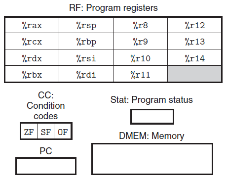

Y86-64的程序可以访问和修改程序寄存器、条件码、程序计数器和内存。这些状态相当于Y86-64的硬件接口，在接下来分析Y86_64指令的过程中，请时刻关注这些状态的变化。

### Y86-64指令

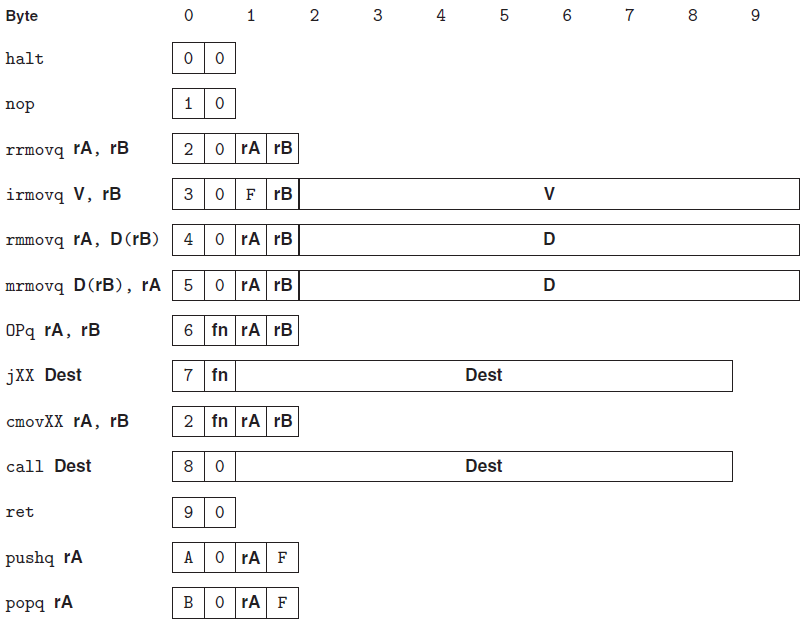

上图显示了Y86-64各指令的结构。虽然不同指令的长度和功能都不同，但是为了最大限度地复用硬件电路，每个指令都遵循相同的执行模式，详情可参考["将处理组织成阶段"](#_5)章节

### Y86-64程序

根据Y86-64指令规则，下面给出`sum`函数在Y86-64下的汇编代码：

=== "C代码"

    ```cpp
    long sum(long *start, long count)
    {
        long sum = 0;
        while (count)
        {
            sum += *start;
            start++;
            count--;
        }
        return sum;
    }
    ```

=== ""Y86-64"汇编代码"

    ```asm linenums="1"
    # long sum(long *start, long count)
    # start in %rdi, count in %rsi
    sum:
        irmovq $8,%r8       # 将常数8放入寄存器
        irmovq $1,%r9       # 将常数1放入寄存器
        xorq %rax,%rax      # sum = 0
        andq %rsi,%rsi      # 初始化条件码，非零标志
    loop:
        mrmovq (%rdi),%r10  # 获取*start值
        addq %r10,%rax      # sum += *start
        addq %r8,%rdi       # start++
        subq %r9,%rsi       # count--，并设置条件码
    test:
        jne loop            # 当count非零时，跳转
        ret
    ```

=== ""x86-64"汇编代码"

    ```asm linenums="1"
    # long sum(long *start, long count)
    # start in %rdi, count in %rsi
    sum:
        movl $0,%eax        # sum = 0
        jmp .L2             # 跳转到test
    .L3:                    # loop:
        addq (%rdi),%rax    # sum += *start
        addq $8,%rdi        # start++
        subq $1,%rsi        # count--
    test:
        testq %rsi,%rsi
        jne .L3             # 当count非零时，跳转
        ret
    ```

"Y86-64"汇编代码和"x86-64"汇编代码不同之处有：

* Y86-64需要将常数加载到寄存器，不能使用立即数
* 要实现从内存读取一个数值并将其与一个寄存器相加，Y86-64需要两条指令(第9~10行)，而x86-64只需要一条`addq`指令(第7行)

## 逻辑设计和硬件控制语言HCL

要实现一个数字系统需要三个主要的组成部分：

* 计算对位进行操作的函数的组合逻辑
* 存储位的存储单元
* 控制存储器单元更新的时钟信号

### 组合电路

将很多的逻辑门组合成一个网，就能构建计算块(computational block)，称为组合电路(combinational circuits)。如何构建这些网有几个限制：

* 每个逻辑门的输入必须是下述选项之一：
    * 一个系统输入
    * 某个存储单元的输出
    * 某个逻辑门的输出
* 两个或多个逻辑门的输出不能连接在一起
* 这个网必须是无环的，即网中不能有路径经过一系列的门而形成一个回路

### 时序电路

组合电路不存储任何信息。为了产生**时序电路**(sequential circuit)，也就是有状态并且在这个状态上进行计算的系统，我们必须引入按位存储信息的设备，包括：程序计数器、条件码、寄存器文件、内存等。时序电路是作为电路不同部分中的组合逻辑之间的屏障。

下图给出了程序计数器、状态码、寄存器文件和内存4个状态单元。组合逻辑(例如ALU)环绕着条件码寄存器，产生输入到条件码寄存器。而其他部分(例如分支计算和PC选择逻辑)又将条件码寄存器作为输入。

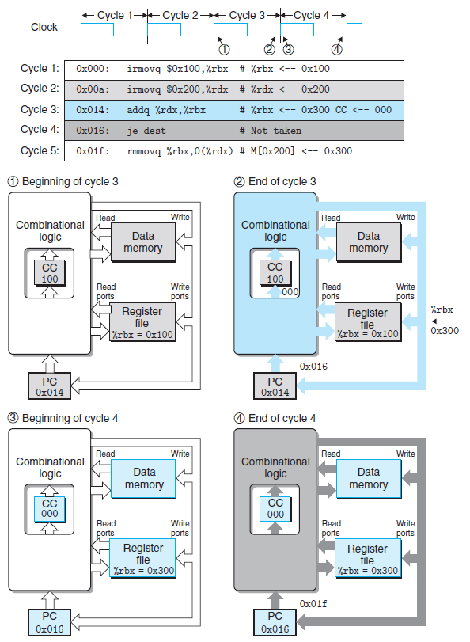

上图中蓝色部分表示`addq`指令相关单元，

* 在时钟周期3开始的时候(点1)
    * 开始`addq`指令的组合逻辑工作
    * 状态单元更新为`irmovq`指令的状态
* 在时钟周期3末尾的时候(点2)
    * **`addq`指令组合逻辑工作完成，为其状态单元准备好了新值**
    * 此时状态单元还维持着`irmovq`指令的状态
* 在时钟周期4开始的时候(点3)
    * 开始`je`指令的组合逻辑工作
    * **状态单元更新为`addq`指令的状态**
* 在时钟周期4末尾的时候(点4)
    * `je`指令组合逻辑工作完成，为其状态单元准备好了新值
    * **此时状态单元还维持着`addq`指令的状态**

### HCL表达式

硬件描述语言(Hardware Description Language, HDL)是一种用来描述硬件结构，而不是程序行为的文本表示方式。我们的`HCL`语言只表达硬件设计的控制部分。将`HCL`代码与基本硬件单元的`Verilog`代码结合起来，就能产生`HDL`描述。

`HCL`主要包括以下几类语法形式：

* 布尔表达式
    * 用于描述简单的组合电路，例如，下面的表达式描述了两个与门和一个或门的组合电路：
    ```py
    bool eq = (a && b) || (!a && !b);
    ```
* 整数表达式
    * 用于描述复杂的组合电路，例如，下面的表达式描述了字级(多位数据)相等测试电路：
    ```py
    bool Eq = (A == B);
    ```
* 情况表达式
    * 用于描述多路复用器，例如，下面的表示式描述了一个四路复用器：
    ```py
    word Out4 = [
        !s1 && !s0  : A; #00
        !s1         : B; #01
        !s0         : C; #10
        1           : D; #11
    ];
    ```
* 集合关系
    * 用于判断某个指令代码是否属于某一类指令代码
    ```py
    bool s1 = code in {2, 3};   #当code在集合{2, 3}中时，s1为1
    bool s0 = code in {1, 3};   #当code在集合{1, 3}中时，s0为1
    ```

## Y86-64顺序实现

### 将处理组织成阶段

为了统一，将Y86-64指令的执行过程分为五个阶段：

* 取值(fetch)
    * 从内存中取出不同大小的指令，获取`rA`，`rB`，`valC`，并计算`valP`
* 译码(decode)
    * 获取`valA`和`valB`
* 执行(execute)
    * 计算`valE`和状态码`CC`
* 访存(memory)
    * 读写内存，读出的内存值存于`valM`
* 写回(write back)
    * 将`valE`或`valM`写入对应的寄存器
* 更新PC(PC update)
    * 除了条件跳转指令和`ret`外，都能在取指阶段确定下一条指令的地址
        * `call`和`jmp`(无条件转移)，PC的更新值为`valC`
        * 其他指令，PC的更新值为`valP`

下面介绍不同类型的指令在各阶段的动作：

* 传送指令mov - 向寄存器或内存传递数据，不涉及条件码

    | 阶段 | rrmovq rA,rB | irmovq V,rB | rmmovq rA,D(rB) | mrmovq D(rB),rA |
    | --- | --- | --- | --- | --- |
    | 取指 | icode:ifun <- M1[PC]</br>rA:rB <- M1[PC+1]</br><br>valP <- PC+2 | icode:ifun <- M1[PC]</br>rA:rB <- M1[PC+1]</br>valC <- M8[PC+2]<br>valP <- PC+10 | icode:ifun <- M1[PC]</br>rA:rB <- M1[PC+1]</br>valC <- M8[PC+2]<br>valP <- PC+10 | icode:ifun <- M1[PC]</br>rA:rB <- M1[PC+1]</br>valC <- M8[PC+2]<br>valP <- PC+10 |
    | 译码 | valA <- R[rA]</br> | | valA <- R[rA]</br>valB <- R[rB] | </br>valB <- R[rB] |
    | 执行 | valE <- 0+valA | valE <- 0+valC | valE <- valB+valC | valE <- valB+valC |
    | 访存 | | | M8[valE] <- valA | valM <- M8[valE] |
    | 写回 | R[rB] <- valE | R[rB] <- valE | | R[rA] <- valM |
    | 更新PC | PC <- valP | PC <- valP | PC <- valP | PC <- valP |

* 算术运算指令OP - 对两个寄存器值进行算术运算，并修改条件码，不涉及内存访问

    | 阶段 | OPq rA, rB |
    | --- | --- |
    | 取指 | icode:ifun <- M1[PC]</br>rA:rB <- M1[PC+1]</br>valP <- PC+2 |
    | 译码 | valA <- R[rA] </br> valB <- R[rB] |
    | 执行 | valE <- valB OP valA</br>Set CC |
    | 访存 | |
    | 写回 | R[rB] <- valE |
    | 更新PC | PC <- valP |

* 栈操作指令 - 既要访问内存，又要访问寄存器，不涉及条件码

    | 阶段 | pushq rA | popq rA |
    | --- | --- | --- |
    | 取指 | icode:ifun <- M1[PC]</br>rA:rB <- M1[PC+1]</br>valP <- PC+2 | icode:ifun <- M1[PC]</br>rA:rB <- M1[PC+1]</br>valP <- PC+2 |
    | 译码 | valA <- R[rA]</br>valB <- R[%rsp] | valA <- R[%rsp]</br>valB <- R[%rsp] |
    | 执行 | valE <- valB+(-8) | valE <- valB+8 |
    | 访存 | M8[valE] <- valA | valM <- M8[valA] |
    | 写回 | R[%rsp] <- valE | R[%rsp] <- valE</br>R[rA] <- valM |
    | 更新PC | PC <- valP | PC <- valP |

* 跳转指令 - 对程序计数器的处理方式与其他指令不同，其他指令PC更新值都是`valP`

    | 阶段 | jXX Dest | call Dest | ret |
    | --- | --- | --- | --- |
    | 取指 | icode:ifun <- M1[PC]</br>valC <- M8[PC+1]</br>valP <- PC+9 |  icode:ifun <- M1[PC]</br>valC <- M8[PC+1]</br>valP <- PC+9 | icode:ifun <- M1[PC]</br></br>valP <- PC+1 |
    | 译码 | | </br>valB <- R[%rsp] | valA <- R[%rsp]</br>valB <- R[%rsp] |
    | 执行 | </br>Cnd <- Cond(CC, ifun) | valE <- valB+(-8) | valE <- valB+8 |
    | 访存 | | M8[valE] <- valP | valM <- M8[valA] |
    | 写回 | | R[%rsp] <- valE | R[%rsp] <- valE |
    | 更新PC | PC <- Cnd?valC:valP | PC <- valC | PC <- valM |

## Y86-64流水线实现

### 流水线的通用原理

流水线化的一个重要特性就是提高了系统的吞吐量(throughput)，不过它会轻微地增加延迟(latency)。

例如，下图在没有流水化之前，下一条指令必须在320ps之后才能执行，因此限制了吞吐量(Throughput)。

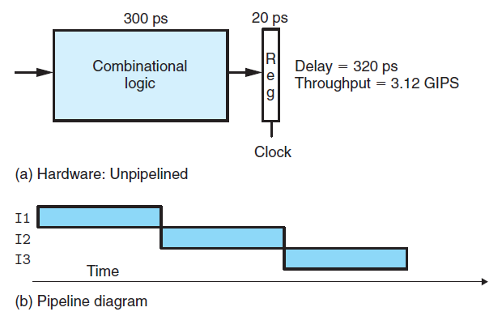

而在流水化之后，下一条指令只需要在120ps之后就能开始执行，大大提高了吞吐量。

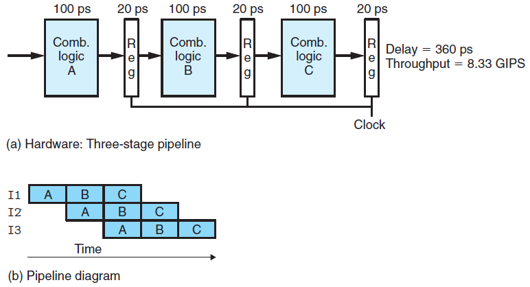

### 流水线的局限性

上面流水线的例子中，我们将计算分成三个相互独立的阶段，每个阶段需要的时间时原来逻辑的三分之一。不幸的是，会出现其他一些因素，降低流水线的效率。

* 不一致的划分
    * 流水线的运行时钟由最慢的阶段决定，下图时钟周期增大为170ps，因此吞吐量下降
    * 另外，由于时钟周期减慢了，延迟也增加到了510ps
    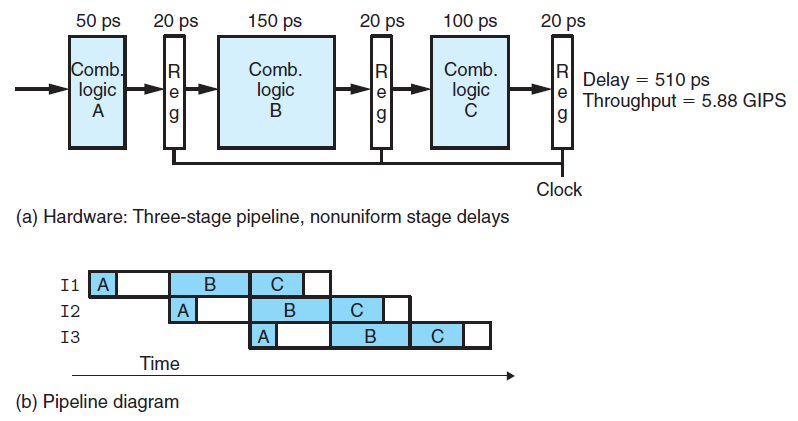
* 流水线过深，收益反而下降
    * 通过增加流水线的阶段数可以提高吞吐量，但是会增加延迟
    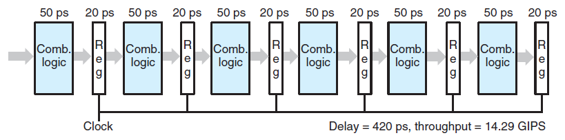
* 带反馈的流水线系统
    * 在下图中，未流水线前，I1的结果是I2的输入
    * 当流水线化后，I1的结果成为了I4的输入，这是不可接受的
    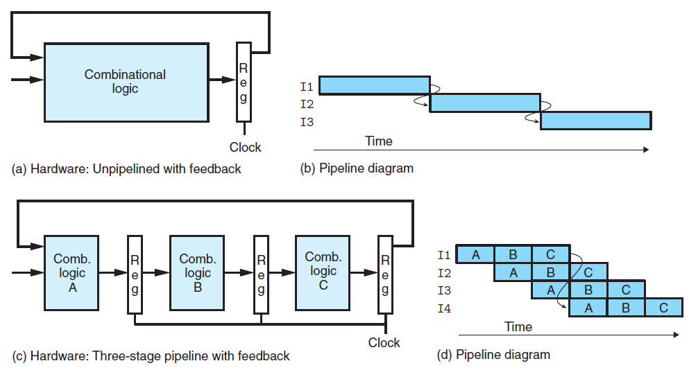

### 流水线的调整

相对于Y86-64的顺序实现，流水线实现必须解决更多的问题，例如：

* 数据冒险
    * 当前指令要用到上一条指令的计算结果，而此计算结果还未完成
        * 通过**插入流水线寄存器**或者**转发**，以提前获取计算结果
        * 通过**暂停**当前指令，以获取正确的计算结果

* 控制冒险
    * 流水线需要提前“更新PC”阶段，以在下一个周期立即获得更新的PC值，而在此阶段可能还无法确定下一条指令的位置，如：条件跳转和`ret`指令
        * 条件跳转指令，通过**预测下一个PC值**，先继续执行指令，如果预测错误，取消这些指令，并跳转到正确的位置执行
        * `ret`指令，通过**暂停**下一条指令，直到`ret`指令到达写回阶段，从内存中获取到了下一条指令的地址

* 异常
    * Y86-64在三种情况下会发生异常：1)`halt`指令，2)有非法指令和功能码组合的指令，3)取指或数据读写视图访问一个非法地址。
        * 由流水线中最深的指令引起的异常，优先级最高，以保证用户能获取最早的异常指令
        * 流水线寄存器中的状态码`stat`记录了某条指令的异常状态，以避免出现由于分支预测错误取出的指令造成的异常
        * 当指令异常时，流水线控制逻辑会禁止更新条件码寄存器或内存数据，以防止其他指令对其修改

## Y86-64各阶段实现对比

### PC选择和取指阶段

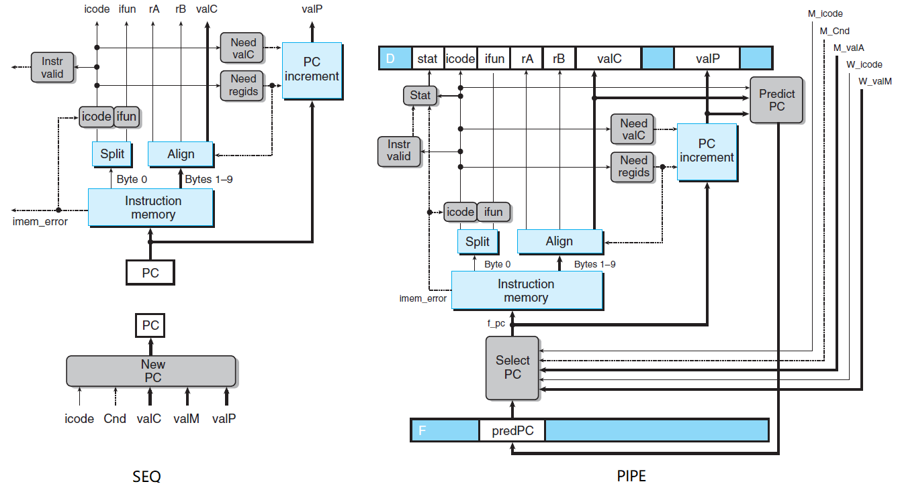

上图分别描述了SEQ和PIPE模型中的“更新PC”和“取指”阶段，

* 相同之处
    * 用于从内存中读取指令和抽取不同指令字段的硬件单元
* 不同之处
    * SEQ模型的“更新PC”阶段处在最后部分，可根据输入确定要更新的PC值，而无需预测
    * PIPE模型提前了“更新PC”阶段，因此需要预测下一个PC值，PC选择逻辑在三个值中做选择：
        * 在条件跳转指令预测失败时，从流水线寄存器M(执行和访存之间)中读出下一条指令地址`M_valA`
        * 在`ret`指令进入写回阶段时，从流水线寄存器W(访存和写回之间)中读出返回地址`W_valM`
        * 其他情况会使用存放在流水寄存器F(取指之前)中的PC的预测值`F_predPC`

### 译码和写回阶段

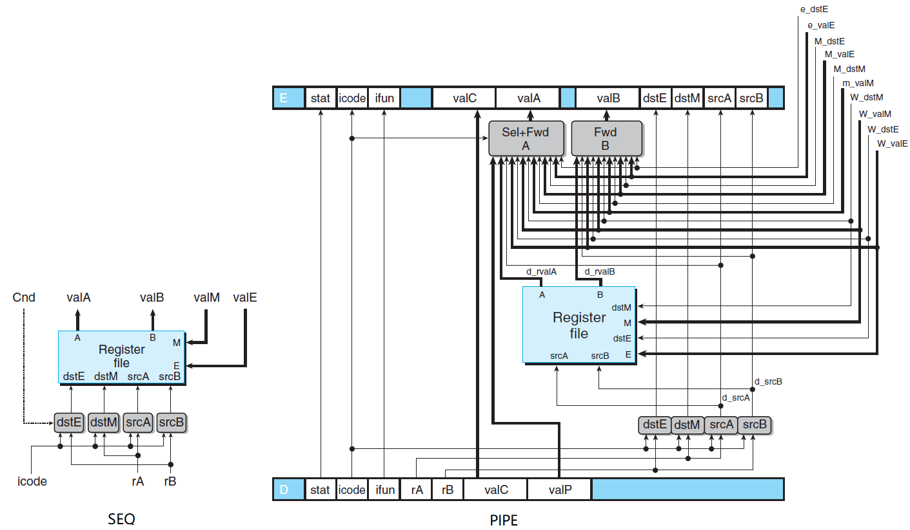

### 执行阶段

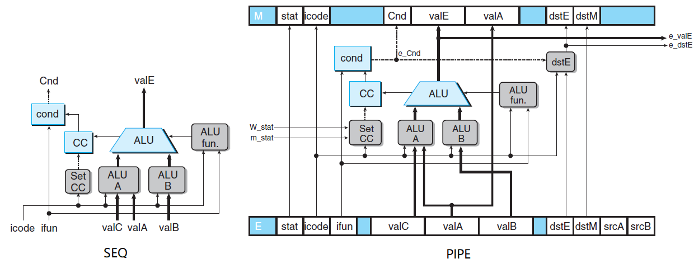

### 访存阶段

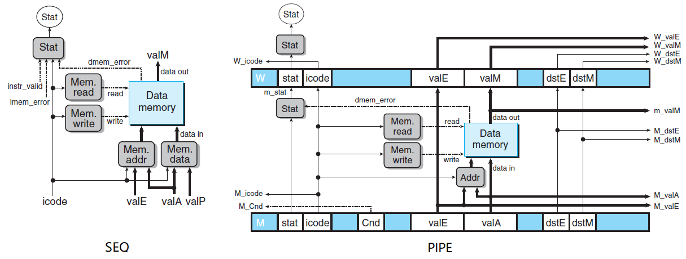
