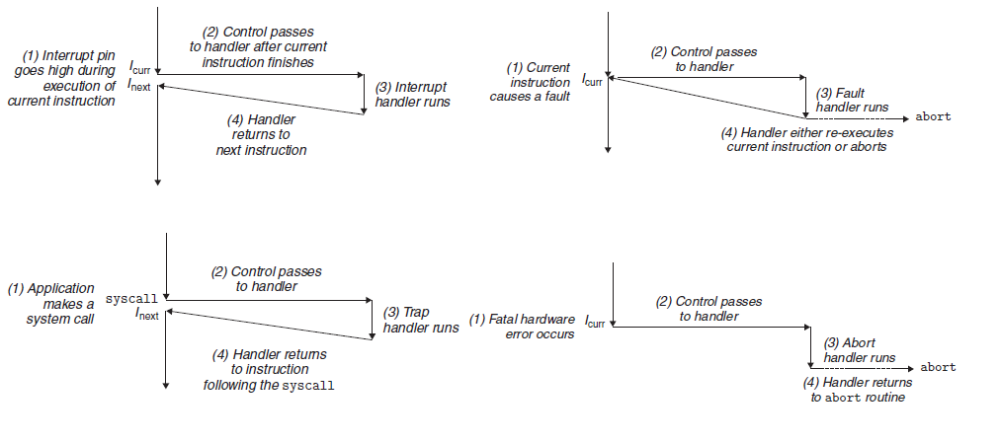
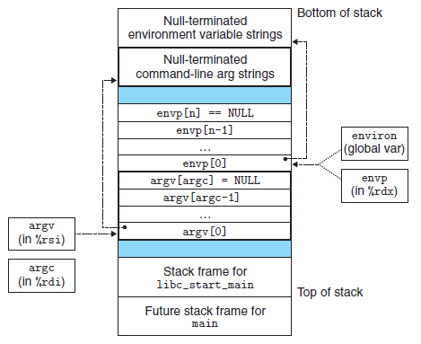
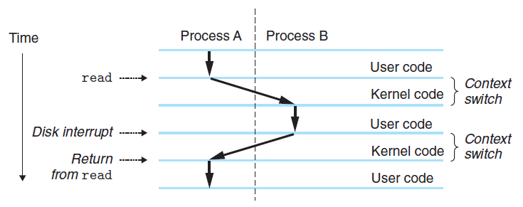
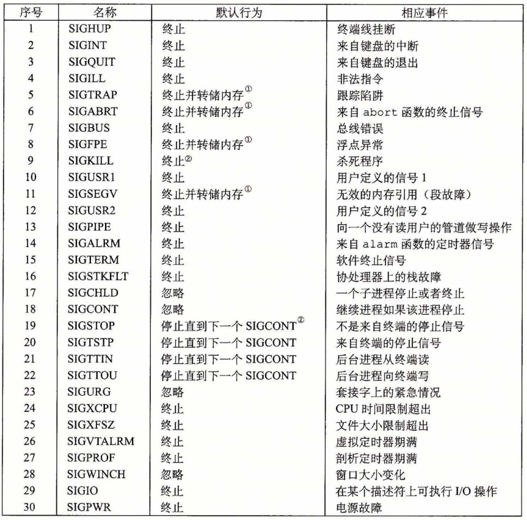

# 异常流控制

> [《深入理解计算机系统》 - Randal E. Bryant - 第三版](https://1drv.ms/b/s!AkcJSyT7tq80bJdqo_mT5IeFTsg?e=W297XG)，第八章的读书笔记，本文中的所有代码可在[GitHub仓库](https://github.com/LittleBee1024/learning_book/tree/main/docs/booknotes/csapp/08/code)中找到


异常控制流(Exceptional Control Flow, ECF)表示由非常规程序指令(`ret`，`call`等)触发的控制权跳转，其发生在计算机系统的各个层次：

* 硬件层 - 异常
    * 硬件检测的事件会触发控制突然转移到异常处理程序
* 操作系统层 - 系统调用
    * 内核通过上下文切换将控制从一个用户进程转移到另一个用户进程
* 应用层 - 信号
    * 信号接收进程接收到信号后，会将控制突然转移到它的一个信号处理程序

## 异常

异常是控制流中的突变，一部分由硬件实现，一部分由操作系统实现。异常发生的过程如下：

* 处理器检测到有事件发生
* 根据事件种类，从**异常表**中选择对应的异常处理程序地址，并进行跳转
* 当异常处理程序完成后，根据异常类型，会发生以下3种情况：
    * 将控制返回给当前指令，即当事件发生时正在执行的指令
    * 将控制返回给下一条指令，即没有发生异常将会执行的下一条指令
    * 终止被终端的程序

异常跳转的过程类似于过程调用，但也有一些不同之处：

* 异常跳转的返回地址会根据异常类型不同而不同，可能是当前指令，也可能是下一条指令
* 处理器也会保存现场，但如果控制是从用户程序转移到内核，所有这些项目都被压到内核栈，而不是压到用户栈

### 异常的类别

| 类别 | 原因 | 异步/同步 | 返回行为 |
| --- | --- | --- | --- |
| 中断 | 来自I/O设备的信号 | 异步 | 总是返回到下一条指令 |
| 陷阱 | 有意的异常，如系统调用 | 同步 | 总是返回到下一条指令 |
| 故障 | 潜在可恢复的错误 | 同步 | 可能返回到当前指令 |
| 终止 | 不可恢复的错误 | 同步 | 不会返回 |

* 异步/同步
    * 中断是来自处理器外部的I/O设备的信号的结果，是异步的
    * 除了中断，剩下的异常类型都是同步发生的，是执行当前指令的结果
* 终止/返回
    * “中断”和“陷阱”总会返回到下一条指令
    * “故障”可能返回到当前指令，也可能终止程序
    * “终止”异常肯定会终止程序



### Linux故障
* 除法错误
    * 当试图除以零，发生除法错误，Linux报告为“浮点异常(Floating exception)”，并终止程序
* 一般保护故障
    * 当引用了一个未定义的虚拟内存区域，或者试图写一个只读段，Linux报告为“段故障(Segmentation fault)”，并终止程序
* 缺页
    * 当发生缺页故障，异常处理程序将虚拟内存的一个页面映射到物理内存的一个页面，然后重新执行这条产生故障的指令

[例子"div_zero_fault"](https://github.com/LittleBee1024/learning_book/tree/main/docs/booknotes/csapp/08/code/div_zero_fault)自定义了“除法错误”的处理程序。类似地，[例子"seg_fault"](https://github.com/LittleBee1024/learning_book/tree/main/docs/booknotes/csapp/08/code/seg_fault)自定义了“段故障”的处理程序。故障的异常处理程序会返回到当前指令，因此只要异常处理程序不主动终止程序，会不断被触发。

```cpp title="Divide by Zero Fault" hl_lines="13 19 24"
void sig_handler(int signo)
{
    static int num = 0;
    if (signo == SIGFPE)
    {
        printf("Divide by zero fault happens %d times\n", num++);
    }

    const int SIGFPE_NUM = 5;
    if (num == SIGFPE_NUM)
    {
        printf("Abort the program after %d divide by zero fault\n", num);
        std::abort();
    }
}

int main()
{
    signal(SIGFPE, sig_handler);

    printf("Trigger divide by zero fault\n");
    int a = 1;
    int b = 0;
    a = a / b;

    return 0;
}
```
```bash
> ./main
Trigger divide by zero fault
Divide by zero fault happens 0 times
Divide by zero fault happens 1 times
Divide by zero fault happens 2 times
Divide by zero fault happens 3 times
Divide by zero fault happens 4 times
Abort the program after 5 divide by zero fault
Aborted (core dumped)
```

### Linux陷阱(系统调用)

Linux提供了几百种系统调用，每个系统调用都有一个唯一的整数号，对应于一个到内核中的偏移量(注意：这个跳转表和异常表不一样)，详情参见[网页](https://blog.rchapman.org/posts/Linux_System_Call_Table_for_x86_64/)。在x86-64系统上，系统调用是通过一条称为`syscall`的陷阱指令来提供的。所有系统调用的参数都是通过通用寄存器而不是栈传递的。

[例子"write_syscall"](https://github.com/LittleBee1024/learning_book/tree/main/docs/booknotes/csapp/08/code/write_syscall)用4种方法在终端打印“hello world”字符串。其中，汇编代码实现的`asm_write`函数展示了`syscall`指令的工作情况：
```cpp hl_lines="11"
int asm_write(int fd, const void* buffer, size_t size)
{
   int ret = 0;

   // write(rdi=fd, rsi=buffer, rdx=size);
   //   write system call ID = 1 (rax)
   asm("movl %1,%%edi \n\t"
       "movq %2,%%rsi \n\t"
       "movq %3,%%rdx \n\t"
       "movq $1,%%rax \n\t"
       "syscall       \n\t"
       "movl %%eax,%0 \n\t"
       :"=rm"(ret)
       :"rm"(fd),"rm"(buffer),"rm"(size));

   return ret;
}

int main()
{
   printf("hello, world0\n");
   write(1/*fileno(stdout)*/, "hello, world1\n", 14);
   syscall(SYS_write, 1, "hello, world2\n", 14);
   asm_write(1, "hello, world3\n", 14);

   return 0;
}
```
```bash
> ./main
hello, world0
hello, world1
hello, world2
hello, world3
```

## 进程

计算机系统中逻辑流有许多不同的形式，例如：

* 异常处理程序
* 信号处理程序
* 进程
* 线程

### 加载和运行



当进程的`main`函数开始执行时，用户栈的组织结构如上图所示。从栈底到栈顶依次是：

* 参数和环境字符串
* 以`NULL`结尾的`envp[]`指针数组，每个指针指向一个环境变量字符串
* 以`NULL`结尾的`argv[]`指针数组，每个指针指向一个参数字符串
* 系统启动函数`libc_start_main`的栈帧，函数调用栈的结构可参考[《Debug Hacks - 调试前的必知必会》](../../debug_hacks/basic/README.md#_4)

[例子"main_stack"](https://github.com/LittleBee1024/learning_book/tree/main/docs/booknotes/csapp/08/code/main_stack)打印了可执行文件的命令行参数和环境变量：
```cpp
int main(int argc, char *argv[], char *envp[])
{
   printf("Command line arguments:\n");
    int i = 0;
    while(argv[i] != NULL)
    {
        printf("\targv[%d]: %s\n", i, argv[i]);
        i++;
    }

    printf("Environment variables:\n");
    i = 0;
    while(envp[i] != NULL)
    {
        printf("\tenvp[%d]: %s\n", i, envp[i]);
        i++;
    }
    return 0;
}
```
```bash
> ./main arg1 arg2
Command line arguments:
        argv[0]: ./main
        argv[1]: arg1
        argv[2]: arg2
Environment variables:
        envp[0]: ...
```

### 上下文切换

操作系统内核使用一种称为**上下文切换**(context switch)的较高层形式的异常控制流来实现多任务。上下文切换机制是建立在之前的那些较低层异常机制之上的。

内核为每个进程维持一个上下文，上下文就是内核重新启动一个被抢占的进程所需的状态。包括：

* 通用目的寄存器、浮点寄存器、程序计数器、状态寄存器
* 用户栈
* 内核栈和各种内核数据结构
    * 比如描述地址空间的页表、包含有关当前进程信息的进程表，以及包含进程已打开文件的信息的文件表

在内核调度了一个新的进程运行后，它就抢占了当前进程，并使用一种称为**上下文切换**的机制来将控制转移到新的进程，过程如下：

* 保存当前进程的上下文
* 恢复某个先前被抢占的进程被保存的上下文
* 将控制传递给这个新恢复的进程

上下文切换由操作系统内核控制，常见情况有：

* 内核同步触发
    * 如果系统调用因为等待某个事件而阻塞，内核可以让当前进程休眠，切换到另一个进程
    * `sleep`系统调用，它会显式地请求让调用进程休眠，切换到另一个进程
* 中断异步触发
    * 每次发生定时器中断时，内核就能判定当前进程已经运行了足够长的事件，从而切换到另一个进程



上图展示了一对进程A和B之间上下文切换的示例。在这个例子中，

* 进程A初始运行在用户模式
* 通过系统调用`read`陷入到内核
    * 内核中的陷阱处理程序请求来自磁盘控制器的DMA传输，并设置DMA完成中断
* 由于磁盘读取需要较长时间，内核执行从进程A到进程B的**上下文切换**
    * 切换前，内核代表进程A在内核模式下执行指令
    * 切换中，内核开始代表进程B在内核模式下执行指令
    * 切换后，内核代表进程B在用户模式下执行指令
* 进程B在用户模式下运行一段时间，直到磁盘发出DMA完成中断信号
* 内核判定进程B已经运行足够长的时间，就执行一个从进程B到进程A的上**下文切换**
    * 将控制返回给进程A中紧随在系统调用`read`之后的那条指令

## 信号

Linux信号是一种更高层的软件形式的异常。常见的信号有：

* SIGFPE
    * 如果一个进程试图除以0，那么内核就发送给它一个SIGFPE信号(号码8)
* SIGILL
    * 如果一个进程执行一条非法指令，那么内核就发送给它一个SIGILL信号(号码4)
* SIGSEGV
    * 如果进程进行非法内存引用，内核就发送它一个SIGSEGV信号(号码11)
* SIGINT
    * 如果当进程在前台运行时，你键入Ctrl+C，那么内核会发送一个SIGINT信号(号码2)给这个前台进程组中的每个进程
* SIGKILL
    * 一个进程可以通过向另一个进程发送一个SIGINT信号(号码9)强制终止它
* SIGCHLD
    * 当一个子进程终止或者停止时，内核会发送一个SIGCHLD信号(号码17)给父进程

下表展示了所有信号的默认行为和相应事件：



### 信号术语

* 发送信号
    * 原因有两个：
        * 内核检测到一个系统事件，如除零错误或者子进程终止
        * 一个进程调用了`kill`函数，显式地要求内核发送一个信号给目的进程

* 接收信号
    * 进程可以忽略这个信号，终止或者通过执行一个称为**信号处理函数**(signal handler)的用户层函数捕获这个信号

* 待处理信号
    * 一个发出而没有被接收的信号
    * 任何时刻，一种类型至多只会有一个待处理信号。如果一个进程有一个类型为k的待处理信号，那么任何接下来发送到这个进程的类型为k的信号都会被简单地丢弃

### 编写信号处理程序

在编写信号处理程序时，需要处理以下几个方面：

* 处理程序与主程序并发运行，共享同样的全局变量，因此可能与主程序和其他处理程序互相干扰
* 如何以及何时接收信号的规则常常有违人的直觉
* 不同的系统有不同的信号处理语义

[例子"pending_sig"](https://github.com/LittleBee1024/learning_book/tree/main/docs/booknotes/csapp/08/code/pending_sig)在父进程中捕获“SIGCHLD”信号，并利用`waitpid`回收终止的子进程资源，以防止出现僵尸进程：

```cpp hl_lines="12 17"
int setSignal(int signum, sighandler_t handler)
{
    struct sigaction action;

    action.sa_handler = handler;
    // sigaction函数的默认行为是：触发处理函数的信号，在处理函数执行过程中是被阻塞的
    sigemptyset(&action.sa_mask);
    // 如果可能，在处理函数结束后继续执行被中断的系统调用。否则，被中断的慢速系统调用
    // 在信号处理程序返回时不再继续，而是立即返回给用户一个错误条件，并将errno设置为EINTR
    action.sa_flags = SA_RESTART;

    return sigaction(signum, &action, NULL);
}

void handler(int sig)
{
    int childPID = waitpid(-1, NULL, 0);
    printf("[Signal] Handle %d signal from child %d\n", sig, childPID);
    // 延长信号处理时间，以产生待处理信号
    sleep(1);
}

int main()
{
    setSignal(SIGCHLD, handler);

    for (int i = 0; i < 3; i++)
    {
        if (fork() == 0)
        {
            printf("[Child] Hello from child %d\n", (int)getpid());
            return 0;
        }
    }

    printf("[Parent] Processing\n");
    ...
}
```
```bash hl_lines="4 13"
> ./main
[Child] Hello from child 47360
[Parent] Processing
[Child] Hello from child 47362
[Signal] Handle 17 signal from child 47360
[Child] Hello from child 47361
[Signal] Handle 17 signal from child 47361
^Z
> ps
    PID TTY          TIME CMD
   2427 pts/4    00:00:01 bash
  47359 pts/4    00:00:00 main
  47362 pts/4    00:00:00 main <defunct>
  47399 pts/4    00:00:00 ps
```

从例子的输出中我们注意到，尽管子进程发送了3个“SIGCHLD”信号给父进程，但是其中只有两个信号被接收了(分别来自`PID-47360`和`PID-47361`)，来自`PID-47362`的“SIGCHLD”信号被丢弃了。因此父进程只回收了两个子进程。子进程“47362”变成了ig僵死进程。其过程如下：

* 父进程接收并捕获了第一个“SIGCHL”信号
* 当处理程序还在处理第一个信号时，
    * 第二个信号就传送并添加到了待处理信号集合里
    * 同时，第三个信号也到达了，因为已经有一个待处理的“SIGCHL”信号，第三个“SIGCHL”信号直接被丢弃
* 所以虽然子进程一共发了三个“SIGCHL”信号，但是父进程只触发了两次信号处理程序，也就只回收了两个子进程(哪两个子进程由`waitpid`决定)

由此得到的教训是：**不可以用信号来对其他进程中发生的事件计数**。

为了修复上面的问题，可修改信号处理程序，让一次处理回收尽可能多的僵死进程。可参考[例子"pending_sig2"](https://github.com/LittleBee1024/learning_book/tree/main/docs/booknotes/csapp/08/code/pending_sig2)：

```cpp hl_lines="4"
void handler(int sig)
{
    int childPID = 0;
    while((childPID = waitpid(-1, NULL, 0)) > 0)
    {
        printf("[Signal] Handle %d signal from child %d\n", sig, childPID);
    }
    // extend the time of signal handler
    sleep(1);
}
```

### 同步流以避免并发错误

信号处理程序和其他进程是并发运行的，当对某一全局的变量进行操作的时候，需要考虑操作的**互斥性**和**顺序性**。

[例子"sig_mask"](https://github.com/LittleBee1024/learning_book/tree/main/docs/booknotes/csapp/08/code/sig_mask)在主程序中向列表中添加子进程号，在信号处理程序中从列表中删除子进程号。因此需要保证：

* `addjob`和`deletejob`不能同时被调用
* 对于同一个子进程PID，应先`addjob`，再在终止时`deletejob`

```cpp hl_lines="9 11 30 35 40 42"
void handler(int sig)
{
    sigset_t mask_all, mask_recover;
    sigfillset(&mask_all);
    int pid = 0;
    while ((pid = waitpid(-1, NULL, 0)) > 0)
    {
        // 在操作列表前将所有信号屏蔽，防止“deletejob”被并发执行
        sigprocmask(SIG_BLOCK, &mask_all, &mask_recover);
        deletejob(pid);
        sigprocmask(SIG_SETMASK, &mask_recover, NULL);
    }
}

int main(int argc, char **argv)
{
    sigset_t mask_all, mask_recover;
    sigfillset(&mask_all);

    sigset_t mask_chld;
    sigemptyset(&mask_chld);
    sigaddset(&mask_chld, SIGCHLD);

    setSignal(SIGCHLD, handler);
    initjobs();

    for (int i = 0; i < 3; i++)
    {
        // 屏蔽“SIGCHLD”信号，防止子进程过早结束，导致“deletejob”先于“addjob”被调用
        sigprocmask(SIG_BLOCK, &mask_chld, &mask_recover);
        int pid = fork();
        if (pid == 0)
        {
            // 在子进程中恢复“SIGCHLD”信号，因为子进程对信号的设置是继承与父进程的
            sigprocmask(SIG_SETMASK, &mask_recover, NULL);
            printf("[Child] Hello from child %d\n", (int)getpid());
            return 0;
        }
        // 在操作列表前将所有信号屏蔽，防止“addjob”和“deletejob”被并发执行
        sigprocmask(SIG_BLOCK, &mask_all, NULL);
        addjob(pid);
        sigprocmask(SIG_SETMASK, &mask_recover, NULL);
    }

    printf("[Parent] Processing\n");
    ...
}
```
```bash
> ./main 
[Global] Init jobs
[Global] Add 51694 PID to jobs
[Global] Add 51695 PID to jobs
[Global] Add 51696 PID to jobs
[Parent] Processing
[Child] Hello from child 51696
[Global] Remove 51696 PID from jobs
[Child] Hello from child 51695
[Global] Remove 51695 PID from jobs
[Child] Hello from child 51694
[Global] Remove 51694 PID from jobs
```

## 非本地跳转

C语言提供了一种用户级异常控制流形式，称为非本地跳转(nonlocal jump)，它将控制直接从一共函数转移到另一个当前正在执行的函数，而不需要警告正常的调用-返回序列。常规代码由`setjum`和`longjmp`函数完成非本地跳转。在信号处理程序中由`sigsetjmp`和`siglongjmp`函数完成非本地跳转。

* `setjmp`/`sigsetjmp`函数在env缓冲区中保存当前调用环境，以供后面的`longjmp`/`siglongjmp`使用，并返回0，返回值不能被赋值给变量，只能用在`switch`或条件语句中
* `longjmp`/`siglongjmp`函数从env缓冲区中恢复调用环境，然后触发以供从最近异常初始化env的`setjmp`调用的返回，且带有非零的返回值

[例子"setjmp"](https://github.com/LittleBee1024/learning_book/tree/main/docs/booknotes/csapp/08/code/setjmp)实现了类似`C++`中的`exception`功能，当`foo`函数出错时，跳过`bar`函数，直接在`main`中捕获到出错信息：

```cpp hl_lines="1 6 17 23"
jmp_buf buf;

void foo(void)
{
    if (error)
        longjmp(buf, ERROR);
}

void bar(void)
{
    foo();
    printf("End bar\n");
}

int main()
{
    switch (setjmp(buf))
    {
    case 0:
        bar();
        break;
    case ERROR:
        printf("Detected an error condition in foo\n");
        break;
    default:
        printf("Unknown error condition in foo\n");
    }

    return 0;
}
```
```bash
> ./main 
Detected an error condition in foo
```

[例子"sigsetjmp"](https://github.com/LittleBee1024/learning_book/tree/main/docs/booknotes/csapp/08/code/sigsetjmp)使“SIGINT”信号处理程序分支到一个特殊的代码位置，而不是返回到被信号到达中断了的指令的位置。当用户在键盘上键入“Ctrl+C”时，这个程序用信号和非本地跳转实现了软重启。

```cpp hl_lines="1 5 10 17"
sigjmp_buf buf;

void handler(int sig)
{
   siglongjmp(buf, SIG_JMP_VAL);
}

int main()
{
    switch (sigsetjmp(buf, SIG_JMP_VAL))
    {
    case 0:
        setSignal(SIGINT, handler);
        printf("starting\n");
        break;
    case SIG_JMP_VAL:
        printf("restarting\n");
        break;
    default:
        printf("Unknown error condition in foo\n");
    }

    while (1)
    {
        sleep(1);
        printf("processing...\n");
    }

    return 0;
}
```
```bash hl_lines="4"
> .main
starting
processing...
^Crestarting
processing...
...
```