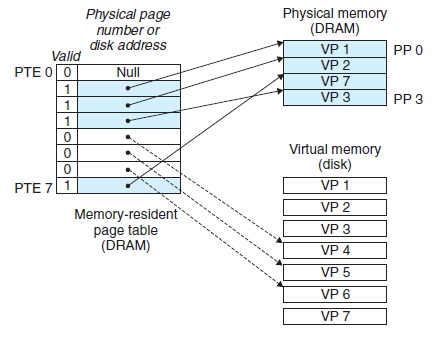
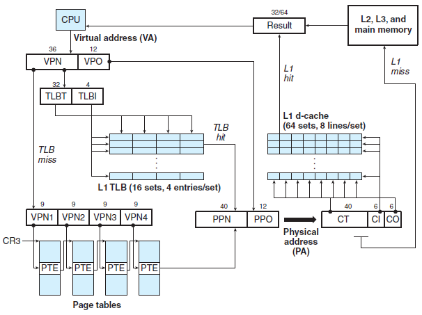
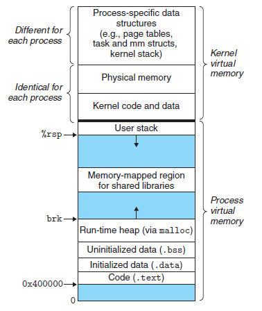
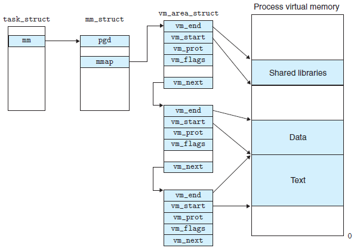
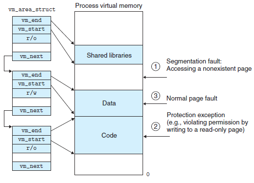
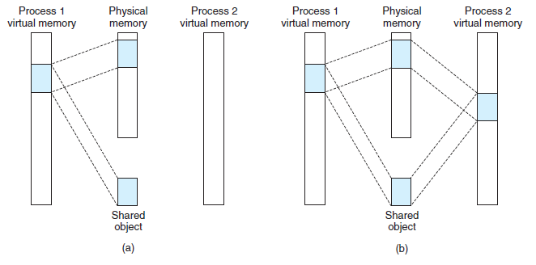
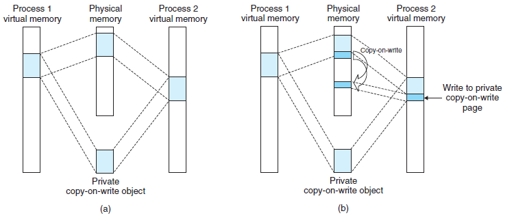
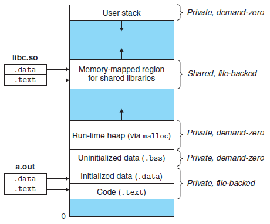
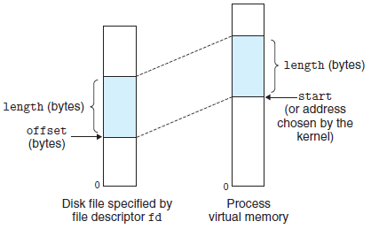
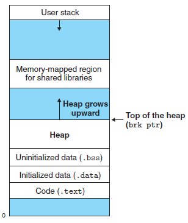

# 虚拟内存

> [《深入理解计算机系统》 - Randal E. Bryant - 第三版](https://1drv.ms/b/s!AkcJSyT7tq80bJdqo_mT5IeFTsg?e=W297XG)，第九章的读书笔记，本文中的所有代码可在[GitHub仓库](https://github.com/LittleBee1024/learning_book/tree/main/docs/booknotes/csapp/09/code)中找到

## 物理和虚拟寻址


上图显式了，现代处理器使用**虚拟地址(virtual addressing)**的寻址形式。CPU芯片上的内存管理单元(Memory Management Unit, MMU)利用存放在主存中的查询表来动态翻译虚拟地址，该表的内容由操作系统管理。

## 虚拟内存作为缓存的工具

VM系统通过将虚拟内存分割为称为**虚拟页(Virtual Page, VP)**的大小固定的块来处理这个问题。类似地，物理内存被分割为相同大小的**物理页(Physical Pge, PP)**。任意时刻，虚拟页面的集合都分为三个不相交的子集：

* 未分配的
* 缓存的
* 未缓存的

### 页表

虚拟内存系统必须有某种方法来判定一个**已分配的虚拟页**是否缓存在DRAM中的某个地方：

* 如果已在物理页中缓存，系统还必须确定这个虚拟页存放在哪个物理页中
* 如果未在物理页中缓存，系统还必须判断这个虚拟页存放在**磁盘**的哪个位置，在物理内存中选择一个牺牲页，并将虚拟页从磁盘复制到DRAM中，以替换这个牺牲页

上述功能是由软硬件联合提供的，包括操作系统软件、MMU中的地址翻译硬件和一个存放在物理内存中叫做**页表(page table)**的数据结构。

下图展示了一个页表的基本组织结构。页表就是一个**页表条目(Page Table Entry, PTE)**的数组。PTE由一个有效位和一个n位地址字段组成，有效位表明了该虚拟页当前是否被缓存在DRAM中：

* 如果设置了有效位，
    * 那么地址字段就表示DRAM中相应的物理页的起始位置，这个物理页中缓存了该虚拟页
* 如果没有设置有效位，
    * 那么一个空地址表示这个虚拟页还未被分配
    * 否则，这个地址就指向该虚拟页在**磁盘**上的起始位置


上图展示了一个有8个虚拟也和4个物理页的系统的页表：

* 四个虚拟页(VP1、VP2、VP4和VP7)当前被缓存在DRAM中
* 两个页(VP0和VP5)还未被分配
* 剩下的页(VP3和VP6)已经被分配了，但是当前还未缓存，PTE中的地址指向磁盘上的某个位置

### 页命中


上图中，CPU想要读虚拟内存“VP2”中的内容，因为设置了有效位，MMU可以直接将虚拟地址转换为物理地址，从而获取所需内容。

### 缺页

下图中，CPU想要读虚拟内存“VP3”中的内容，“VP3”并没有被缓存，因此会触发一个缺页异常，已完成对“VP3”的缓存。


缺页异常会调用内核中的缺页异常处理程序，

* 如果主存空间以满，会选择一个牺牲页，以腾出空间缓存“VP3”
    * 图中的牺牲页就是在“PP3”中的“VP4”。如果“VP4”已经被修改，内核会将它复制回磁盘。无论哪种情况，内核都会修改“VP4”的页表条目，以表明“VP4”已不在被缓存在主存中了
* 接下来，内核从磁盘复制“VP3”到内存中的“PP3”，并更新“PTE3”

缺页异常处理程序返回后，会重新执行先前导致缺页的指令，此时PTE已经设置了有效会，MMU可以正常翻译虚拟地址，从而可以从实际物理地址中获取所需内容。

### 分配页面

当操作系统分配一个新的虚拟内存页时，会与一个磁盘上的对象关联起来(如下图中的“VP5”，这个页面可以是系统中的普通文件，也可以是一个匿名文件)，然后更新PTE对应条目(如下图中的“PTE5”)，使它指向这个新创建的页面。



## 地址翻译

下图总结了完整的“Core i7”地址翻译过程，展示了从CPU产生虚拟地址的时刻一直到来自内存的数据字到达CPU的过程。为了加速从内存中获取数据，“Core i7”采用了：

* TLB(Translation Lookaside Buffer)
    * 虚拟地址缓存，用于快速得到物理地址
        * 根据虚拟页号VPN，快速获取缓存的物理页号PPN
* 多级页表
    * 用于减少内存中页表的大小，因为
        * 如果上级页表中的PTE是空的，那么相应的下一级页表就不会存在
        * 只有一级页表才总是需要在主存中，其他页表可按需载入主存
* 高速缓存L1/L2/L3
    * 相对主存，有更快的访问速度，但其价格更高，容量更小，因此需要和主存配合使用



## Linux虚拟内存系统



如上图所示，Linux为每个进程维护了一个单独的虚拟地址空间，包括：

* 内核虚拟内存
    * 每个进程都不同的部分
        * 与进程相关的数据结构，比如，页表、内核在进程的上下文中执行代码时使用的栈
    * 每个进程都相同的部分
        * 内核代码和全局数据结构被每个进程共享
        * 一段连续的物理内存被映射后，每个进程都可以方便对其进行访问，比如，对某些设备的I/O操作
* 进程虚拟内存
    * 内存被组织成一些区域(也叫段)的集合，每个存在的虚拟页面都保存在某个区域中
    * 不属于任何区域的虚拟页是不存在的(图中的蓝色部分)，并且不能被进程因引用。内核不用记录这些不存在的虚拟页，因此这样的页也不占用内存、磁盘或者内核本身中的任何额外资源


### 虚拟内存的数据结构



上图展示了一个进程中虚拟内存区域的内核数据结构。内核为系统中的每个进程维护了一个单独的任务结构`task_struct`。任务结构中的元素包含或者指向内核运行该进程所需要的所有信息(例如，PID、指向用户栈的指针、可执行目标文件的名字，以及程序计数器等)。

任务结构中的一个条目指向`mm_struct`，它描述了虚拟内存的当前状态。其中，`pgd`指向第一级页表(页全局目录)的基址，而`mmap`指向一个`vm_area_structs`的链表，其中每个`vm_area_structs`都描述了当前虚拟地址空间的一个区域。一个具体区域的结构包含下面的字段：

* `vm_start`：指向这个区域的起始处
* `vm_end`：指向这个区域的结束处
* `vm_prot`：描述这个区域内包含的所有页的读写许可权限
* `vm_flags`：描述这个区域内的页面是与其他进程共享的，还是这个进程私有的
* `vm_next`：指向链表中下一个区域结构

### Linux缺页异常处理

假设MMU在试图翻译某个虚拟地址A时，触发了一个缺页。这个异常导致控制转移到内核的缺页处理程序，执行以下步骤：

* 判断虚拟地址A是否合法
    * 搜索区域结构的链表`vm_area_structs`，把A和每个区域中的`vm_start`和`vm_end`做比较。如果过不合法，就触发一个段错误"segmentation fault"，即下图中的情况1
* 判断试图进行的内存访问是否合法(有权限)
    * 虚拟内存作为内存保护的工具，在PTE上添加了一些额外的许可位(SUP/READ/WRITE)。在地址翻译过程中，如果指令违反了这些许可，会触发一般保护故障，Linux将这种异常也报告为段错误"segmentation fault"，即下图中的情况2
* 对合法的虚拟地址进行合法的操作，内核会换入新的页面并更新页表(可能要换出牺牲页面)，即下图中的情况3
* 缺页处理程序返回，并重新执行引起缺页的指令，此时MMU能正常翻译A，而不会再产生缺页中断



## 内存映射

Linux通过将一个虚拟内存区域与一个磁盘上的对象关联起来，以初始化这个虚拟内存区域的内容，这个过程称为**内存映射(memory mapping)**。虚拟内存区域可以映射到两种类型的对象中的一种：

* Linux文件系统中的普通文件
    * 一个区域可以映射到一个普通磁盘文件的连续部分
* 匿名文件
    * 一个区域也可以映射到一个匿名文件，匿名文件是由内核创建的，包含的全是二进制零
    * 在磁盘和内存之间并没有实际的数据传送

无论在哪种情况中，一旦一个虚拟页面被初始化了，它就在一个由内核维护的专门的交换文件(swap file)之间换来换去。交换文件也叫做交换空间(swap space)或交换区域(swap area)。在任何时刻，交换空间都限制着当前运行着的进程能够分配的虚拟页面的总数。

### 共享对象

如果一个进程将一个共享对象映射到它的虚拟地址空间的一个区域内，那么这个进程对这个区域的任何写操作，对于那些也把这个共享对象映射到他们虚拟内存的其他进程而言，也是可见的。而且，这些变化也反映在磁盘上的原始对象中。



上图中，进程1将一个共享对象映射到它的虚拟内存的一个区域中。进程2将同一个共享对象映射到它的地址空间。因为每个对象都有一个唯一的文件名，内核可以迅速地判定进程1已经映射了这个对象，而且可以使进程2中的页表条目指向相同的物理页面。图中的物理页面显示为连续的，但是在一般情况下当然不是这样的。

### 私有对象

对一个映射到私有对象的区域做的改变，对其他进程来说是不可见的，并且进程对这个区域所做的任何写操作都不会反映在磁盘上的对象中。



上图中，两个进程将一个私有对象映射到他们虚拟内存的不同区域，但共享这个对象同一个物理副本。对于每个映射私有对象的进程，相应私有区域的页表条目都被标记为只读，并且区域结构被标记为**私有的写时复制**。只要没有进程试图写它自己的私有区域，它们就可以继续共享物理内存中对象的一个单独副本。然而，只要有一个进程试图写私有区域内的某个页面，那么这个写操作就会触发一个保护故障。

当故障处理程序注意到保护异常是由于进程试图写私有的写时复制区域中的一个页面而引起的，它就会在物理内存中创建这个页面的一个新副本，更新页面条目指向这个新的副本，然后恢复这个页面的可写权限，如上图所示。当故障处理程序返回时，CPU重新执行这个写操作，现在在新创建的页面上这个写操作就可以正常执行了。

### fork函数的内存映射

当`fork`函数被当前进程调用时，

* 内核为新进程创建各种数据结构，包括当前进程的`mm_struct`、区域结构和页表的原样副本
    * 内核将两个进程中的每个页面(私有对象)都标记为只读，并将两个进程中的每个区域结构都标记为私有的写时复制

当`fork`在新进程中返回时，

* 新进程现在的虚拟内存刚好和调用`fork`时存在的虚拟内存相同

当这两个进程中的任何一个后来进行写操作时，写时复制就会创建新页面。因此，也就为每个进程保持了私有地址空间的抽象概念

### execve函数的内存映射

`execve`函数在当前进程中加载并运行包含在可执行目标文件`a.out`中的程序，用`a.out`程序有效地替代了当前的程序。加载并运行`a.out`需要以下几个步骤：

* 删除已存在的用户区域
* 映射私有区域
    * 为新程序的代码、数据、bss和栈区域创建新的区域结构，如下图所示
        * 代码和数据区被映射为`a.out`文件中的`.text`和`.data`区
        * bss区域时请求二进制零的，映射到匿名文件，其大小包含在`a.out`中
        * 栈和堆区域也是请求二进制零的，初始长度为零
* 映射共享区域
    * 如果`a.out`程序与共享对象链接，那么这些对象会映射到共享区域内
* 设置程序计数器PC
    * 指向代码区域的入口点，下一次调度这个进程时，将从这个入口点开始执行，按需换入代码和数据页面



### mmap函数内的存映射

```cpp
#include <unistd.h>
#include <sys/mman.h>

void *mmap(void *start, size_t length, int prot, int flags, int fd, off_t offset);
```

如上`mmap`的函数签名所示，`mmap`函数要求内核创建一个新的虚拟内存区域，最好是从地址`start`开始的一个区域，并将文件描述符`fd`指定的对象的一个连续的片(chunk)映射到这个新的区域。连续的对象片大小为`length`字节，从距文件开始处偏移量为`offset`字节的地方开始。`start`地址仅仅是一个暗示，通常被定义为`NULL`。下图描述了这些参数的意义：



参数`prot`包含描述新映射的虚拟内存区域的访问权限：

* `PROT_EXEC`：可被CPU执行
* `PROT_READ`：可读
* `PROT_WRITE`：可写
* `PROT_NONE`：不能被访问

参数`flags`由描述被映射对象类型的位组成：

* `MAP_ANON`：被映射的对象是一个匿名对象，相应的虚拟页请求二进制零
* `MAP_PRIVATE`：被映射的对象是一个私有的、写时复制的对象
* `MAP_SHARED`：被映射的对象是一个共享对象

## 动态内存分配

虽然可以使用低级的`mmap`和`munmap`函数来创建和删除虚拟内存的区域，但C程序员还是会觉得当运行时需要额外虚拟内存时，用**动态内存分配器(dynamic memory allocator)**更方便，也有更好的可移植性。



如上图所示，动态内存分配器维护着一个进程的虚拟内存区域，称为堆(heap)。对于每个进程，内核维护着一个变量`brk`，它指向堆的顶部。

分配器将堆视为一组不同大小的块(block)的集合来维护。每个块就是一个连续的虚拟内存片(chunk)，要么是已分配的，要么是空闲的。已分配的块显式地保留为供应用程序使用。空闲块可用来分配。一个已分配的块保持已分配状态，直到它被释放，这种释放要么是应用程序显式执行的，要么是内存分配器自身隐式执行的。

分配器按释放方式的不同，分为：

* 显式分配器(explicit allocator)
    * 要求应用显式释放任何已分配的块
    * C程序的`malloc`/`free`，C++程序的`new`/`delete`
* 隐式分配器(implicit allocator)，也叫垃圾收集器(garbage collection)
    * 要求分配器检测一个已分配块何时不再被程序使用，那么就释放这个块
    * `Lisp`、`ML`以及`Jave`之类的高级语言都依赖垃圾收集来释放已分配的块


