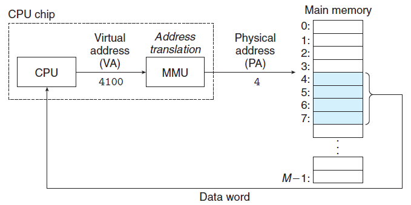
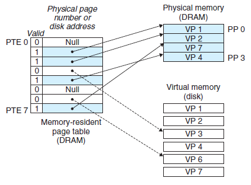
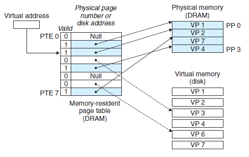
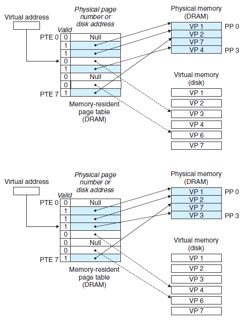

# 虚拟内存

> [《深入理解计算机系统》 - Randal E. Bryant - 第三版](https://1drv.ms/b/s!AkcJSyT7tq80bJdqo_mT5IeFTsg?e=W297XG)，第九章的读书笔记，本文中的所有代码可在[GitHub仓库](https://github.com/LittleBee1024/learning_book/tree/main/docs/booknotes/csapp/09/code)中找到

## 物理和虚拟寻址

上图显式了，现代处理器使用**虚拟地址(virtual addressing)**的寻址形式。CPU芯片上的内存管理单元(Memory Management Unit, MMU)利用存放在主存中的查询表来动态翻译虚拟地址，该表的内容由操作系统管理。

## 虚拟内存作为缓存的工具

VM系统通过将虚拟内存分割为称为**虚拟页(Virtual Page, VP)**的大小固定的块来处理这个问题。类似地，物理内存被分割为相同大小的**物理页(Physical Pge, PP)**。任意时刻，虚拟页面的集合都分为三个不相交的子集：

* 未分配的
* 缓存的
* 未缓存的

### 页表

虚拟内存系统必须有某种方法来判定一个**已分配的虚拟页**是否缓存在DRAM中的某个地方：

* 如果已在物理页中缓存，系统还必须确定这个虚拟页存放在哪个物理页中
* 如果未在物理页中缓存，系统还必须判断这个虚拟页存放在**磁盘**的哪个位置，在物理内存中选择一个牺牲页，并将虚拟页从磁盘复制到DRAM中，以替换这个牺牲页

上述功能是由软硬件联合提供的，包括操作系统软件、MMU中的地址翻译硬件和一个存放在物理内存中叫做**页表(page table)**的数据结构。

下图展示了一个页表的基本组织结构。页表就是一个**页表条目(Page Table Entry, PTE)**的数组。PTE由一个有效位和一个n位地址字段组成，有效位表明了该虚拟页当前是否被缓存在DRAM中：

* 如果设置了有效位，
    * 那么地址字段就表示DRAM中相应的物理页的起始位置，这个物理页中缓存了该虚拟页
* 如果没有设置有效位，
    * 那么一个空地址表示这个虚拟页还未被分配
    * 否则，这个地址就指向该虚拟页在**磁盘**上的起始位置

上图展示了一个有8个虚拟也和4个物理页的系统的页表：

* 四个虚拟页(VP1、VP2、VP4和VP7)当前被缓存在DRAM中
* 两个页(VP0和VP5)还未被分配
* 剩下的页(VP3和VP6)已经被分配了，但是当前还未缓存，PTE中的地址指向磁盘上的某个位置

### 页命中

上图中，CPU想要读虚拟内存“VP2”中的内容，因为设置了有效位，MMU可以直接将虚拟地址转换为物理地址，从而获取所需内容。

### 缺页

下图中，CPU想要读虚拟内存“VP3”中的内容，“VP3”并没有被缓存，因此会触发一个缺页异常，已完成对“VP3”的缓存。

缺页异常会调用内核中的缺页异常处理程序，

* 如果主存空间以满，会选择一个牺牲页，以腾出空间缓存“VP3”
    * 图中的牺牲页就是在“PP3”中的“VP4”。如果“VP4”已经被修改，内核会将它复制回磁盘。无论哪种情况，内核都会修改“VP4”的页表条目，以表明“VP4”已不在被缓存在主存中了
* 接下来，内核从磁盘复制“VP3”到内存中的“PP3”，并更新“PET3”

缺页异常处理程序返回后，会重新执行先前导致缺页的指令，此时PTE已经设置了有效会，MMU可以正常翻译虚拟地址，从而可以从实际物理地址中获取所需内容。
