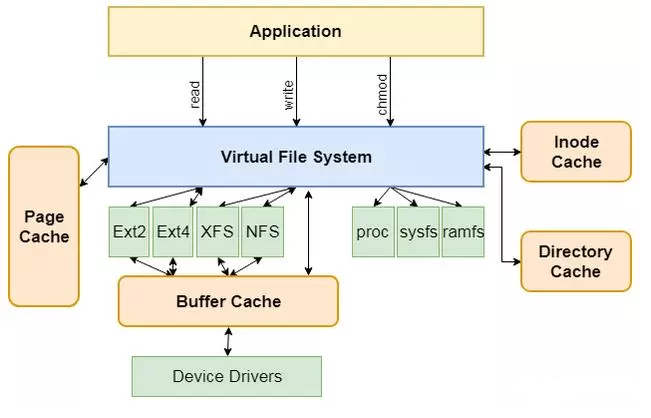
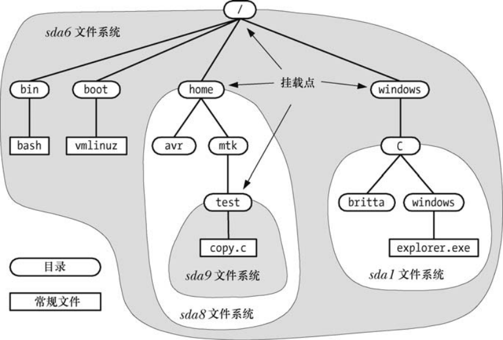
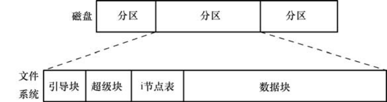
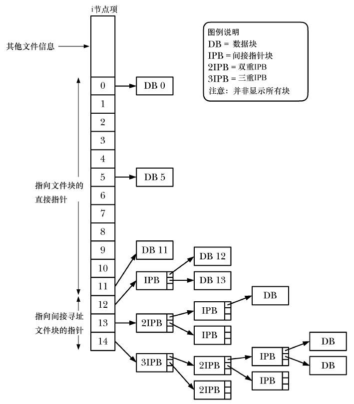
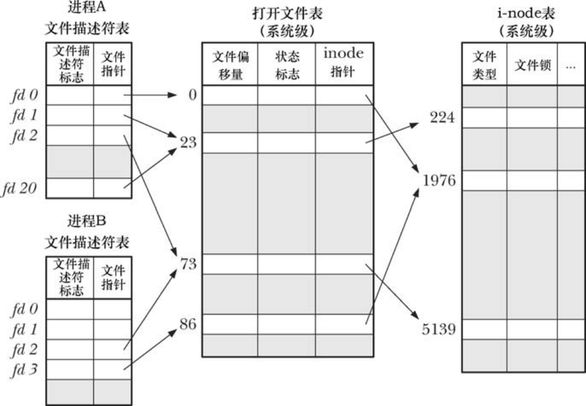

# 系统级I/O

> [《深入理解计算机系统》 - Randal E. Bryant - 第三版](https://1drv.ms/b/s!AkcJSyT7tq80bJdqo_mT5IeFTsg?e=W297XG) 第十章，以及[《Linux/UNIX 系统编程手册》 - Michael Kerrisk](https://1drv.ms/b/s!AkcJSyT7tq80fmGEtgQjbyZPMOY?e=Z7XvIW) 文件系统相关章节（4，5，13~18）的读书笔记，本文中的所有代码可在[GitHub仓库](https://github.com/LittleBee1024/learning_book/tree/main/docs/booknotes/csapp/10/code)中找到

## 虚拟文件系统

在Linux系统中基本上把所有内容都看作文件，除了我们普通意义理解的文件之外，目录、字符设备、块设备、FIFO或管道、套接字、符号链接等都被视为是一个“文件”。



如上图所示，虚拟文件系统(VFS)VFS是一个抽象层，其向上提供了统一的文件访问接口，而向下则兼容了各种不同的文件系统。不仅仅是诸如Ext2、Ext4、XFS和Btrfs等常规意义上的文件系统，还包括伪文件系统和设备等等。另外，VFS实现了一部分公共的功能，例如：页缓存和inode缓存等，从而避免多个文件系统重复实现的问题。

Linux上所有文件系统中的文件都位于单根目录树下，树根就是根目录`/`。其他的文件系统都挂载在根目录下。`mount device directory`命令会将名为`device`的文件系统挂接到目录层级中由`directory`所指定的目录，即文件系统的挂载点。`mount`命令可以列出当前已挂载的文件系统，例如：
```bash
> mount
proc on /proc type proc (rw)
sysfs on /sys type sysfs (rw)
tmpfs on /run type tmpfs (rw)
udev on /dev type devtmpfs (rw)
/dev/sda6 on / type ext4 (rw)
/dev/sda8 on /home type ext3 (rw,acl,user_xattr)
/dev/sda1 on /windows/C type vfat (rw,noexec,nosuid,nodev)
/dev/sda9 on /home/mtk/test type reiserfs (rw)
```



除了上图中驻留在磁盘上的文件系统，Linux同样支持驻留于内存中的虚拟文件系统：proc，sysfs，tmpfs，devtmpfs等。`/proc/filesystems`可以查看当前为内核所知的文件系统类型。

## 常规文件系统

常规文件系统是对常规文件和目录的组织集合，由`mkfs`命令创建，其类型有：

* 传统的ext2文件系统
* 各种原始UNIX文件系统，如，Minix、System V以及BSD文件系统
* 微软的FAT、FAT32以及NTFS文件系统
* ISO 9660 CD-ROM文件系统
* Apple Macintosh的HFS
* 一系列网络文件系统，如，SUN的NFS、IBM和微软的SMB、Novell的NCP等
* 一系列日志文件系统，包括ext3、ext4、Reiserfs、JFS、XFS以及Btrfs等
    * 系统崩溃重启后，会利用日志重做任何不完整的更新，恢复文件系统的一致性状态

### 磁盘和分区

常规文件和目录通常都存放在磁盘设备里(比如，CD-ROM、flash内存卡以及虚拟磁盘等)。每块磁盘被划分为一个或多个分区。内核将每个分区视为位于`/dev`路径下的单独设备。磁盘分区一般存放三种信息：

* 文件系统
    * 用来存放常规文件
* 数据区域
    * 可做为裸设备对其进行访问，如数据库管理系统就使用了该技术
* 交换区域
    * 供内核的内存管理使用，如Linux系统中的`/proc/swaps`可查看已激活的交换区域信息



上图显示了磁盘分区和文件系统之间的关系。文件系统由以下几部分组成：

* 引导块
    * 位于文件系统首部，只包含用来引导操作系统的信息
* 超级块
    * 包含与文件系统有关的参数信息，如：
        * i节点表容量
        * 文件系统中逻辑块的大小
        * 以逻辑块计，文件系统的大小
* i节点表
    * 文件系统中的每个文件或目录在i节点表中都对应着唯一一条记录，这条记录登记了关乎文件的各种信息
* 数据块
    * 用于存放数据

### i节点

每个文件都在i节点表中有自己的i节点(索引节点的简称)，i节点由数字标识，可通过`ls -li`命令查看。i节点维护文件的属性信息，包括：

* 文件类型
    * 可通过`ls -l`最首部的字母获得
* 访问权限
* 指向文件的硬链接数
    * 可通过`ls -l`第二列的数字获得
* 文件属主/组
* 文件的大小
* 时间戳
* 实际分配给文件的块数量
    * 可通过`ls -s`命令获得
* 指向文件数据块的指针



上图显示了ext2文件系统的i节点结构。每个i节点包含15个指针。其中，前12个指针指向文件前12个块在数据块中的位置。接下来，是一个指向指针块的指针，提供了文件的第13个以及后续数据块的位置。指针块中指针的数量取决于文件系统中块的大小，可能在256(块容量为1024字节) ~ 1024(块容量为4096字节)之间。

双重间接指针以及三重间接指针，满足了更大文件的需求。例如，对于大小为4096字节的块而言，文件大小可略高于`1024*1024*1024*4096`字节(4TB)。这是由三重间接指针所指向的范围决定的，直接、间接或双重间接指针的范围相对来说，就微不足道了。

## 共享文件

Linux内核用三个相关的数据结构来表示打开的文件：

* 进程级的文件描述符表(open file descriptor)
    * 该表的每一条目都记录了对打开文件句柄的引用
* 系统级的打开文件表(open file table)
    * 该表的每个条目称为打开文件句柄，存储了一个与打开文件相关的全部信息，包括：
        * 文件偏移量
        * 打开文件时所使用的状态标志
        * 对该文件i-node对象的引用
* 文件系统的i-node表
    * 每个文件的i-node信息包括：
        * 文件类型和访问权限
        * 文件的其他属性，包括文件大小、时间戳等信息

下图显示了文件描述符、打开的文件句柄以及i-node之间的关系。



* 一个进程中多个文件描述符指向同一个打开的文件句柄
    * 如图中，进程A的`fd1`和`fd20`
    * 可能是通过调用`dup()`、`dup2()`或`fcntl(...,F_DUPFD,...)`形成的，参考例子[fd_share](https://github.com/LittleBee1024/learning_book/tree/main/docs/booknotes/csapp/10/code/fd_share)
* 多个进程中值相同的文件描述符指向同一个打开的文件句柄
    * 如图中，进程A的`fd2`和进程B的`fd2`
    * 可能是在调用`fork()`后形成的
* 不同的打开文件句柄指向i-node表中的相同条目
    * 如图中，打开文件表的i-node指针`1976`
    * 可能是对同一个文件发起`open()`调用后形成的

由上图可知，对于指向同一打开文件句柄的多个文件描述符，它们共享同一文件偏移量，打开的文件标志等属性。如果其中一个文件描述符修改了上述文件属性，会影响其他文件描述符，除了文件描述符标志(close-on-exec标志)，这一标志是文件描述符所私有的。

