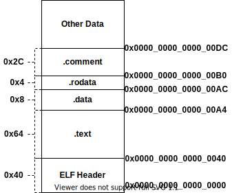
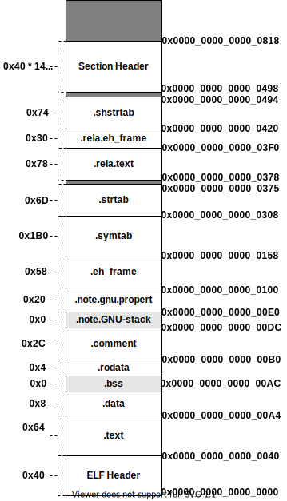

# 编译

> [《程序员的自我修养--链接、装载与库》 - 俞甲子，石凡，潘爱民](https://1drv.ms/b/s!AkcJSyT7tq80cUuHb2eRcJkkBjM?e=YUwBqB)，第二、三章的读书笔记，本文中的所有代码可在[GitHub仓库](https://github.com/LittleBee1024/learning_book/tree/main/docs/booknotes/cxydzwxy/compile/code)中找到

## 生成一个可执行文件
C语言生成一个可执行文件需要4个步骤：

* 预处理(Preprocessing)
* 编译(Compilation)
* 汇编(Assembly)
* 链接(Linking)

下面以[HelloWorld](https://github.com/LittleBee1024/learning_book/tree/main/docs/booknotes/cxydzwxy/compile/code/hello)为例，分别介绍各步骤做了什么事情。

### 预编译
预编译过程通过`gcc -E main.c -o main.i`命令，处理源代码中以`#`开头的预编译指令。主要规则如下：

* 展开宏和头文件
* 删除注释
* 添加行号和文件名标识，以便编译器产生调试用的行号信息，例如`# 2 "main.c" 2`，表示main.c的第二行
    * 文件名后面的数字代表不同的意思，参考[GCC手册](https://gcc.gnu.org/onlinedocs/cpp/Preprocessor-Output.html)
        * `1`，表示新文件的开始
        * `2`，表示返回此文件
        * `3`，表示接下来的内容来自系统头文件，某些警告将被忽略
        * `4`，表示接下来的内容按C代码处理，即被`extern "C"`修饰

### 编译
编译过程就是把预处理完的文件进行一系列词法分析、语法分析、语义分析以及优化后产生相应的汇编代码文件，其命令是：`gcc -S main.i -o main.s`。

### 汇编
汇编器将汇编代码转变成机器可执行的指令，称为目标文件(Object File)。我们可以调用汇编器`as`完成，也可以通过GCC命令完成。

* `as main.s -o main.o`
* `gcc -c main.s -o main.o`

### 链接
GCC命令`gcc main.o -o main`，通过链接器，将多个目标文件链接成一个可执行文件。此命令底层是依赖链接器`ld`完成的，其完整命令如下：
```sh
ld -static /usr/lib/x86_64-linux-gnu/crt1.o /usr/lib/x86_64-linux-gnu/crti.o /usr/lib/gcc/x86_64-linux-gnu/9/crtbeginT.o \
   -L/usr/lib/gcc/x86_64-linux-gnu/9 -L/usr/lib -L/lib main.o --start-group -lgcc -lgcc_eh -lc --end-group /usr/lib/gcc/x86_64-linux-gnu/9/crtend.o /usr/lib/x86_64-linux-gnu/crtn.o \
   -o main
```

## 目标文件
目标文件从结构上讲，是以及编译后的可执行文件格式，只是还没有经过链接的过程，其中可能有些符号或有些地址还没有调整。其实它本身就是按照可执行文件格式存储的，只是跟真正的可执行文件在结构上稍有不同。

Linux的ELF(Executable Linkable Format)是一种可执行文件的格式。除了目标文件(.o)，动态链接库(.so)、静态链接库(.a)和可执行文件(.out)都是按照这种格式存储的。

ELF文件类型 | 说明 | 实例
--- | --- | ---
可重定位文件 (Relocatable File) | 这类文件包含了代码和数据，可以被用来链接成可执行文件或共享目标文件，静态链接库也可以归为这一类| .o, .a
可执行文件 (Executable File) | 这类文件包含了可以直接执行的程序，它的代表就是ELF可执行文件 | /bin/bash
目标共享文件 (Shared Object File) | 这种文件包含了代码和数据，通过链接器可以和其他可重定位文件产生新的目标文件。或者和可执行文件结合，作为进程映像的一部分来运行 | .so
核心转储文件 (Core Dump File) | 当进程意外终止时，系统可以将该进程的地址空间的内容及终止时的一些其他信息转储到核心转储文件 | core dump

### 目标文件中的段

目标文件以段(Segment/Section)的方式，将不同属性的信息组织起来。例如，源代码编译后的机器指令经常放在`.text`代码段(Code Section)中，而全局变量和局部静态变量经常放在数据段`.data`(Data Section)。

以下面的[代码](./code/obj/main.c)为例，让我们来看看目标文件的内容。

```cpp
int global_init_var = 84;   // .data section
int global_uninit_var;      // .bss section

void func1(int i)           // .text section
{
   printf("%d\n", i);
}

int main(void)              // .text section
{
   static int static_var = 85;      // .data section
   static int static_var2;          // .bss section

   int a = 1;
   int b;
   func1(static_var + static_var2 + a + b);

   return 0; 
}
```

* `.text`段
    * 代码段，存储执行代码，如：`main`函数，`func1`函数
* `.data`段
    * 数据段，存储以初始化的全局/局部变量，如：`global_init_var`，`static_var`
* `.bss`段（Block Started by Symbol）
    * 未初始化的全局/局部变量默认值都是0，为了节省空间，并没有放入数据段，而是在`.bss`段中预留了位置，`.bss`段不占据任何空间
* `.rodata`段
    * 只读数据段，存储只读变量，例如：`%d\n`字符串

通过`objdump`工具可以查看目标文件的内容，`objdump -h main.o`打印"main.o"的各段的首部信息如下:
```bash
$ objdump -h main.o

main.o:     file format elf64-x86-64

Sections:
Idx Name          Size      VMA               LMA               File off  Algn
  0 .text         00000064  0000000000000000  0000000000000000  00000040  2**0
                  CONTENTS, ALLOC, LOAD, RELOC, READONLY, CODE
  1 .data         00000008  0000000000000000  0000000000000000  000000a4  2**2
                  CONTENTS, ALLOC, LOAD, DATA
  2 .bss          00000008  0000000000000000  0000000000000000  000000ac  2**2
                  ALLOC
  3 .rodata       00000004  0000000000000000  0000000000000000  000000ac  2**0
                  CONTENTS, ALLOC, LOAD, READONLY, DATA
  4 .comment      0000002c  0000000000000000  0000000000000000  000000b0  2**0
                  CONTENTS, READONLY
  5 .note.GNU-stack 00000000  0000000000000000  0000000000000000  000000dc  2**0
                  CONTENTS, READONLY
  6 .note.gnu.property 00000020  0000000000000000  0000000000000000  000000e0  2**3
                  CONTENTS, ALLOC, LOAD, READONLY, DATA
  7 .eh_frame     00000058  0000000000000000  0000000000000000  00000100  2**3
                  CONTENTS, ALLOC, LOAD, RELOC, READONLY, DATA
```



根据`objdump`结果，可得到目标文件"main.o"的结构(如上图)。每个段的第2行表示段属性，如"CONTENTS"表示该段是否在文件中存在。

#### 代码段

通过`objdump -s -d main.o`可得到各段的内容，并打印反汇编内容。例如，下面就是大小为0x64的`.text`段的二进制编码。通过反汇编可知，这些二进制编码就是`func1`和`main`函数的指令。
```asm
Contents of section .text:
 0000 f30f1efa 554889e5 4883ec10 897dfc8b  ....UH..H....}..
 0010 45fc89c6 488d0500 00000048 89c7b800  E...H......H....
 0020 000000e8 00000000 90c9c3f3 0f1efa55  ...............U
 0030 4889e548 83ec10c7 45f80100 00008b15  H..H....E.......
 0040 00000000 8b050000 000001c2 8b45f801  .............E..
 0050 c28b45fc 01d089c7 e8000000 00b80000  ..E.............
 0060 0000c9c3
```

#### 数据段和只读数据段
```asm
Contents of section .data:
 0000 54000000 55000000                    T...U...        
Contents of section .rodata:
 0000 25640a00 
```

`.data`段保存已经初始化的全局/局部静态变量，如例子中的：`global_init_var`和`static_var`。它们的值分别是84和85，对应于上面的54000000和55000000。在小端模式下，低字节保存在低地址中，因此0x54，0x00，0x00，0x00的存放顺序代表的是整型值84。

`.rodata`段保存只读数据，如例子中的字符串：`%d\n`，三个字符的[ASCII码](https://ascii.cl/)分别是：0x25，0x64，0x0A，对应于上面的25640a00。

#### 其他段
常用段名 | 说明
--- | ---
.comment | 存放的是编译器版本信息，比如字符串："GCC: (Ubuntu 11.1.0-1ubuntu1~20.04) 11.1.0"
.debug | 调试信息，在编译的时候加上-g，可以出现相关段
.dynamic | 动态链接信息
.hash | 符号哈希表
.line | 调试时的行号表
.note | 额外的编译信息，比如程序的公司名、发布版本号等
.strtab | String Table字符串表，用于存储ELF文件中用到的各种字符串
.symtab | Symbol Table符号表
.shstrtab | Section String Table段名表
.plt .got | 动态链接的跳转表和全局入口表
.init .fini | 程序初始化与终结代码段，出现在C++代码中

#### 自定义段
在全局变量或函数之前加上`__attribute__((section("name")))`属性就可以把相应的变量或函数放到以"name"作为段名的段中。如：
```cpp
// 将`global`全局变量放入"FOO"段名中
__attribute__((section("FOO"))) int global = 42;
// 将`foo`函数放入"BAR"段名中
__attribute__((section("BAR"))) void foo()
{
}
```

### ELF文件结构
前面我们通过`objdump`工具，大致了解了目标文件中常见的段。接下来我们来详细地看看ELF目标文件的结构。ELF目标文件主要包括：

* ELF文件头(ELF Header)
    * 在文件最前部，描述整个文件的基本属性，比如ELF文件版本、目标机器型号、程序入口地址等
* 各个段的内容
    * ELF文件的主体内容
* 段表(Section Header)
    * 描述了ELF文件包含的所有段的信息，比如每个段的段名、段的长度、在文件中的偏移、读写权限及段的其他属性

`readelf -h main.o`命令会读取"main.o"的ELF文件头，并打印如下信息：
```sh
ELF Header:
  Magic:   7f 45 4c 46 02 01 01 00 00 00 00 00 00 00 00 00 
  Class:                             ELF64
  Data:                              2's complement, little endian
  Version:                           1 (current)
  OS/ABI:                            UNIX - System V
  ABI Version:                       0
  Type:                              REL (Relocatable file)
  Machine:                           Advanced Micro Devices X86-64
  Version:                           0x1
  Entry point address:               0x0
  Start of program headers:          0 (bytes into file)
  Start of section headers:          1176 (bytes into file)
  Flags:                             0x0
  Size of this header:               64 (bytes)
  Size of program headers:           0 (bytes)
  Number of program headers:         0
  Size of section headers:           64 (bytes)
  Number of section headers:         14
  Section header string table index: 13
```

`readelf -S main.o`命令会读取"main.o"的段表，并打印如下信息：
```sh
There are 14 section headers, starting at offset 0x498:

Section Headers:
  [Nr] Name              Type             Address           Offset
       Size              EntSize          Flags  Link  Info  Align
  [ 0]                   NULL             0000000000000000  00000000
       0000000000000000  0000000000000000           0     0     0
  [ 1] .text             PROGBITS         0000000000000000  00000040
       0000000000000064  0000000000000000  AX       0     0     1
  [ 2] .rela.text        RELA             0000000000000000  00000378
       0000000000000078  0000000000000018   I      11     1     8
  [ 3] .data             PROGBITS         0000000000000000  000000a4
       0000000000000008  0000000000000000  WA       0     0     4
  [ 4] .bss              NOBITS           0000000000000000  000000ac
       0000000000000008  0000000000000000  WA       0     0     4
  [ 5] .rodata           PROGBITS         0000000000000000  000000ac
       0000000000000004  0000000000000000   A       0     0     1
  [ 6] .comment          PROGBITS         0000000000000000  000000b0
       000000000000002c  0000000000000001  MS       0     0     1
  [ 7] .note.GNU-stack   PROGBITS         0000000000000000  000000dc
       0000000000000000  0000000000000000           0     0     1
  [ 8] .note.gnu.propert NOTE             0000000000000000  000000e0
       0000000000000020  0000000000000000   A       0     0     8
  [ 9] .eh_frame         PROGBITS         0000000000000000  00000100
       0000000000000058  0000000000000000   A       0     0     8
  [10] .rela.eh_frame    RELA             0000000000000000  000003f0
       0000000000000030  0000000000000018   I      11     9     8
  [11] .symtab           SYMTAB           0000000000000000  00000158
       00000000000001b0  0000000000000018          12    12     8
  [12] .strtab           STRTAB           0000000000000000  00000308
       000000000000006d  0000000000000000           0     0     1
  [13] .shstrtab         STRTAB           0000000000000000  00000420
       0000000000000074  0000000000000000           0     0     1
Key to Flags:
  W (write), A (alloc), X (execute), M (merge), S (strings), I (info),
  L (link order), O (extra OS processing required), G (group), T (TLS),
  C (compressed), x (unknown), o (OS specific), E (exclude),
  l (large), p (processor specific)
```

结合上面打印的信息，我们可以画出"main.o"文件的结构如下:



## 链接的接口--符号
每个目标文件都会有一个相应的**符号表(Symbol Table)**，记录了目标文件中所用到的所有符号。符号除了是常见的函数和变量外，还有可能是其他类型。通过`nm`工具可以查看目标文件中的符号。

```sh
$ nm main.o
0000000000000000 T func1                    # T, in text section
0000000000000000 D global_init_var          # D, in data section
                 U _GLOBAL_OFFSET_TABLE_    # U, undefined
0000000000000000 B global_uninit_var        # B, in BSS data section
000000000000002b T main
                 U printf
0000000000000004 d static_var.1             # d, in data section
0000000000000004 b static_var2.0            # b, in BSS data section
```

* 常见的符号类型
    * 内部全局符号 - 定义在本目标文件的全局符号，可以被其他目标文件引用
    * 外部全局符号 - 在本目标文件中引用的全局符号，却没有定义在本目标文件
    * 段名 - 由编译器产生，它的值就是该段的起始地址
    * 局部符号 - 只在编译单元内部可见
    * 行号信息 - 目标文件指令与源代码行的对应关系

### 特殊符号
当用ld作为链接器产生可执行文件时，它会为我们定义很多特殊的符号，例如：

* __executable_start - 程序的起始地址
* etext, _etext, __etext - 代码段结束地址
* edata, _edata - 数据段结束地址
* end, _end - 程序结束地址

通过GDB调试相关[代码](./code/ld_sym/main.c)，可得到如下信息。其中，起始地址`0x555555554000`和结束地址`0x555555558018`，分别映射在了相应的虚拟地址空间中。
```asm
Mapped address spaces:

        Start Addr           End Addr       Size     Offset objfile
    0x555555554000     0x555555555000     0x1000        0x0 /home/yuxiangw/GitHub/learning_book/docs/booknotes/cxydzwxy/compile/code/ld_sym/main
    0x555555555000     0x555555556000     0x1000     0x1000 /home/yuxiangw/GitHub/learning_book/docs/booknotes/cxydzwxy/compile/code/ld_sym/main
    0x555555556000     0x555555557000     0x1000     0x2000 /home/yuxiangw/GitHub/learning_book/docs/booknotes/cxydzwxy/compile/code/ld_sym/main
    0x555555557000     0x555555558000     0x1000     0x2000 /home/yuxiangw/GitHub/learning_book/docs/booknotes/cxydzwxy/compile/code/ld_sym/main
    0x555555558000     0x555555559000     0x1000     0x3000 /home/yuxiangw/GitHub/learning_book/docs/booknotes/cxydzwxy/compile/code/ld_sym/main

Executable Start 0x555555554000
Text End 0x555555555285 0x555555555285 0x555555555285
Data End 0x555555558010 0x555555558010
Executable End 0x555555558018 0x555555558018
```

### C++符号修饰
为了支持C++函数重载，命名空间等复杂的特性，人们发明了符号修饰(Name Decoration)和符号改编(Name Mangling)机制。

函数签名 | 修饰后名称(符号名)
--- | ---
int func(int) | _Z4funci
float func(float) | _Z4funcf
int C::func(int) | _ZN1C4funcEi
int C::C2::func(int) | _ZN1C2C24funcEi
int N::func(int) | _ZN1N4funcEi
int N::C::func(int) | _ZN1N1C4funcEi

上表显示了[例子](./code/cpp_sym/main.cpp)中，不同函数的符号名。以`_Z`开头，后面紧跟`N`，然后是各名称空间和类的名字，每个名字前是名字字符串长度，再以`E`结尾。参数列表紧跟在`E`后面。`c++filt`工具可以用来解析被修饰过的名称。

### extern "C"

C++用`extern "C"`关键字来声明或定义一个C的符号。修饰后，C++的名称修饰机制将不会起作用。常见的写法如下:

```cpp
#ifdef __cplusplus
extern "C" {
#endif

void *memset (void *, int, size_t);

#ifdef __cplusplus
}
#endif
```

### 弱符号与强符号
我们经常会遇到符号重定义的错误。例如，目标文件A和目标文件B都定义了一个全局变量global，则链接时会报错：
```sh
b.o: multiple definition of `global`
a.o: first defined here
```

符号的定义分为**强符号(Strong Symbol)**定义和**弱符号(Weak Symbol)**定义。通过GCC修饰符`__attribute__((weak))`可以定义弱符号，包括弱全局变量和弱函数。例如，["weak.c"](./code/strong_weak_sym/weak.c)定义了弱变量`bar`和弱函数`foo`，
```cpp
int __attribute__((weak)) bar = 3;

void __attribute__((weak)) foo(int a, int b)
{
   printf("weak version foo(%d, %d) with bar %d, sizeof(bar) = %zu\n", a, b, bar, sizeof(bar));
}
```
当没有编译目标中没有强符号["strong.c"](./code/strong_weak_sym/strong.c)，使用弱符号的定义。当存在强符号时，使用强符号的定义。
