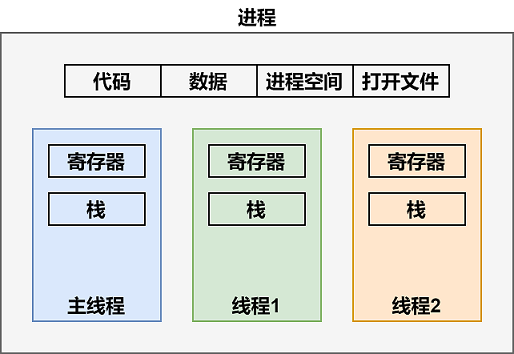
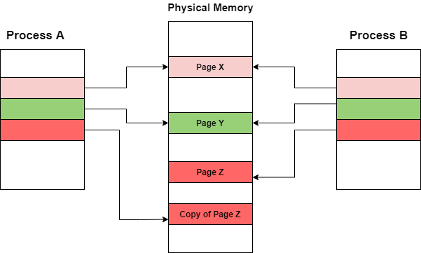

# 并发

> [《程序员的自我修养--链接、装载与库》 - 俞甲子，石凡，潘爱民](https://1drv.ms/b/s!AkcJSyT7tq80cUuHb2eRcJkkBjM?e=YUwBqB)，第一章的读书笔记，本文中的所有代码可在[GitHub仓库](https://github.com/LittleBee1024/learning_book/tree/main/docs/booknotes/cxydzwxy/concurrency/code)中找到

## 进程与线程

线程，又称为轻量级进程(Lightweight Process, LWP)，是程序执行流的最小单元。如下图所示，一个线程有以下几个部分组成：

* 线程ID
* 当前指令指针PC
* 寄存器集合
* 栈

一个进程由一个到多个线程组成，各线程之间共享一些资源，包括：

* 程序的内存空间，如代码段、数据段、堆等
* 进程级的资源，如打开的文件描述符，信号等



线程的访问非常自由，它可以访问内存里的所有数据，除了少数私有的变量，如下表所示：

线程私有 | 线程之间共享(进程所有)
--- | ---
1.局部变量<br/> 2.函数的参数<br/> 3.TLS数据<br/> | 1.全局变量<br/> 2.堆上的数据<br/> 3.函数里的静态变量<br/> 4.程序代码，任何线程都有权力读取并执行任何代码<br/> 5.打开的文件，A线程打开的文件可以由B线程读写

从Linux内核角度，进程和线程的区别仅仅是可访问的资源不同，其自身的结构是类似的，都是一个任务，详情可参考[文档](https://eli.thegreenplace.net/2018/launching-linux-threads-and-processes-with-clone/)。在Linux下，以下方法可以创建一个新的任务：

系统调用 | 作用
--- | ---
fork | 复制当前进程，文件锁和挂起的信号不会被复制
exec | 使用新的可执行映像覆盖当前可执行映像
clone | 创建新任务并从指定位置开始执行，根据参数选项的不同，既可用于创建进程，也可用于创建线程

### 写时复制

Linux产生一个新任务的速度是非常快的，因为新任务不是复制原任务的内存空间，而是和原任务一起共享一个**写时复制**(Copy on Write, COW)的内存空间。所谓写时复制，指的是两个任务可以同时自由地读取内存，但任意一个任务试图对内存进行修改时，内存就会复制一份提供给修改方单独使用，以免影响到其他的任务使用。

例如，进程A创建了进程B，最初它们共享相同的内存页。由于创建前后内存并没有变化，所以进程B的创建非常迅速。


此时，进程A需要修改页面Z中的内容，一个新的页面Z的拷贝会被创建，进程A就单独拥有此页面。从而，进程A对页面Z的任何修改都不会影响进程B。详情可参考[文档](https://www.studytonight.com/operating-system/copyonwrite-in-operating-system)。



### fork进程
[例子"fork"](https://github.com/LittleBee1024/learning_book/tree/main/docs/booknotes/cxydzwxy/concurrency/code/fork)利用系统调用`fork`创建了一个新进程：
```cpp
pid_t pid = fork();
```

`fork`出的子进程和父进程各自拥有不同的PID，并且不共享变量，因此子进程对`buf`的修改不会影响父进程的内容：
```bash
> ./main 
[PID 57469, TID 57469] Child sees buf = "hello from parent"
[PID 57468, TID 57468] Child exited with status 0, buf = "hello from parent"
```

### clone进程
[例子"clone"](https://github.com/LittleBee1024/learning_book/tree/main/docs/booknotes/cxydzwxy/concurrency/code/clone)利用系统调用`clone`创建了一个新进程：

```cpp
unsigned long flags = 0;
if (argc > 1 && !strcmp(argv[1], "vm"))
{
    flags |= CLONE_VM;
}

clone(child_func, stack + STACK_SIZE, flags | SIGCHLD, buf)
```

程序默认设置了`SIGCHLD`选项，因此父进程可以收到子进程结束的信息，从而等到子进程结束再退出。程序可以选择是否设置`CLONE_VM`选项。如果设置了`CLONE_VM`，则两个进程共享内存空间。因此，子进程对`buf`的修改，在父进程中可见，打印结果如下：

```bash
> ./main 
[PID 55486, TID 55486] Child sees buf = "hello from parent"
[PID 55485, TID 55485] Child exited with status 0, buf = "hello from parent"

> ./main vm
[PID 55517, TID 55517] Child sees buf = "hello from parent"
[PID 55516, TID 55516] Child exited with status 0, buf = "hello from child"
```

### clone线程

[例子"clone_thread"](https://github.com/LittleBee1024/learning_book/tree/main/docs/booknotes/cxydzwxy/concurrency/code/clone_thread)创建了一个新线程：

```cpp
clone(&func, (char *)child_stack + STACK_SIZE, CLONE_THREAD | CLONE_SIGHAND | CLONE_FS | CLONE_VM | CLONE_FILES, NULL);
```

`CLONE_THREAD`选项创建的新任务和调用进程拥有相同的PID，因此它更像一个线程，可以直接在新任务上打GDB的断点(无须`set follow-fork-mode child`)。无论是查看`/proc/self/status`信息，还是打印PID和TID，都显示新建的任务更接近一个线程，而不是进程：
```bash
> ./main
This process pid: 56244, tid: 56244
Creating new thread...
Done! Thread pid: 56245
Looking into /proc/self/status...
...
Tgid:   56244
Ngid:   0
Pid:    56244
PPid:   47895
...
[PID 56244, TID 56245] Terminating func...
[PID 56244, TID 56244] Parent process end
```

### 线程库NPTL
NPTL(Native POSIX Threads Library)线程库提供了线程相关的各种API，方便用户进行线程的创建、同步、销毁等。
```cpp
#include <pthread.h>

// 创建线程
//  thread - 线程标识，用于后续对线程的操作
//  attr - 线程属性，NULL表示默认属性，可结合pthread_attr_init()等属性函数配置自定义属性值
int pthread_create(pthread_t* thread, const pthread_attr_t* attr, void*(*stat_routine)(void*), void* arg);

// 同步线程
//  retval - 目标线程返回的退出信息
int pthread_join(pthread_t thread, void** retval);

// 结束线程
//  retval - 向线程调用者传递的退出信息指针
void pthread_exit(void* retval);
```

[例子"nptl_thread"](https://github.com/LittleBee1024/learning_book/tree/main/docs/booknotes/cxydzwxy/concurrency/code/nptl_thread)展示了如何通过NPTL线程库创建线程，向线程传递参数，并接收线程返回的结果：
```cpp
struct thread_info
{                       /* Used as argument to thread_start() */
   pthread_t thread_id; /* ID returned by pthread_create() */
   int thread_num;      /* Application-defined thread # */
   int ret;             /* Return value */
};

void *thread_start(void *arg)
{
   struct thread_info *tinfo = arg;

   printf("[Thread_%d, num_%ld] Thread processing done\n", tinfo->thread_num, tinfo->thread_id);
   tinfo->ret = tinfo->thread_num;
   pthread_exit(&tinfo->ret);
}

int main(void)
{
    ...
    for (int tnum = 0; tnum < NUM_THREADS; tnum++)
    {
        tinfo[tnum].thread_num = tnum + 1;
        pthread_create(&tinfo[tnum].thread_id, NULL, &thread_start, &tinfo[tnum]);
    }

    void *res;
    for (int tnum = 0; tnum < NUM_THREADS; tnum++)
    {
        pthread_join(tinfo[tnum].thread_id, &res);
        printf("Joined with thread %d; Return value from thread is [%d]\n",
                tinfo[tnum].thread_num, *(int *)res);
        // free res if the res is allocated by the thread
    }
    ...
}
```
```bash
> ./main 
[Thread_2, num_140071691572992] Thread processing done
[Thread_1, num_140071699965696] Thread processing done
Joined with thread 1; Return value from thread is [1]
Joined with thread 2; Return value from thread is [2]
```

## 线程间同步

### 互斥量(Mutex)
互斥量是最常见的线程同步机制，资源仅同时允许一个线程访问，并且获取和释放互斥量的线程必须是同一个线程。NPTL线程库提供了如下对互斥量操作的API：

```cpp
// 初始化互斥量
//  mutex - 一个可全局访问的`pthread_mutex_t`互斥量
//  mutexattr - 互斥量属性，NULL表示默认属性，可结合pthread_mutexattr_init()等属性函数配置自定义属性
//              例如，默认情况下，互斥量是不能跨进程共享的，通过pthread_mutexattr_setpshared()可设置跨进程共享互斥量
int pthread_mutex_init(pthread_mutex_t* mutex, const pthread_mutexattr_t* mutexattr);

// 销毁互斥量
int pthread_mutex_destroy(pthread_mutex_t* mutex);

// 获取/释放互斥量
int pthread_mutex_lock(pthread_mutex_t* mutex);
int pthread_mutex_trylock(pthread_mutex_t* mutex);
int pthread_mutex_unlock(pthread_mutex_t* mutex);
```

[例子"con_th/mutex"](https://github.com/LittleBee1024/learning_book/tree/main/docs/booknotes/cxydzwxy/concurrency/code/con_th/mutex)利用互斥量，同步了两个线程的执行顺序：
```cpp
pthread_mutex_t lock;

void *thread_start(void *arg)
{
   pthread_mutex_lock(&lock);

   pthread_t id = pthread_self();
   printf("[Thread %ld] Entered..\n", id);
   sleep(1);
   printf("[Thread %ld] Just Exiting...\n", id);

   pthread_mutex_unlock(&lock);

   return NULL;
}

int main(void)
{
   pthread_mutex_init(&lock, NULL);

   pthread_t t1, t2;
   pthread_create(&t1, NULL, thread_start, NULL);
   pthread_create(&t2, NULL, thread_start, NULL);

   pthread_join(t1, NULL);
   pthread_join(t2, NULL);

   pthread_mutex_destroy(&lock);

   return 0;
}
```
```bash
> ./main 
[Thread 139949549393664] Entered..
[Thread 139949549393664] Just Exiting...
[Thread 139949557786368] Entered..
[Thread 139949557786368] Just Exiting...
```

### 信号量(Semaphore)
相较于互斥量，信号量更加灵活。信号量分为：

* 二元信号量 (Binary Semaphore)
    * 初始值为1的信号量，只有占用/非占用两种状态，不同于互斥量的地方是：信号量的获取和释放不要求是同一个线程
* 多源信号量 (Counting Semaphore)
    * 一个初始值为N的信号量，允许N个线程并发访问

POSIX标准规定了操作信号量的一组接口，如下：
```cpp
#include <semaphore.h>
// 初始化一个未命名的信号量
//  sem - 一个可以全局访问的信号量
//  pshared - 0表示个信号量是当前进程的局部信号量，否则该信号量就可以在多个进程之间共享
//            和互斥量一样，信号量也可以配置为进程间共享，同时要求信号量要位于共享内存中
//  value - 信号量的初始值，1表示二元信号量
int sem_init(sem_t* sem, int pshared, unsigned int value);

// 销毁信号量
int sem_destroy(sem_t* sem);

// 以原子操作的方式将信号量的值减1，如果信号量的值为0，则阻塞
int sem_wait(sem_t* sem);
// 不阻塞，如果信号量为0，返回-1，并设置errno为EAGAIN
int sem_trywait(sem_t* sem);

// 以原子操作的方式将信号量的值加1
int sem_post(sem_t* sem);
```

[例子"con_th/binary_sem"](https://github.com/LittleBee1024/learning_book/tree/main/docs/booknotes/cxydzwxy/concurrency/code/con_th/binary_sem)利用二元信号量，同步了两个线程的执行顺序，效果和“互斥量”的例子相同：

```cpp
sem_t sem;

void *thread_start(void *arg)
{
   // wait
   sem_wait(&sem);

   pthread_t id = pthread_self();
   printf("[Thread %ld] Entered..\n", id);

   // critical section
   sleep(1);

   // signal
   printf("[Thread %ld] Just Exiting...\n", id);
   sem_post(&sem);

   return NULL;
}

int main(void)
{
   sem_init(&sem, 0, 1);
   pthread_t t1, t2;
   pthread_create(&t1, NULL, thread_start, NULL);
   pthread_create(&t2, NULL, thread_start, NULL);
   pthread_join(t1, NULL);
   pthread_join(t2, NULL);
   sem_destroy(&sem);

   return 0;
}
```
```bash
> ./main 
[Thread 139963370571520] Entered..
[Thread 139963370571520] Just Exiting...
[Thread 139963362178816] Entered..
[Thread 139963362178816] Just Exiting...
```

[例子"con_th/counting_sem"](https://github.com/LittleBee1024/learning_book/tree/main/docs/booknotes/cxydzwxy/concurrency/code/con_th/counting_sem)利用多元信号量，实现了“生产者/消费者”模型，详情可参考[代码](./code/con_th/counting_sem/main.c)，这里不做细述。

### 条件变量(Condition Variable)
条件变量类似于一个栅栏。对于条件变量，线程可以有两种操作：

* 等待条件变量
    * 一个条件变量可以被多个线程等待
* 唤醒条件变量
    * 某个或所有等待此条件变量的线程都会被唤醒并继续运行

条件变量需要互斥量的配合使用，保证等待/唤醒条件变量的动作是互斥的。因此，条件变量可以让**许多线程一起等待某个事件的发生**，当事件发生时，所有的线程可以一起恢复执行。

```cpp
#include <pthread.h>

// 初始条件变量
//  cond - 一个可以全局访问的`pthread_cond_t`条件变量
//  cond_attr - 条件变量属性，NULL表示默认属性，和互斥量类似，也有相关函数配置属性
int pthread_cond_init(pthread_cond_t* cond, const pthread_condattr_t* cond_attr);

// 销毁条件变量
int pthread_cond_destroy(pthread_cond_t* cond);

// 以广播的方式唤醒所有的等待目标条件变量的线程
int pthread_cond_broadcast(pthread_cond_t* cond);
// 用于唤醒一个等待目标条件变量的线程，至于哪个线程被唤醒，取决于线程的优先级和调度策略
int pthread_cond_signal(pthread_cond_t* cond);

// 用于等待目标条件变量，mutex用于保护条件变量的互斥量
// 在调用前，必须确保互斥量mutex已经加锁。在函数执行时，限把调用线程翻入条件变量的等待队列中，然后将互斥量解锁
// 当函数成功返回时，互斥量将再次被上锁
int pthread_cond_wait(pthread_cond_t* cond, pthread_mutex_t* mutex);
```

[例子"con_th/cond"](https://github.com/LittleBee1024/learning_book/tree/main/docs/booknotes/cxydzwxy/concurrency/code/con_th/cond)利用条件变量，用一个线程触发另外两个线程开始运行：

```cpp
pthread_mutex_t lock;
pthread_cond_t cond;
int started = 0;

void *thread_run(void *arg)
{
   pthread_mutex_lock(&lock);

   pthread_t id = pthread_self();
   printf("[Thread %ld] Entered..\n", id);

   if (!started)
      pthread_cond_wait(&cond, &lock);

   printf("[Thread %ld] Just Exiting...\n", id);

   pthread_mutex_unlock(&lock);

   return NULL;
}

void *thread_trigger(void *arg)
{
   pthread_mutex_lock(&lock);

   pthread_t id = pthread_self();
   printf("[Thread %ld] Start Trigger...\n", id);
   started = 1;
   pthread_cond_broadcast(&cond);
   printf("[Thread %ld] End Trigger...\n", id);

   pthread_mutex_unlock(&lock);
   return NULL;
}

int main(void)
{
   pthread_mutex_init(&lock, NULL);
   pthread_cond_init(&cond, NULL);

   pthread_t run_t0, run_t1;
   pthread_t trigger_t;
   pthread_create(&run_t0, NULL, thread_run, NULL);
   pthread_create(&run_t1, NULL, thread_run, NULL);
   sleep(1);
   pthread_create(&trigger_t, NULL, thread_trigger, NULL);

   pthread_join(trigger_t, NULL);
   pthread_join(run_t0, NULL);
   pthread_join(run_t1, NULL);

   pthread_cond_destroy(&cond);
   pthread_mutex_destroy(&lock);

   return 0;
}
```
```bash
> ./main 
[Thread 139980016891648] Entered..
[Thread 139980025284352] Entered..
[Thread 139980008498944] Start Trigger...
[Thread 139980008498944] End Trigger...
[Thread 139980016891648] Just Exiting...
[Thread 139980025284352] Just Exiting...
```

## 进程间同步

前面线程同步的方法(互斥量，信号量，条件变量)，都是POSIX标准提供的API。它们不仅可以作用于线程，也可以应用于进程，可参考下面的例子：

* 互斥量["mutex_posix"](./code/con_proc/mutex_posix/main.c)
* 信号量["sem_posix"](./code/con_proc/sem_posix/main.c)
* 条件变量["cond_posix"](./code/con_proc/cond_posix/main.c)

### 互斥量(Mutex)

POSIX提供了对进程互斥量的操作，要使互斥量在进程中生效，需要满足两点：

* 互斥量需要定义在进程间能共享的位置，如共享内存中
* 互斥量属性需要配置为`PTHREAD_PROCESS_SHARED`(1)，默认是`PTHREAD_PROCESS_PRIVATE`(0)

[例子"con_proc/mutex_posix"](https://github.com/LittleBee1024/learning_book/tree/main/docs/booknotes/cxydzwxy/concurrency/code/con_proc/mutex_posix)利用互斥量，同步了两个进程的执行顺序：
```cpp
// 1.在匿名共享内存上创建互斥量
shm_lock = (pthread_mutex_t*) mmap(NULL, sizeof(pthread_mutex_t), PROT_READ | PROT_WRITE, MAP_SHARED | MAP_ANON, -1, 0);

// 2.配置互斥量的属性为PTHREAD_PROCESS_SHARED
pthread_mutexattr_t attr;
pthread_mutexattr_init(&attr);
pthread_mutexattr_setpshared(&attr, PTHREAD_PROCESS_SHARED);
pthread_mutex_init(shm_lock, &attr);
pthread_mutexattr_destroy(&attr);
```

### 信号量(Semaphore)

POSIX提供了对进程信号量的操作，要使信号量在进程中生效，和互斥量一样，也需要满足两点：

* 信号量需要定义在进程间能共享的位置，如共享内存中
* 初始化信号量时，`pshared`选项设置为1

[例子"con_proc/sem_posix"](https://github.com/LittleBee1024/learning_book/tree/main/docs/booknotes/cxydzwxy/concurrency/code/con_proc/sem_posix)利用二元信号量，同步了两个进程的执行顺序，效果和“互斥量”的例子相同：
```cpp
// 1.在匿名共享内存上创建信号量
sem = (sem_t *)mmap(NULL, sizeof(sem_t), PROT_READ | PROT_WRITE, MAP_ANONYMOUS | MAP_SHARED, -1, 0);

// 2.初始化信号量，第二个参数是`pshared`，将其设置为1就可在进程间共享信号量
sem_init(sem, 1, 1);
```

### 条件变量(Condition Variable)

POSIX提供了对进程条件变量的操作，要使条件变量在进程中生效，和互斥量一样，也需要满足两点：

* 条件变量需要定义在进程间能共享的位置，如共享内存中
* 条件变量属性需要配置为`PTHREAD_PROCESS_SHARED`(1)，默认是`PTHREAD_PROCESS_PRIVATE`(0)

[例子"con_proc/cond_posix"](https://github.com/LittleBee1024/learning_book/tree/main/docs/booknotes/cxydzwxy/concurrency/code/con_proc/cond_posix)利用了条件变量，用主进程触发另外两个子进程开始运行：
```cpp
// 1.在匿名共享内存上创建条件变量
shm_cond = (pthread_cond_t*) mmap(NULL, sizeof(pthread_cond_t), PROT_READ | PROT_WRITE, MAP_SHARED | MAP_ANON, -1, 0);

// 2.配置条件变量的属性为PTHREAD_PROCESS_SHARED
pthread_condattr_t cond_attr;
pthread_condattr_init(&cond_attr);
pthread_condattr_setpshared(&cond_attr, PTHREAD_PROCESS_SHARED);
pthread_cond_init(shm_cond, &cond_attr);
pthread_condattr_destroy(&cond_attr);
```

## 三种进程间通信

Linux系统的进程间通信有两种类型，分别是"POSIX"和"System V"，且提供了三种常见的进程通信的方法：

* 信号量
* 共享内存
* 消息队列

下表展示了"POSIX"和"System V"的区别，详情参考[文档](https://www.tutorialspoint.com/inter_process_communication/inter_process_communication_system_v_posix.htm)：

IPC | System V | POSIX
--- | --- | ---
描述 | 1983年由AT&T创建，包括三种IPC机制：共享内存，消息队列和信号量 | 由IEEE制定，也包括了这三种IPC机制
信号量 | `semget()`, `semop()`, `semctl()` | 具名: `sem_open()`, `sem_close()`, `sem_post()`, `sem_wait()`<br/> 匿名: `sem_init()`, `sem_destroy()`, `sem_post()`, `sem_wait()`
共享内存 | `shmget()`, `shmat()`, `shmdt()`, `shmctl()` | `shm_open()`, `mmap()`, `shm_unlink()`
消息队列 | `msgget()`, `msgsnd()`, `msgrcv()`, `msgctl()` | `mq_open()`, `mq_send()`, `mq_receive()`, `mq_unlink()`
互斥量 | 无 |  `pthread_mutex_lock()`, `pthread_mutex_unlock()`
条件变量 | 无 |  `pthread_cond_wait()`, `pthread_cond_broadcast()`， `pthread_cond_signal()`

### 信号量(Semaphore)

#### POSIX
"POSIX"提供了两组API操作信号量：

* 匿名信号量，参考前面的[例子"con_proc/sem_posix"](https://github.com/LittleBee1024/learning_book/tree/main/docs/booknotes/cxydzwxy/concurrency/code/con_proc/sem_posix)
* 具名信号量的，如下：

```cpp
#include <semaphore.h>

// 创建/打开信号量"name"
//  name - 信号量名称，信号量会创建为：/dev/shm/sem.<name>
//  oflag, mode - 和创建文件时的选项相同
//  value - 信号量的初始值
sem_t *sem_open(const char *name, int oflag, mode_t mode, unsigned int value);
// 关闭信号量，进程将释放信号量
int sem_close(sem_t *sem);

// 释放信号量
int sem_post(sem_t *sem);
// 获取信号量
int sem_wait(sem_t *sem);

// 获取信号量的值
int sem_getvalue(sem_t *restrict sem, int *restrict sval);

// 删除信号量
//  name - 信号量名称，/dev/shm文件夹中对应的文件被删除
int sem_unlink(const char *name);
```

[例子"con_proc/sem_named_posix"](https://github.com/LittleBee1024/learning_book/tree/main/docs/booknotes/cxydzwxy/concurrency/code/con_proc/sem_named_posix)利用具名信号量，同步了两个进程的执行顺序，效果和前面的例子相同：
```cpp
int main()
{
   // 创建或打开"/dev/shm/sem.hello"
   sem = sem_open("/hello", O_RDWR | O_CREAT, 0644, 1);
   int val = 0;
   sem_getvalue(sem, &val);
   printf("sem value = %d\n", val);

   pid_t pid = fork();
   if (pid == 0)
   {
      child_process();
      return 0;
   }

   assert(pid > 0);
   parent_process();

   wait(NULL);

   sem_close(sem);
   // 删除"/dev/shm/sem.hello"
   sem_unlink("/hello");
   return 0;
}
```
```bash
> ./main
sem value = 1
[Parent PID 126225] Entered..
[Parent PID 126225] Just Exiting...
[Child PID 126226] Entered..
[Child PID 126226] Just Exiting...
```

#### System V
"System V"提供了一组API，用于操作多个信号量(信号量集)：
```cpp
#include <sys/sem.h>

// 创建/获取一个信号量集
//  key - 全局唯一的标识，可通过`ftok()`系统调用生成
//  num_sems - 指定信号量集中，信号的数目
//  sem_flags - 除了常规的权限设置外，还可以设置IPC_CREAT，表示创建新的信号集
//  返回信号量集的标识符
int semget(key_t key, int num_sems, int sem_flags);

// 获取/释放信号量
//  sem_id - semget()返回的标识
//  sem_ops - 对信号集的操作
//  num_sem_ops - sem_ops中元素的个数
int semop(int sem_id, struct sembuf* sem_ops, size_t num_sem_ops);
struct sembuf
{
    unsigned short int sem_num; // 信号量集中的信号量的编号，0表示信号量集中的第一个信号量
    short int sem_op;           // 改变信号量的值，大于零表示释放sem_op个信号量，反之要获取信号量
    short int sem_flg;          // IPC_NOWAIT - 无论操作是否成功，立即返回
                                // SEM_UNDO - 当进程退出时取消正在进程的semop操作
};

// 用命令控制信号量集
//  IPC_RMID命令 - 移除信号量集
int semctl(int sem_id, int sem_num, int command, ...);
// 命令参数
union semun
{
    int val;                // 用于SETVAL命令
    struct semid_ds* buf;   // 用于IPC_STAT和IPC_SET命令
    unsigned short* array;  // 用于GETALL和SETALL命令
    struct seminfo* __buf;  // 用于IPC_INFO命令
};
```

[例子"con_proc/sem_systemv"](https://github.com/LittleBee1024/learning_book/tree/main/docs/booknotes/cxydzwxy/concurrency/code/con_proc/sem_systemv)利用"System V"的信号量集操作，同步了两个进程的执行顺序，效果和上面POSIX的例子相同：
```cpp
// semun is not defined in "sys/sem.h"
union semun
{
   int val;              /* used for SETVAL only */
   struct semid_ds *buf; /* used for IPC_STAT and IPC_SET */
   ushort *array;        /* used for GETALL and SETALL */
   struct seminfo* __buf;
};

// op为-1时执行P操作，op为1时执行V操作
void pv(int sem_id, int op)
{
   struct sembuf sem_b;
   sem_b.sem_num = 0;
   sem_b.sem_op = op;
   sem_b.sem_flg = SEM_UNDO;
   semop(sem_id, &sem_b, 1);
}

int semid; // System V semaphore ID

void child_process()
{
   printf("[Child PID %d] Entered..\n", getpid());

   pv(semid, -1);
   // critical section
   sleep(1);
   printf("[Child PID %d] Just Exiting...\n", getpid());
   pv(semid, 1);
}

void parent_process()
{
   printf("[Parent PID %d] Entered..\n", getpid());

   pv(semid, -1);
   // critical section
   sleep(1);
   printf("[Parent PID %d] Just Exiting...\n", getpid());
   pv(semid, 1);
}

int main()
{
   // 创建/打开信号量集(".", 'a')
   key_t key = ftok(".", 'a');
   semid = semget(key, 1, 0666 | IPC_CREAT);

   // 设置信号量的值为1
   union semun arg;
   arg.val = 1;
   semctl(semid, 0, SETVAL, arg);

   pid_t pid = fork();
   if (pid == 0)
   {
      child_process();
      return 0;
   }
   parent_process();
   wait(NULL);

   // 删除信号量集
   semctl(semid, 0, IPC_RMID, arg);

   return 0;
}
```
```bash
> ./main
[Parent PID 101834] Entered..
[Child PID 101835] Entered..
[Parent PID 101834] Just Exiting...
[Child PID 101835] Just Exiting...
```

`ipcs -s -i <semid>`命令可以查看某个"System V"信号量集的详细信息，包括创建时间，创建进程，当前值等信息。也可以打印`/proc/sysvipc/sem`的内容，查看所有信号量集的信息：
```bash
> ipcs -s -i 1
Semaphore Array semid=1
uid=1000         gid=1000        cuid=1000       cgid=1000
mode=0666, access_perms=0666
nsems = 1
otime = Not set                   
ctime = Mon May  9 20:48:09 2022  
semnum     value      ncount     zcount     pid
0          1          0          0          103565

> cat /proc/sysvipc/sem
       key      semid perms      nsems   uid   gid  cuid  cgid      otime      ctime
1627720036          1   666          1  1000  1000  1000  1000          0 1652100489
```

### 共享内存(Shared memory)

### 消息队列(Message Queues)

## 其他进程间通信

### 文件锁(File Lock)

### 信号(Signal)

### 管道(Pipe)

### 套接字(Socket)

