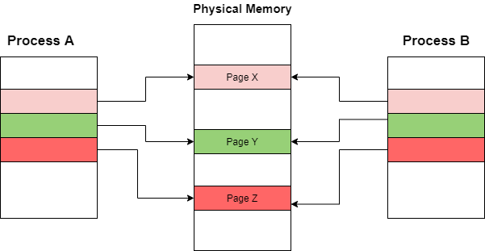

# 并发

> [《程序员的自我修养--链接、装载与库》 - 俞甲子，石凡，潘爱民](https://1drv.ms/b/s!AkcJSyT7tq80cUuHb2eRcJkkBjM?e=YUwBqB)，第一章的读书笔记，本文中的所有代码可在[GitHub仓库](https://github.com/LittleBee1024/learning_book/tree/main/docs/booknotes/cxydzwxy/concurrency/code)中找到

## 进程与线程

线程，又称为轻量级进程(Lightweight Process, LWP)，是程序执行流的最小单元。如下图所示，一个线程有以下几个部分组成：

* 线程ID
* 当前指令指针PC
* 寄存器集合
* 栈

一个进程由一个到多个线程组成，各线程之间共享一些资源，包括：

* 程序的内存空间，如代码段、数据段、堆等
* 进程级的资源，如打开的文件描述符，信号等


线程的访问非常自由，它可以访问内存里的所有数据，除了少数私有的变量，如下表所示：

线程私有 | 线程之间共享(进程所有)
--- | ---
1.局部变量<br/> 2.函数的参数<br/> 3.TLS数据<br/> | 1.全局变量<br/> 2.堆上的数据<br/> 3.函数里的静态变量<br/> 4.程序代码，任何线程都有权力读取并执行任何代码<br/> 5.打开的文件，A线程打开的文件可以由B线程读写

从Linux内核角度，进程和线程的区别仅仅是可访问的资源不同，其自身的结构是类似的，都是一个任务，详情可参考[文档](https://eli.thegreenplace.net/2018/launching-linux-threads-and-processes-with-clone/)。在Linux下，以下方法可以创建一个新的任务：

系统调用 | 作用
--- | ---
fork | 复制当前进程
exec | 使用新的可执行映像覆盖当前可执行映像
clone | 创建新任务并从指定位置开始执行，根据参数选项的不同，既可用于创建进程，也可用于创建线程

### 写时复制

Linux产生一个新任务的速度是非常快的，因为新任务不是复制原任务的内存空间，而是和原任务一起共享一个**写时复制**(Copy on Write, COW)的内存空间。所谓写时复制，指的是两个任务可以同时自由地读取内存，但任意一个任务试图对内存进行修改时，内存就会复制一份提供给修改方单独使用，以免影响到其他的任务使用。

例如，进程A创建了进程B，最初它们共享相同的内存页。由于创建前后内存并没有变化，所以进程B的创建非常迅速。



此时，进程A需要修改页面Z中的内容，一个新的页面Z的拷贝会被创建，进程A就单独拥有此页面。从而，进程A对页面Z的任何修改都不会影响进程B。详情可参考[文档](https://www.studytonight.com/operating-system/copyonwrite-in-operating-system)。


### fork进程
[例子"fork"](https://github.com/LittleBee1024/learning_book/tree/main/docs/booknotes/cxydzwxy/concurrency/code/fork)利用系统调用`fork`创建了一个新进程：
```cpp
pid_t pid = fork();
```

`fork`出的子进程和父进程各自拥有不同的PID，并且不共享变量，因此子进程对`buf`的修改不会影响父进程的内容：
```bash
> ./main 
[PID 57469, TID 57469] Child sees buf = "hello from parent"
[PID 57468, TID 57468] Child exited with status 0, buf = "hello from parent"
```

### clone进程
[例子"clone"](https://github.com/LittleBee1024/learning_book/tree/main/docs/booknotes/cxydzwxy/concurrency/code/clone)利用系统调用`clone`创建了一个新进程：

```cpp
unsigned long flags = 0;
if (argc > 1 && !strcmp(argv[1], "vm"))
{
    flags |= CLONE_VM;
}

clone(child_func, stack + STACK_SIZE, flags | SIGCHLD, buf)
```

程序默认设置了`SIGCHLD`选项，因此父进程可以收到子进程结束的信息，从而等到子进程结束再退出。程序可以选择是否设置`CLONE_VM`选项。如果设置了`CLONE_VM`，则两个进程共享内存空间。因此，子进程对`buf`的修改，在父进程中可见，打印结果如下：

```bash
> ./main 
[PID 55486, TID 55486] Child sees buf = "hello from parent"
[PID 55485, TID 55485] Child exited with status 0, buf = "hello from parent"

> ./main vm
[PID 55517, TID 55517] Child sees buf = "hello from parent"
[PID 55516, TID 55516] Child exited with status 0, buf = "hello from child"
```

### clone线程

[例子"clone_thread"](https://github.com/LittleBee1024/learning_book/tree/main/docs/booknotes/cxydzwxy/concurrency/code/clone_thread)创建了一个新线程：

```cpp
clone(&func, (char *)child_stack + STACK_SIZE, CLONE_THREAD | CLONE_SIGHAND | CLONE_FS | CLONE_VM | CLONE_FILES, NULL);
```

`CLONE_THREAD`选项创建的新任务和调用进程拥有相同的PID，因此它更像一个线程，可以直接在新任务上打GDB的断点(无须`set follow-fork-mode child`)。无论是查看`/proc/self/status`信息，还是打印PID和TID，都显示新建的任务更接近一个线程，而不是进程：
```bash
> ./main
This process pid: 56244, tid: 56244
Creating new thread...
Done! Thread pid: 56245
Looking into /proc/self/status...
...
Tgid:   56244
Ngid:   0
Pid:    56244
PPid:   47895
...
[PID 56244, TID 56245] Terminating func...
[PID 56244, TID 56244] Parent process end
```

### 线程库NPTL
NPTL(Native POSIX Threads Library)线程库提供了线程相关的各种API，方便用户进行线程的创建、同步、销毁等。
```cpp
#include <pthread.h>

// 创建线程
//  thread - 线程标识，用于后续对线程的操作
//  attr - 线程属性，NULL表示默认属性，可通过pthread_attr_init()等属性函数获取自定义属性值
int pthread_create(pthread_t* thread, const pthread_attr_t* attr, void*(*stat_routine)(void*), void* arg);

// 同步线程
//  retval - 目标线程返回的退出信息
int pthread_join(pthread_t thread, void** retval);

// 结束线程
//  retval - 向线程调用者传递的退出信息指针
void pthread_exit(void* retval);
```

[例子"nptl_thread"](https://github.com/LittleBee1024/learning_book/tree/main/docs/booknotes/cxydzwxy/concurrency/code/nptl_thread)展示了如何通过NPTL线程库创建线程，向线程传递参数，并接收线程返回的结果。
```cpp
struct thread_info
{                       /* Used as argument to thread_start() */
   pthread_t thread_id; /* ID returned by pthread_create() */
   int thread_num;      /* Application-defined thread # */
   int ret;             /* Return value */
};

void *thread_start(void *arg)
{
   struct thread_info *tinfo = arg;

   printf("[Thread_%d, num_%ld] Thread processing done\n", tinfo->thread_num, tinfo->thread_id);
   tinfo->ret = tinfo->thread_num;
   pthread_exit(&tinfo->ret);
}

int main(void)
{
    ...
    for (int tnum = 0; tnum < NUM_THREADS; tnum++)
    {
        tinfo[tnum].thread_num = tnum + 1;
        pthread_create(&tinfo[tnum].thread_id, NULL, &thread_start, &tinfo[tnum]);
    }

    void *res;
    for (int tnum = 0; tnum < NUM_THREADS; tnum++)
    {
        pthread_join(tinfo[tnum].thread_id, &res);
        printf("Joined with thread %d; Return value from thread is [%d]\n",
                tinfo[tnum].thread_num, *(int *)res);
        // free res if the res is allocated by the thread
    }
    ...
}
```

## 线程同步

### 互斥量(Mutex)


### 信号量(Semaphore)


### 临界区(Critical Section)


### 读写锁(Read-Write Lock)


### 条件变量(Condition Variable)


## 进程同步
### 文件锁
### 管道
### 信号量(Semaphore)
### Shared memory
### Socket
### Signal