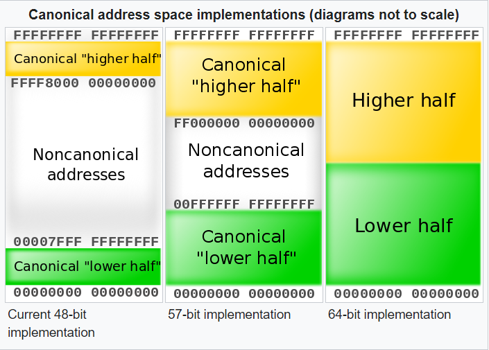
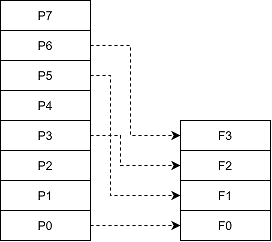

# 装载

> [《程序员的自我修养--链接、装载与库》 - 俞甲子，石凡，潘爱民](https://1drv.ms/b/s!AkcJSyT7tq80cUuHb2eRcJkkBjM?e=YUwBqB)，第六章的读书笔记，本文中的所有代码可在[GitHub仓库](https://github.com/LittleBee1024/learning_book/tree/main/docs/booknotes/cxydzwxy/load/code)中找到

## 进程虚拟地址空间

### 32位
32位系统的地址空间是4GB(2^32)，参见[文档](https://gabrieletolomei.wordpress.com/miscellanea/operating-systems/in-memory-layout/)。其中，1GB是内核空间，3GB是用户空间：

* 内核空间：0xC0000000 ~ 0xFFFFFFFF
* 用户空间：0x00000000 ~ 0xBFFFFFFF
    * `.text`段的加载地址是：0x08048000


### 64位
64位系统的最大地址空间是16EB(2^64)，参见[文档](https://en.wikipedia.org/wiki/X86-64#Virtual_address_space_details)。AMD架构规定了3种64位系统的虚拟地址空间规范，分别是：48-bit实现，57-bit实现和64-bit实现。



以48-bit实现为例，可用地址空间为两个128TB(2^47)范围(如下图)，分别是：

* 内核空间：0xFFFF_8000_0000_0000 ~ 0xFFFF_FFFF_FFFF_FFFF
* 用户空间：0x0000_0000_0000_0000 ~ 0x0000_7FFF_FFFF_FFFF
    * 和32位系统一样，用户空间也包含了栈区、堆区、代码段、数据段等


[例子"vm_addr"](https://github.com/LittleBee1024/learning_book/tree/main/docs/booknotes/cxydzwxy/load/code/vm_addr)通过打印`__executable_start`变量的值，查看进程被加载的起始地址。默认情况下，gcc会利用ASLR，随机进程的加载地址。因此，需要加入链接选项`-static`或者手动指定链接脚本(`-T`)，以固定进程加载地址，便于观察。例子中的链接脚本[main.lds](./code/vm_addr/main.lds)和默认链接脚本`ld -verbose`一致，指定了加载地址`.`：
```cpp
...
SECTIONS
{
  PROVIDE (__executable_start = SEGMENT_START("text-segment", 0x400000)); . = SEGMENT_START("text-segment", 0x400000) + SIZEOF_HEADERS;
  ...
}
```
程序运行结果如下，其中：

* 加载地址由`SEGMENT_START("text-segment", 0x400000) + SIZEOF_HEADERS`指定，运行结果是`0x400318`
* `__executable_start`变量的值由`SEGMENT_START("text-segment", 0x400000)`指定，运行结果是`0x400000`
* 进程运行时加载页的起始地址是`0x400000`，由链接时指定的加载地址`0x400318`决定

```cpp
> ./main
Executable Start 0x400000
Text End 0x401285 0x401285 0x401285
Data End 0x404030 0x404030
Executable End 0x404038 0x404038

> objdump -h ./main
./main:     file format elf64-x86-64
Sections:
Idx Name          Size      VMA               LMA               File off  Algn
  0 .interp       0000001c  0000000000400318  0000000000400318  00000318  2**0
                  CONTENTS, ALLOC, LOAD, READONLY, DATA
  1 .note.gnu.property 00000020  0000000000400338  0000000000400338  00000338  2**3
                  CONTENTS, ALLOC, LOAD, READONLY, DATA

> make debug
Mapped address spaces:
          Start Addr           End Addr       Size     Offset objfile
            0x400000           0x401000     0x1000        0x0 ./main
            0x401000           0x402000     0x1000     0x1000 ./main
            0x402000           0x403000     0x1000     0x2000 ./main
            0x403000           0x404000     0x1000     0x2000 ./main
            0x404000           0x405000     0x1000     0x3000 ./main
      0x7ffff7dbf000     0x7ffff7de4000    0x25000        0x0 /usr/lib/x86_64-linux-gnu/libc-2.31.so
```

## 装载的方式

内存和磁盘中的数据与指令按照“页(Page)”为单位划分成若干个页，所有装载和操作都以页为单位。通过`getconf PAGESIZE`命令可参看系统页的大小，一般系统都使用4096(0x1000)字节的页，如上节打印的进程虚拟内存，就是以`0x1000`大小的页为单位的。

### 实例

假设有一台32位机器，内存16KB，页大小为4096字节，因此共4页，地址分布如下：

页编号 | 地址
--- | ---
F0 | 0x0000_0000 ~ 0x0000_0FFF
F1 | 0x0000_1000 ~ 0x0000_1FFF
F2 | 0x0000_2000 ~ 0x0000_2FFF
F3 | 0x0000_3000 ~ 0x0000_3FFF

现有一大小为32KB的程序需要装载。程序总共被分为8页(P0 ~ P7)，无法同时装入16KB的内存。因此，我们需要动态装载：

* 如果程序刚开始执行时的入口地址在P0页，装载管理器发现程序的P0不在内存中，于是将内存F0分配给P0
* 运行一段时间以后，程序需要用到P5，于是装载器将P5转入F1；以此类推P3和P6被装入F2和F3，此时内存已满载
* 如果此时程序需要访问P4，装载器会根据特定算法，选择一个已经被分配掉的内存页来装载P4，例如按照先进先出的算法，用F0装载P4



当程序需要P4的时候，它可能会被装入F0~F3中的任意一个。如果程序使用物理地址直接进行操作，那么每次页被装入时都需要进行重定位。因此需要进程需要使用虚拟地址而不是物理地址。硬件MMU提供了虚拟地址到物理地址的转换，将物理地址隐藏在虚拟地址之下。因此，对于程序来说，物理地址是透明的，不需要关心。

在硬件的地址转换和页映射机制的帮助下，程序可以不用考虑实际硬件大小的限制。例如上例中，虽然硬件只有16KB的内存，对于32KB的程序来说，拥有独立的32KB虚拟内存，可“同时”(分时复用)加载入全部的程序，并且地址连续。

下面，我们从操作系统的角度，来阐述一个可执行文件是如何被装载和执行的。

### 进程的建立

程序启动前，需要做以下三件事情：

* 创建一个独立的虚拟地址空间
    * 创建虚拟地址和物理地址的映射关系
    * 创建虚拟空间只是创建映射函数所需要的相关数据结构
        * 在Linux中，实际上只是分配了一个页目录(Page Directory)
* 读取可执行文件头，并且建立虚拟空间与可执行文件的映射关系
    * 创建虚拟空间与可执行文件的映射关系
    * 当操作系统捕获到缺页错误时，需要知道程序当前所需要的页在可执行文件中的位置
        * 在Linux中，会在进程相应的数据结构中，设置段的VMA和段在ELF文件中的偏移的映射关系
* 将CPU的指令寄存器设置成可执行文件的入口地址，启动运行
    * 内核堆栈和用户堆栈的切换
    * CPU运行权限的切换

### 页错误

上面的步骤执行完以后，其实可执行文件的真正指令和数据都没有被装入到内存中。操作系统只是通过可执行文件头部的信息建立起可执行文件和进程虚拟内存之间的映射关系而已。

假设程序的入口地址时`0x08048000`，刚好是`.text`段的起始地址。当CPU开始执行这个地址的指令时，发现页面`0x08048000 ~ 0x08049000`是个空页面，于是触发一个**页错误**(Page Fault)。然后控制权被交给操作系统，来加载`.text`段到此页面，具体步骤如下：

* 利用前面提到的第二步建立的虚拟空间和可执行文件的映射关系，找到空页面所在的VMA，并计算出相应的页面在可执行文件中的偏移
* 然后在物理内存中分配一个物理页面，加载可执行文件对应位置的内容到此物理页，并将进程中该虚拟页与分配的物理页之间建立映射关系
* 最后把控制权交还给进程，进程从刚才页错误的位置重新开始执行

## 进程虚拟空间分布

### ELF链接视图和执行视图

ELF文件中，段的权限往往只有为数不多的几种组合，基本上是三种：

* 以代码段为代表的权限为可读可执行的段
* 以数据段和BSS段为代表的权限为可读可写的段
* 以只读数据段为代表的权限为只读的段

为了有效利用内存，可将相同权限的段合并到一起当作一个段进行页映射。一个或多个属性类似的"Section"组成一个"Segment"，一个"Segment"在装载的时候只有一个对应的VMA，这样就可减少页面内部碎片，从而节省空间。

* 从"Section"的角度来看ELF文件是**链接视图**(Linking View)
    * `readelf -S <elf>`可查看Section
* 从"Segment"的角度来看是**执行视图**(Execution View)。
    * `readelf -l <elf>`可擦好看Segment

[例子"segment"](https://github.com/LittleBee1024/learning_book/tree/main/docs/booknotes/cxydzwxy/load/code/segment)展示了一个简单的可执行文件两种视图的关系：

* 32个"Section"根据段的属性被分成了10个"Segment"
* 4个"LOAD"类型的"Segment"是需要被加载的，其他的诸如"NOTE"，"TLS", "GNU_STACK"都是在装载时起辅助作用的
    * 其中，第二个"LOAD"类型为可读可执行的部分，包括了代码段`.text`段

```asm
> readelf -S main
There are 32 section headers, starting at offset 0xd4588:
Section Headers:
  [Nr] Name              Type             Address           Offset
       Size              EntSize          Flags  Link  Info  Align
  [ 0]                   NULL             0000000000000000  00000000
       0000000000000000  0000000000000000           0     0     0
  [ 1] .note.gnu.propert NOTE             0000000000400270  00000270
       0000000000000020  0000000000000000   A       0     0     8
  [ 2] .note.gnu.build-i NOTE             0000000000400290  00000290
       0000000000000024  0000000000000000   A       0     0     4
  [ 3] .note.ABI-tag     NOTE             00000000004002b4  000002b4
       0000000000000020  0000000000000000   A       0     0     4
  [ 4] .rela.plt         RELA             00000000004002d8  000002d8
       0000000000000240  0000000000000018  AI       0    20     8
  [ 5] .init             PROGBITS         0000000000401000  00001000
       000000000000001b  0000000000000000  AX       0     0     4
  [ 6] .plt              PROGBITS         0000000000401020  00001020
       0000000000000180  0000000000000000  AX       0     0     16
  [ 7] .text             PROGBITS         00000000004011a0  000011a0
       0000000000091ec0  0000000000000000  AX       0     0     16
  [ 8] __libc_freeres_fn PROGBITS         0000000000493060  00093060
       0000000000001ca0  0000000000000000  AX       0     0     16
  [ 9] .fini             PROGBITS         0000000000494d00  00094d00
       000000000000000d  0000000000000000  AX       0     0     4
  [10] .rodata           PROGBITS         0000000000495000  00095000
       000000000001bd04  0000000000000000   A       0     0     32
  [11] .stapsdt.base     PROGBITS         00000000004b0d04  000b0d04
       0000000000000001  0000000000000000   A       0     0     1
  [12] .eh_frame         PROGBITS         00000000004b0d08  000b0d08
       000000000000a604  0000000000000000   A       0     0     8
  [13] .gcc_except_table PROGBITS         00000000004bb30c  000bb30c
       00000000000000b1  0000000000000000   A       0     0     1
  [14] .tdata            PROGBITS         00000000004bd0c0  000bc0c0
       0000000000000020  0000000000000000 WAT       0     0     8
  [15] .tbss             NOBITS           00000000004bd0e0  000bc0e0
       0000000000000040  0000000000000000 WAT       0     0     8
  [16] .init_array       INIT_ARRAY       00000000004bd0e0  000bc0e0
       0000000000000010  0000000000000008  WA       0     0     8
  [17] .fini_array       FINI_ARRAY       00000000004bd0f0  000bc0f0
       0000000000000010  0000000000000008  WA       0     0     8
  [18] .data.rel.ro      PROGBITS         00000000004bd100  000bc100
       0000000000002df4  0000000000000000  WA       0     0     32
  [19] .got              PROGBITS         00000000004bfef8  000beef8
       00000000000000f0  0000000000000000  WA       0     0     8
  [20] .got.plt          PROGBITS         00000000004c0000  000bf000
       00000000000000d8  0000000000000008  WA       0     0     8
  [21] .data             PROGBITS         00000000004c00e0  000bf0e0
       0000000000001a50  0000000000000000  WA       0     0     32
  [22] __libc_subfreeres PROGBITS         00000000004c1b30  000c0b30
       0000000000000048  0000000000000000  WA       0     0     8
  [23] __libc_IO_vtables PROGBITS         00000000004c1b80  000c0b80
       00000000000006a8  0000000000000000  WA       0     0     32
  [24] __libc_atexit     PROGBITS         00000000004c2228  000c1228
       0000000000000008  0000000000000000  WA       0     0     8
  [25] .bss              NOBITS           00000000004c2240  000c1230
       0000000000001718  0000000000000000  WA       0     0     32
  [26] __libc_freeres_pt NOBITS           00000000004c3958  000c1230
       0000000000000028  0000000000000000  WA       0     0     8
  ...
Key to Flags:
  W (write), A (alloc), X (execute), M (merge), S (strings), I (info),
  L (link order), O (extra OS processing required), G (group), T (TLS),
  C (compressed), x (unknown), o (OS specific), E (exclude),
  l (large), p (processor specific)

> readelf -l main
There are 10 program headers, starting at offset 64
Program Headers:
  Type           Offset             VirtAddr           PhysAddr
                 FileSiz            MemSiz              Flags  Align
  LOAD           0x0000000000000000 0x0000000000400000 0x0000000000400000
                 0x0000000000000518 0x0000000000000518  R      0x1000
  LOAD           0x0000000000001000 0x0000000000401000 0x0000000000401000
                 0x0000000000093d0d 0x0000000000093d0d  R E    0x1000
  LOAD           0x0000000000095000 0x0000000000495000 0x0000000000495000
                 0x00000000000263bd 0x00000000000263bd  R      0x1000
  LOAD           0x00000000000bc0c0 0x00000000004bd0c0 0x00000000004bd0c0
                 0x0000000000005170 0x00000000000068c0  RW     0x1000
  NOTE           0x0000000000000270 0x0000000000400270 0x0000000000400270
                 0x0000000000000020 0x0000000000000020  R      0x8
  NOTE           0x0000000000000290 0x0000000000400290 0x0000000000400290
                 0x0000000000000044 0x0000000000000044  R      0x4
  TLS            0x00000000000bc0c0 0x00000000004bd0c0 0x00000000004bd0c0
                 0x0000000000000020 0x0000000000000060  R      0x8
  GNU_PROPERTY   0x0000000000000270 0x0000000000400270 0x0000000000400270
                 0x0000000000000020 0x0000000000000020  R      0x8
  GNU_STACK      0x0000000000000000 0x0000000000000000 0x0000000000000000
                 0x0000000000000000 0x0000000000000000  RW     0x10
  GNU_RELRO      0x00000000000bc0c0 0x00000000004bd0c0 0x00000000004bd0c0
                 0x0000000000002f40 0x0000000000002f40  R      0x1
 Section to Segment mapping:
  Segment Sections...
   00     .note.gnu.property .note.gnu.build-id .note.ABI-tag .rela.plt 
   01     .init .plt .text __libc_freeres_fn .fini 
   02     .rodata .stapsdt.base .eh_frame .gcc_except_table 
   03     .tdata .init_array .fini_array .data.rel.ro .got .got.plt .data __libc_subfreeres __libc_IO_vtables __libc_atexit .bss __libc_freeres_ptrs 
   04     .note.gnu.property 
   05     .note.gnu.build-id .note.ABI-tag 
   06     .tdata .tbss 
   07     .note.gnu.property 
   08     
   09     .tdata .init_array .fini_array .data.rel.ro .got 
```

由于只有可执行文件需要加载，因此只有可执行文件有程序头表`Program Headers`，目标文件中没有。根据程序头表中的"VirtAddr"，"MemSiz"以及系统的页大小，就可用推断出各段运行时在虚拟内存中的位置。

### 堆和栈


## 内核装载ELF过程

