# 调试前的必知必会

> [《Debug Hacks--深入调试的技术和工具》 - 吉冈弘隆](https://1drv.ms/b/s!AkcJSyT7tq80clf1-pjOCricrUs?e=xIJL0b)，第二章的读书笔记，本文中的所有代码可在[GitHub仓库](https://github.com/LittleBee1024/learning_book/tree/main/docs/booknotes/debug_hacks/basic/code)中找到

## 寄存器和汇编代码

> 本章节介绍了x84_64平台中的各寄存器的作用，以及汇编代码的基本形式

### x86_64寄存器

[x86_64](http://6.s081.scripts.mit.edu/sp18/x86-64-architecture-guide.html)定义了各种寄存器，它们的用途如下表所示：

Register | Purpose                                        | Saved across calls
---      | ---                                            | ---
%rax     | temp register; (保存函数返回值)                 | No
%rbx     | callee-saved                                   | Yes
%rcx     | used to pass 4th argument to functions         | No
%rdx     | used to pass 3rd argument to functions         | No
%rsp     | stack pointer （指向栈顶）                      | Yes
%rbp     | callee-saved; base pointer（指向栈帧开始的地方） | Yes
%rsi     | used to pass 2nd argument to functions         | No
%rdi     | used to pass 1st argument to functions         | No
%r8      | used to pass 5th argument to functions         | No
%r9      | used to pass 6th argument to functions         | No
%r10-r11 | temporary                                      | No
%r12-r15 | callee-saved registers                         | Yes
%rip     | instruction pointer; Program Counter register  | Global

另外还有xmm0, xmm1...等寄存器，用于传递float类型或者double类型的参数，具体参见本文中的[“参数传递-x86_64”](#x86_64)章节。

### 常见操作符

下表列出了对寄存器和内存的常见操作，其他操作和相应的汇编代码可参考[文档](https://cs.brown.edu/courses/cs033/docs/guides/x64_cheatsheet.pdf)。

操作类型 | 格式      | 操作数值
---     | ---       | ---
立即数   | `$Imm`    | `Imm`，立即数寻址
寄存器   | `Ea`      | `R[Ea]`，寄存器寻址
内存     | `Imm`     | `M[Imm]`，绝对寻址
内存     | `(Ea)`    | `M[R[Ea]]`，间接寻址
内存     | `Imm(Ea)` | `M[Imm + R[Ea]]`，（基地址+偏移量）寻址

* `Imm`表示立即数，例如：0x8048d8e
* `Ex`表示寄存器，例如：%rax
* `R[Ex]`表示寄存器Ex的值
* `M[x]`表示地址为x的内存中的值

## 函数调用和栈

> 本章节结合[GDB](../gdb/README.md)的调试信息，介绍了栈在程序运行中的作用

### 栈的布局

在函数调用的过程中，栈上依次保存了：

* 传给函数的参数，具体传递过程可参考本文中的[“参数传递”](#_7)章节
    * 对于x86_64，参数通过“rdi, rsi, rdx, rcx, r8, r9”等寄存器传递。当参数过多时，才会将额外的参数通过栈传递
    * 对于i386，所有的参数都会通过栈传递
* 调用者的返回地址
* 上层栈帧指针`%rbp`的值
* 函数内部使用的自动变量



每次函数调用都会创建自己的栈帧(stack frame)，栈帧的起始地址由`%rbp`帧指针保存，栈顶由`%rsp`栈指针保存。以["sum.c"](https://github.com/LittleBee1024/learning_book/tree/main/docs/booknotes/debug_hacks/basic/code/stack/sum.c)代码为例子，`main`函数(caller)调用了`sum_till_MAX`函数(callee)，其相关汇编代码如下：

* `main`函数调用处的汇编代码
    ```asm
    0x0000000000001296 <+180>:   mov    $0x0,%edi               # 初始化参数1的值为0
    0x000000000000129b <+185>:   callq  0x11a9 <sum_till_MAX>   # 跳转至sum_till_MAX，其地址为0x11a9
    0x00000000000012a0 <+190>:   mov    %rax,-0x8(%rbp)         # 将sum_till_MAX返回的结果存到：M[%rbp-0x8]
    ```

* `sum_till_MAX`函数的汇编代码
    ```asm
    0x00000000000011a9 <+0>:     endbr64                        # sum_till_MAX的起始地址为0x11a9
    0x00000000000011ad <+4>:     push   %rbp                    # 在栈上保存上层栈帧的地址(存于%rbp)的值
    0x00000000000011ae <+5>:     mov    %rsp,%rbp               # 更新当前栈帧地址(栈顶地址%rsp)到栈指针%rbp
    0x00000000000011b1 <+8>:     sub    $0x20,%rsp              # 在栈上分配用于保存自动变量的空间(栈按照地址减小的方向增长)
    0x00000000000011b5 <+12>:    mov    %edi,-0x14(%rbp)        # 开始执行sum_till_MAX
    0x00000000000011b8 <+15>:    addl   $0x1,-0x14(%rbp)        # n++
    0x00000000000011bc <+19>:    mov    -0x14(%rbp),%eax
    0x00000000000011bf <+22>:    mov    %rax,-0x8(%rbp)         # sum = n, M[%rbp0-0x8]存了sum的值
    0x00000000000011c3 <+26>:    mov    0x2e47(%rip),%eax       # 0x4010 <max_addend>
    0x00000000000011c9 <+32>:    cmp    %eax,-0x14(%rbp)
    0x00000000000011cc <+35>:    jae    0x11dc <sum_till_MAX+51># 结束递归
    0x00000000000011ce <+37>:    mov    -0x14(%rbp),%eax
    0x00000000000011d1 <+40>:    mov    %eax,%edi
    0x00000000000011d3 <+42>:    callq  0x11a9 <sum_till_MAX>   # 递归调用sum_till_MAX
    0x00000000000011d8 <+47>:    add    %rax,-0x8(%rbp)
    0x00000000000011dc <+51>:    mov    -0x8(%rbp),%rax         # 将sum的值通过%rax返回
    0x00000000000011e0 <+55>:    leaveq                         # 释放当前栈，更新%rbp的值到上一栈帧
    0x00000000000011e1 <+56>:    retq                           # 跳转到栈中的返回地址
    ```

### GDB的backtrace

GDB调试器的backtrace功能是通过搜索栈中保存的信息来实现的。以["sum.c"](https://github.com/LittleBee1024/learning_book/tree/main/docs/booknotes/debug_hacks/basic/code/stack/sum.c)代码为例子，当backtrace显示如下时，
```cpp
#0  sum_till_MAX (n=2) at sum.c:18
#1  0x00005555555551d8 in sum_till_MAX (n=1) at sum.c:19
#2  0x00005555555552a0 in main (argc=2, argv=0x7fffffffdd48) at sum.c:37
```
通过`x/40xw $sp`打印的栈上内容如下：
```asm
0x7fffffffdbd0: 0x00000000      0x00000000      0x00000000      0x00000002      当前栈帧
                                                                ["u32 n"的值]
0x7fffffffdbe0: 0x00050000      0x00000000      0x00000002      0x00000000
                                                ["u64 sum" 的值是2       ]
0x7fffffffdbf0: 0xffffdc20      0x00007fff      0x555551d8      0x00005555
                [上层%rbp的值0x7fffffffdc20]    [返回地址0x00005555555551d8]
------------------------------------------------------------------------------------------
0x7fffffffdc00: 0xffffdc50      0x00007fff      0x555550c0      0x00000001      上层栈帧
                                                                ["u32 n"的值]
0x7fffffffdc10: 0xffffdd40      0x00007fff      0x00000001      0x00000000
                                                ["u64 sum" 的值是1       ]
0x7fffffffdc20: 0xffffdc50      0x00007fff      0x555552a0      0x00005555
                [上层%rbp的值0x7fffffffdc50]    [返回地址0x00005555555552a0]
------------------------------------------------------------------------------------------
0x7fffffffdc30: 0xffffdd48      0x00007fff      0x555550c0      0x00000002 上上层栈帧'main'
                [argv的值:0x7fffffffdd48 ]                      [argc的值]
0x7fffffffdc40: 0xffffdd40      0x00007fff      0x00000000      0x00000000
0x7fffffffdc50: 0x00000000      0x00000000      0xf7de60b3      0x00007fff
0x7fffffffdc60: 0xf7ffc620      0x00007fff      0xffffdd48      0x00007fff
```

* 其中，返回main函数的地址的汇编代码，通过`x/i 0x00005555555552a0`打印如下：
    * `0x5555555552a0 <main+190>:   mov    %rax,-0x8(%rbp)`，对应于main函数汇编代码的返回位置
* 通过`info frame`可以查看更多frame的信息
    ```asm
    Stack level 0, frame at 0x7fffffffdc00:
     rip = 0x5555555551c3 in sum_till_MAX (sum.c:18); saved rip = 0x5555555551d8
     called by frame at 0x7fffffffdc30
     source language c.
     Arglist at 0x7fffffffdbc8, args: n=2
     Locals at 0x7fffffffdbc8, Previous frame's sp is 0x7fffffffdc00
     Saved registers:
      rbp at 0x7fffffffdbf0, rip at 0x7fffffffdbf8
    ```

### 栈大小的限制
如果进程发生栈溢出(stack overflow)，会引发segmentation fault。上面的[例子](https://github.com/LittleBee1024/learning_book/tree/main/docs/booknotes/debug_hacks/basic/code/stack)如果不带任何参数，就会发生栈溢出。通过GDB调试，可得到如下调试信息：
```asm
(gdb) i proc mapping
      0x7ffff7ffe000     0x7ffff7fff000     0x1000        0x0 
      0x7fffff7ff000     0x7ffffffff000   0x800000        0x0 [stack]
  0xffffffffff600000 0xffffffffff601000     0x1000        0x0 [vsyscall]
(gdb) p $sp
      $1 = (void *) 0x7fffff7fefe0
```

* `i proc mapping`显示的栈的有效地址范围为：0x7fffff7ff000 ~ 0x7ffffffff000
* 发生错误时，栈指针为：0x7fffff7fefe0，超出了有效范围

我们可以通过`ulimit -s`查看进程栈的最大值，并且可以通过`ulimit -Ss <stack_size>`修改此值。

## 参数传递

> 本章节介绍了不同平台、语言中，不同的函数参数传递模型

### x86_64

在x86_64中，整型和指针型的参数会从左至右依次保存到rdi, rsi, rdx, rcx, r8, r9中，浮点型参数会保存到xmm0, xmm1...中，如果寄存器被用完，其他参数会被保存到栈上。

以如下[代码](https://github.com/LittleBee1024/learning_book/tree/main/docs/booknotes/debug_hacks/basic/code/call/main.c)为例，通过`func`函数的调用调试信息，我们可以了解x86_64的参数传递模型。
```cpp
void func(int a, long b, short c, char d, long long e, float f, double g, int *h, float *i, char *j);

// 函数调用
func(100, 35000L, 5, 'A', 123456789LL, 3.14, 2.99792458e8, &v1, &v2, "string");
```

通过GDB命令`b *func`(加星号可确保函数被断在栈操作之前)，将断点打到[示例代码](https://github.com/LittleBee1024/learning_book/tree/main/docs/booknotes/debug_hacks/basic/code/call/main.c)中`func`函数调用之前，观察到寄存器的值如下：
```asm
(gdb) b *func
Breakpoint 2 at 0x555555555149: file main.c, line 8.

(gdb) disas func
Dump of assembler code for function func:
=> 0x0000555555555149 <+0>:     endbr64 
   0x000055555555514d <+4>:     push   %rbp
   0x000055555555514e <+5>:     mov    %rsp,%rbp
   0x0000555555555151 <+8>:     sub    $0x30,%rsp

(gdb) i r
rax            0x4048f5c3          1078523331
rbx            0x555555555240      93824992236096
rcx            0x41                65               #参数d
rdx            0x5                 5                #参数c
rsi            0x88b8              35000            #参数b
rdi            0x64                100              #参数a
rbp            0x7fffffffdcb0      0x7fffffffdcb0
rsp            0x7fffffffdc98      0x7fffffffdc98
r8             0x75bcd15           123456789        #参数e
r9             0x555555558010      93824992247824   #参数h
...

(gdb) p $xmm0.v4_float                              #参数f
$1 = {3.1400001, 0, 0, 0}

(gdb) p $xmm1.v2_double                             #参数g
$3 = {299792458, 0}

(gdb) x/3xg $rsp                                    #返回地址,参数i,参数j
0x7fffffffdc98: 0x000055555555522e 0x0000555555558014
0x7fffffffdca8: 0x0000555555556055

(gdb) printf "%.2f\n", *(float*)0x0000555555558014  #参数i
0.01

(gdb) p (char*)0x0000555555556055                   #参数j
$1 = 0x555555556055 "string"

(gdb) n
(gdb) bt                                            #所有参数的值，和寄存器和栈中的值相同
func (a=100, b=35000, c=5, d=65 'A', e=123456789, f=3.1400001, g=299792458,
  h=0x555555558010 <v1>, i=0x555555558014 <v2>, j=0x555555556055 "string") at main.c:9
```

* 5个整型参数`a,b,c,d,e,h`被依次存入`rdi,rsi,rdx,rcx,r8,r9`中
* 浮点型参数`f,g`被存入`xmm0,xmm1`中，GDB将这些寄存器被看作以下联合类型
    ```cpp
    union {
        float v4_float[4];
        double v2_double[2];
        int8_t v16_int8[16];
        int16_t v8_int16[8];
        int32_t v4_int32[8];
        int64_t v2_int64[8];
        int128_t uint128;
    } xmm0;
    ```
* 由于寄存器已经用完，参数`i,j`被存于栈上，通过`x/3xg $rsp`依次得到返回地址、参数i和参数j的值，和最终传递的函数参数值相同
    * 0x7fffffffdc98: 0x000055555555522e    - 返回地址
    * 0x7fffffffdca0: 0x0000555555558014    - 参数i
    * 0x7fffffffdca8: 0x0000555555556055    - 参数j


### i386

在i386中，参数全部放在栈中。将上节中的代码通过`-m32`编译成[32位版本](https://github.com/LittleBee1024/learning_book/tree/main/docs/booknotes/debug_hacks/basic/code/call_i386/Makefile)后，通过GDB调试，断点在`func`调用之前。此时，`func`函数的所有参数，从右到左依次被压入栈中，打印栈上内容如下：

```asm
(gdb) p *(int*)($esp+4)
$1 = 100                                    #参数a
(gdb) p *(long*)($esp+8)
$2 = 35000                                  #参数b
(gdb) p *(short*)($esp+12)
$3 = 5                                      #参数c
(gdb) p *(char*)($esp+16)
$4 = 65 'A'                                 #参数d
(gdb) p *(long long*)($esp+20)
$5 = 123456789                              #参数e
(gdb) printf "%.2e\n",*(float*)($esp+28)
3.14e+00                                    #参数f
(gdb) printf "%.3e\n",*(double*)($esp+32)
2.998e+08                                   #参数g
(gdb) p/x *(int*)($esp+40)
$6 = 0x56559008                             #参数h
(gdb) p/x *(int*)($esp+44)
$7 = 0x5655900c                             #参数i
(gdb) p/x *(int*)($esp+48)
$8 = 0x56557055                             #参数j

(gdb) n
(gdb) bt
func (a=100, b=35000, c=5, d=65 'A', e=123456789, f=3.1400001, g=299792458,
  h=0x56559008 <v1>, i=0x5655900c <v2>, j=0x56557055 "string") at main.c:9
```

#### i386中的寄存器调用

i386也可以通过“fastcall”的方式，将参数放在寄存器中。例如，GCC可以通过`__attribute__((regparm(3)))`声明，使用eax，edx和ecx传递开头3各参数。而Linux可以使用FASTCALL和asmregparm等宏来实现。
```cpp
__attribute__((regparm(3)))
void func(int a, long b, short c, char d, long long e, float f, double g, int *h, float *i, char *j)
{
    ...
}
```

### C++

C++函数在编译时会经过函数名变换(mangle)，并且对于类方法的调用，第一个参数是当前类对象的指针。例如，[例子](https://github.com/LittleBee1024/learning_book/tree/main/docs/booknotes/debug_hacks/basic/code/call_cpp/main.cpp)中的`foo::func`函数，最终调用签名如下：
```cpp
void func(class foo *this, int x, int y)
{
    this->a = x;
    this->b = y+2;
}
```

将程序在`foo::func`函数调用前打上断点后，可得到如下寄存器的值：
```asm
(gdb) i r
...
rdx            0x1                 1                #参数y
rsi            0x5                 5                #参数x
rdi            0x7fffffffdc18      140737488346136  #参数this
...

(gdb) n
(gdb) bt                                            #参数值和上面的寄存器值相同
foo::func (this=0x7fffffffdc18, x=5, y=1) at main.cpp:13
```
