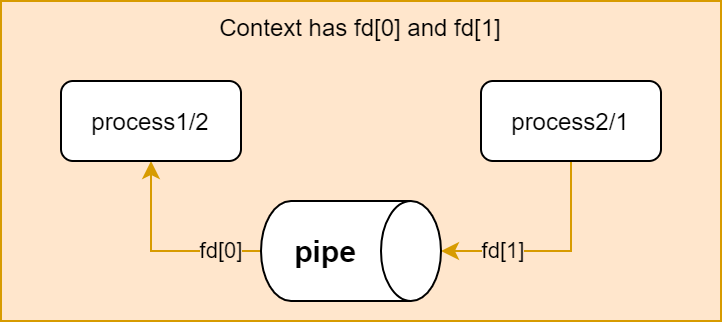
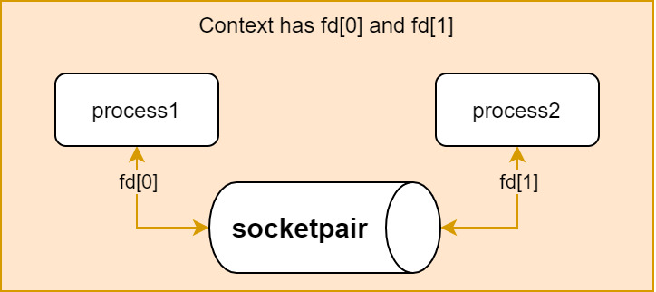
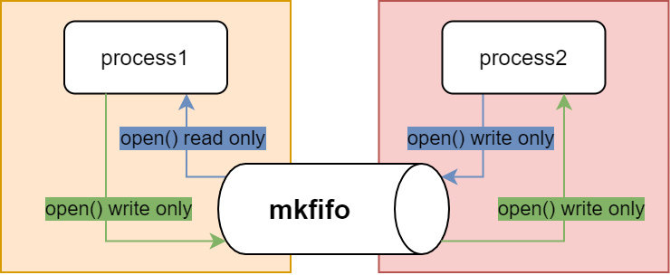
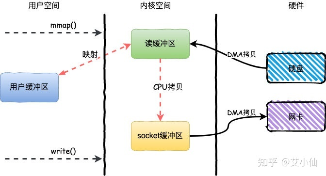
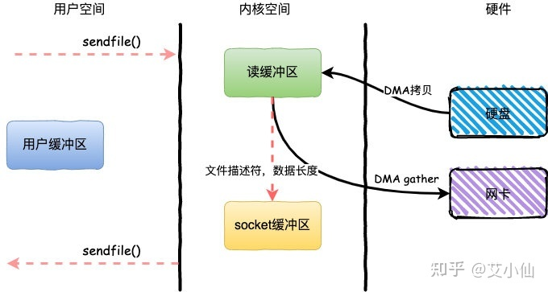

# 高级IO函数

> [《Linux高性能服务器编程》 - 游双 ](https://1drv.ms/b/s!AkcJSyT7tq80c1DmkdcxK7oScvQ)第6章，以及[《小林coding - 网络系统》](https://xiaolincoding.com/os)的读书笔记，本文中的所有代码可在[GitHub仓库](https://github.com/LittleBee1024/learning_book/tree/main/docs/booknotes/hplsp/adv_io/code)中找到

## pipe函数

### pipe
```cpp
#include <unistd.h>

// 打开一个管道
//  fd[0] - 管道读端
//  fd[1] - 管道写端
//  如果管道中没有数据，读操作阻塞
//  如果所有写端被关闭，读操作返回零
//  如果所有读端被关闭，写操作失败，并触发`SIGPIPE`信号
int pipe(int fd[2]);
```


[例子"pipe"](https://github.com/LittleBee1024/learning_book/tree/main/docs/booknotes/hplsp/adv_io/code/pipe)，实现了子进程同步读取父进程往管道中写入的数据：

```cpp hl_lines="9 11 24 33 35 36"
#define MSGSIZE 16
const char *msg1 = "hello, world #1";
const char *msg2 = "hello, world #2";

void write_data(int write_fd)
{
   printf("Parent Task Starts\n");

   int nbytes = write(write_fd, msg1, MSGSIZE);
   printf("parent process wrote %d bytes to child process: %s\n", nbytes, msg1);
   nbytes = write(write_fd, msg2, MSGSIZE);
   printf("parent process wrote %d bytes to child process: %s\n", nbytes, msg2);

   printf("Parent Task Ends\n");
}

void read_data(int read_fd)
{
   printf("Child Task Starts\n");

   char inbuf[MSGSIZE];
   int nbytes = 0;

   while ((nbytes = read(read_fd, inbuf, MSGSIZE)) > 0)
      printf("child process read %d bytes to from parent process: %s\n", nbytes, inbuf);

   printf("Child Task Ends\n");
}

int main(int argc, char **argv)
{
   int fd[2];
   pipe(fd);

   int read_fd = fd[0];
   int write_fd = fd[1];

   pid_t pid = fork();
   if (pid == 0)
   {
      close(write_fd);
      read_data(read_fd);
      close(read_fd);
      return 0;
   }

   close(read_fd);
   sleep(1);
   write_data(write_fd);
   close(write_fd);

   wait(NULL);
   return 0;
}
```
```bash
> ./main 
Child Task Starts
Parent Task Starts
parent process wrote 16 bytes to child process: hello, world #1
parent process wrote 16 bytes to child process: hello, world #2
Parent Task Ends
child process read 16 bytes to from parent process: hello, world #1
child process read 16 bytes to from parent process: hello, world #2
Child Task Ends
```

### socketpair
```cpp
#include <sys/socket.h>

// 创建双向管道
//  domain - 只能是UNIX本地协议族AF_UNIX
//  type, protocol - 本地协议族的参数
//  fd[2] - 管道的两端，都可读可写，一端写，必须从另一端读，反之亦然。
//  如果管道中没有数据，读操作阻塞
//  如果管道一端的文件描述符都被关闭，则另一端的读操作返回零
int socketpair(int domain, int type, int protocol, int fd[2]);
```


[例子"socketpair"](https://github.com/LittleBee1024/learning_book/tree/main/docs/booknotes/hplsp/adv_io/code/socketpair)，实现了在两个进程间传递数据：

```cpp hl_lines="10 13 23 27 36"
#define MSGSIZE 16
const char *msg1 = "hello, world #1";
const char *msg2 = "hello, world #2";

void parent_rw(int socket)
{
   printf("[Parent] Task Starts\n");

   char inbuf[MSGSIZE];
   int nbytes = read(socket, inbuf, MSGSIZE);
   printf("[Parent] read %d bytes to from child process: %s\n", nbytes, inbuf);

   nbytes = write(socket, msg1, MSGSIZE);
   printf("[Parent] wrote %d bytes to child process: %s\n", nbytes, msg1);

   printf("[Parent] Task Ends\n");
}

void child_wr(int socket)
{
   printf("[Child] Task Starts\n");

   int nbytes = write(socket, msg2, MSGSIZE);
   printf("[Child] wrote %d bytes to parent process: %s\n", nbytes, msg2);

   char inbuf[MSGSIZE];
   nbytes = read(socket, inbuf, MSGSIZE);
   printf("[Child] read %d bytes to from parent process: %s\n", nbytes, inbuf);

   printf("[Child] Task Ends\n");
}

int main()
{
   int fd[2];
   socketpair(AF_UNIX, SOCK_STREAM, 0, fd);

   const int parentSocket = 0;
   const int childSocket = 1;

   pid_t pid = fork();
   if (pid == 0)
   {
      close(fd[parentSocket]);
      child_wr(fd[childSocket]);
      close(fd[childSocket]);
      return 0;
   }

   close(fd[childSocket]);
   sleep(1);
   parent_rw(fd[parentSocket]);
   close(fd[parentSocket]);

   wait(NULL);
   return 0;
}
```
```bash
> ./main 
[Child] Task Starts
[Child] wrote 16 bytes to parent process: hello, world #2
[Parent] Task Starts
[Parent] read 16 bytes to from child process: hello, world #2
[Parent] wrote 16 bytes to child process: hello, world #1
[Parent] Task Ends
[Child] read 16 bytes to from parent process: hello, world #1
[Child] Task Ends
```

### mkfifo
```cpp
#include <sys/stat.h>

// 创建命名管道
//  pathname - 命名管道文件名，需要保证在创建前不存在此文件
//  mode - 文件属性
//  需要同时以“只读”和“只写”的方式打开命名管道，并在两边进行同步读写
int mkfifo(const char *pathname, mode_t mode);
```


[例子"mkfifo"](https://github.com/LittleBee1024/learning_book/tree/main/docs/booknotes/hplsp/adv_io/code/mkfifo)，创建了一个`/tmp/fifo`命名管道，并在两个进程中通过此管道同步数据：

```cpp hl_lines="10 12 16 17 28 29 33 35 44"
#define NAMED_FIFO "/tmp/fifo"
#define MSGSIZE 16
const char *msg1 = "hello, world #1";
const char *msg2 = "hello, world #2";

void parent_rw()
{
   printf("[Parent] Task Starts\n");

   int fd_read = open(NAMED_FIFO, O_RDONLY);
   char inbuf[MSGSIZE];
   int nbytes = read(fd_read, inbuf, MSGSIZE);
   printf("[Parent] read %d bytes to from child process: %s\n", nbytes, inbuf);
   close(fd_read);

   int fd_write = open(NAMED_FIFO, O_WRONLY);
   nbytes = write(fd_write, msg1, MSGSIZE);
   printf("[Parent] wrote %d bytes to child process: %s\n", nbytes, msg1);
   close(fd_write);

   printf("[Parent] Task Ends\n");
}

void child_wr()
{
   printf("[Child] Task Starts\n");

   int fd_write = open(NAMED_FIFO, O_WRONLY);
   int nbytes = write(fd_write, msg2, MSGSIZE);
   printf("[Child] wrote %d bytes to parent process: %s\n", nbytes, msg2);
   close(fd_write);

   int fd_read = open(NAMED_FIFO, O_RDONLY);
   char inbuf[MSGSIZE];
   nbytes = read(fd_read, inbuf, MSGSIZE);
   printf("[Child] read %d bytes to from parent process: %s\n", nbytes, inbuf);
   close(fd_read);

   printf("[Child] Task Ends\n");
}

int main(int argc, char **argv)
{
   int rc = mkfifo(NAMED_FIFO, 0777);
   if (rc == -1)
   {
      perror(NAMED_FIFO);
      return -1;
   }

   pid_t pid = fork();
   if (pid == 0)
   {
      child_wr();
      return 0;
   }

   sleep(1);
   parent_rw();

   wait(NULL);
   unlink(NAMED_FIFO);
   return 0;
}
```
```bash
> ./main 
[Child] Task Starts
[Parent] Task Starts
[Child] wrote 16 bytes to parent process: hello, world #2
[Parent] read 16 bytes to from child process: hello, world #2
[Parent] wrote 16 bytes to child process: hello, world #1
[Child] read 16 bytes to from parent process: hello, world #1
[Child] Task Ends
[Parent] Task Ends
```

## dup函数

### dup
```cpp
#include <unistd.h>

// 复制文件描述符，新的文件描述符的值由系统指定
//  oldfd - 要复制的文件描述符
int dup(int oldfd);
```
[例子"dup"](https://github.com/LittleBee1024/learning_book/tree/main/docs/booknotes/hplsp/adv_io/code/dup)，复制了标准输出，因此有两个文件描述符可以输出信息：
```cpp hl_lines="7 9 10"
const char msg1[] = "hello, world #1\n";
const char msg2[] = "hello, world #2\n";

int main()
{
   int stdout_fd = 1;
   int stdout_fd_copy = dup(stdout_fd);

   printf("%s", msg1);
   write(stdout_fd_copy, msg2, sizeof(msg2) - 1); // print to stdout

   close(stdout_fd_copy);
   return 0;
}
```
```bash
> ./main 
hello, world #1
hello, world #2
```

### dup2
```cpp
#include <unistd.h>

// 复制文件描述符，新的文件描述符由用户传入
//  oldfd - 要复制的文件描述符
//  newfd - 新的文件描述符的值，如果有被此文件描述符打开的文件，会被关闭
int dup2(int oldfd, int newfd);
```
[例子"dup2"](https://github.com/LittleBee1024/learning_book/tree/main/docs/booknotes/hplsp/adv_io/code/dup2)，将标准输出重定位到了文件：
```cpp hl_lines="8 10 12"
const char msg1[] = "hello, world #1\n";
const char msg2[] = "hello, world #2\n";

int main()
{
   int fd = open("dup2.log", O_CREAT | O_WRONLY | O_APPEND, S_IRUSR | S_IWUSR | S_IRGRP | S_IROTH);
   int stdout_fd = 1;
   int rc = dup2(fd, stdout_fd);

   printf("%s", msg1); // print to log file because the fd is redirected
   fflush(stdout); // no flush will lose the data
   write(stdout_fd, msg2, sizeof(msg2) - 1);

   close(stdout_fd);
   close(fd);

   return 0;
}
```
```bash
> cat dup2.log
hello, world #1
hello, world #2
```

## mmap函数
```cpp
#include <sys/mman.h>

// 申请一块内存，可将这段内存作为进程间通信的共享内存，也可用将文件直接映射到用户空间
//  start - 允许用户使用某个特定的地址作为这段内存的起始地址，NULL表示由系统分配
//  length - 内存段长度
//  prot - 设置内存段的访问权限
//  flags - 控制内存段被修改后程序的行为
//      MAP_SHARED - 在进程间共享这段内存，POSIX进程通信依赖此功能
//      MAP_PRIVATE - 调用进程所私有
//      MAP_ANONYMOUS / MAP_ANON - 内存段不是从文件映射而来，后两个参数被忽略，POSIX进程同步依赖此功能
//  fd - 被映射文件对应的文件描述符
//  offset - 从文件的何处开始映射
//  成功时返回指向目标内存区域的指针，失败时返回`MAP_FAILED`
void* mmap(void *start, size_t length, int prot, int flags, int fd, off_t offset);
```

`mmap`一般用在两个地方：

* 利用`mmap+write`加速文件拷贝，实现零拷贝
* 在进程间共享内存，例如，POSIX进程间通信就依赖到了`mmap`

### 零拷贝
正常文件拷贝，需要经过“用户缓冲区”，如下图：

*图片来自[文档](https://zhuanlan.zhihu.com/p/357820303)*

而在`mmap`的帮助下，不需要经过“用户缓冲区”，直接在内核空间通过CPU拷贝，从而减少了一次CPU的拷贝时间，如下图：


[例子"mmap"](https://github.com/LittleBee1024/learning_book/tree/main/docs/booknotes/hplsp/adv_io/code/mmap)，利用`mmap`实现了对文件的拷贝：
```cpp hl_lines="12 15 17"
int main(int argc, char *argv[])
{
   ...
   int fdin = open(in_filename, O_RDONLY);
   int fdout = open(out_filename, O_RDWR | O_CREAT | O_TRUNC, S_IRUSR | S_IWUSR | S_IRGRP | S_IROTH);

   struct stat statbuf;
   fstat(fdin, &statbuf);
   ftruncate(fdout, statbuf.st_size); // expand the space of the output file

   // 映射输入文件到用户空间`src_ptr`
   void *src_ptr = mmap(NULL, statbuf.st_size, PROT_READ, MAP_SHARED, fdin, 0);

   // 映射输出文件到用户空间`dest_ptr`
   void *dest_ptr = mmap(NULL, statbuf.st_size, PROT_READ | PROT_WRITE, MAP_SHARED, fdout, 0);

   memcpy(dest_ptr, src_ptr, statbuf.st_size); // copy to output file

   munmap(dest_ptr, statbuf.st_size);
   munmap(src_ptr, statbuf.st_size);
   return 0;
}
```

### 共享内存

进程间共享内存是`mmap`最重要的功能之一，匿名共享内存可用于父进程/子进程间的通信，而具名共享内存可以实现系统中任意进程间的通信。在[“程序员的自我修养/并发”](../../cxydzwxy/concurrency/README.md)博文中，例举了各场景中`mmap`的作用：

* `mmap`在进程间同步中的作用
    * [互斥量](../../cxydzwxy/concurrency/README.md#mutex_1)
    * [信号量](../../cxydzwxy/concurrency/README.md#semaphore_1)
    * [条件变量](../../cxydzwxy/concurrency/README.md#condition-variable_1)
* `mmap`在进程间通信中的作用
    * [共享内存](../../cxydzwxy/concurrency/README.md#posix_1)

## sendfile函数
```cpp
#include <sys/sendfile.h>

// 将一个真实文件的数据传递给一个socket
//  out_fd - 必须是一个socket
//  in_fd - 必须是一个真实文件的文件描述符，不能是socket或管道
ssize_t sendfile(int out_fd, int in_fd, off_t* offset, size_t count);
```
如下图所示，一次`sendfile`系统调用，就可以实现文件的拷贝动作。相比于`mmap+write`实现的零拷贝，`sendfile`同样只有一次CPU拷贝，并且只需要一次系统调用，从而减少了用户空间/内核空间上下文切换的次数。



[例子"sendfile"](https://github.com/LittleBee1024/learning_book/tree/main/docs/booknotes/hplsp/adv_io/code/sendfile)，利用`sendfile`完成了服务器向客户端传递文件数据的功能：

```cpp hl_lines="12"
int main(int argc, char* argv[])
{
   ...
   int filefd = open(file_name, O_RDONLY);
   struct stat stat_buf;
   fstat(filefd, &stat_buf);

   // start server listen socket
   ...
   int connfd = accept(sock, (struct sockaddr*)&client, &client_addrlength);

   sendfile(connfd, filefd, NULL, stat_buf.st_size);

   close(connfd);
   close(sock);
   return 0;
}
```
=== "server"

    ```bash
    > ./main 127.0.0.1 12345 ./in.txt
    ```

=== "client"

    ```bash
    > telnet 127.0.0.1 12345
    Trying 127.0.0.1...
    Connected to 127.0.0.1.
    Escape character is '^]'.
    hello
    world
    Connection closed by foreign host.
    ```

## splice函数

## tee函数

