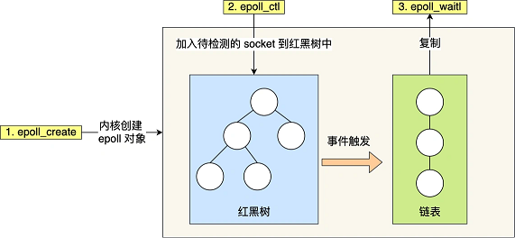

# IO复用

> [《Linux高性能服务器编程》 - 游双 ](https://1drv.ms/b/s!AkcJSyT7tq80c1DmkdcxK7oScvQ)的第9章，[《UNIX网络编程卷1》 - 第三版 ](https://1drv.ms/b/s!AkcJSyT7tq80dP1Vghbg7qb9uts)的第6章，以及[《小林coding - 网络系统》](https://xiaolincoding.com/os)的读书笔记，本文中的所有代码可在[GitHub仓库](https://github.com/LittleBee1024/learning_book/tree/main/docs/booknotes/hplsp/multi_io/code)中找到

## IO复用函数


Linux提供了`select()`，`poll()`，`epoll()`三个函数，用于监控文件描述符上发生的事件，实现IO复用。其中，`select()`，`poll()`是类UNIX系统都提供的，而`epoll()`是Linux独有的。三者的区别如下：

系统调用 | select | poll | epoll
--- | --- | --- | ---
事件集合 | 监听可读、可写及异常三种事件 | 统一处理所有事件类型 | 内核通过一个事件表管理事件
索引就绪事件时间复杂度 | O(n) | O(n) | O(1)
工作模式 | 电平触发LT | 电平触发LT | 电平触发LT/边沿触发ET

下面通过三个例子，分别介绍这三个函数的使用方法。这三个例子可同时处理新的客户端网络连接和多个客户端输入，并将客户端传来的字符串转换成大写后回传给客户端：


### select函数

```cpp
#include <sys/select.h>

// 监听三组文件描述符上发生的事件
//  nfds - 被监听的文件描述符的总数，通常是select监听的所有文件描述符的最大值加1
//  readfds, writefds, exceptfds - 记录要监听的三种类型的文件描述符
int select(int nfds, fd_set* readfds, fd_set* writefds, fd_set* exceptfds, struct timeval* timeout);
```

* 文件描述符就绪条件
    * socket可读
        * 接收缓存区的字节数大于或等于`SO_RCVLOWAT`
        * socket通信的对方关闭连接，此时对该socket的读操作将返回0
        * 监听socket上有新的连接请求
        * socket上有未处理的错误
    * socket可写
        * 发送缓存区的字节数大于或等于`SO_SNDLOWAT`
        * socket的写操作被关闭
        * socket使用非阻塞connect连接成功或者失败(超时)之后
        * socket上有未处理的错误
    * socket异常
        * socket上接收到外带数据，发送的时候带上`MSG_OOB`标志

[例子"select"](https://github.com/LittleBee1024/learning_book/tree/main/docs/booknotes/hplsp/multi_io/code/select)利用`select()`函数，完成了对客户端连接和客户端输入的监听。需要注意的是，`select()`调用返回后，用户需要遍历所有文件描述符，找到发生了事件的文件描述符后，再进行处理。并且，每次调用`select()`前都要重新设置文件描述符，因为内核会修改传入的文件描述符。

```cpp title="server.cpp" hl_lines="30 37 40"
int main(int argc, char *argv[])
{
   ...
   int listen_fd = socket(PF_INET, SOCK_STREAM, 0);

   int on = 1;
   setsockopt(listen_fd, SOL_SOCKET, SO_REUSEADDR, &on, sizeof(on));
   // 配置监听socket为非阻塞
   ioctl(listen_fd, FIONBIO, (char *)&on);

   bind(listen_fd, (struct sockaddr *)&address, sizeof(address));
   listen(listen_fd, 5);

   fd_set read_fds_copy;
   FD_ZERO(&read_fds_copy);
   FD_SET(listen_fd, &read_fds_copy);

   int max_fd = listen_fd;
   struct timeval timeout;
   char buf[1024];
   fd_set read_fds;
   FD_ZERO(&read_fds);
   while (true)
   {
      // 每次调用select前都要重新在read_fds中设置文件描述符，因为事件发生之后，文件描述符将被内核修改
      memcpy(&read_fds, &read_fds_copy, sizeof(read_fds_copy));
      timeout.tv_sec = 60; // seconds

      printf("[Server] Waiting on select()...\n");
      select(max_fd + 1, &read_fds, nullptr /*write_fds*/, nullptr /*exception_fds*/, &timeout);
      if (rc == 0)
      {
         printf("[Server] select() timeout, end program\n");
         break;
      }

      for (int i = 0; i <= max_fd; ++i)
      {
         // file descriptor `i` has read event
         if (FD_ISSET(i, &read_fds))
         {
            if (i == listen_fd)
            {
               printf("[Server] Listening socket is readable\n");

               struct sockaddr_in client;
               socklen_t client_addrlength = sizeof(client);
               int conn_fd = accept(listen_fd, (struct sockaddr *)&client, &client_addrlength);
               printf("[Server] New incoming connection %d, ip: %s, port: %d\n",
                      conn_fd, inet_ntoa(client.sin_addr), ntohs(client.sin_port));

               FD_SET(conn_fd, &read_fds_copy);
               if (conn_fd > max_fd)
                  max_fd = conn_fd;
            }
            else
            {
               printf("[Server] Connection socket %d is readable\n", i);

               memset(buf, '\0', sizeof(buf));
               int n_bytes = recv(i, buf, sizeof(buf) - 1, 0);
               if (n_bytes == 0)
               {
                  printf("[Server] Remote client was closed, so close connection %d\n", i);
                  close(i);
                  FD_CLR(i, &read_fds_copy);
                  if (i == max_fd)
                  {
                     while (FD_ISSET(max_fd, &read_fds) == false)
                        max_fd -= 1;
                  }
                  break;
               }

               printf("[Server] Get %d bytes from connection %d : %s\n", n_bytes, i, buf);
               for (int j = 0; j < n_bytes; j++)
                  buf[j] = toupper(buf[j]);
               send(i, buf, n_bytes, 0);
            }
         }
      }
   }

   for (int i = 0; i <= max_fd; ++i)
   {
      if (FD_ISSET(i, &read_fds_copy))
         close(i);
   }

   return 0;
}
```

启动服务后，通过`nc`命令，连接两个客户端到服务器，分别传送"hello"和"world"字符串给服务器，观察服务器是否回传大写的"HELLO"和"WORLD"。再分别退出客户端连接，观察服务端打印的信息。最后等待60秒后，由于服务端没有收到任何信息，超时退出。

=== "Server"

    ```bash
    > ./main 127.0.0.1 1234
    [Server] Waiting on select()...
    [Server] Listening socket is readable
    [Server] New incoming connection 4, ip: 127.0.0.1, port: 56274
    [Server] Waiting on select()...
    [Server] Listening socket is readable
    [Server] New incoming connection 5, ip: 127.0.0.1, port: 56280
    [Server] Waiting on select()...
    [Server] Connection socket 4 is readable
    [Server] Get 6 bytes from connection 4 : hello

    [Server] Waiting on select()...
    [Server] Connection socket 5 is readable
    [Server] Get 6 bytes from connection 5 : world

    [Server] Waiting on select()...
    [Server] Connection socket 4 is readable
    [Server] Remote client was closed, so close connection 4
    [Server] Waiting on select()...
    [Server] Connection socket 5 is readable
    [Server] Remote client was closed, so close connection 5
    [Server] Waiting on select()...
    [Server] Waiting on select()...
    [Server] select() timeout, end program
    ```

=== "Client"

    ```bash
    # 客户端1连接服务器，发送"hello"后`Ctrl+D`退出
    > nc -q 1 127.0.0.1 1234
    hello
    HELLO
    ```
    ```bash
    # 客户端1连接服务器，发送"world"后`Ctrl+D`退出
    > nc -q 1 127.0.0.1 1234
    world
    WORLD
    ```

### poll函数

```cpp
#include <poll.h>

// 在指定时间内轮询一定数量的文件描述符，以测试其中是否有就绪者
//  fds - 一个pollfd结构类的数组，可指定我们感兴趣的事件
//  nfds - fds数组的有效长度
int poll(struct pollfd* fds, nfds_t nfds, int timeout);

// 此数据用于指定用户感兴趣的事件，同时内核返回发生的事件给用户，具体事件见下表
struct pollfd {
    int   fd;         // 输入，监听的文件描述符
    short events;     // 输入，监听的事件类型，常见的类型有：POLLIN, POLLOUT, POLLHUP
    short revents;    // 输出，发生的事件，由内核修改
};
```

事件 | 描述 | 说明
--- | --- | ---
POLLIN | 数据可读 | 包括优先数据`MSG_OOB`
POLLOUT | 数据可写 | 包括优先数据`MSG_OOB`
POLLRDHUP | TCP连接被对方关闭，或者对方关闭了写操作 | Linux内核2.6.17引入
POLLERR | 错误 | 由内核管理，用户不能作为输入配置
POLLHUP | 写端被关闭后，读端上将收到POLLHUP事件| 由内核管理，用户不能作为输入配置
POLLNVAL | 文件描述符没有打开 | 由内核管理，用户不能作为输入配置


[例子"poll"](https://github.com/LittleBee1024/learning_book/tree/main/docs/booknotes/hplsp/multi_io/code/select)利用`poll()`函数，完成了对客户端连接和客户端输入的监听。和`select()`函数一样，`poll()`调用返回后，用户也需要遍历所有文件描述符，找到感兴趣的文件描述符后，进行处理。同时再次调用`poll()`的时候，需要重新传入所有文件描述符。

```cpp title="server.cpp" hl_lines="24 32 38 52"
int main(int argc, char *argv[])
{
   ...

   int listen_fd = socket(PF_INET, SOCK_STREAM, 0);

   int on = 1;
   setsockopt(listen_fd, SOL_SOCKET, SO_REUSEADDR, &on, sizeof(on));
   ioctl(listen_fd, FIONBIO, (char *)&on);

   bind(listen_fd, (struct sockaddr *)&address, sizeof(address));
   listen(listen_fd, 5);

   struct pollfd fds[MAX_POLL_FD];
   memset(fds, 0, sizeof(fds));
   fds[0].fd = listen_fd;
   fds[0].events = POLLIN;
   int nfds = 1;
   int timeout = 60 * 1000; // milliseconds
   char buf[1024];
   while (true)
   {
      printf("Waiting on poll()...\n");
      rc = poll(fds, nfds, timeout);
      if (rc == 0)
      {
         printf("[Server] poll() timeout, end program\n");
         break;
      }

      int current_size = nfds;
      for (int i = 0; i < current_size; ++i)
      {
         printf("[Server] fds[%d].fd = %d, fds[%d].revents = 0x%x\n", i, fds[i].fd, i, fds[i].revents);
         if (fds[i].revents == 0)
            continue;

         if ((fds[i].fd == listen_fd) && (fds[i].revents & POLLIN))
         {
            printf("[Server] Listening socket is readable\n");

            struct sockaddr_in client;
            socklen_t client_addrlength = sizeof(client);
            int conn_fd = accept(listen_fd, (struct sockaddr *)&client, &client_addrlength);
            printf("[Server] New incoming connection %d, ip: %s, port: %d\n",
                   conn_fd, inet_ntoa(client.sin_addr), ntohs(client.sin_port));

            fds[nfds].fd = conn_fd;
            fds[nfds].events = POLLIN;
            nfds++;
         }
         else if (fds[i].revents & POLLIN)
         {
            printf("[Server] Connection socket %d is readable\n", fds[i].fd);

            memset(buf, '\0', sizeof(buf));
            int n_bytes = recv(fds[i].fd, buf, sizeof(buf) - 1, 0);
            if (n_bytes == 0)
            {
               printf("[Server] Remote client was closed, so close connection %d\n", fds[i].fd);
               close(fds[i].fd);
               fds[i] = fds[nfds - 1];
               nfds--;
               break;
            }

            printf("[Server] Get %d bytes from connection %d : %s\n", n_bytes, fds[i].fd, buf);
            for (int j = 0; j < n_bytes; j++)
               buf[j] = toupper(buf[j]);
            send(fds[i].fd, buf, n_bytes, 0);
         }
         else
         {
            printf("[Server] Receive unexpected event 0x%x", fds[i].revents);
            assert(0);
         }
      }
   }

   for (int i = 0; i < nfds; i++)
   {
      if (fds[i].fd > 0)
         close(fds[i].fd);
   }

   return 0;
}
```

同样的方法，用两个客户端测试服务器，得到如下信息：

=== "Server"

    ```bash
    > ./main 127.0.0.1 1234
    Waiting on poll()...
    [Server] Listening socket is readable
    [Server] New incoming connection 4, ip: 127.0.0.1, port: 58686
    Waiting on poll()...
    [Server] Listening socket is readable
    [Server] New incoming connection 5, ip: 127.0.0.1, port: 58756
    Waiting on poll()...
    [Server] Connection socket 4 is readable
    [Server] Get 6 bytes from connection 4 : hello

    Waiting on poll()...
    [Server] Connection socket 5 is readable
    [Server] Get 6 bytes from connection 5 : world

    Waiting on poll()...
    [Server] Connection socket 4 is readable
    [Server] Remote client was closed, so close connection 4
    Waiting on poll()...
    [Server] Connection socket 5 is readable
    [Server] Remote client was closed, so close connection 5
    Waiting on poll()...
    [Server] poll() timeout, end program
    ```

=== "Client"

    ```bash
    # 客户端1连接服务器，发送"hello"后`Ctrl+D`退出
    > nc -q 1 127.0.0.1 1234
    hello
    HELLO
    ```
    ```bash
    # 客户端1连接服务器，发送"world"后`Ctrl+D`退出
    > nc -q 1 127.0.0.1 1234
    world
    WORLD
    ```

### epoll函数

```cpp
#include <sys/epoll.h>

// 创建epoll的文件描述符
//  size - 已经无需，置零即可
int epoll_create(int size);

// 操作epoll的内核事件表，以在内核事件表中监听/删除某文件描述符
//  epfd - `epoll_create()`返回的文件描述符
//  op - 指定操作类型
//  fd - 要操作的文件描述符
int epoll_ctl(int epfd, int op, int fd, struct epoll_event *event);

// epoll事件
//  events - 描述事件类型，基本和poll相同
struct epoll_event
{
    __uint32_t events; //epoll事件
    epoll_data_t data; //用户数据
};

// 用于存储用户数据的联合体，只能选择其中一项使用
//  fd - 指定事件所从属的目标文件描述符
//  ptr - 用于指定与fd相关的用户数据，一种更灵活传递数据的方式
typedef union epoll_data
{
    void* ptr;
    int fd;
    uint32_t u32;
    uint64_t u64;
} epoll_data_t;

// 在一段超时时间内等待一组文件描述符上的事件
//  events - 内核返回的就绪事件，只包含就绪事件，因此无需用户自己遍历寻找感兴趣的事件
int epoll_wait(int epfd, struct epoll_event* events, int maxevents, int timeout);
```

下图显示了`epoll`相关系统调用在内核中的作用。`epoll`较`select/poll`的优势在于：

* 在内核中使用了红黑树来跟踪进程所有待检测的文件描述符，解决了`select/poll`每次都要重复传入所有文件描述符的问题
* 同时还维护了一个链表来记录就绪事件，解决了`select/poll`每次都要遍历所有文件描述符来寻找感兴趣的就绪事件的问题



[例子"epoll"](https://github.com/LittleBee1024/learning_book/tree/main/docs/booknotes/hplsp/multi_io/code/select)利用`epoll()`函数，完成了对客户端连接和客户端输入的监听。不同于`select()`和`poll()`调用，用户无需自己遍历文件描述符，寻找感兴趣的事件。`epoll()`函数只返回用户感兴趣的就绪事件，提高了索引效率。

```cpp title="server.cpp" hl_lines="13 17 24 31 48"
int main(int argc, char *argv[])
{
   ...
   int listen_fd = socket(PF_INET, SOCK_STREAM, 0);

   int on = 1;
   setsockopt(listen_fd, SOL_SOCKET, SO_REUSEADDR, &on, sizeof(on));
   ioctl(listen_fd, FIONBIO, (char *)&on);

   bind(listen_fd, (struct sockaddr *)&address, sizeof(address));
   listen(listen_fd, 5);

   int epoll_fd = epoll_create1(0);
   struct epoll_event event, events[MAX_EVENTS];
   event.events = EPOLLIN;
   event.data.fd = listen_fd;
   epoll_ctl(epoll_fd, EPOLL_CTL_ADD, listen_fd, &event);

   int timeout = 60 * 1000; // milliseconds
   char buf[1024];
   while (true)
   {
      printf("Waiting on epoll()...\n");
      int event_count = epoll_wait(epoll_fd, events, MAX_EVENTS, timeout);
      if (event_count == 0)
      {
         printf("[Server] poll() timeout, end program\n");
         break;
      }

      for (int i = 0; i < event_count; ++i)
      {
         printf("[Server] Event 0x%x of %d events from file descriptor %d\n",
            events[i].events, event_count, events[i].data.fd);

         if ((events[i].data.fd == listen_fd) && (events[i].events & EPOLLIN))
         {
            printf("[Server] Listening socket is readable\n");

            struct sockaddr_in client;
            socklen_t client_addrlength = sizeof(client);
            int conn_fd = accept(listen_fd, (struct sockaddr *)&client, &client_addrlength);
            printf("[Server] New incoming connection %d, ip: %s, port: %d\n",
                   conn_fd, inet_ntoa(client.sin_addr), ntohs(client.sin_port));

            event.data.fd = conn_fd;
            event.events = EPOLLIN;
            epoll_ctl(epoll_fd, EPOLL_CTL_ADD, conn_fd, &event);
         }
         else if (events[i].events & EPOLLIN)
         {
            printf("[Server] Connection socket %d is readable\n", events[i].data.fd);

            memset(buf, '\0', sizeof(buf));
            int n_bytes = recv(events[i].data.fd, buf, sizeof(buf) - 1, 0);
            if (n_bytes == 0)
            {
               printf("[Server] Remote client was closed, so close connection %d\n", events[i].data.fd);
               epoll_ctl(epoll_fd, EPOLL_CTL_DEL, events[i].data.fd, nullptr);
               close(events[i].data.fd);
               continue;
            }

            printf("[Server] Get %d bytes from connection %d : %s\n", n_bytes, events[i].data.fd, buf);
            for (int j = 0; j < n_bytes; j++)
               buf[j] = toupper(buf[j]);
            send(events[i].data.fd, buf, n_bytes, 0);
         }
         else
         {
            printf("[Server] Receive unexpected event 0x%x", events[i].data.fd);
            assert(0);
         }
      }
   }

   close(epoll_fd);
   close(listen_fd);

   return 0;
}
```

同样的方法，用两个客户端测试服务器，得到如下信息：

=== "Server"

    ```bash
    > ./main 127.0.0.1 1234
    Waiting on epoll()...
    [Server] Listening socket is readable
    [Server] New incoming connection 5, ip: 127.0.0.1, port: 36564
    Waiting on epoll()...
    [Server] Listening socket is readable
    [Server] New incoming connection 6, ip: 127.0.0.1, port: 36574
    Waiting on epoll()...
    [Server] Connection socket 5 is readable
    [Server] Get 6 bytes from connection 5 : hello

    Waiting on epoll()...
    [Server] Connection socket 6 is readable
    [Server] Get 6 bytes from connection 6 : world

    Waiting on epoll()...
    [Server] Connection socket 5 is readable
    [Server] Remote client was closed, so close connection 5
    Waiting on epoll()...
    [Server] Connection socket 6 is readable
    [Server] Remote client was closed, so close connection 6
    Waiting on epoll()...
    [Server] poll() timeout, end program
    ```

=== "Client"

    ```bash
    # 客户端1连接服务器，发送"hello"后`Ctrl+D`退出
    > nc -q 1 127.0.0.1 1234
    hello
    HELLO
    ```
    ```bash
    # 客户端1连接服务器，发送"world"后`Ctrl+D`退出
    > nc -q 1 127.0.0.1 1234
    world
    WORLD
    ```


## IO模型

IO模型 | 读写操作和阻塞阶段
--- | ---
阻塞IO | 程序阻塞于读写函数
IO复用 | 程序阻塞于IO复用系统调用，但可同时监听多个IO事件，对于IO本身的读写操作可以是非阻塞的
SIGIO信号 | 信号触发读写就绪事件，用户程序指向读写操作，程序没有阻塞阶段
异步IO | 内核执行读写操作并触发读写完成事件，程序没有阻塞阶段

阻塞IO模型是最简单的IO模型，但是由于存在阻塞阶段，效率较低。其他IO模型都尽量减少阻塞阶段的时间，以提高效率。

### 阻塞/非阻塞IO

socket默认是阻塞的，可通过系统调用配置为非阻塞的(如上面的例子)。可能被阻塞的socket系统调用有：

* `accept`，`send`，`recv`，`connect`

例如，客户端通过`connect`向服务器发起连接，首先发送同步段报文给服务器，然后等待服务器返回确认段报文。如果服务器的确认报文没有立即到达客户端，`connect`调用将被挂起，直到客户端收到确认报文，`connect`重新被唤醒。

对于非阻塞IO，函数返回`-1`不一定是出错，也有可能是事件没有完成。因此，需要判断`errno`是否为期望错误，

* 对于`accept`，`send`和`recv`而言，事件未发生时，`errno`被设置为
    * `EAGAIN` - 再来一次
* 对于`connect`而言，事件未发生时，`errno`被设置为
    * `EINPROGRESS` - 在处理中

### IO通知机制

非阻塞IO通常要和其他IO通知机制一起使用，比如IO复用和SIGIO信号：

* IO复用
    * 应用程序通过IO复用函数向内核注册一组事件，内核通过IO复用函数把其中就绪的事件通知给应用程序
    * 能提高效率的原因在于IO复用函数具有同时监听多个IO事件的能力
* SIGIO信号
    * 可以为一个目标文件描述符指定宿主进程，当目标文件描述符上有事件发生时，宿主进程将捕获SIGIO信号，触发信号处理函数，然后在信号处理函数中对目标文件描述符执行非阻塞IO操作

### 异步IO

阻塞IO，IO复用和SIGIO信号都是同步IO模型，因为这三种模型中，IO的读写操作，都是在IO就绪事件发生之后，由应用程序来完成的。对于异步IO而言，用户可以直接将IO执行读写操作交给内核，无需等待IO就绪事件。同步IO模型向应程序通知的是IO就绪事件，而异步IO向应用程序通知的时IO完成事件。

在Linux环境下，`aio.h`头文件中定义的函数提供了对异步IO的支持，详情参考[文档](https://man7.org/linux/man-pages/man7/aio.7.html)。

## Reactor模式


