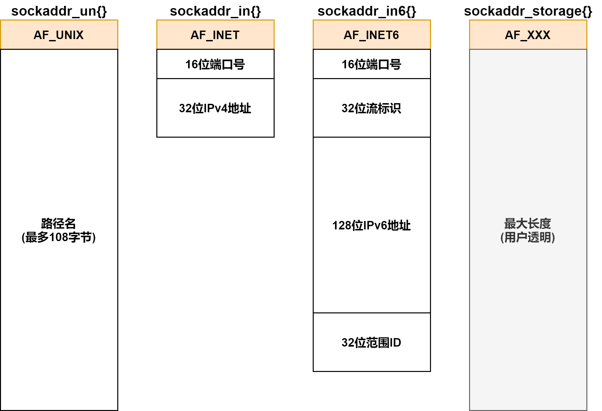

# 套接字基础

> [《Linux高性能服务器编程》 - 游双 ](https://1drv.ms/b/s!AkcJSyT7tq80c1DmkdcxK7oScvQ)的第5章，以及[《UNIX网络编程卷1》](https://1drv.ms/b/s!AkcJSyT7tq80dP1Vghbg7qb9uts)的第3、7、11章的读书笔记，本文中的所有代码可在[GitHub仓库](https://github.com/LittleBee1024/learning_book/tree/main/docs/booknotes/hplsp/sock_base/code)中找到

## 套接字地址
大多数套接字都需要一个指向套接字地址结构的指针作为参数。每个协议都定义了它自己的套接字地址结构：

协议族 | 地址族 | 结构体 | 地址含义和长度
--- | --- | --- | ---
PF_UNIX | AF_UNIX | `sockaddr_un` | UNIX本地域协议，文件的路径名，长度可达108字节
PF_INET | AF_INET | `sockaddr_in` | TCP/IPv4协议，16bit端口号和32bit IPv4地址，共6字节
PF_INET6 | AF_INET6 | `sockaddr_in6` | TCP/IPv6协议，16bit端口号，32bit流标识，128bit IPv6地址，32bit范围ID，共26字节

### 通用socket地址
```cpp
#include <bits/socket.h>

// 通用套接字地址类型
//  sa_family - 地址族类型
//  套接字函数需要支持不同协议族的套接字地址结构，因此定义了通用地址结构`sockaddr`以接受任何协议的指针参数。
//  例如，`int bind(int, struct sockaddr *, socklen_t)`函数的第二个参数接受IPv4协议地址时，需要如下强制转换：
//      struct sockaddr_in serv;
//      bind(sockfd, (struct sockaddr *)&serv, sizeof(serv));
struct sockaddr
{
    sa_family_t sa_family;
    char sa_data[14];
}

// 14字节的`sockaddr.sa_data`不足以容纳多数协议族的地址值，因此Linux定义了`sockaddr_storage`用于真正的存储空间
struct sockaddr_storage
{
    sa_family_t sa_family;
    unsigned long int __ss_align;
    char __ss_padding[128-sizeof(__ss_align)];
}
```

不同套接字地址结构的比较如下：



