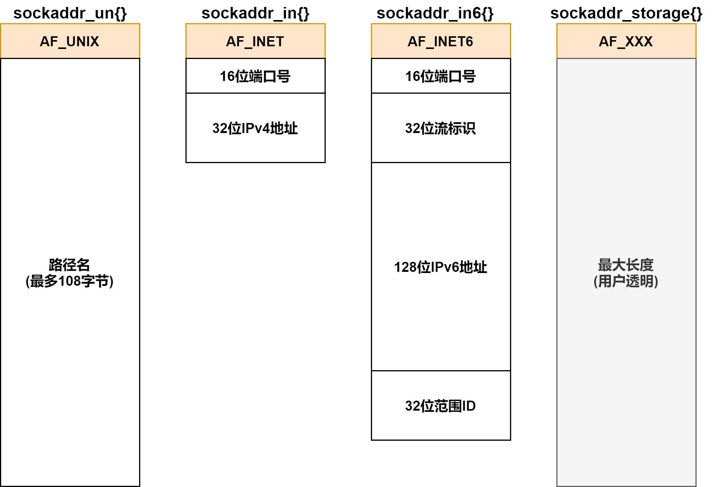

# 套接字基础

> [《Linux高性能服务器编程》 - 游双 ](https://1drv.ms/b/s!AkcJSyT7tq80c1DmkdcxK7oScvQ)的第5章，以及[《UNIX网络编程卷1》 - 第三版 ](https://1drv.ms/b/s!AkcJSyT7tq80dP1Vghbg7qb9uts)的第3、4、7、11章的读书笔记，本文中的所有代码可在[GitHub仓库](https://github.com/LittleBee1024/learning_book/tree/main/docs/booknotes/hplsp/socket/code)中找到

## 套接字地址
大多数套接字都需要一个指向套接字地址结构的指针作为参数。每个协议都定义了它自己的套接字地址结构：

协议族 | 地址族 | 结构体 | 地址含义和长度
--- | --- | --- | ---
PF_UNIX | AF_UNIX | `sockaddr_un` | UNIX本地域协议，文件的路径名，长度可达108字节
PF_INET | AF_INET | `sockaddr_in` | TCP/IPv4协议，16bit端口号和32bit IPv4地址，共6字节
PF_INET6 | AF_INET6 | `sockaddr_in6` | TCP/IPv6协议，16bit端口号，32bit流标识，128bit IPv6地址，32bit范围ID，共26字节

### 通用socket地址
```cpp
#include <bits/socket.h>

// 通用套接字地址类型
//  sa_family - 地址族类型
//  套接字函数需要支持不同协议族的套接字地址结构，因此定义了通用地址结构`sockaddr`以接受任何协议的指针参数。
//  例如，`int bind(int, struct sockaddr *, socklen_t)`函数的第二个参数接受IPv4协议地址时，需要如下强制转换：
//      struct sockaddr_in serv;
//      bind(sockfd, (struct sockaddr *)&serv, sizeof(serv));
struct sockaddr
{
    sa_family_t sa_family;
    char sa_data[14];
}

// 14字节的`sockaddr.sa_data`不足以容纳多数协议族的地址值，因此Linux定义了`sockaddr_storage`用于真正的存储空间
struct sockaddr_storage
{
    sa_family_t sa_family;
    unsigned long int __ss_align;
    char __ss_padding[128-sizeof(__ss_align)];
}
```

不同套接字地址结构的比较如下：



### IPv4 socket地址
TCP/IPv4协议族的socket地址结构`sockaddr_in`如下：
```cpp
struct sockaddr_in
{
    sa_family_t sin_family; // 地址族：AF_INET
    u_int16_t sin_port;     // 端口号，要用网络字节序(大端)表示
    struct in_addr sin_addr;// IPv4地址结构体
};

struct in_addr
{
    u_int32_t s_addr;       // IPv4地址，要用网络字节序(大端)表示
};
```

人们习惯用字符串来表示IP地址，下面的函数可用于“用点分十进制字符串表示的IPv4地址”和“用网络字节序整数表示的IPv4地址”之间的转换：
```cpp
#include <arpa/inet.h>

// 将用点分十进制字符串的IPv4地址转换为网络字节序整数表示的地址
in_addr_t inet_addr(const char* strptr);

// 和inet_addr功能一样，但将结果存于inp指向的结构中，成功返回1
int inet_aton(const char* cp, struct in_addr* inp);

// 将网络字节序整数表示的IPv4地址转化为用点分十进制字符串的IPv4地址
char* inet_ntoa(struct in_addr in);

// inet_aton的通用版本，也可用于IPv6的地址转换
int inet_pton(int af, const char* src, void* dst);

// inet_ntoa的通用版本，也可用于IPv6的地址转换，成功返回指向dst的指针
const char* inet_ntop(int af, const void* src, char* dst, socklen_t cnt);
```

[例子"addr_conv"](https://github.com/LittleBee1024/learning_book/tree/main/docs/booknotes/hplsp/socket/code/addr_conv)利用上面的函数，完成了IPv4字符串地址和网络字节地址的转换：
```cpp
#define IP_STR "192.0.2.33"

int main()
{
   struct sockaddr_in sa;
   char str[INET_ADDRSTRLEN];

   memset(&sa, 0, sizeof(sa));
   inet_pton(AF_INET, IP_STR, &(sa.sin_addr));
   inet_ntop(AF_INET, &(sa.sin_addr), str, INET_ADDRSTRLEN);
   printf("[inet_pton/inet_ntop] convert between %d and %s\n", sa.sin_addr.s_addr, str);

   memset(&sa, 0, sizeof(sa));
   inet_aton(IP_STR, &(sa.sin_addr));
   // ip指向inet_ntoa内部的一个静态变量，因此inet_ntoa不可重入
   char* ip = inet_ntoa(sa.sin_addr);
   printf("[inet_addr/inet_aton/inet_ntoa] convert between %d(%d) and %s\n", inet_addr(IP_STR), sa.sin_addr.s_addr, ip);

   return 0;
}
```
```bash
> ./main
[inet_pton/inet_ntop] convert between 553779392 and 192.0.2.33
[inet_addr/inet_aton/inet_ntoa] convert between 553779392(553779392) and 192.0.2.33
```

### 名字与地址的转换

Linux提供了`getaddrinfo()`和`getnameinfo()`用于主机名和IP地址之间的转换：
```cpp
#include <netdb.h>

// 根据主机名/服务名，获得主机或者服务的地址信息，是对`gethostbyname`和`getservbyname`的封装
//  hints - 可设置ai_flags, ai_family, ai_socktype, ai_protocol，其他必须为NULL
//  res - 返回的查询结果，由于一个主机名可能对应多个IP地址，因此res是一个链表
int getaddrinfo(const char *restrict node,
    const char *restrict service,
    const struct addrinfo *restrict hints,
    struct addrinfo **restrict res);

// 销毁`getaddrinfo`返回的res
void freeaddrinfo(struct addrinfo *res);

// hints和返回结果的结构
struct addrinfo
{
    int ai_flags;       // 控制`hints`行为，如配置为`AI_CANONNAME`，会返回主机名
    int ai_family;      // 地址簇，AF_INET/AF_INET5/AF_UNIX
    int ai_socktype;    // 服务类型，SOCK_STREAM/SOCK_DGRAM
    int ai_protocol;    // 网络协议，通常为零，需要和`ai_family`的值配套
    socklen_t ai_addrlen;
    char* ai_canonname; // 主机的别名
    struct sockaddr* ai_addr;
    struct addrinfo* ai_next;
};

// 根据主机/服务地址信息，获得以字符串表示的主机/服务名，是对`gethostbyaddr`和`getservbyport`的封装
int getnameinfo(const struct sockaddr *restrict addr, socklen_t addrlen,
    char *restrict host, socklen_t hostlen,
    char *restrict serv, socklen_t servlen, int flags);
```

[例子"addr_name"](https://github.com/LittleBee1024/learning_book/tree/main/docs/booknotes/hplsp/socket/code/addr_name)利用上面的函数，完成了主机名和IP地址之间的转换：
```cpp
#define TEST_HOSTNAME "www.baidu.com"
#define TEST_IP "142.250.194.100"

void test_getaddrinfo()
{
   printf("[getaddrinfo]: %s\n", TEST_HOSTNAME);

   struct addrinfo hints;
   struct addrinfo *result;

   memset(&hints, 0, sizeof(struct addrinfo));
   hints.ai_flags = AI_CANONNAME; // 配置返回主机名到第一个结果中，否则不返回主机名
   hints.ai_family = AF_INET;
   hints.ai_socktype = SOCK_STREAM;

   getaddrinfo(TEST_HOSTNAME, NULL, &hints, &result);

   printf("  Host name: %s\n", result->ai_canonname);
   printf("  Address type: %s\n", (result->ai_family == AF_INET) ? "AF_INET" : "Unknown");
   char str[INET_ADDRSTRLEN];
   printf("  Address(es): ");
   for (struct addrinfo *rp = result; rp != NULL; rp = rp->ai_next)
   {
      struct sockaddr_in *p_sockaddr = (struct sockaddr_in *)rp->ai_addr;
      inet_ntop(rp->ai_family, &(p_sockaddr->sin_addr), str, INET_ADDRSTRLEN);
      printf(" %s", str);
   }
   printf("\n");

   freeaddrinfo(result);
}

void test_getnameinfo()
{
   struct sockaddr_in sa;
   memset(&sa, 0, sizeof(sa));
   sa.sin_family = AF_INET;
   inet_aton(TEST_IP, &(sa.sin_addr));

   printf("[getnameinfo]: %s\n", inet_ntoa(sa.sin_addr));
   char host[NI_MAXHOST];
   getnameinfo((struct sockaddr *)&sa, sizeof(struct sockaddr), host, NI_MAXHOST, nullptr, 0, NI_NAMEREQD);
   printf("  Host name: %s\n", host);
}
```
```bash
> ./main 
[getaddrinfo]: www.baidu.com
  Host name: www.wshifen.com
  Address type: AF_INET
  Address(es):  104.193.88.77 104.193.88.123
[getnameinfo]: 142.250.194.100
  Host name: del12s04-in-f4.1e100.net
```

## TCP套接字


如上图所示，客户端和服务端经过一些列的socket API调用，最终各自拥有了一个可以读写的文件描述符。此后，就可以通过`read/write`函数像访问文件一样，在客户端和服务器之间进行数据的传输。同时，服务端不仅创建了一个和客户端连接的socket，还打开了一个监听socket，用于监听新的客户端连接。

[例子"tcp_sc"](https://github.com/LittleBee1024/learning_book/tree/main/docs/booknotes/hplsp/socket/code/tcp_sc)实现了客户端向服务端传递"Hello World"字符串的功能：

=== "Server"

    ```cpp
    int main(int argc, char *argv[])
    {
        ...
        printf("[Server] Start server at %s:%d\n", ip, port);

        struct sockaddr_in address;
        bzero(&address, sizeof(address));
        address.sin_family = AF_INET;
        inet_pton(AF_INET, ip, &address.sin_addr);
        address.sin_port = htons(port);

        // 1. create server socket
        int sock = socket(AF_INET, SOCK_STREAM, 0);
        // 2. bind server socket to the address and port
        bind(sock, (struct sockaddr *)&address, sizeof(address));
        // 3. listen at client's connection
        listen(sock, 5);

        struct sockaddr_in client;
        socklen_t client_len = sizeof(client);
        printf("[Server] Waiting for connection...\n");
        // 4. accept a connection from client, and create connection socket
        int connfd = accept(sock, (struct sockaddr *)&client, &client_len);
        printf("[Server] Connection %d is created\n", connfd);

        // 5. read/write with connection socket
        char buffer[BUFFER_SIZE];
        memset(buffer, '\0', BUFFER_SIZE);
        printf("[Server] Dump data from client...\n");
        while (1)
        {
            int n_bytes = read(connfd, buffer, BUFFER_SIZE - 1);
            if (n_bytes == 0)
            {
                printf("\n[Server] Remote client socket was closed\n");
                break;
            }
            for (int i = 0; i < n_bytes; i++)
                printf("%c", buffer[i]);
        }

        printf("[Server] Close connection %d and listen socket %d\n", connfd, sock);
        close(connfd);
        close(sock);
        return 0;
    }
    ```

    ```bash
    > ./server 127.0.0.1 1234
    [Server] Start server at 127.0.0.1:1234
    [Server] Waiting for connection...
    [Server] Connection 4 is created
    [Server] Dump data from client...
    Hello World
    [Server] Remote client socket was closed
    [Server] Close connection socket 4 and listen socket 3
    ```

=== "Client"

    ```cpp
    int main(int argc, char *argv[])
    {
        ...
        printf("[Client] Connect to server %s:%d\n", ip, port);

        sockaddr_in server_address;
        bzero(&server_address, sizeof(server_address));
        server_address.sin_family = AF_INET;
        inet_pton(AF_INET, ip, &server_address.sin_addr);
        server_address.sin_port = htons(port);

        // 1. create client socket
        int sock = socket(AF_INET, SOCK_STREAM, 0);
        // 2. connect to server address and port
        connect(sock, (struct sockaddr *)&server_address, sizeof(server_address));
        printf("[Client] Connected socket %d to the server\n", sock);

        // 3. read/write with the client socket
        char buffer[] = "Hello World";
        printf("[Client] Send '%s' to server\n", buffer);
        send(sock, buffer, sizeof(buffer), 0);

        printf("[Client] Close the socket %d\n", sock);
        close(sock);
        return 0;
    }
    ```

    ```bash
    > ./client 127.0.0.1 1234
    [Client] Connect to server 127.0.0.1:1234
    [Client] Connected socket 3 to the server
    [Client] Send 'Hello World' to server
    [Client] Close the socket 3
    ```
