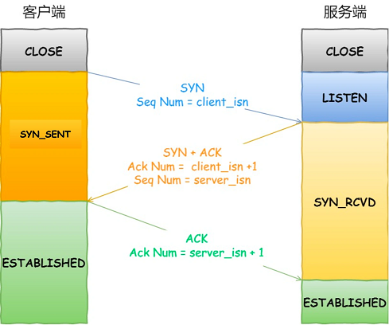

# TCP/IP协议

> [《Linux高性能服务器编程》 - 游双 ](https://1drv.ms/b/s!AkcJSyT7tq80c1DmkdcxK7oScvQ)的第1、2、3章，[《UNIX网络编程卷1》 - 第三版 ](https://1drv.ms/b/s!AkcJSyT7tq80dP1Vghbg7qb9uts)的第2章，以及[《小林coding - TCP篇》](https://xiaolincoding.com/network/)的读书笔记，本文中的所有代码可在[GitHub仓库](https://github.com/LittleBee1024/learning_book/tree/main/docs/booknotes/hplsp/tcp_ip/code)中找到

## TCP基础

* 序列号(SYN)
    * 用来解决网络包乱序的问题，初始值为一个随机数，随后每发送一次，加一
* 确认应答号(ACK)
    * 用来解决丢包问题，指下一次期望收到的数据的序列号，可确认此序列号前面的数据都已经被正常接收
* 控制位
    * ACK - 确认应答，除了最初建立连接的`SYN`包以外，此控制位都必须置1
    * RST - 强制断开连接
    * SYN - 希望建立连接
    * FIN - 希望断开连接
* 窗口大小
    * 用来做流量控制，表示接收方还能容纳多少字节的数据

### 三次握手

如上图所示，通过三个TCP包，就能建立一个TCP连接，常称为三次握手：

* SYN报文
    * 客户端发起连接请求，并带客户端序列号`client_isn`
    
* SYN+ACK报文
    * 服务端应答客户端序列`client_isn+1`，并带上服务端序列号`server_isn`
    
* ACK报文
    * 客户端应答服务端序列`server_isn+1`，并带上数据(可选)
    

### 四次挥手

### 头部选项

上面的TCP报文头部中，有一个可选的部分，是“TCP头部选项”，其结构如下：

通过`kind`和`length`的不同组合，TCP报文可携带各种不同的配置选项。这里只介绍“最大报文段长度”选项，其他选项信息可参考[《Linux高性能服务器编程》](https://1drv.ms/b/s!AkcJSyT7tq80c1DmkdcxK7oScvQ)的第3.2.2节。

当`kind=2`时，TCP头部选项为“最大报文段长度”选项。TCP连接初始化(同步报文)时，通信双方使用该选项来协商最大报文段长度(Max Segment Size, MSS)。**为了避免发生IP分片**，TCP模块通常将MSS设置为`(MTU - 40)`字节(20字节TCP头部和20字节IP头部)。MTU和MSS的概念如下：

* MTU (Max Transmit Unit)
    * 当IP数据报长度超过MTU时，它会被分片，可通过`ifconfig`查看
* MSS (Max Segment Size)
    * 除去IP和TCP头部之后，一个网络包所能容纳的TCP数据的最大长度

