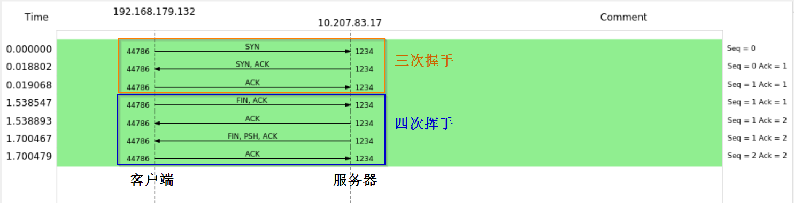

# TCP/IP协议

> [《Linux高性能服务器编程》 - 游双 ](https://1drv.ms/b/s!AkcJSyT7tq80c1DmkdcxK7oScvQ)的第1、2、3章，[《UNIX网络编程卷1》 - 第三版 ](https://1drv.ms/b/s!AkcJSyT7tq80dP1Vghbg7qb9uts)的第2章，以及[《小林coding - TCP篇》](https://xiaolincoding.com/network/)的读书笔记，本文中的所有代码可在[GitHub仓库](https://github.com/LittleBee1024/learning_book/tree/main/docs/booknotes/hplsp/tcp_ip/code)中找到

## TCP基础


* 序列号(SYN)
    * 用来解决网络包乱序的问题，初始值为一个随机数，随后每发送一次，加一
* 确认应答号(ACK)
    * 用来解决丢包问题，指下一次期望收到的数据的序列号，可确认此序列号前面的数据都已经被正常接收
* 控制位
    * ACK - 确认应答，除了最初建立连接的`SYN`包以外，此控制位都必须置1
    * RST - 强制断开连接
    * SYN - 希望建立连接
    * FIN - 希望断开连接
* 窗口大小
    * 用来做流量控制，表示接收方还能容纳多少字节的数据

### 三次握手


如上图所示，通过三个TCP报文，就能建立一个TCP连接，常称为三次握手：

* SYN报文
    * 客户端发起连接请求，并带客户端序列号`client_isn`
    
* SYN+ACK报文
    * 服务端应答客户端序列`client_isn+1`，并带上服务端序列号`server_isn`
    
* ACK报文
    * 客户端应答服务端序列`server_isn+1`，并带上数据(可选)
    

### 四次挥手


如上图所示，需要四个TCP报文，才能完全断开一个TCP连接，常称为四次挥手。客户端和服务端都可以先发起断开请求，每个方向都需要一个`FIN`报文和`ACK`报文，并且只有主动关闭的连接，才有`TIME_WAIT`状态。

* FIN报文
    * 主动方发送断开请求，并带上主动方的`SEQ`和期望的被动方`ACK`
* ACK报文
    * 被动方应答主动方的断开请求，并带上被动方的`SEQ`和期望的主动方`ACK`
* FIN报文
    * 被动方处理完本地事务后，向主动方发送断开请求，并带上正确的`SEQ`和`ACK`
* ACK报文
    * 主动方应答被动方的断开请求，并带上主动方的`SEQ`
    * 如果`SEQ`是被动方期望的，被动方进入`CLOSE`状态
    * 主动方还需等待两倍的MSL(最大生成时间)，才能进入`CLOSE`状态，以保证收到来自被动方的ACK报文丢失请求的时候，能重发


### 头部选项

上面的TCP报文头部中，有一个可选的部分，是“TCP头部选项”，其结构如下：


通过`kind`和`length`的不同组合，TCP报文可携带各种不同的配置选项。这里只介绍“最大报文段长度”选项，其他选项信息可参考[《Linux高性能服务器编程》](https://1drv.ms/b/s!AkcJSyT7tq80c1DmkdcxK7oScvQ)的第3.2.2节。

当`kind=2`时，TCP头部选项为“最大报文段长度”选项。TCP连接初始化(同步报文)时，通信双方使用该选项来协商最大报文段长度(Max Segment Size, MSS)。**为了避免发生IP分片**，TCP模块通常将MSS设置为`(MTU - 40)`字节(20字节TCP头部和20字节IP头部)。MTU和MSS的概念如下：


* MTU (Max Transmit Unit)
    * 当IP数据报长度超过MTU时，它会被分片，可通过`ifconfig`查看
* MSS (Max Segment Size)
    * 除去IP和TCP头部之后，一个网络包所能容纳的TCP数据的最大长度

## tcpdump实战

tcpdump选项 | 示例 | 说明
--- | --- | ---
-i | `tcpdump -i eth0` | 指定网卡，any表示所有网卡
-nn | `tcpdump -nn` | 不解析IP地址和端口号的名称
-c | `tcpdump -c 5` | 限制要抓取的网络包的个数
-w | `tcpdump -w file.pcap` | 保存到文件中，可用`wireshark`打开
host, src host, dst host | `tcpdump -nn host 192.168.1.100` | 主机过滤
port, src port, dst port | `tcpdump -nn port 80` | 端口过滤
ip, ip6, arp, tcp, udp, icmp | `tcpdump -nn tcp` | 协议过滤
and, or, not | `tcpdump -nn host 192.168.1.100 and port 80` | 逻辑表达式
tcp[tcpflags] | `tcpdump -nn "tcp[tcpflags] & (tcp-syn|tcp-ack) != 0"` | 特定状态的TCP包

### 正常连接/断开实验

[例子"tcpdump/normal"](https://github.com/LittleBee1024/learning_book/tree/main/docs/booknotes/hplsp/tcp_ip/code/tcpdump/normal)中包含了实验脚本`Makefile`和实验结果`normal.pcap`：

=== "Server"

    ```bash
    # 在远端的机器上通过`nc`命令启动一个TCP服务，假设其IP是10.207.83.17，端口是1234
    > nc -lk -p 1234
    ```

=== "Client"

    ```bash
    # 在近端的机器上启动tcpdump监控，假设网卡名称是：ens33
    > sudo tcpdump -i ens33 tcp and host 10.207.83.17 and port 1234 -w normal.pcap
    ```
    ```bash
    # 在近端的机器上通过`nc`命令连接服务器，并通过`Ctrl+D`直接退出
    > nc -q 1 10.207.83.17 1234
    ```

客户端连接到服务器后，直接通过`Ctrl+D`退出。`tcpdump`工具在客户端抓取三次握手和四次挥手的TCP包，并记录在`normal.pcap`文件中。用`wireshark`软件直接打开`tcpdump`的输出结果`normal.pcap`，其中显示的`Seq`和`Ack`是`wireshark`做过优化后的相对值：


### 第一次握手失败

为了模拟TCP第一次握手`SYN`丢包的情况，可利用`iptables`的`INPUT`规则在服务端过滤掉客户端输入的包，`iptables`相关命令可参考[文档](https://www.jianshu.com/p/ed001ae61c58)。网络包进入主机后的顺序如下：

* 进来的顺序: Wire -> NIC -> tcpdump -> iptables(INPUT规则)
* 出去的顺序: iptables(OUTPUT规则) -> tcpdump -> NIC -> Wire

[例子"tcpdump/1st_handshake"](https://github.com/LittleBee1024/learning_book/tree/main/docs/booknotes/hplsp/tcp_ip/code/tcpdump/1st_handshake)中包含了实验脚本`Makefile`和实验结果`1st_syn_fail.pcap`：

=== "Server"

    ```bash
    # 在远端的机器上利用`iptables`工具过滤掉端口1234的包
    > sudo iptables -A INPUT -p tcp --destination-port 1234 -j DROP
    # 在远端的机器上通过`nc`命令启动一个TCP服务，假设其IP是10.207.83.17，端口是1234
    > nc -lk -p 1234
    ```

=== "Client"

    ```bash
    # 在近端的机器上启动tcpdump监控，假设网卡名称是：ens33
    > sudo tcpdump -i ens33 tcp and host 10.207.83.17 and port 1234 -w 1st_syn_fail.pcap
    ```
    ```bash
    # 在近端的机器上通过`nc`命令连接服务器，由于无法连接服务器，一段时间后会自行退出
    > nc -q 1 10.207.83.17 1234
    ```

由于服务端过滤了客户端发来的`SYN`包，客户端发起了`SYN`包后，一直没有收到服务端的`ACK`包，所以一直会超时重传，并且每次RTO超时时间是不同的(如下图)，同时客户端重传次数由`/proc/sys/net/ipv4/tcp_syn_retries`指定：


