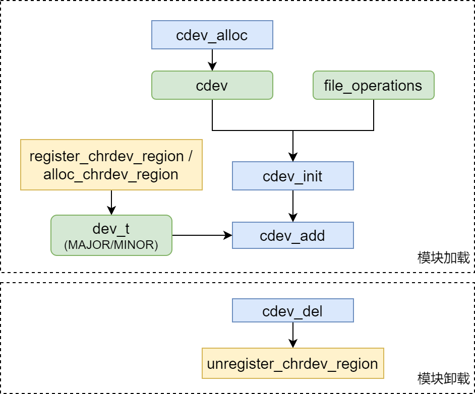
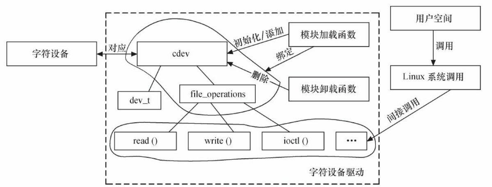

# 字符设备驱动

> [《Linux设备驱动程序》 - 第三版 ](https://1drv.ms/b/s!AkcJSyT7tq80d6mS7pO12K6Qb30)的第3章，[《Linux设备驱动开发详解》 - 宋宝华 ](https://1drv.ms/b/s!AkcJSyT7tq80eFABEg8fSOajqHk)的第6章，的读书笔记，本文中的所有代码可在[GitHub仓库](https://github.com/LittleBee1024/learning_book/tree/main/docs/booknotes/ldd/cdev/code)中找到



## 设备号
* 主设备号
    * 标识设备对应的驱动程序
* 次设备号
    * 由内核使用，用于确定设备文件(通常位于`/dev`目录)所指的设备

在内核中，主/次设备号通过`MKDEV(int major, int minor)`生成`dev_t`类型的设备编号，并通过下面的函数完成分配/释放设备编号的工作：

```cpp
#include <linux/fs.h>

// 静态分配设备编号，用于已知起始设备号的情况
//  first - 要分配的设备编号范围的起始值，常设置为0
//  count - 所请求的连续设备编号的个数，此数值会影响可用次设备编号的个数
//  name - 是和该编号范围关联的设备名称，将出现在`/proc/devices`和`sysfs`中
int register_chrdev_region(dev_t from, unsigned count, const char *name);

// 动态分配设备编号，用于设备号未知，向系统动态申请未被占用的设备号的情况
//  dev - 输出参数，保存调用完成后分配的第一个编号
//  baseminor - 应该要使用的被请求的第一个次设备号，通常是0
//  count和name - 和上面的函数一致
int alloc_chrdev_region(dev_t * dev, unsigned baseminor, unsigned count, const char *name);

// 释放设备编号
void unregister_chrdev_region (dev_t from, unsigned count);
```
[模块"dev_num"](https://github.com/LittleBee1024/learning_book/tree/main/docs/booknotes/ldd/cdev/code/dev_num)在加载时向系统申请了一个主设备号`111`，在卸载时释放了此设备号：

```cpp title="mock.c"
#define MOCK_MAJOR 111

static int mock_init(void)
{
   int ret;

   printk(KERN_INFO "Mock enter\n");

   ret = register_chrdev_region(MKDEV(MOCK_MAJOR, 0), 1, "mock");
   if (ret < 0)
   {
      printk(KERN_ERR "Failed to register major number %d for mock module\n", MOCK_MAJOR);
      return ret;
   }

   printk(KERN_INFO "Register major number %d for mock module", MOCK_MAJOR);
   return 0;
}
module_init(mock_init);

static void mock_exit(void)
{
   printk(KERN_INFO "Mock exit\n");
   unregister_chrdev_region(MKDEV(MOCK_MAJOR, 0), 1);
}
module_exit(mock_exit);
```

```bash
> sudo insmod mock.ko
# 申请的设备会出现在`/proc/devices`中
> cat /proc/devices | grep mock
111 mock

> sudo rmmod mock.ko
> tail -n 3 /var/log/kern.log
Jun 19 21:22:18 ben-vm-base kernel: [213898.642963] Mock enter
Jun 19 21:23:05 ben-vm-base kernel: [213898.642967] Register major number 111 for mock module
Jun 19 21:23:05 ben-vm-base kernel: [213944.901289] Mock exit
```

## 字符设备驱动组成



字符设备驱动主要有两部分组成：

* 模块加载/卸载函数
    * 在加载函数中应实现设备号的申请和`cdev`的注册
    * 在卸载函数中应实现设备号的释放和`cdev`的注销
* `file_operations`结构体中的成员函数
    * 大多数字符设备驱动会实现`read()`，`write()`和`ioctl()`函数

### `cdev`结构体

在Linux内核中，使用`cdev`结构体描述一个字符设备：

```cpp
#include <linux/cdev.h>

struct cdev {
    struct kobject kobj;
    struct module *owner;
    const struct file_operations *ops;  // 文件操作结构体
    struct list_head list;
    dev_t dev;                          // 设备号
    unsigned int count;
};

// 向内核申请`cdev`空间
struct cdev *cdev_alloc(void);

// 初始化`cdev`的成员，并建立`cdev`和`file_operations`之间的连接
void cdev_init(struct cdev * cdev, const struct file_operations * fops);

// 向系统添加一个`cdev`设备
//  num - 设备编号，由主/次设备号组成
//  count - 和该设备关联的设备编号的数量，常取值1
int cdev_add(struct cdev *dev, dev_t num, unsigned int count);

// 从系统删除一个`cdev`设备
void cdev_del(struct cdev *);
```

### `file_operations`结构体
向系统申请了设备编号后，需要将驱动程序操作连接到这些编号上，`file_operations`结构就是用来建立这种连接的。

```cpp
#include <linux/fs.h>

struct file_operations {
    // 用于修改文件的当前读写位置
    loff_t (*llseek) (struct file *, loff_t, int);
    // 从设备中读取数据
    ssize_t (*read) (struct file *, char __user *, size_t, loff_t *);
    // 向设备发送数据
    ssize_t (*write) (struct file *, const char __user *, size_t, loff_t *)；
    // 提供设备相关控制命令的实现
    long (*unlocked_ioctl) (struct file *, unsigned int, unsigned long);
    // 将设备内存映射到进程的虚拟地址空间中
    int (*mmap) (struct file *, struct vm_area_struct *);
    // 设备文件执行的第一个操作，提供了给驱动程序初始化的能力
    int (*open) (struct inode *, struct file *);
    // file结构被释放时，将调用这个操作
    //  不是每次调用close时都会被调用，只要file结构被空闲(如fork或dup调用之后)，release就会等到
    //  所有副本都关闭之后才会调用
    int (*release) (struct inode *, struct file *);
    ...
};

// 系统中每个打开的文在内核空间中都有一个对应的`file`结构
struct file {
    struct inode *f_inode;
    // 文件模式
    fmode_t f_mode;
    // 文件读写位置
    loff_t f_pos;
    // 可在open调用时，赋值此字段为某个已分配数据，方便其他调用访问
    void *private_data;
    ...
};

// 对于单个文件可能会有多个对应的`file`结构体，但只有一个`inode`结构
struct inode {
    // 设备编号
    dev_t i_rdev;
    union {
        // 字符设备内部结构
        struct cdev *i_cdev;
        ...
    };
}；
```

### `fops`操作

`file_operations`结构体中的成员函数是字符设备驱动与内核虚拟文件系统的接口，是用户空间对Linux进行系统调用最终的落实者。大多数字符设备驱动会实现`read()`，`write()`和`ioctl()`函数：

```cpp
struct file_operations xxx_fops = {
    .owner = THIS_MODULE,
    .read = xxx_read,
    .write = xxx_write,
    .unlocked_ioctl= xxx_ioctl,
    ...
};

ssize_t xxx_read(struct file *filp, char __user *buf, size_t count, loff_t *f_pos)
{
    ...
    copy_to_user(..., buf, ...);
    ...
}

ssize_t xxx_write(struct file *filp, const char __user *buf, size_t count, loff_t *f_pos)
{
    ...
    copy_from_user(..., buf, ...);
    ...
}

// I/O控制函数的`cmd`参数为实现定义的I/O控制命令，而`arg`对应于该命令的参数
long xxx_ioctl(struct file *filp, unsigned int cmd, unsigned long arg)
{
    ...
    switch(cmd) {
    case XXX_CMD1:
        ...
        break;
    case XXX_CMD2:
        ...
        break;
    default:
        // 不能支持的命令
        return -ENOTTY;
    }
    return 0;
}
```
`read`和`write`方法完成的任务是相似的，即拷贝数据到应用程序空间，或从应用程序空间拷贝数据到内核空间。`read`和`write`方法的`buf`参数是用户空间的指针，不能直接在内核中直接引用，原因是：

* 内核模式中用户空间的指针可能是无效的
* 用户空间的内存是分页的，访问时有可能发生页错误，而内核代码是不允许发生页错误的
* 保护内核内存，防止用户操作破坏内核

因此，可通过下面的函数完成内核空间核用户空间的数据传输：
```cpp
// 连续空间
unsigned long copy_from_user(void *to, const void __user *from, unsigned long count);
unsigned long copy_to_user(void __user *to, const void *from, unsigned long count);

// 简单类型，如：char, int, long等
int val;                    // 内核空间整型变量
get_user(val, (int *) arg); // 用户→内核，arg是用户空间的地址
put_user(val, (int *) arg); // 内核→用户，arg是用户空间的地址
```

## 字符设备驱动实例
[驱动"cdev_rw"](https://github.com/LittleBee1024/learning_book/tree/main/docs/booknotes/ldd/cdev/code/cdev_rw)实现了一个字符设备驱动。此设备相当于一个全局内存，大小为`GLOBALMEM_SIZE` (4KB)。驱动提供了针对该内存的读写、控制和定位函数，以供用户空间的进程能通过Linux系统调用获取或设置这片内存的内容。

### 注册字符设备

在加载模块时，需要

* 获取设备号
* 添加字符设备

```cpp hl_lines="15 16 23 24"
#define DEVICE_NUM 2
#define GMEM_MAJOR 111
#define GLOBALMEM_SIZE 0x1000

struct gmem_dev
{
   struct cdev cdev;
   unsigned char mem[GLOBALMEM_SIZE];
};
struct gmem_dev *gmem_devp;

static void gmem_setup_cdev(struct gmem_dev *dev, int index)
{
   int devno = MKDEV(GMEM_MAJOR, index);
   cdev_init(&dev->cdev, &gmem_fops);
   cdev_add(&dev->cdev, devno, 1);
}

static int __init gmem_init(void)
{
    ...
    devno = MKDEV(GMEM_MAJOR, 0);
    ret = register_chrdev_region(devno, DEVICE_NUM, "gmem");
    gmem_devp = kzalloc(sizeof(struct gmem_dev) * DEVICE_NUM, GFP_KERNEL);
    for (i = 0; i < DEVICE_NUM; i++)
        gmem_setup_cdev(gmem_devp + i, i);

    return 0;
}
```

### 添加文件操作

在通过`cdev_add`添加字符设备之前，需要通过`cdev_init`初始化字符设备的文件操作`file_operations`。驱动"cdev_rw"的文件操作包括：

* `gmem_open`
    * 从`inode`结构中获取全局内存，并存到`filp->privatre_data`结构中，便于其他函数拿到内存位置
* `gmem_read`
    * 将数据从全局内存拷贝到用户空间
* `gmem_write`
    * 将数据从用户空血写道全局内存
* `gmem_llseek`
    * 修改全局内存的当前读写位置

```cpp hl_lines="13 14 20 25 37 38 45 46 68"
static const struct file_operations gmem_fops = {
    .owner = THIS_MODULE,
    .llseek = gmem_llseek,
    .read = gmem_read,
    .write = gmem_write,
    .unlocked_ioctl = gmem_ioctl,
    .open = gmem_open,
    .release = gmem_release,
};

static int gmem_open(struct inode *inode, struct file *filp)
{
   struct gmem_dev *dev = container_of(inode->i_cdev, struct gmem_dev, cdev);
   filp->private_data = dev;
   return 0;
}

static long gmem_ioctl(struct file *filp, unsigned int cmd, unsigned long arg)
{
   struct gmem_dev *dev = filp->private_data;

   switch (cmd)
   {
   case MEM_CLEAR:
      memset(dev->mem, 0, GLOBALMEM_SIZE);
      printk(KERN_INFO "gmem is set to zero\n");
      break;
   default:
      return -EINVAL;
   }

   return 0;
}

static ssize_t gmem_read(struct file *filp, char __user *buf, size_t size, loff_t *ppos)
{
   struct gmem_dev *dev = filp->private_data;
   copy_to_user(buf, dev->mem + *ppos, size);
   *ppos += size;
   return size;
}

static ssize_t gmem_write(struct file *filp, const char __user *buf, size_t size, loff_t *ppos)
{
   struct gmem_dev *dev = filp->private_data;
   copy_from_user(dev->mem + *ppos, buf, size);
   *ppos += size;
   return size;
}

static loff_t gmem_llseek(struct file *filp, loff_t offset, int whence)
{
   loff_t newpos = 0;
   switch (whence)
   {
   case 0: /* SEEK_SET */
      newpos = offset;
      break;
   case 1: /* SEEK_CUR */
      newpos = filp->f_pos + offset;
      break;
   case 2: /* SEEK_END */
      newpos = GLOBALMEM_SIZE + offset;
      break;
   default:
      return -EINVAL;
   }
   filp->f_pos = newpos;
   return newpos;
}
```

### 加载模块
利用`insmod`加载"gmem"模块后，可通过`cat /proc/devices | grep gmem`查询到此模块的主设备号为"111"。然后，需要通过`mknod`命令在`/dev`下创建对应的设备节点。

```bash
# 加载"gmem.ko"模块
> insmod gmem.ko
# 创建主设备号为111，次设备号为0的设备节点: /dev/gmem0
> mknod /dev/gmem0 c 111 0
# 创建主设备号为111，次设备号为1的设备节点: /dev/gmem1
> mknod /dev/gmem1 c 111 1

# 测试设备节点
> echo "hello gmem0" > /dev/gmem0
> echo "hello gmem1" > /dev/gmem1
> cat /dev/gmem0 && cat /dev/gmem1
hello gmem0
hello gmem1
```

