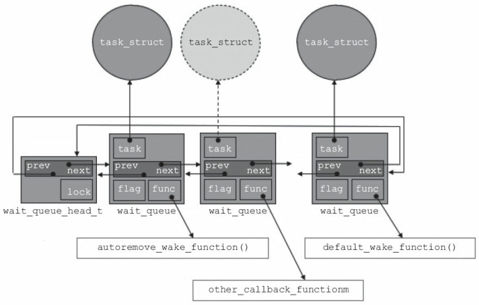

# 高级I/O操作

> [《Linux设备驱动程序》 - 第三版 ](https://1drv.ms/b/s!AkcJSyT7tq80d6mS7pO12K6Qb30)的第6章，[《Linux设备驱动开发详解》 - 宋宝华 ](https://1drv.ms/b/s!AkcJSyT7tq80eFABEg8fSOajqHk)的第8，9章，的读书笔记，本文中的所有代码可在[GitHub仓库](https://github.com/LittleBee1024/learning_book/tree/main/docs/booknotes/ldd/io/code)中找到

## 休眠和唤醒

对Linux设备驱动程序，进入休眠状态需要注意：

* 不要在原子上下文(拥有锁)中进入休眠
* 被唤醒后需要重新检查等待条件

唤醒时需要知道哪些事件序列会结束休眠，因此需要维护一个等待队列：队列头`wait_queue_head_t`和队列元素`wait_queue`。进程可通过`wait_event`宏进入休眠，通过`wake_up`唤醒等待队列中的进程：
```cpp
// 动态初始化等待队列头
wait_queue_head_t my_queue;
init_waitqueue_head(&my_queue);

// 在等待队列中，添加/移除等待队列元素
void add_wait_queue(wait_queue_head_t *q, wait_queue_t *wait);
void remove_wait_queue(wait_queue_head_t *q, wait_queue_t *wait);

// 等待队列的宏操作
//  定义并初始化名为`my_queue`的等待队列头
DECLARE_WAIT_QUEUE_HEAD(my_queue);
//  定义等待队列元素`wait`, 并用任务task初始化此等待队列元素
DECLARE_WAITQUEUE(wait, task);

// 屏蔽中断休眠
//  queue - 等待队列头
//  condition - 休眠条件，休眠/唤醒时都需要检查
wait_event(queue, condition)
// 不屏蔽中断休眠，返回非零值表示休眠被某个信号中断
wait_event_interruptible(queue, condition)

// 唤醒等待队列中的所有任务
void wake_up(wait_queue_head_t *queue);
// 唤醒等待队列中处于`TASK_INTERRUPTIBLE`的任务
void wake_up_interruptible(wait_queue_head_t *queue);
```

下图显示了，`wait_queue_head_t`，`wait_queue`和`task_struct`之间的关系：



[例子"sleepy"](https://github.com/LittleBee1024/learning_book/tree/main/docs/booknotes/ldd/io/code/sleepy)，创建了一个"/dev/sleepy"设备。如果某一进程在读取此设备时，会进入休眠状态。通过在另一个进程写此设备，可唤醒休眠的读设备进程。一次只能唤醒一个进程，如果存在多个休眠的读进程，需要多次写入设备。

```cpp title="sleepy.c" hl_lines="1 7 17"
static DECLARE_WAIT_QUEUE_HEAD(wq);
static int flag = 0;

static ssize_t sleepy_read(struct file *filp, char __user *buf, size_t count, loff_t *pos)
{
   printk(KERN_DEBUG "process %i (%s) going to sleep\n", current->pid, current->comm);
   wait_event_interruptible(wq, flag != 0);
   flag = 0;
   printk(KERN_DEBUG "awoken %i (%s)\n", current->pid, current->comm);
   return 0;
}

static ssize_t sleepy_write(struct file *filp, const char __user *buf, size_t count, loff_t *pos)
{
   printk(KERN_DEBUG "process %i (%s) awakening the readers...\n", current->pid, current->comm);
   flag = 1;
   wake_up_interruptible(&wq);
   return count;
}
```

## 阻塞I/O

驱动程序在某些情况下，可能无法立即完成用户的请求。例如，

* 当数据不可用时，用户调用`read`
* 当输出缓冲区已满，或设备还未准备好接受数据时，用户调用`write`

在这种情况下，驱动程序默认会阻塞该进程，将其置入休眠状态直到请求可继续。

### 驱动实例

[例子"gfifo"](https://github.com/LittleBee1024/learning_book/tree/main/docs/booknotes/ldd/io/code/gfifo)，创建了一个支持阻塞访问的FIFO设备。当FIFO中没有数据时，`read`请求阻塞，此时向FIFO中写入数据能重新唤醒`read`请求进程。当FIFO满数据时，`write`请求阻塞，此时从FIFO中读出数据能重新唤醒`write`请求进程。

```cpp title="gfifo.c" hl_lines="7 8 15 18 22 24 36 39 40 49 52 56 58 69 72 73"
struct gfifo_dev
{
    struct cdev cdev;
    unsigned int current_len;
    unsigned char mem[GFIFO_SIZE];
    struct mutex mutex;
    wait_queue_head_t r_wait;
    wait_queue_head_t w_wait;
};

static ssize_t gfifo_read(struct file *filp, char __user *buf, size_t count, loff_t *ppos)
{
    int ret;
    struct gfifo_dev *dev = filp->private_data;
    DECLARE_WAITQUEUE(wait, current);

    mutex_lock(&dev->mutex);
    add_wait_queue(&dev->r_wait, &wait);

    while (dev->current_len == 0)
    {
        set_current_state(TASK_INTERRUPTIBLE);
        mutex_unlock(&dev->mutex);
        schedule();
        mutex_lock(&dev->mutex);
    }

    if (count > dev->current_len)
        count = dev->current_len;

    copy_to_user(buf, dev->mem, count);
    memcpy(dev->mem, dev->mem + count, dev->current_len - count);
    dev->current_len -= count;
    printk(KERN_INFO "read %lu bytes(s),current_len:%u\n", count, dev->current_len);

    wake_up_interruptible(&dev->w_wait);

    ret = count;
    remove_wait_queue(&dev->r_wait, &wait);
    set_current_state(TASK_RUNNING);
    mutex_unlock(&dev->mutex);
    return ret;
}

static ssize_t gfifo_write(struct file *filp, const char __user *buf, size_t count, loff_t *ppos)
{
    struct gfifo_dev *dev = filp->private_data;
    int ret;
    DECLARE_WAITQUEUE(wait, current);

    mutex_lock(&dev->mutex);
    add_wait_queue(&dev->w_wait, &wait);

    while (dev->current_len == GFIFO_SIZE)
    {
        set_current_state(TASK_INTERRUPTIBLE);
        mutex_unlock(&dev->mutex);
        schedule();
        mutex_lock(&dev->mutex);
    }

    if (count > GFIFO_SIZE - dev->current_len)
        count = GFIFO_SIZE - dev->current_len;

    copy_from_user(dev->mem + dev->current_len, buf, count);
    dev->current_len += count;
    printk(KERN_INFO "written %lu bytes(s),current_len:%u\n", count, dev->current_len);

    wake_up_interruptible(&dev->r_wait);

    ret = count;
    remove_wait_queue(&dev->w_wait, &wait);
    set_current_state(TASK_RUNNING);
    mutex_unlock(&dev->mutex);
    return ret;
}
```

### 用户空间测试

[例子"gfifo_user_block"](https://github.com/LittleBee1024/learning_book/tree/main/docs/booknotes/ldd/io/code/gfifo_user_block)是对上述"gfifo"驱动阻塞I/O行为的在用户空间的测试。其中，一个进程对"/dev/gfifo"设备进行读操作，另一个进程在一定时间之后对"/dev/gfifo"设备进行写操作。读进程会一直阻塞，直到写进程完成写操作。

```cpp title="GFIFO Block I/O Test" hl_lines="11 24"
#define GFIFO_DEV "/dev/gfifo"
const char data[] = "Hello, global gfifo\n";

void sleep_write()
{
   printf("[Write Process] Start\n");
   int fd = open(GFIFO_DEV, O_RDWR);

   sleep(1);
   printf("[Write Process] Start to write after sleep\n");
   int n = write(fd, data, sizeof(data));
   printf("[Write Process] Written %d bytes to the device\n", n);

   close(fd);
   printf("[Write Process] End\n");
}

void block_read()
{
   printf("[Read Process] Start\n");

   int fd = open(GFIFO_DEV, O_RDWR);
   char buf[1024];
   int n = read(fd, buf, sizeof(data));
   printf("[Read Process] Read %d bytes from the device: %s\n", n, buf);

   close(fd);
   printf("[Read Process] End\n");
}

int main(int argc, char **argv)
{
   pid_t pid = fork();
   if (pid == 0)
   {
      sleep_write();
      return 0;
   }
   block_read();
   wait(NULL);
   return 0;
}
```
```bash
>./main
[Read Process] Start
[Write Process] Start
[Write Process] Start to write after sleep
[Write Process] Written 21 bytes to the device
[Write Process] End
[Read Process] Read 21 bytes from the device: Hello, global gfifo

[Read Process] End
```

## 非阻塞I/O

非阻塞I/O在设备无法立即完成用户请求时，不阻塞，而是返回`-EAGAIN`错误，告知用户在设备准备好后再次访问。非阻塞I/O一般和`select`，`poll`或`epoll`系统调用配合使用，以实现多路复用。这三个系统调用的本质是一样的：都允许进程决定是否可以对一个或多个打开的文件做非阻塞的读写操作。

当用户空间在驱动程序关联的文件描述符上执行`select`，`poll`或`epoll`系统调用时，驱动程序中的`poll`文件操作将被调用，该设备方法分为两步：

* 在一个或多个可指示poll状态的等待队列上调用`poll_wait`
* 返回一个用来描述操作是否可以立即无阻塞执行的位掩码

```cpp
// 被`select`，`poll`或`epoll`会调用的驱动中的设备方法
//  poll_table - 用于在内核中实现`select`，`poll`或`epoll`系统调用
unsigned int (*poll) (struct file *filp, poll_table *wait);

// 向`poll_table`结构中添加一个等待队列
void poll_wait(struct file *, wait_queue_head_t *, poll_table *);
```

### 驱动实例

[例子"gfifo"](https://github.com/LittleBee1024/learning_book/tree/main/docs/booknotes/ldd/io/code/gfifo)，不仅支持阻塞I/O访问，也支持非阻塞I/O访问。当`O_NONBLOCK`标记被设置后，读写操作都变为非阻塞。当设备没有准备好时，读写操作直接返回`-EAGAIN`而不是进入休眠状态。当用户调用`select`，`poll`或`epoll`时，驱动方法`gfifo_poll`被调用，相关等待队列被加入到`poll_table`结构中，以供内核使用。

```cpp title="gfifo.c" hl_lines="7 8 11 14 27 42"
static unsigned int gfifo_poll(struct file *filp, poll_table *wait)
{
    unsigned int mask = 0;
    struct gfifo_dev *dev = filp->private_data;
    mutex_lock(&dev->mutex);

    poll_wait(filp, &dev->r_wait, wait);
    poll_wait(filp, &dev->w_wait, wait);

    if (dev->current_len != 0)
        mask |= POLLIN | POLLRDNORM;

    if (dev->current_len != GFIFO_SIZE)
        mask |= POLLOUT | POLLWRNORM;

    mutex_unlock(&dev->mutex);
    return mask;
}

static ssize_t gfifo_read(struct file *filp, char __user *buf, size_t count, loff_t *ppos)
{
    ...
    while (dev->current_len == 0)
    {
        if (filp->f_flags & O_NONBLOCK)
        {
            ret = -EAGAIN;
            goto out;
        }
        ...
    }
    ...
}

static ssize_t gfifo_write(struct file *filp, const char __user *buf, size_t count, loff_t *ppos)
{
    ...
    while (dev->current_len == GFIFO_SIZE)
    {
        if (filp->f_flags & O_NONBLOCK)
        {
            ret = -EAGAIN;
            goto out;
        }
        ...
    }
   ...
}
```
### 用户空间select测试

[例子"gfifo_user_select"](https://github.com/LittleBee1024/learning_book/tree/main/docs/booknotes/ldd/io/code/gfifo_user_select)对GFIFO非阻塞I/O行为的在用户空间通过`select`方法进行了测试。其中，一个进程对"/dev/gfifo"设备进行非阻塞读操作，另一个进程在一定时间之后对"/dev/gfifo"设备进行写操作。读进程以1秒`timeout`时间对`select`进行轮询，写进程在一定时间之后向设备写入数据。读进程的轮询操作在多次`timoout`之后，会收到设备可读事件，从而结束。

```cpp title="Non-block IO Select Test" hl_lines="35 44"
#define GFIFO_DEV "/dev/gfifo"
const char data[] = "Hello, global gfifo\n";

void sleep_write()
{
   printf("[Write Process] Start\n");

   int fd = open(GFIFO_DEV, O_RDWR);
   assert(fd > 0);

   sleep(5);
   int n = write(fd, data, sizeof(data));
   printf("[Write Process] Written %d bytes to the device\n", n);

   close(fd);

   printf("[Write Process] End\n");
}

void poll_read()
{
    printf("[Poll Process] Start\n");

    int fd = open(GFIFO_DEV, O_RDONLY | O_NONBLOCK);
    char buf[1024];
    fd_set rfds;
    struct timeval timeout;
    while (1)
    {
        FD_ZERO(&rfds);
        FD_SET(fd, &rfds);
        timeout.tv_sec = 1;
        timeout.tv_usec = 0;

        int rc = select(fd + 1, &rfds, NULL, NULL, &timeout);
        if (rc == 0)
        {
            printf("[Poll Process] select() timeout, no data to read\n");
            continue;
        }

        if (FD_ISSET(fd, &rfds))
        {
            int n = read(fd, buf, sizeof(data));
            printf("[Poll Process] Read %d bytes from the device: %s\n", n, buf);
            break;
        }
    }

    close(fd);
    printf("[Poll Process] End\n");
}

int main(int argc, char **argv)
{
    pid_t pid = fork();
    if (pid == 0)
    {
        // child process
        sleep_write();
        return 0;
    }
    // parent process
    poll_read();
    wait(NULL);
    return 0;
}
```
```bash
> ./main
[Poll Process] Start
[Write Process] Start
[Poll Process] select() timeout, no data to read
[Poll Process] select() timeout, no data to read
[Poll Process] select() timeout, no data to read
[Poll Process] select() timeout, no data to read
[Write Process] Written 21 bytes to the device
[Write Process] End
[Poll Process] Read 21 bytes from the device: Hello, global gfifo

[Poll Process] End
```

### 用户空间poll测试

[例子"gfifo_user_poll"](https://github.com/LittleBee1024/learning_book/tree/main/docs/booknotes/ldd/io/code/gfifo_user_poll)对GFIFO非阻塞I/O行为的在用户空间通过`poll`方法进行了测试，其行为和上述`select`方法的测试类似。

```cpp title="Non-block IO Poll Test" hl_lines="15 24"
void poll_read()
{
    printf("[Poll Process] Start\n");

    int fd = open(GFIFO_DEV, O_RDONLY | O_NONBLOCK);
    char buf[1024];
    struct pollfd fds[MAX_POLL_FD];
    memset(fds, 0, sizeof(fds));
    fds[0].fd = fd;
    fds[0].events = POLLIN;
    int nfds = 1;
    int timeout = 1 * 1000; // milliseconds
    while (1)
    {
        int event_count = poll(fds, nfds, timeout);
        if (event_count == 0)
        {
            printf("[Poll Process] poll() timeout, no data to read\n");
            continue;
        }

        if (fds[0].revents & POLLIN)
        {
            int n = read(fds[0].fd, buf, sizeof(data));
            printf("[Poll Process] Read %d bytes from the device: %s\n", n, buf);
            break;
        }
        printf("[Poll Process] Receive unexpected event 0x%x\n", fds[0].revents);
    }

    close(fd);
    printf("[Poll Process] End\n");
}
```
```bash
> ./main
[Poll Process] Start
[Write Process] Start
[Poll Process] poll() timeout, no data to read
[Poll Process] poll() timeout, no data to read
[Poll Process] poll() timeout, no data to read
[Poll Process] poll() timeout, no data to read
[Write Process] Written 21 bytes to the device
[Write Process] End
[Poll Process] Read 21 bytes from the device: Hello, global gfifo

[Poll Process] End
```

### 用户空间epoll测试

[例子"gfifo_user_epoll"](https://github.com/LittleBee1024/learning_book/tree/main/docs/booknotes/ldd/io/code/gfifo_user_epoll)对GFIFO非阻塞I/O行为的在用户空间通过`epoll`方法进行了测试，其行为和上述`select`、`poll`方法的测试类似。

```cpp title="Non-block IO EPoll Test" hl_lines="7 17 26"
void poll_read()
{
    printf("[Poll Process] Start\n");

    int fd = open(GFIFO_DEV, O_RDONLY | O_NONBLOCK);
    char buf[1024];
    int epoll_fd = epoll_create1(0);
    assert(epoll_fd > 0);
    struct epoll_event event, events[MAX_EVENTS];
    event.events = EPOLLIN;
    event.data.fd = fd;
    int rc = epoll_ctl(epoll_fd, EPOLL_CTL_ADD, fd, &event);
    assert(rc != -1);
    int timeout = 1 * 1000; // milliseconds
    while (1)
    {
        int event_count = epoll_wait(epoll_fd, events, MAX_EVENTS, timeout);
        if (event_count == 0)
        {
            printf("[Poll Process] epoll() timeout, no data to read\n");
            continue;
        }

        if (events[0].events & EPOLLIN)
        {
            int n = read(events[0].data.fd, buf, sizeof(data));
            printf("[Poll Process] Read %d bytes from the device: %s\n", n, buf);
            break;
        }
        printf("[Poll Process] Receive unexpected event 0x%x\n", events[0].events);
    }

    close(fd);
    printf("[Poll Process] End\n");
}
```
```bash
> ./main
[Poll Process] Start
[Write Process] Start
[Poll Process] epoll() timeout, no data to read
[Poll Process] epoll() timeout, no data to read
[Poll Process] epoll() timeout, no data to read
[Poll Process] epoll() timeout, no data to read
[Write Process] Written 21 bytes to the device
[Write Process] End
[Poll Process] Read 21 bytes from the device: Hello, global gfifo

[Poll Process] End
```

## 异步通知

异步通知是指，当设备准备就绪时，主动通知应用程序，这样应用程序就无需轮询设备是否可访问。在Linux中，异步通知使用信号`SIGIO`来实现。

### 用户程序的角度

为了启动文件的异步通知机制，用户程序必须执行两个步骤：

* 为了让内核指定应该通知哪个进程，需指定一个进程作为文件的“属主(owner)”
* 设置`FASYNC`标志，启动异步通知机制

[例子"async_stdin"](https://github.com/LittleBee1024/learning_book/tree/main/docs/booknotes/ldd/io/code/async_stdin)启用了`stdin`数据文件到当前进程的异步通知机制。当用户输入一串字符后，标准输入设备释放`SIGIO`信号，这个信号驱使对应的`input_handler()`得以执行。

```cpp title="async_stdin" hl_lines="17 19 21 22"
#define MAX_LEN 100
void input_handler(int num)
{
   char data[MAX_LEN];
   int len;

   len = read(STDIN_FILENO, &data, MAX_LEN);
   data[len] = 0;
   printf("input available:%s\n", data);
}

int main()
{
   int oflags;

   // 1. 连接信号和信号处理函数
   signal(SIGIO, input_handler);
   // 2. 通过F_SETOWN设置设备文件的拥有者为本进程，这样设备驱动发出的信号才能被本进程接收
   fcntl(STDIN_FILENO, F_SETOWN, getpid());
   // 3. 通过FASYNC，设置异步通知模式，每当FASYNC标志改变时，驱动程序中的`fasync()`函数被执行
   oflags = fcntl(STDIN_FILENO, F_GETFL);
   fcntl(STDIN_FILENO, F_SETFL, oflags | FASYNC);

   while (1);
   return 0;
}
```
```bash
> ./main
hello
input available:hello

world
input available:world
```

### 驱动程序的角度

用户程序的动作在驱动程序中所对应的动作是：

* `F_SETOWN`被调用时，驱动程序对`filp->f_owner`赋值，此外什么也不做
* `F_SETFL`启用`FASYNC`时，驱动程序调用`fasync`文件操作方法，通过`fasync_helper`添加异步通知进程到`struct fasync_struct`数据结构
* 当数据到达时，通过`kill_fasync`, 所有注册为异步通知的进程都会被发送一个`SIGIO`信号

[例子"gfifo"](https://github.com/LittleBee1024/learning_book/tree/main/docs/booknotes/ldd/io/code/gfifo)，通过如下步骤，即可支持异步通知：

```cpp title="GFIFO Driver Async IO"
struct gfifo_dev
{
    ...
    struct fasync_struct *async_queue;
};

static int gfifo_fasync(int fd, struct file *filp, int mode)
{
    struct gfifo_dev *dev = filp->private_data;
    return fasync_helper(fd, filp, mode, &dev->async_queue);
}

static int gfifo_release(struct inode *inode, struct file *filp)
{
    gfifo_fasync(-1, filp, 0);
    return 0;
}

static ssize_t gfifo_write(struct file *filp, const char __user *buf,
                           size_t count, loff_t *ppos)
{
    ...
    if (dev->async_queue) {
        kill_fasync(&dev->async_queue, SIGIO, POLL_IN);
        printk(KERN_DEBUG "%s kill SIGIO\n", __func__);
    }
    ...
}

static const struct file_operations gfifo_fops = {
    ...
    .fasync = gfifo_fasync,
};
```

[例子"gfifo_user_async"](https://github.com/LittleBee1024/learning_book/tree/main/docs/booknotes/ldd/io/code/gfifo_user_async)在用户空间对GFIFO的异步通知功能进行了测试，读进程接收到`SIGIO`信号后，成功打印出了写进程写入的数据。

```cpp title="Async Signal Test" hl_lines="2 18 20"
static int read_fd = -1;
static void signalio_handler(int signum)
{
    printf("[Read Process - Signal_IO] Receive a signal from global FIFO, signalnum:%d\n", signum);
    assert(read_fd > 0);
    char buf[1024];
    int n = read(read_fd, buf, sizeof(data));
    printf("[Read Process - Signal_IO] Read %d bytes from the device: %s\n", n, buf);
    close(read_fd);
}

void block_read()
{
    printf("[Read Process - Main] Start\n");

    read_fd = open(GFIFO_DEV, O_RDWR);
    signal(SIGIO, signalio_handler);
    fcntl(read_fd, F_SETOWN, getpid());
    int oflags = fcntl(read_fd, F_GETFL);
    fcntl(read_fd, F_SETFL, oflags | FASYNC);

    printf("[Read Process - Main] End\n");
}
```

## mmap操作

一般情况下，用户空间是不可能也不应该直接访问设备的，但是，设备驱动程序中可通过实现`mmap()`函数，使得用户空间能直接访问设备的物理地址。当用户访问用户空间的某个特定地址时，实际上会转化为对设备的访问。

当用户调用`mmap()`系统调用时，内核会进行如下处理：

* 在进程的虚拟空间查找一块VMA
* 将这块VMA进行映射
* 如果设备驱动程序的`file_operations`定义了`mmap`操作，则调用它
    * 驱动程序中的`mmap`操作需要建立页表，并填充VMA结构体中的`vm_operations_struct`指针
* 将这个VMA插入进程的VMA链表中

### VMA
VMA通过`vm_area_struct`结构体描述，针对VMA的操作都被包含在`vm_operations_struct`结构体中：
```cpp
struct vm_operations_struct {
    // 被mmap()系统调用所调用
    void (*open)(struct vm_area_struct * area);
    // 被munmap()系统调用所调用
    void (*close)(struct vm_area_struct * area);
    // 当发生缺页异常时被调用
    vm_fault_t (*fault)(struct vm_fault *vmf);
    ...
};
```

驱动程序中的`mmap`操作最主要的任务就是建立虚拟地址到物理地址的映射关系，一般有两种方式完成此操作：

* 调用`remap_pfn_range()`函数，在创建的时候完成
    ```cpp
    // 为"addr ~ addr+size"的虚拟地址构造页面
    //  pfn - 虚拟地址应该映射到的物理地址的页帧号(物理地址右移PAGE_SHIFT)
    //  prot - 新页所要求的保护属性
    int remap_pfn_range(struct vm_area_struct *vma, unsigned long addr, unsigned long pfn, unsigned long size, pgprot_t prot);
    ```
* 实现`fault()`函数，在访问的时候完成（可参考下面的例子）
    * 找到虚拟地址所对应的物理页的页描述符


### 驱动实例

由于硬件的限制，我们的实验将内核中申请的某块内存映射到用户空间，而不是将设备的物理地址映射到用户空间。[例子"gmem_mmap"](https://github.com/LittleBee1024/learning_book/tree/main/docs/booknotes/ldd/io/code/gmem_mmap)，创建了一个"/dev/gmemp"设备。该设备就是一块全局内存(大小是一页)，用户可以通过`read/write`系统调用进行读写，也可以通过`mmap`系统调用将地址映射到用户空间进行读写。

```cpp title="GMEMP" hl_lines="24 30 37 43 50"
void gmemp_vma_open(struct vm_area_struct *vma)
{
    printk(KERN_INFO "GMEMP VMA open, vm_start %lx, vm_end %lx, vm_pgoff %lx\n",
            vma->vm_start, vma->vm_end, vma->vm_pgoff);
}

void gmemp_vma_close(struct vm_area_struct *vma)
{
    printk(KERN_INFO "GMEMP VMA close.\n");
}

static vm_fault_t gmemp_vma_nopage(struct vm_fault *vmf)
{
    unsigned long offset;
    struct vm_area_struct *vma = vmf->vma;
    struct gmemp_dev *dev = vma->vm_private_data;
    struct page *page = NULL;
    void *pageptr = NULL;

    offset = (unsigned long)(vmf->address - vma->vm_start) + (vma->vm_pgoff << PAGE_SHIFT);
    if (offset >= dev->total_size)
        return VM_FAULT_NOPAGE;

    pageptr = (void *)&dev->mem[offset];
    if (!pageptr)
        return VM_FAULT_NOPAGE;

    page = virt_to_page(pageptr);
    get_page(page);
    vmf->page = page;
    return 0;
}

struct vm_operations_struct gmemp_vm_ops = {
    .open = gmemp_vma_open,
    .close = gmemp_vma_close,
    .fault = gmemp_vma_nopage,
};

int gmemp_mmap(struct file *filp, struct vm_area_struct *vma)
{
    /* don't do anything here: "nopage" will set up page table entries */
    vma->vm_ops = &gmemp_vm_ops;
    vma->vm_private_data = filp->private_data;
    gmemp_vma_open(vma);
    return 0;
}

static const struct file_operations gmemp_fops = {
    .mmap = gmemp_mmap,
    ...
};
```

### 用户空间测试

[例子"gmem_mmap_user"](https://github.com/LittleBee1024/learning_book/tree/main/docs/booknotes/ldd/io/code/gmem_mmap_user)对"GMEMP"驱动的`mmap`操作进行了测试。一个进程通过`write`系统调用，往全局内存中写入数据；另一个进程通过`mmap`系统调用，从全区内存中读出数据。
```cpp title="GMEMP Test" hl_lines="22"
#define GMEMP_DEV "/dev/gmemp"
const char data[] = "Hello, global gmemp\n";

void normal_write()
{
   printf("[Write Process] Start\n");
   int fd = open(GMEMP_DEV, O_RDWR);

   int n = write(fd, data, sizeof(data));
   printf("[Write Process] Written %d bytes to the device\n", n);

   close(fd);
   printf("[Write Process] End\n");
}

void mmap_read()
{
   printf("[Read Process] Start\n");

   int fd = open(GMEMP_DEV, O_RDWR);
   const size_t MMAP_SIZE = sizeof(data);
   void *ptr = mmap(NULL, MMAP_SIZE, PROT_READ, MAP_SHARED, fd, 0);

   char buf[MMAP_SIZE + 1];
   buf[MMAP_SIZE] = 0;
   memcpy(buf, ptr, MMAP_SIZE);
   printf("[Read Process] Read %zu bytes from the device: %s\n", MMAP_SIZE, buf);

   munmap(ptr, MMAP_SIZE);
   close(fd);

   printf("[Read Process] End\n");
}

int main(int argc, char **argv)
{
   pid_t pid = fork();
   if (pid == 0)
   {
      normal_write();
      return 0;
   }
   wait(NULL);
   mmap_read();
   return 0;
}
```
```bash
> ./main
[Write Process] Start
[Write Process] Written 21 bytes to the device
[Write Process] End
[Read Process] Start
[Read Process] Read 21 bytes from the device: Hello, global gmemp

[Read Process] End
```
