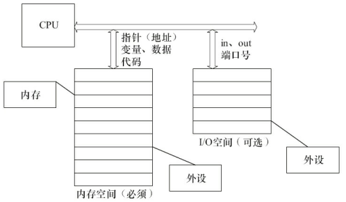
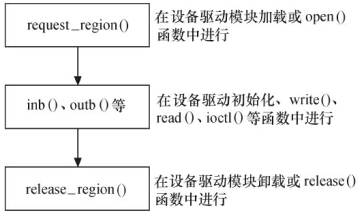
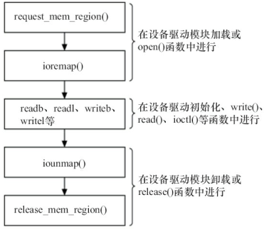

# 与硬件通信

> [《Linux设备驱动程序》 - 第三版 ](https://1drv.ms/b/s!AkcJSyT7tq80d6mS7pO12K6Qb30)的第9章，[《Linux设备驱动开发详解》 - 宋宝华 ](https://1drv.ms/b/s!AkcJSyT7tq80eFABEg8fSOajqHk)的第11章，的读书笔记，本文中的所有代码可在[GitHub仓库](https://github.com/LittleBee1024/learning_book/tree/main/docs/booknotes/ldd/mem_port/code)中找到，本文中的实验涉及与硬件的通信，可能会由于硬件的原因，无法得到期望的结果

设备通常会提供一组寄存器来控制设备、读写设备和获取设备状态，即控制寄存器、数据寄存器和状态寄存器。这些寄存器可能位于**I/O空间**中，也可能位于**内存空间**中。

* 当位于I/O空间时，被称为I/O端口
* 当位于内存空间时，被称为I/O内存



## I/O端口
在x86处理器中存在着I/O空间，而大多数嵌入式控制器(如ARM、PowerPC等)中并不提供I/O空间，只存在内存空间。I/O空间通过特定的指令`in`和`out`来访问。

在linux中，`/proc/ioports`记录了系统分配的所有I/O端口。例如，下面所列出的端口都已经被对应的驱动所占用：
```bash
> sudo cat /proc/ioports
0000-0cf7 : PCI Bus 0000:00
  0000-001f : dma1
  0020-0021 : PNP0001:00
    0020-0021 : pic1
  0040-0043 : timer0
  0050-0053 : timer1
  0060-0060 : keyboard
  0061-0061 : PNP0800:00
  0064-0064 : keyboard
  0070-0071 : rtc0
  0080-008f : dma page reg
  00a0-00a1 : PNP0001:00
    00a0-00a1 : pic2
  00c0-00df : dma2
  00f0-00ff : fpu
  0170-0177 : 0000:00:07.1
    0170-0177 : ata_piix
  01f0-01f7 : 0000:00:07.1
    01f0-01f7 : ata_piix
  0376-0376 : 0000:00:07.1
    0376-0376 : ata_piix
  03c0-03df : vga+
  03f6-03f6 : 0000:00:07.1
    03f6-03f6 : ata_piix
  04d0-04d1 : PNP0001:00
  0cf0-0cf1 : pnp 00:00
```

`request_region`函数用于在驱动程序中注册I/O端口。如果函数失败，可能端口已经被其他驱动所占用。

```cpp
#include <linux/ioport.h>

// 注册I/O端口
//  first - 端口起始地址
//  n - 需注册的端口个数
//  name - 设备名称，显示在/proc/ioports中
struct resource *request_region(unsigned long first, unsigned long n, const char *name);

// 释放I/O端口
void release_region(unsigned long start, unsigned long n);
```

I/O端口访问的一种途径是直接使用I/O端口操作函数。在设备打开或驱动模块被加载时申请I/O端口区域，之后使用`inb`、`outb`等进行端口访问，最后在设备关闭或驱动被卸载时释放I/O端口范围。下图展示了I/O端口访问的基本流程：




### 驱动程序

[驱动"io_port"](https://github.com/LittleBee1024/learning_book/tree/main/docs/booknotes/ldd/mem_port/code/io_port)通过`request_region`在"0x378"I/O端口上，注册了一个名为"short"的I/O端口驱动：
```cpp title="IO Port Driver" hl_lines="3 9"
#define DEVICE_NUM 2
#define SHORT_MAJOR 110
#define SHORT_PORT_BASE 0x378

static int __init short_init(void)
{
    int result;

    if (!request_region(SHORT_PORT_BASE, DEVICE_NUM, "short"))
    {
        printk(KERN_INFO "[short_init] can't get I/O port address 0x%x\n", SHORT_PORT_BASE);
        return -ENODEV;
    }

    result = register_chrdev(SHORT_MAJOR, "short", &short_fops);
    if (result < 0)
    {
        printk(KERN_INFO "[short_init] can't get major number\n");
        release_region(SHORT_PORT_BASE, DEVICE_NUM);
        return result;
    }
    printk(KERN_INFO "[short_init] done\n");

    return 0;
}
module_init(short_init);
```

安装上"short"驱动后，会在`/proc/ioports`文件中对应的位置（0x378），出现"short"驱动：
```bash
> sudo cat /proc/ioports | grep short
  0378-0379 : short
```

### 用户读写

Linux内核提供了一系列的函数，让用户可以方便访问I/O端口，包括：
```cpp
// 读写字节端口（8位）
unsigned inb(unsigned port);
void outb(unsigned char byte, unsigned port);

// 读写字端口（16位）
unsigned inw(unsigned port);
void outw(unsigned short word, unsigned port);

// 读写长字端口（32位）
unsigned inl(unsigned port);
void outl(unsigned longword, unsigned port);
```

[例子"io_port_user/inp"和"io_port_user/outp"](https://github.com/LittleBee1024/learning_book/tree/main/docs/booknotes/ldd/mem_port/code/io_port_user)分别提供了读写I/O端口的方法：

```cpp title="inp/main.c" hl_lines="5 7 9"
static int read_and_print_one_i386(unsigned int port, int size)
{
    ...
    if (size == 4)
        printf("%04x: 0x%08x\n", port, inl(port));
    else if (size == 2)
        printf("%04x: 0x%04x\n", port, inw(port));
    else
        printf("%04x: 0x%02x\n", port, inb(port));
    return 0;
}
```
```cpp title="outp/main.c" hl_lines="5 7 9"
static int write_one_i386(unsigned int port, int size)
{
    ...
    if (size == 4)
        outl(val, port);
    else if (size == 2)
        outw(val & 0xffff, port);
    else
        outb(val & 0xff, port);
    return 0;
}
```

除了上述访问方式外，用户也可以直接通过读写`/dev/port`文件，对I/O端口进行访问。可直接参考上面例子中的其他代码，此处不再赘述。

## I/O内存
在linux中，`/proc/iomem`记录了系统分配的所有I/O内存。例如，下面所列出的地址都对应了相应的驱动：
```bash
> sudo cat /proc/iomem 
00000000-00000fff : Reserved
00001000-0009e7ff : System RAM
0009e800-0009ffff : Reserved
000a0000-000bffff : PCI Bus 0000:00
000c0000-000c7fff : Video ROM
000ca000-000cafff : Adapter ROM
000cb000-000ccfff : Adapter ROM
00000000-00000000 : PCI Bus 0000:00
00000000-00000000 : PCI Bus 0000:00
000d0000-000dbfff : PCI Bus 0000:00
000dc000-000fffff : Reserved
  000f0000-000fffff : System ROM
00100000-bfedffff : System RAM
bfee0000-bfefefff : ACPI Tables
bfeff000-bfefffff : ACPI Non-volatile Storage
bff00000-bfffffff : System RAM
c0000000-febfffff : PCI Bus 0000:00
  c0000000-c0003fff : 0000:00:10.0
  e5b00000-e5bfffff : PCI Bus 0000:22
  ...
```

和I/O端口一样，在使用I/O内存前，需要先通过`request_mem_region`向内核申请：
```cpp
#include <linux/ioport.h>

// 申请I/O内存，从start开始分配len字节长的内存区域
//  name - 设备名称，显示在/proc/iomem中
struct resource *request_mem_region(unsigned long start, unsigned long len, char *name);

// 释放I/O内存
void release_mem_region(unsigned long start, unsigned long len);
```

I/O内存的访问首先是调用`request_mem_region`申请资源，接着将寄存器地址通过`ioremap`映射到内核空间虚拟地址，之后就可以通过Linux设备访问编程接口访问这些设备的寄存器了。访问完成后，应对`ioremap`申请的虚拟地址进行释放，并释放`release_mem_region`申请的I/O内存资源。下图展示了I/O内存访问的基本流程：



### 驱动程序

[驱动"io_mem"](https://github.com/LittleBee1024/learning_book/tree/main/docs/booknotes/ldd/mem_port/code/io_mem)通过`request_mem_region`在"0xfe800000"地址上，注册了一个名为"short"的I/O内存驱动：

```cpp title="IO Mem Driver" hl_lines="3 10 15"
#define DEVICE_NUM 2
#define SHORT_MAJOR 109
#define SHORT_MEM_BASE 0xfe800000  // pnp
unsigned long io_short_base = 0;

static int __init short_init(void)
{
   int result;

   if (!request_mem_region(SHORT_MEM_BASE, DEVICE_NUM, "short"))
   {
      printk(KERN_INFO "[short_init] can't get I/O mem address 0x%x\n", SHORT_MEM_BASE);
      return -ENODEV;
   }
   io_short_base = (unsigned long) ioremap(SHORT_MEM_BASE, DEVICE_NUM);
   printk(KERN_INFO "[short_init] ioremap returns 0x%lx\n", io_short_base);

   result = register_chrdev(SHORT_MAJOR, "short", &short_fops);
   if (result < 0)
   {
      printk(KERN_INFO "[short_init] can't get major number\n");
      release_mem_region(SHORT_MEM_BASE, DEVICE_NUM);
      return result;
   }
   printk(KERN_INFO "[short_init] done\n");

   return 0;
}
module_init(short_init);
```

安装上"short"驱动后，会在`/proc/iomem`文件中对应的位置（0xfe800000），出现"short"驱动：
```bash
> sudo cat /proc/iomem | grep short
    fe800000-fe800001 : short
```

### 用户读写

当I/O内存通过`ioremap`映射到内核空间虚拟地址后，内核空间就可以通过此虚拟地址，自由访问I/O内存空间了。如果想让用户空间也能访问I/O内存，可在驱动中实现`mmap`函数，将I/O内存的地址映射到用户空间。或者，也可以通过读写`/dev/mem`文件，在用户空间访问I/O内存。

[例子"io_mem_user/inm"和"io_mem_user/outm"](https://github.com/LittleBee1024/learning_book/tree/main/docs/booknotes/ldd/mem_port/code/io_mem_user)通过读写`/dev/mem`文件，可访问相应位置的I/O内存。
