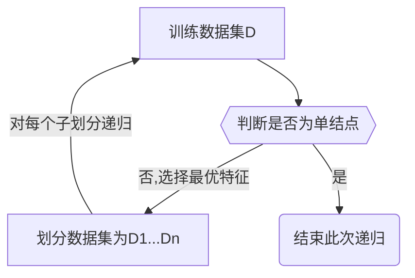

# 决策树

> [《统计学习方法》 - 李航 - 第二版](https://1drv.ms/b/s!AkcJSyT7tq80f24rxQaaH3HMUWE?e=5vJQNK) 第五章，以及[《Python数据手册》 - Jake VanderPlas](https://1drv.ms/b/s!AkcJSyT7tq80gQBIJPqCGBXnxliQ?e=oCjr4e) 第五章的读书笔记，本文中的所有代码可在[GitHub仓库](https://github.com/LittleBee1024/learning_book/tree/main/docs/booknotes/ml/decision_tree/code)中找到

## 理论

决策树(decision tree)是一种基本的分类与回归方法。本文主要讨论用于分类的决策树。在分类问题种，决策树可以认为是给定特征条件下类的条件概率分布。所有给定的特征条件将特征空间划分为互不相交的单元。决策树的一条路径对应于划分种的一个单元。各叶节点(单元)上的条件概率往往偏向某一个类，决策树分类时将该单元的实例强行分到条件概率大的那一类去。

决策树的主要优点是模型具有可读性，分类速度快。通常包括3个步骤：

* 特征选择
* 决策树的生成
* 决策树的修剪

常见的决策树算法有：

* ID3算法
* C4.5算法
* CART算法

三种算法的特点如下：

|算法|支持模型|树结构|特征选择|连续值处理|缺失值处理|剪枝|
|---|---|---|---|---|---|---|
|ID3 |分类|多叉树|信息增益|不支持|不支持|不支持|
|C4.5|分类|多叉树|信息增益比|支持|支持|支持|
|CART|分类，回归|二叉树|基尼系数,均方差|支持|支持|支持|

*表格来自[文章](https://www.cnblogs.com/pinard/p/6053344.html)*

### 特征选择

#### 信息增益

在信息论与概率统计中，熵(entropy)是表示随机变量不确定性的度量。随机变量 $X$ 的熵定义为：

$$H(X) = - \sum_{i=1}^{n}p_i \log p_i$$

其中， $p_i$ 是 $X=x_i$ 的概率。熵越大，随机变量的不确定性就越大。例如，当随机变量只取“1,0”两个值（伯努利分布）时，熵 $H(p)$ 随概率 $p$ 变化的曲线如下图所示：

_p.png)

当概率 $p$ 平均分布（等于0.5）时，熵最大。换句话说，当“1,0”出现的概率相等时，不确定性最大。

条件熵 $H(Y|X)$ 表示在已知随机变量 $X$ 的条件下随机变量 $Y$ 的不确定性。其定义为 $X$ 给定条件下 $Y$ 的条件概率分布的熵对 $X$ 的数学期望：

$$H(Y|X) = \sum_{i=1}^{n}p_iH(Y|X=x_i)$$

其中， $p_i = P(X=x_i), i = 1,2,...,n$ 。

**定义（信息增益）** 特征 $A$ 对训练数据集 $D$ 的信息增益 $g(D, A)$，定义为集合 $D$ 的经验熵 $H(D)$ 与特征 $A$ 给定条件下 $D$ 的经验条件熵 $H(D, A)$ 之差，即

$$g(D, A) = H(D) - H(D|A)$$

信息增益表示由于特征 $A$ 而使得对数据集 $D$ 的分类的不确定性减少的程度。信息增益大的特征具有更强的分类能力。

根据信息增益准则的特征选择方法是：对训练数据(或子集) $D$，计算其每个特征的信息增益，并比较它们的大小，选择信息增益最大的特征。

**例1** 假设我们想通过如下的“贷款申请样本数据表”，学习一个贷款申请的决策树，用以对未来的贷款申请进行分类。如何用信息增益选择特征来划分特征空间？

ID | 年龄 | 有工作 | 有自己的房子 | 信贷情况 | 类别
:-: | :-: | :-: | :-: | :-: | :-: 
1 | 青年 | 否 | 否 | 一般 | 否
2 | 青年 | 否 | 否 | 好 | 否
3 | 青年 | 是 | 否 | 好 | 是
4 | 青年 | 是 | 是 | 一般 | 是
5 | 青年 | 否 | 否 | 一般 | 否
6 | 中年 | 否 | 否 | 一般 | 否
7 | 中年 | 否 | 否 | 好 | 否
8 | 中年 | 是 | 是 | 好 | 是
9 | 中年 | 否 | 是 | 非常好 | 是
10 | 中年 | 否 | 是 | 非常好 | 是
11 | 老年 | 否 | 是 | 非常好 | 是
12 | 老年 | 否 | 是 | 好 | 是
13 | 老年 | 是 | 否 | 好 | 是
14 | 老年 | 是 | 否 | 非常好 | 是
15 | 老年 | 否 | 否 | 一般 | 否

**解** 首先计算经验熵 $H(D)$ ：

$$H(D) = -\sum_{k=1}^{K} \frac{|C_k|}{|D|} \log_2 \frac{|C_k|}{|D|} = -\frac{9}{15} \log_2 \frac{9}{15} -\frac{6}{15} \log_2 \frac{6}{15} = 0.971$$

然后计算各特征对数据集 $D$ 的信息增益。分别以 $A_1, A_2, A_3, A_4$ 表示年龄、有工作、有自己的房子和信贷情况4个特征。分别计算每个特征在数据集 $D$ 下的信息增益：

$$\begin{aligned}
g(D, A_1) &= H(D) - H(D|A_1) = H(D) - [\frac{5}{15}H(D_1) + \frac{5}{15}H(D_2) + \frac{5}{15}H(D_3)] \\
&= 0.971 - [\frac{5}{15}(-\frac{2}{5}\log_2\frac{2}{5} -\frac{3}{5}\log_2\frac{3}{5}) + \frac{5}{15}(-\frac{3}{5}\log_2\frac{3}{5} -\frac{2}{5}\log_2\frac{2}{5}) \\
&\quad + \frac{5}{15}(-\frac{4}{5}\log_2\frac{4}{5} -\frac{1}{5}\log_2\frac{1}{5})] \\
&= 0.971 - 0.888 = 0.083
\end{aligned}$$

按照同样的方法，计算出 $g(D, A_2)=0.324, g(D, A_3)=0.420, g(D, A_4)=0.363$。由于特征 $A_3$ (有自己的房子)的信息增益值最大，所以选择特征 $A_3$ 作为第一层的最优特征。

特征 $A_3$ 将数据集划分为两组 $D1,D2$。如果 $D1,D2$ 还需要根据特征进行划分(参见后面章节“决策树的生成”)，应再次分别计算 $D1,D2$ 数据集下 $A_1,A_2,A_4$ 的信息增益，以选取下一层的最优特征。

#### 信息增益比

以信息增益作为划分训练数据集的特征，存在偏向于选择取值较多的特征的问题。使用信息增益比(information gain ratio)可以对这一问题进行校正。

**定义(信息增益比)** 特征 $A$ 对训练数据集 $D$ 的信息增益比 $g_R(D, A)$ 定义为其信息增益 $g(D, A)$ 与训练数据集 $D$ 关于特征 $A$ 的值的熵 $H_A(D)$ 之比，即

$$g_R(D, A) = \frac {g(D, A)}{H_A(D)}$$

其中， $H_A(D) = - \sum_{i=1}^{n} \frac{|D_i|}{|D|} \log_2 \frac{|D_i|}{|D|}$，特征 $A$ 将 $D$ 划分为 $n$ 个子集 $D_1, D_2, ..., D_n$， $|D_i|$ 为 $D_i$ 的样本个数。

#### 基尼指数

信息增益和信息增益比的计算会涉及大量的对数运算。使用基尼指数可以简化计算。基尼指数代表了模型的不纯度，基尼指数越小，则不纯度越低，特征越好。

**定义（基尼指数）** 分类问题中，假设有 $K$ 个类，样本点属于第 $k$ 类的概率为 $p_k$，则概率分布的基尼指数定义为：

$$\operatorname{Gini} (p) = \sum_{k=1}^Kp_k(1-p_k)=1 - \sum_{k=1}^{K}p_k^2$$

在特征 $A$ 的条件下，集合 $D$ 的基尼指数定义为

$$\operatorname{Gini}(D,A) = \frac{|D_1|}{|D|}\operatorname{Gini}(D_1) + \frac{|D_2|}{|D|}\operatorname{Gini}(D_2)$$

基尼指数 $\operatorname{Gini}(D)$ 表示集合 $D$ 的不确定性，基尼指数 $\operatorname{Gini}(D, A)$ 表示 $A=a$ 分割后集合 $D$ 的不确定性。基尼指数数值越大，样本集合的不确定性也就越大，这一点与熵相似。

下图显示了二分类问题中基尼指数 $\operatorname{Gini}(p)$、熵(单位比特)之半 $H(p)/2$ 和分类误差率的关系。横坐标表示概率 $p$，纵坐标表示损失。可以看出基尼指数和熵之半的曲线很接近，都可以近似地代表分类误差率。

### 决策树的生成

决策树的三种生成算法分别采用了三种不同的方法选择最优化特征。其中，ID3算法采用信息增益、C4.5算法采用信息增益比、CART算法采用基尼指数。但是三者的对决策树的生成算法是类似的，都是从根开始，在各个结点上应用信息增益准则选择特征，递归地构建决策树，其过程大致如下：

#### ID3算法

**例2** 对例1中的“贷款申请样本数据表”，利用ID3算法建立决策树。

**解** 由例1的结果可知，特征 $A_3$ 的信息增益值最大，所以先选择特征 $A_3$ 作为根结点的特征。它将训练数据集 $D$ 划分为两个子集 $D_1$ 和 $D_2$。其中， $D_1$ 所有的样本点的分类都为“是”，所以它成为一个叶节点，结点的类标记为“是”，不需要为其继续递归。

对 $D_2$ 则需从特征 $A_1$ (年龄)， $A_2$ (有工作)和 $A_4$ (信贷情况)中选择新的特征。计算各个特征的信息增益：

$$\begin{aligned}
&g(D_2, A_1) = H(D_2) - H(D_2|A_1) = 0.918 - 0.667 = 0.251 \\
&g(D_2, A_2) = H(D_2) - H(D_2|A_2) = 0.918 \\
&g(D_2, A_4) = H(D_2) - H(D_2|A_4) = 0.474
\end{aligned}$$

选择信息增益最大的特征 $A_2$ (有工作)作为 $D_2$ 结点的特征。$A_2$ 有两个可能取值，将 $D_2$ 划分为两组数据。一个对应“是”（有工作），包含3个样本，它们属于同一类(“是”)，因此是叶结点，结束递归。另一个对应“否”（无工作），包含6个样本，也属于同一类(“否”)，结束递归。最终，我们得到如下的决策树，该决策树只用了两个特征。

#### CART算法

**例3** 对例1中的“贷款申请样本数据表”，利用CART算法建立决策树。

**解** 首先计算各特征的基尼指数，选择最优特征以及其最优切分点(二分)。分别以 $A_1,A_2,A_3,A_4$ 表示年龄、有工作、有自己的房子和信贷情况4个特征，并以1，2，3表示年龄的值为青年、中年和老年，以1，2表示有工作和有自己的房子值为是和否，以1，2，3表示信贷情况的值为非常好、好和一般。

求特征 $A_1$ 的基尼指数：

$$\begin{aligned}
&\operatorname{Gini}(D,A_1=1)=\frac{5}{15}(2*\frac{2}{5}*(1-\frac{2}{5}))+\frac{10}{15}(2*\frac{7}{10}*(1-\frac{7}{10})) = 0.44\\
&\operatorname{Gini}(D,A_1=2)=0.48 \\
&\operatorname{Gini}(D,A_1=3)=0.44
\end{aligned}$$

由于 $\operatorname{Gini}(D,A_1=1)$ 和 $\operatorname{Gini}(D,A_1=3)$ 相等，且最小，所以两个点都可以选作 $A_1$ 的最优切分点。

用同样的方法，求 $A_2$ 和 $A_3$ 的基尼指数，由于它们只能取两种值，所以只有一个切分点：

$$\begin{aligned}
&\operatorname{Gini}(D,A_2=1)=\frac{10}{15}(2*\frac{4}{10}*(1-\frac{4}{10})) = 0.32 \\
&\operatorname{Gini}(D,A_3=1) =\frac{9}{15}(2*\frac{3}{9}*(1-\frac{3}{9})) = 0.27
\end{aligned}$$

继续求特征 $A_4$ 的基尼指数：

$$\begin{aligned}
&\operatorname{Gini}(D,A_4=1) = 0.36 \\
&\operatorname{Gini}(D,A_4=2) = 0.47 \\
&\operatorname{Gini}(D,A_4=3) = 0.32 \\
\end{aligned}$$

$\operatorname{Gini}(D,A_4=3)$ 最小，选择 $A_4=3$ 为最优切分点。

在所有特征中， $\operatorname{Gini}(D,A_3=1)$ 最小，所以选择特征 $A_3$ 为最优特征， $A_3=1$ 为最优切分点。于是根结点生成两个子结点，一个是叶结点(所有数据类相同)。另一个结点继续使用以上方法在 $A_1,A_2,A_4$ 中选择最优特征及其最优切分点，结果是 $A_2=1$。依此计算得知，所得结点都是叶结点。

对于本问题，按照CART算法所生成的决策树与按照ID3算法所生成的决策树完全一致。

## 实验
