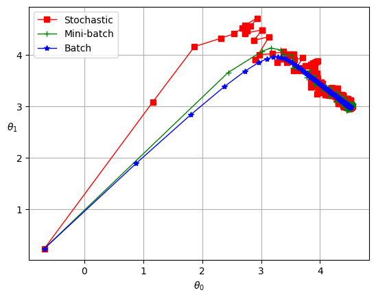

# 线性回归

> [《Hands-on Machine Learning with Scikit-Learn, Keras & TensorFlow》 - 第二版](https://1drv.ms/b/s!AkcJSyT7tq80gQMC23h9BYE9cIKW?e=4IPacy) 第四章，[《Python数据手册》 - Jake VanderPlas](https://1drv.ms/b/s!AkcJSyT7tq80gQBIJPqCGBXnxliQ?e=oCjr4e) 第五章，[《机器学习》 - 周志华](https://1drv.ms/b/s!AkcJSyT7tq80gQHa_bUybXe9tjCV?e=shgZXm)第三章的读书笔记，本文中的所有代码可在[GitHub仓库](https://github.com/LittleBee1024/learning_book/tree/main/docs/booknotes/ml/linear_reg/code)中找到

## 数学模型

线性模型试图学得一个通过属性的线性组合来进行预测的函数，即：

$$\hat{y} = \theta_0 + \theta_1x_1 + \theta_2x_2+...+\theta_nx_n$$

一般用向量形式写成：

$$\hat{y} = \theta^Tx$$

其中，

* $\hat{y}$ 表示预测结果
* $n$ 表示特征的个数
* $x_i$ 表示第 $i$ 个特征的值
* $\theta_j$ 表示第 $j$ 个参数(包括偏置项 $\theta_0$ 和特征权重值 $\theta_1, \theta_2, ...\theta_n$ )

## 正规方程求解

我们可以采用公式解，通过正规方程直接得到 $\theta$ 的值。正规方程如下：

$$\hat{\theta} = (X^T \cdot X)^{-1} \cdot X^T \cdot y$$

其中，

* $\hat{\theta}$ 指最小化损失 $\theta$ 的值
* $y$ 是一个向量，其包含了 $y^{(1)}$ 到 $y^{(m)}$ 的值

[例子“normal_equation.ipynb”](https://github.com/LittleBee1024/learning_book/blob/main/docs/booknotes/ml/linear_reg/code/normal_equation.ipynb)展示了如何利用方程直接求解线性回归方程，并和`sklearn`提供的`LinearRegression`模型进行了对比，两者结果相近。

## 梯度下降求解

当特征个数较大时，正规方程求解较慢。梯度下降是一种非常通用的优化算法。其整体思路是通过迭代来逐渐调整参数使得损失函数达到最小值。

### 批量梯度下降

线性回归模型的损失函数采用均方误差MSE(mean square error)：

$$MSE(\theta) = \frac{1}{m} \sum_{i=1}^m(\theta^T \cdot x^{(i)} - y^{(i)})^2$$

梯度下降需要求损失函数的偏导数：

$$\frac{\partial}{\partial \theta_j}MSE(\theta) = \frac{2}{m}  \sum_{i=1}^m (\theta^T \cdot x^{(i)} - y^{(i)})x_j^{(i)}$$

对所有 $\theta$ 都计算偏导数，可以用矩阵运算，得到梯度向量：

$$\bigtriangledown_{\theta} MSE(\theta) = \begin{pmatrix}
\frac{\partial}{\partial \theta_0}MSE(\theta)\\ 
\frac{\partial}{\partial \theta_1}MSE(\theta)\\ 
...\\ 
\frac{\partial}{\partial \theta_n}MSE(\theta)\\ 
\end{pmatrix} = \frac{2}{m}X^T \cdot (X \cdot \theta - y)$$

梯度向量是 $\theta$ 每次变化的步长，通过学习率 $\eta$ 控制 $\theta$ 的变化速度，得到 $\theta$ 的迭代公式：

$$ \theta^{(next step)} = \theta - \eta \bigtriangledown_{\theta} MSE(\theta)$$

梯度向量的计算包含了整个训练集 $X$，因此这个算法称为**批量梯度下降**。

[例子“batch_gradient_descent.ipynb”](https://github.com/LittleBee1024/learning_book/blob/main/docs/booknotes/ml/linear_reg/code/batch_gradient_descent.ipynb)分别选择了“0.02, 0.1, 0.5”三种学习率，观察每次迭代的变化情况。

* 左侧图的学习率太小了，花了大量时间也没能求出最后的结果
* 中间图的学习率最合适，迭代几次后就收敛了
* 右侧图的学习率太大了，算法是发散的

### 随机梯度下降

批量梯度下降每一步都要使用整个训练集，这导致在规模较大的数据集上，其速度会非常慢。而随机梯度下降，在每一步的梯度计算上只随机选取训练集中的一个样本，这一每次操作数据量会非常小，从而提高了速度。

但是，由于随机梯度下降每次迭代的随机性，其呈现出更多的不规律性：它到达最小值不是平缓地下降，损失函数会忽高忽低，只是在大体上呈下降趋势。随着时间的推移，它会非常靠近最小值，但是不会停在一个值上，而是一直在这个值附件摆动。下图对比了梯度下降(左图)和随机梯度下降(右图)的迭代路径。

虽然随机性可以很好地跳过局部最优值(损失函数不规则)，但同时它却不能达到最小值(在附件摆动)。解决办法是逐渐降低学习率。开始时，走的每一步较大(有助于跳过局部最小值)，然后学习率变得越来越小，从而使算法达到局部最小值。

[例子“stochastic_gradient_descent.ipynb”](https://github.com/LittleBee1024/learning_book/blob/main/docs/booknotes/ml/linear_reg/code/stochastic_gradient_descent.ipynb)实现了这样的随机梯度下降算法，其中`learning_schedule`决定了每次迭代的学习率函数，迭代次数越大，其值越小。

### 小批量梯度下降

在迭代的每一步，批量梯度使用整个训练集，随机梯度仅仅使用一个实例。但是，在小批量梯度下降中，它使用一个随机的小型实例集。它比随机梯度的主要优点在于你可以通过矩阵运算的硬件优化得到一个较好的训练表现，尤其当你使用GPU进行运算的时候。

## 总结

下表比较了线性回归的不同算法：

| Algorithm | Large m | Out-of-core support | Large n | Hyper-params | Scaling required | Scikit-Learn |
| --- | --- | --- | --- | --- | --- | --- |
| Normal Equation | Fast | No  | Slow | 0   | No  | LinearRegression |
| Batch GD        | Slow | No  | Fast | 2   | Yes | N/A              |
| Stochastic GD   | Fast | Yes | Fast | >=2 | Yes | SGDRegressor     |
| Mini-batch GD   | Fast | Yes | Fast | >=2 | Yes | N/A              |

其中，`m`表示样本数，`n`表示特征数。

下图显示了训练期间三种梯度下降算法在参数空间中所采用的路径。它们都接近最小值，但批量梯度的路径最后停在了最小值，而随机梯度和小批量梯度最后都在最小值附件摆动。

