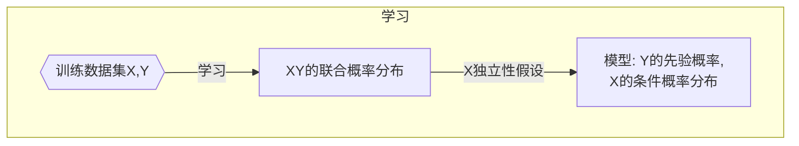

# 朴素贝叶斯法

> [《统计学习方法》 - 李航 - 第二版](https://1drv.ms/b/s!AkcJSyT7tq80f24rxQaaH3HMUWE?e=5vJQNK) 第四章，以及[《Python数据手册》 - Jake VanderPlas](https://1drv.ms/b/s!AkcJSyT7tq80gQBIJPqCGBXnxliQ?e=oCjr4e) 第五章的读书笔记，本文中的所有代码可在[GitHub仓库](https://github.com/LittleBee1024/learning_book/tree/main/docs/booknotes/ml/naive_bayes/code)中找到

## 理论

朴素贝叶斯(Naive Bayes)法是基于**贝叶斯定理**与**特征条件独立假设**的分类方法。对于给定的训练数据集，首先基于特征条件独立假设学习输入输出的联合概率分布。然后基于此联合概率分布，利用贝叶斯定理，求出给定的输入x，对应y的后验概率。取后验概率最大的y类作为x的类输出。

朴素贝叶斯法的基本假设是条件独立性，

$$\begin{aligned} P(X&=x | Y=c_{k} )=P\left(X^{(1)}=x^{(1)}, \cdots, X^{(n)}=x^{(n)} | Y=c_{k}\right) \\ &=\prod_{j=1}^{n} P\left(X^{(j)}=x^{(j)} | Y=c_{k}\right) \end{aligned}$$

这是一个较强的假设。由于这一假设，模型包含的条件概率的数量大为减少，朴素贝叶斯法的学习与预测大为简化。因而朴素贝叶斯法高效，且易于实现。其缺点是分类的性能不一定很高。
