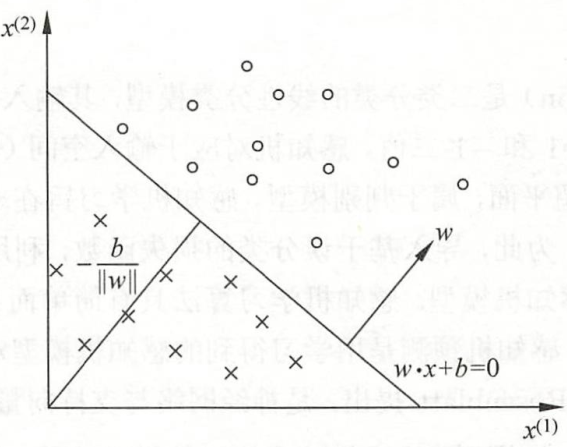
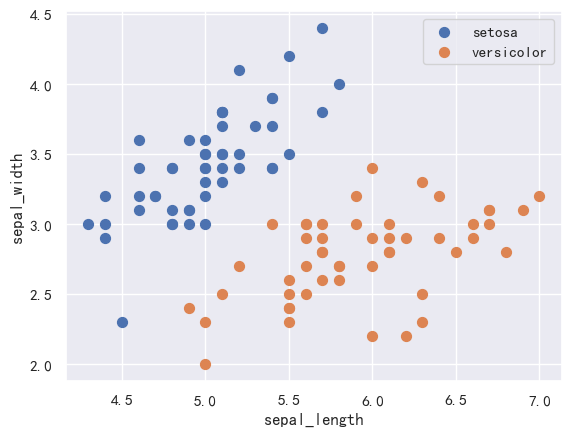
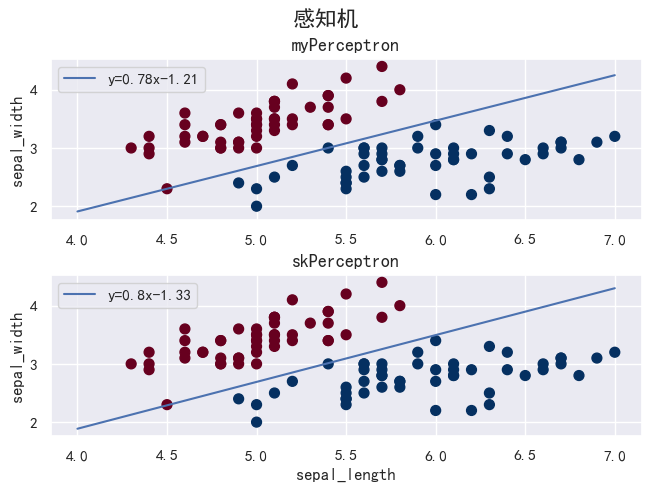

# 感知机

> [《统计学习方法》 - 李航 - 第二版](https://1drv.ms/b/s!AkcJSyT7tq80f24rxQaaH3HMUWE?e=5vJQNK) 第二章的读书笔记，本文中的所有代码可在[GitHub仓库](https://github.com/LittleBee1024/learning_book/tree/main/docs/booknotes/ml/perceptron/code)中找到

## 理论

感知机(perceptron)是二分类的线性分类模型，其输入为实例的特征向量，输出为实例的类别，取+1和-1二值。

感知机学习旨在求出将训练数据进行线性划分的**分离超平面**，为此，导入基于误分类的**损失函数**，利用梯度下降法对损失函数进行极小化，从而求得感知机模型。


感知机预测是用学习得到的感知机模型对新的输入实例进行分类。感知机是神经网络与支持向量机的基础。


### 感知机模型

感知机是根据输入实例的特征向量$x$对其进行二类分类的线性分类模型：

$$
f(x)=\operatorname{sign}(w \cdot x+b)
$$

其中，$w$和$b$为感知机模型参数，$w \cdot x$表示$w$和$x$的内积。sign是符号函数，即

$$
\operatorname{sign}(x) = \begin{cases}+1&x\geq0\\\\-1&x<0\end{cases}
$$

感知机模型对应于输入空间（特征空间）中的分离超平面

$$w \cdot x+b=0$$

其中，$w$是超平面的法向量，$b$是超平面的截距。这个超平面将特征空间划分为两个部分。位于两部分的点（特征向量）分别被分为正、负两类。如下图所示：



图中值的证明过程可参考[文章](https://www.jianshu.com/p/c7eddb3ff248)。

### 损失函数

损失函数的一个自然选择是误分点的总数(将误分点个数减少到最小)。但是，这样的损失函数不可导，难以优化。因此我们需要寻找一个更加合适的损失函数，并保证损失函数收敛于误分点最少的点(误分类最小策略)。

感知机学习的损失函数定义为：

$$
\min _{w, b} L(w, b)=-\sum_{x_{i} \in M} y_{i}\left(w \cdot x_{i}+b\right)
$$

其中，$M$是超平面$S$的误分类点集合。通过《统计学习方法》第二章中的推导过程可知，某一误分类点$x_{i}$到超平面$S$的距离是：

$$
-\frac{1}{\left \| w \right \|}y_{i}(w \cdot x_{i}+b)
$$

因此，感知机损失函数的意义是**误分类点**到超平面$S$的总距离。

损失函数$L(w, b)$是非负的。如果没有误分类点，损失函数值是0。误分类点越少，误分类点离超平面越近，损失函数值就越小。利用梯度下降法调整$w$和$b$，以不断极小化损失函数，直到损失函数值为0，此时超平面下没有误分类点。

### 算法

输入：训练数据集$T$，学习率$\eta (0 < \eta \leq 1)$

输出：$w$，$b$，感知机模型$f(x)=\operatorname{sign}(w \cdot x+b)$

利用梯度下降法，求取$w$和$b$的具体过程如下：

* 选取初值$w_{0}$和$b_{0}$
* 在训练集中选取数据$(x_{i},y_{i})$
* 如果$y_{i}(w \cdot x_{i}+b) \leq 0$，表明$(x_{i},y_{i})$是误分类点，需要通过梯度下降法调整$w$和$b$：

$$
\begin{aligned}
&w \leftarrow w + \eta y_{i}x_{i}
\\
&b \leftarrow b + \eta y_{i}
\end{aligned}
$$

* 跳转至第二步，直到训练集中没有误分类点

上述过程可解释为：当一个实例点被误分类，即位于分离超平面的错误一侧时，调整$w$和$b$的值，使分离超平面向该误分类点的一侧移动，以减少该误分类点与超平面的距离，直至超平面越过该误分类点使其被正确分类。

#### 算法的收敛性

当训练数据集线性可分时(存在一个超平面可以将正负实例完全划分到两侧)，感知机学习算法存在无穷多个解，其解由于不同的初值或不同的迭代顺序而可能有所不同。为了得到唯一的超平面，需要对分离超平面增加约束条件，这就是支持向量机的想法来源。

当训练集线性不可分时，感知机学习算法不收敛，迭代结果会发生震荡。

## 实验

实现一个[感知机二分类器](https://github.com/LittleBee1024/learning_book/tree/main/docs/booknotes/ml/perceptron/code/perceptron.ipynb)，并通过与`sklearn`的感知机模型进行对比，验证结果。

### 准备数据

```python
import pandas as pd
import numpy as np
import matplotlib.pyplot as plt
import seaborn as sns

# load data
iris = sns.load_dataset("iris")

# 取出'sepal_length'，'sepal_width'和'species'，前100个数据，前50个'species'是'setosa'，后50个'species'是'versicolor'
data = np.array(iris.iloc[:100, [0, 1, -1]])
# 第一维度全部取出(100行)，第二维度取出第一个列，到倒数第二个列
X = data[:,:-1]
# 二分类'species'标签，'setosa'值为-1，'versicolor'值为1
y = np.array([1 if s == 'versicolor' else -1 for s in data[:,-1]])

fig, ax = plt.subplots()
sct = ax.scatter(X[:50, 0], X[:50, 1], s=50, label='setosa')
sct = ax.scatter(X[50:100, 0], X[50:100, 1], s=50, label='versicolor')
ax.set_xlabel('sepal_length')
ax.set_ylabel('sepal_width')
ax.legend()
```



### 训练模型

下面的代码实现了感知机的原始算法，即对损失函数进行梯度下降算法进行迭代，直到没有误分点：

```python
class MyPerceptron:
    def __init__(self):
        self.b = 0
        self.l_rate = 0.1

    def sign(self, x, w, b):
        y = np.dot(x, w) + b
        return y

    # 随机梯度下降法
    def fit(self, X_train, y_train):
        self.w = np.ones(len(X_train[0]), dtype=np.float32)
        is_end = False
        while not is_end:
            err_point_count = 0
            for d in range(len(X_train)):
                X = X_train[d]
                y = y_train[d]
                if y * self.sign(X, self.w, self.b) <= 0:
                    # 处理误分点d
                    self.w = self.w + self.l_rate * np.dot(y, X)
                    self.b = self.b + self.l_rate * y
                    err_point_count += 1
            if err_point_count == 0:
                is_end = True
        return f'Perceptron Model!'

# 训练感知机模型
perceptron = MyPerceptron()
perceptron.fit(X, y)

x_line = np.linspace(4, 7, 10)
a = -perceptron.w[0]/perceptron.w[1]
b = -perceptron.b/perceptron.w[1]
y_line = a*x_line + b
```

同时，我们也用`sklearn`提供的感知机模型`Perceptron`进行对比实验。由于感知机算法存在多个解，因此下图中的两条感知机线并不完全相同：

```python
import sklearn
from sklearn.linear_model import Perceptron

# tol参数规定了如果本次迭代的损失和上次迭代的损失之差小于一个特定值时，停止迭代。如果设置成None可保证不会出现误差点
clf = Perceptron(fit_intercept=True, max_iter=1000, shuffle=True, tol=None)
clf.fit(X, y)

x_line_g = np.arange(4, 8)
a_g = -clf.coef_[0][0]/clf.coef_[0][1]
b_g = -clf.intercept_/clf.coef_[0][1]
y_line_g = a_g*x_line_g + b_g
```

对比`sklearn`的`Perceptron`模型和本地实现的`MyPerceptron`模型，结果如下：

```python
fig, ax = plt.subplots(2, 1, constrained_layout=True, sharey=True)
fig.suptitle('感知机', fontsize=16)

ax[0].scatter(X[:, 0], X[:, 1], s=50, c=y, cmap='RdBu')

# 感知机线
ax[0].plot(x_line, y_line, label=f'y={round(a,2)}x{round(b,2)}')
ax[0].legend(loc='upper left')

ax[0].set_ylabel('sepal_width')
ax[0].set_title('myPerceptron', fontsize=13)

ax[1].scatter(X[:, 0], X[:, 1], s=50, c=y, cmap='RdBu')
# 感知机线
ax[1].plot(x_line_g, y_line_g, label=f'y={round(a_g, 2)}x{round(b_g[0],2)}')
ax[1].legend(loc='upper left')

ax[1].set_xlabel('sepal_length')
ax[1].set_ylabel('sepal_width')
ax[1].set_title('skPerceptron', fontsize=13)
```




