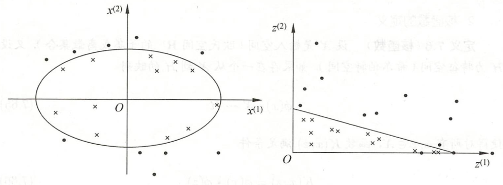
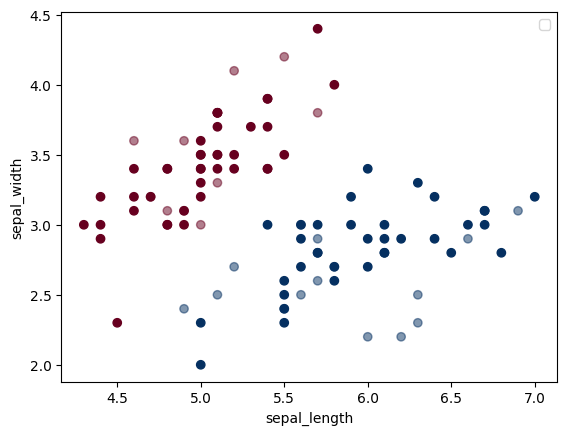
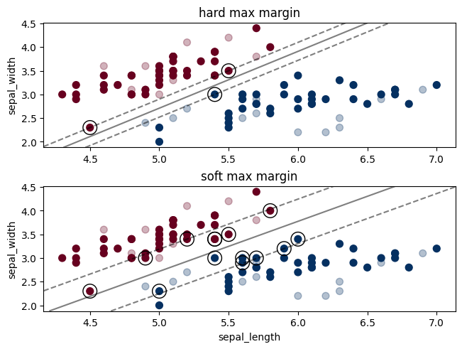
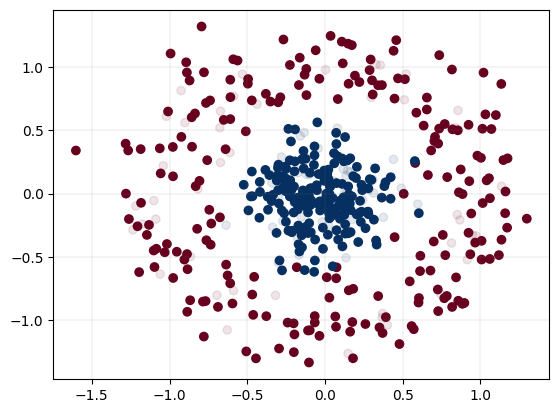
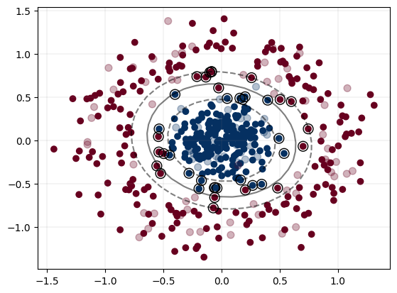
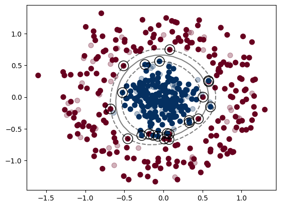
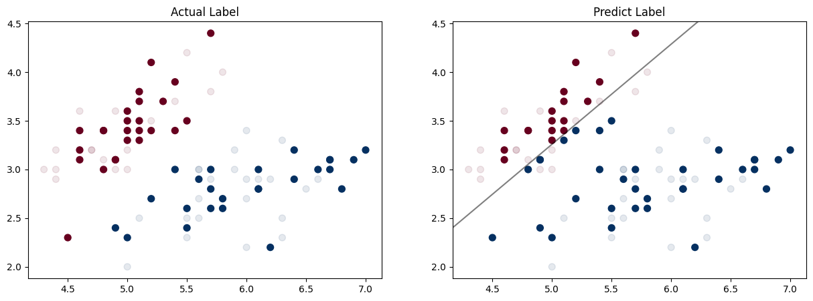
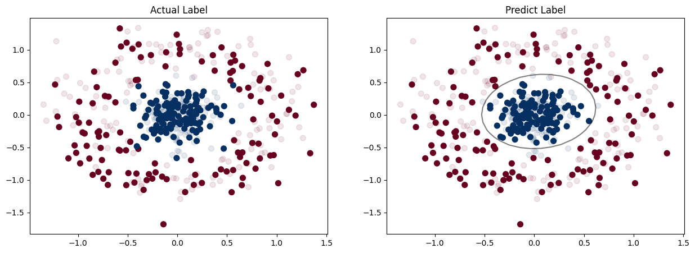

# 支持向量机

> [《统计学习方法》 - 李航 - 第二版](https://1drv.ms/b/s!AkcJSyT7tq80f24rxQaaH3HMUWE?e=5vJQNK) 第七章，以及[《Python数据手册》 - Jake VanderPlas](https://1drv.ms/b/s!AkcJSyT7tq80gQBIJPqCGBXnxliQ?e=oCjr4e) 第五章的读书笔记，本文中的所有代码可在[GitHub仓库](https://github.com/LittleBee1024/learning_book/tree/main/docs/booknotes/ml/svm/code)中找到

## 理论

支持向量机分三种:

* 线性可分支持向量机
    * 通过硬间隔最大化(hard margin maximization)，分类可线性划分的数据(所有数据正确地分布在最大间隔两侧)
* 线性支持向量机
    * 通过软间隔最大化(soft margin maximization)，分类可线性划分的**大部分**数据(可能存在误分点，或在最大间隔之间)
* 非线性支持向量机
    * 通过使用核技巧(kernel trick)及软间隔最大化，分类非线性划分的数据

### 线性可分支持向量机


图中数据的证明可参考另一篇博文[《感知机》](../perceptron/README.md)，其中 $H_{1}$ 和 $H_{2}$ 称为间隔边界：

$$H_{1}: w \cdot x + b = 1，H_{2}: w \cdot x + b = -1$$

为了对最难分的实例点(离超平面最近的点)也有足够大的确信度将它们分开，我们需要在保证无误分点的情况下，使 $H_{1}$ 和 $H_{2}$ 的间隔最大：

$$\max _{w, b} \frac{\|w\|}{2}$$

而此间隔最大的问题，可以转化为凸二次规划问题，其原始最优化问题可表示为：

$$\min _{w, b} \frac{1}{2}\|w\|^{2}$$

$$s.t. \quad y_{i}\left(w \cdot x_{i}+b\right)-1 \geqslant 0, \quad i=1,2, \cdots, N$$

求得最优化问题的解为 $w^\ast$， $b^\ast$，得到线性可分支持向量机，分离超平面是：

$$w^\ast \cdot x+b^\ast=0$$

分类决策函数是：

$$f(x)=\operatorname{sign}\left(w^\ast \cdot x+b^\ast\right)$$

利用拉格朗日对偶性可将上述原始问题转化为对偶问题([参考](https://zhuanlan.zhihu.com/p/77560876))：

$$\min \frac{1}{2} \sum_{i=1}^{N} \sum_{j=1}^{N} \alpha_{i} \alpha_{j} y_{i} y_{j}\left(x_{i} \cdot x_{j}\right)-\sum_{i=1}^{N} \alpha_{i}$$

$$s.t. \quad \sum_{i=1}^{N} \alpha_{i} y_{i}=0$$

$$\alpha_{i} \geqslant 0, \quad i=1,2, \cdots, N$$

通过求解对偶问题学习线性可分支持向量机，即首先求解对偶问题的最优值 $a^\ast$，然后求最优值 $w^\ast$ 和 $b^\ast$，得出分离超平面和分类决策函数：

$$w^\ast = \sum_{i=1}^{N} \alpha_{i}^\ast y_{i} x_{i}$$

$$b^\ast = y_{j} - \sum_{i=1}^{N} \alpha_{i}^\ast y_{i} (x_{i} \cdot x_{j})$$

#### 支持向量

由KKT互补条件可证明(参见《统计学习方法》的定义7.4)， $\alpha_{i}^\ast>0$ 的样本点 $x_i$ 是支持向量，而其他 $\alpha_{i}^\ast=0$ 的样本点对分离超平面并无影响。

#### 算法例子

已知一个如下图所示的训练数据集，其正例点是 $x_{1}=(3,3)^T$， $x_{2}=(4,3)^T$，负例点是 $x_{3}=(1,1)^T$。试用线性可分支持向量机的对偶问题，求解分离超平面。


**解** 根据所给数据，对偶问题是

$$\begin{aligned}
\min _{\alpha}\quad
&\frac{1}{2} \sum_{i=1}^{N} \sum_{j=1}^{N} \alpha_{i} \alpha_{j} y_{i} y_{j}\left(x_{i} \cdot x_{j}\right)-\sum_{i=1}^{N} \alpha_{i} \\
&= \frac{1}{2} (18\alpha_{1}^2 + 25\alpha_{2}^2 + 2\alpha_{3}^2 + 42\alpha_{1}\alpha_{2} - 12\alpha_{1}\alpha_{3} - 14\alpha_{2}\alpha_{3}) - \alpha_{1} - \alpha_{2} - \alpha_{3} \\
s.t. \quad
&\alpha_{1} + \alpha_{2} - \alpha_{3} = 0 \\
&\alpha_{i} \geqslant 0, \quad i=1,2,3
\end{aligned}$$

将 $\alpha_{3}=\alpha_{1}+\alpha_{2}$ 代入目标函数，求 $s(\alpha_{1},\alpha_{2})$ 最小值：

$$s(\alpha_{1},\alpha_{2}) = 4\alpha_{1}^2+\frac{13}{2}\alpha_{2}^2+10\alpha_{1}\alpha_{2}-2\alpha_{1}-2\alpha_{2}$$

对 $\alpha_{1},\alpha_{2}$ 求偏导数并令其为0，易知 $s(\alpha_{1},\alpha_{2})$ 在点 $(\frac{3}{2},-1)^T$ 取极值，但该点不满足约束条件 $\alpha_{2} \geqslant 0$，所以最小值应在边界上达到。

* 当 $\alpha_{1} = 0$ 时，最小值是 $s(0,\frac{2}{13})=-\frac{2}{13}$

* 当 $\alpha_{1} = 0$ 时，最小值是 $s(\frac{1}{4},0)=-\frac{1}{4}$

因此， $s(\alpha_{1},\alpha_{2})$ 在 $(\frac{1}{4},0)^T$ 达到最小，此时 $\alpha_{3}=\frac{1}{4}$。

这样， $\alpha_{1}^\ast=\alpha_{3}^\ast=\frac{1}{4}$ 对应的实例点 $x_{1},x_{3}$ 是支持向量。

根据 $\alpha_{1}^\ast,\alpha_{2}^\ast,\alpha_{3}^\ast$ 的值求 $w^\ast$，并选取正分量 $\alpha_{1}^\ast$ 求 $b^\ast$：

$$\begin{aligned}
w^{(1)\ast} &= \sum_{i=1}^{3} \alpha_{i}^\ast y_{i} x_{i}^
{(1)} = \frac{1}{4}*3 -  \frac{1}{4}*1 = \frac{1}{2} \\
w^{(2)\ast} &= \sum_{i=1}^{3} \alpha_{i}^\ast y_{i} x_{i}^
{(2)} = \frac{1}{4}*3 -  \frac{1}{4}*1 = \frac{1}{2} \\
b^\ast &= y_{1} - \sum_{i=1}^{3} \alpha_{i}^\ast y_{i} (x_{i} \cdot x_{1}) = 1 - (\frac{1}{4}*18 - \frac{1}{4}*6) = -2
\end{aligned}$$

因此，分离超平面为：

$$\frac{1}{2}x^{(1)}+\frac{1}{2}x^{(2)}-2 = 0$$

### 线性支持向量机

现实中训练数据使线性可分的情形较少，大部分训练数据往往使近似线性可分的。此时，就需要采用线性支持向量机，修改硬间隔最大化，使其成为软间隔最大化。

线性不可分意味着某些样本点不能满足函数间隔大于等于1的约束条件。为了解决这个问题，引入了松弛变量 $\xi_i \geqslant 0$，使约束条件变为：

$$s.t. \quad y_{i}\left(w \cdot x_{i}+b\right) \geqslant 1 - \xi_i, \quad i=1,2, \cdots, N$$

同时，对每个松弛变量 $\xi_i$，需要支付一个代价。目标函数变为：

$$\min _{w, b, \xi} \frac{1}{2}\|w\|^{2}+C \sum_{i=1}^{N} \xi_{i}$$

这里， $C > 0$ 称为惩罚参数，一般由应用问题决定。 $C$ 值越大对误分类的惩罚越大，误分点越少。

引入松弛变量 $\xi_i$ 后，硬间隔最大化问题转化为软间隔最大化的问题，其原始问题的拉格朗日函数是：

$$L(w,b,\xi,\alpha,\mu) \equiv \frac{1}{2}\|w\|^{2} + C \sum_{i=1}^{N}\xi_i - \sum_{i=1}^{N}\alpha_i(y_i(w \cdot x_i+b)-1+\xi_i) - \sum_{i=1}^{N}\mu_i \xi_i $$

其中， $\alpha_i \geqslant 0$ 且 $\mu_i \geqslant 0$，对拉格朗日求极值，得到原始问题的对偶问题：

$$\min _{\alpha} \frac{1}{2} \sum_{i=1}^{N} \sum_{j=1}^{N} \alpha_{i} \alpha_{j} y_{i} y_{j}\left(x_{i} \cdot x_{j}\right)-\sum_{i=1}^{N} \alpha_{i}$$

$$s.t. \quad \sum_{i=1}^{N} \alpha_{i} y_{i}=0$$

$$0 \leqslant \alpha_{i} \leqslant C, \quad i=1,2, \cdots, N$$

和线性可分支持向量机一样，求得对偶问题的最优值 $a^\ast$ 后，通过如下公式求 $w^\ast$ 和 $b^\ast$，最终得出分离超平面和分类决策函数。

$$w^\ast = \sum_{i=1}^{N} \alpha_{i}^\ast y_{i} x_{i}$$

$$b^\ast = y_{j} - \sum_{i=1}^{N} \alpha_{i}^\ast y_{i} (x_{i} \cdot x_{j})$$

和线性可分支持向量机不同的是，线性支持向量机的 $w$ 是唯一的，但 $b$ 的解可能不唯一(根据选择的 $\alpha_j^\ast$ 不同可能不同)，而是存在于一个区间。

#### 支持向量

和线性可分支持向量机一样， $\alpha_{i}^\ast>0$ 的样本点 $x_i$ 是支持向量。不同的是，这里的支持向量不一定在间隔边界上。如下图，支持向量(带箭头的点)可能在间隔边界内，也可能在分类超平面误分一侧。


* 若 $0< \alpha_{i}^\ast < C$
    * 则 $\xi_i = 0$，表明支持向量 $x_i$ 恰好落在间隔边界上
* 若 $\alpha_{i}^\ast = C，0 < \xi_i < 1$
    * 则分类正确，支持向量 $x_i$ 在间隔边界与分离超平面之间
* 若 $\alpha_{i}^\ast = C，\xi_i = 1$
    * 则支持向量 $x_i$ 在分离超平面上
* 若 $\alpha_{i}^\ast = C，\xi_i > 1$
    * 则支持向量 $x_i$ 在分离超平面误分一侧

### 非线性支持向量机

非线性分类问题是指通过利用非线性模型才能很好地进行分类的问题。如下图，无法用直线(线性模型)将正负实例分开，但可以用一条椭圆曲线(非线性模型)将它们正确分开。



非线性问题往往不好求解，可通过将非线性问题转换为线性问题，来简化问题。例如，定义从原空间到新空间的映射 $z$：

$$z=\phi(x)=((x^{(1)})^2,(x^{(2)})^2)^T$$

通过变换 $z$，原空间中的椭圆：

$$w^{(1)}(x^{(1)})^2 + w^{(2)}(x^{(2)})^2 + b = 0$$

变换成为新空间中的直线：

$$w^{(1)}z^{(1)} + w^{(2)}z^{(2)} + b = 0$$

上面的例子说明，用线性分类方法求解非线性分类问题分为两步：

* 首先使用一个变换将原空间的数据映射到新空间
* 然后在新空间里用线性分类学习方法从训练数据中学习分类模型

由于映射函数 $\phi$ 并不好找，我们定义了核函数 $K(x,z)$ 来简化运算：

$$K(x,z) = \phi(x) \cdot \phi(z)$$

其中， $\phi$ 是输入空间 $\mathbf{R}^n$ 到特征空间 $\mathcal{H}$ 的映射，特征空间 $\mathcal{H}$ 一般是高维的。

由于线性支持向量机的对偶问题只涉及输入实例之间的内积，用核函数代替后，对偶问题的目标函数成为：

$$W(\alpha) = \frac{1}{2} \sum_{i=1}^{N} \sum_{j=1}^{N} \alpha_{i} \alpha_{j} y_{i} y_{j}K(x_{i} \cdot x_{j})-\sum_{i=1}^{N} \alpha_{i}$$

同样，分类决策函数变为：

$$f(x)=\operatorname{sign}(\sum_{i=1}^{N} \alpha_i^\ast y_iK(x, x_i)+b^\ast)$$

#### 常用核函数

* 多项式核函数(polynomial kernel function)

$$K(x,z) = (x \cdot z + 1)^p$$

* 高斯核函数(Gaussian kernel function)

$$K(x,z) = \operatorname{exp}(-\frac{\|x-z\|^2}{2 \sigma ^2})$$

### SMO算法

序列最小最优化(sequential minimal optimization, SMO)算法可以快速求解SVM中的凸二次规划问题，其对偶问题是：

$$\min _{\alpha} \frac{1}{2} \sum_{i=1}^{N} \sum_{j=1}^{N} \alpha_{i} \alpha_{j} y_{i} y_{j}K(x_{i} , x_{j})-\sum_{i=1}^{N} \alpha_{i}$$

$$s.t. \quad \sum_{i=1}^{N} \alpha_{i} y_{i}=0$$

$$0 \leqslant \alpha_{i} \leqslant C, \quad i=1,2, \cdots, N$$

在这个问题中，变量是拉格朗日乘子，一个变量 $\alpha_i$ 对应于一个样本点 $(x_i,y_i)$，变量的总数等于训练样本容量 $N$。

SMO算法的基本思路是：如果所有变量的解都满足此最优化问题的KKT条件，那么这个最优化问题的解就得到了。否则，选择两个变量，固定其他变量，针对这两个变量构建一个二次规划问题。这时的子问题只关注两个变量，可大大提高计算速度。子问题有两个变量，一个是违反KKT条件最严重的那一个，另一个由约束条件 $\sum \alpha_i y_i = 0$ 自动确定。如此，SMO算法将原问题不断分解为子问题并对子问题求解，进而达到求解原问题的目的。

整个SMO算法包括：

* 求解两个变量二次规划的解析方法
* 选择变量的启发式方法

其中，对于训练样本点 $(x_i, y_i)$的KKT条件是：

$$\alpha_i = 0 \Leftrightarrow y_ig(x_i) \geqslant 1$$

$$0 < \alpha_i < C \Leftrightarrow y_ig(x_i) = 1$$

$$\alpha_i = C \Leftrightarrow y_ig(x_i) \leqslant 1$$

其中， $g(x_i) = \sum_{j=1}^{N} a_j y_j K(x_i, x_j) + b$。

## 实验

### 线性支持向量机

["svm_linear.ipynb"](https://github.com/LittleBee1024/learning_book/blob/main/docs/booknotes/ml/svm/code/svm_linear.ipynb)利用`sklearn`的线性支持向量机，对鸢尾花数据集进行了分类学习。其中，根据惩罚参数`C`的选择不同，我们对比了硬间隔最大化和软间隔最大化的区别。

#### 准备数据

如下图，我们选取两种鸢尾花，一部分数据用于线性支持向量机的训练(图中实心的点)，另一部分用于测试(图中透明的点)。




#### 训练模型

我们使用`sklearn`支持向量机分类器`SVC`来训练一个线性支持向量机模型。

`SVC`有一个参数`C`，称为惩罚参数，其值一般由应用问题决定。当C值大时对误分类的惩罚增大，当C值小时对误分类的惩罚减小。如果数据线性可分，我们可以增大`C`，以增加准确度。如果数据线性不可分，则应该减小`C`，以容许一定量的误分类存在。

```python
from sklearn.svm import SVC # 支持向量分类器
# C值大，减少误分类，针对线性可分数据，硬间隔最大化
model_hard = SVC(kernel='linear', C=1E10)
model_hard.fit(X_train, y_train)
# C值小，容许误分类，针对线性不可分数据，软间隔最大化
model_soft = SVC(kernel='linear', C=1)
model_soft.fit(X_train, y_train)
```

#### 预测分类

下面的代码通过对比测试数据的实际结果和预测结果，发现两个模型的准确率都达到了100%。
```python
from sklearn.metrics import accuracy_score

predictions_hard = model_hard.predict(X_test)
accuracy_hard = accuracy_score(y_test, predictions_hard)
print("SVM hard linear kernel accuracy: " + str(accuracy_hard))

predictions_soft = model_soft.predict(X_test)
accuracy_soft = accuracy_score(y_test, predictions_hard)
print("SVM soft linear kernel accuracy: " + str(accuracy_soft))
```
输出结果：
```bash
SVM hard linear kernel accuracy: 1.0
SVM soft linear kernel accuracy: 1.0
```

为了更进一步地展示模型的特点，下面我们画出了两个模型的决策边界和支持向量机。
```python
def plot_svc_decision_function(model, ax):
    assert ax is not None
    xlim = ax.get_xlim()
    ylim = ax.get_ylim()

    # 创建网格来展示数据
    x = np.linspace(xlim[0], xlim[1], 30)
    y = np.linspace(ylim[0], ylim[1], 30)
    Y, X = np.meshgrid(y, x)
    xy = np.vstack([X.ravel(), Y.ravel()]).T
    # 超平面S在坐标(x,y)下对应的值
    P = model.decision_function(xy).reshape(X.shape)

    # 绘制边界和间距，即超平面S的等高线：f(x,y)=0, f(x,y)=1, f(x,y)=-1
    ax.contour(X, Y, P, colors='k', levels=[-1, 0, 1], alpha=0.5, linestyles=['--', '-', '--'])

    # 绘制支持向量
    ax.scatter(model.support_vectors_[:, 0], model.support_vectors_[:, 1], s=200, edgecolors='k', facecolors='none')

    ax.set_xlim(xlim)
    ax.set_ylim(ylim)

fig, ax = plt.subplots(2, 1, constrained_layout=True)

ax[0].scatter(X_train[:, 0], X_train[:, 1], c=y_train, s=50, cmap='RdBu')
ax[0].scatter(X_test[:, 0], X_test[:, 1], c=y_test, s=50, alpha=0.3, cmap='RdBu')
ax[0].set_ylabel('sepal_width')
ax[0].set_title("hard max margin")
plot_svc_decision_function(model_hard, ax[0])

ax[1].scatter(X_train[:, 0], X_train[:, 1], c=y_train, s=50, cmap='RdBu')
ax[1].scatter(X_test[:, 0], X_test[:, 1], c=y_test, s=50, alpha=0.3, cmap='RdBu')
ax[1].set_xlabel('sepal_length')
ax[1].set_ylabel('sepal_width')
ax[1].set_title("soft max margin")
plot_svc_decision_function(model_soft, ax[1])

```
可以发现，硬间隔最大化由于惩罚参数`C`较大，所有样本都正确分布在了决策边界两侧，支持向量位于边界上。而软间隔最大化，支持向量可分布边界内(甚至允许存在误分点)，对于样本的噪声有更大的容忍度。


### 非线性支持向量机

`sklearn`提供了多种核函数的非线性支持向量机。下面我们分别选择“多项式核(二次)”和“高斯核”，对非线性数据进行分类预测：

* 多项式核
    * ["svm_nonlinear_poly.ipynb"](https://github.com/LittleBee1024/learning_book/blob/main/docs/booknotes/ml/svm/code/svm_nonlinear_poly.ipynb)

* 高斯核
    * ["svm_nonlinear_rbf.ipynb"](https://github.com/LittleBee1024/learning_book/blob/main/docs/booknotes/ml/svm/code/svm_nonlinear_rbf.ipynb)

#### 准备数据

我们利用`sklearn`提供的`make_circles`产生了可以被椭圆分隔的两组数据，即非线性可分。

```python
import matplotlib.pyplot as plt
from sklearn.datasets import make_circles

def load_data(test_size_perc):
    size = 500
    test_size = int(size * test_size_perc)
    X, y = make_circles(size, factor=.1, noise=.2)
    X_train = X[:-test_size]
    y_train = 2 * y[:-test_size] - 1 # convert to 1 or -1
    X_test = X[-test_size:]
    y_test = 2 * y[-test_size:] - 1 # convert to 1 or -1
    return X_train, X_test, y_train, y_test

X_train, X_test, y_train, y_test = load_data(0.2)

# Plotting the training set
fig, ax = plt.subplots()
# adding major gridlines
ax.grid(color='grey', linestyle='-', linewidth=0.25, alpha=0.5)
ax.scatter(X_train[:,0], X_train[:,1], c=y_train, cmap='RdBu')
ax.scatter(X_test[:,0], X_test[:,1], c=y_test, alpha=0.1, cmap='RdBu')
```
同样的，我们选取一部分数据进行测试，即下图中透明的点：


#### 多项式核

训练采用二次多项式核的支持向量机模型：

```python
from sklearn.svm import SVC

model = SVC(kernel='poly', degree=2)
model.fit(X_train, y_train)
```

测试模型，对比测试数据的预测结果和实际结果：

```python
from sklearn.metrics import accuracy_score
predictions_poly = model.predict(X_test)
accuracy_poly = accuracy_score(y_test, predictions_poly)
print("SVM 2nd degree polynomial kernel accuracy: " + str(accuracy_poly))
```

二次多项式核的支持向量机的准确度如下：

```bash
SVM 2nd degree polynomial kernel accuracy: 0.98
```

下图展示了该模型的分离超平面和支持向量：



#### 高斯核

训练采用高斯核支持向量机模型：

```python
from sklearn.svm import SVC

model = SVC(kernel='rbf', C=100, gamma='auto')
model.fit(x_train, y_train)
```

测试模型，对比测试数据的预测结果和实际结果：

```python
from sklearn.metrics import accuracy_score
predictions_rbf = model.predict(x_test)
accuracy_rbf = accuracy_score(y_test, predictions_rbf)
print("SVM RBF kernel accuracy: " + str(accuracy_rbf))
```

高斯核的支持向量机的准确度如下：

```bash
SVM RBF kernel accuracy: 0.98
```

下图展示了该模型的分离超平面和支持向量：



### 支持向量机SMO实现

["smo.ipynb"](https://github.com/LittleBee1024/learning_book/blob/main/docs/booknotes/ml/svm/code/smo.ipynb)基于SMO算法实现了一个支持向量机，它支持线性核函数、二次多项式核函数和高斯核函数。和`sklearn`提供的支持向量机模型相比，其精度不高，但可以作为学习参考。

模型代码如下：

```python
import numpy as np
from matplotlib import pyplot as plt


class LinearKernel:  # 线性核函数

    def __call__(self, a: np.ndarray, b: np.ndarray):
        return np.sum(a * b, axis=-1) # 对最内轴进行求和，即行向量内积


class PolyKernel:  # 多项式核函数

    def __call__(self, a: np.ndarray, b: np.ndarray):
        return (np.sum(a * b, axis=-1) + 1)**2 # 公式(7.88)


class RBFKernel:  # 高斯核函数

    def __init__(self, sigma):
        self.divisor = 2 * sigma**2

    def __call__(self, a: np.ndarray, b: np.ndarray):
        return np.exp(-np.sum((a - b)**2, axis=-1) / self.divisor) # 公式(7.90)


class SVM:
    """
    Support Vector Machines(支持向量机)
    """

    def __init__(self, kernel="linear", C=1.0, iterations=100, tol=1e-3, sigma=1.0):
        """
        Args:
            kernel (str, optional): 核函数. Defaults to 'linear'.
            C (float, optional): 惩罚因子. Defaults to 1.0.
            iterations (int, optional): 最大迭代次数. Defaults to 100.
            tol (float, optional): 绝对误差限. Defaults to 1e-3.
            sigma (float, optional): 高斯核函数的sigma. Defaults to 1.0.
        """
        assert kernel in ["linear", "poly", "rbf"]

        if kernel == "linear":
            self.K = LinearKernel()  # 线性核函数
        elif kernel == "poly":
            self.K = PolyKernel()  # 多项式核函数
        elif kernel == "rbf":
            self.K = RBFKernel(sigma)  # 径向基核函数

        self.C, self.iterations, self.tol, self.alpha, self.b = C, iterations, tol, None, 0.0
        self.X, self.y = None, None

    def fit(self, X: np.ndarray, y: np.ndarray):
        self.X, self.y = X, y

        # 拉格朗日乘子，长度为样本个数，初始值为1
        self.alpha = np.ones([len(X)])
        for _ in range(self.iterations):
            # 此次迭代缓存的误差
            E = np.array([self.__E(i) for i in range(len(X))])

            # 7.4.2 变量的选择方法
            # 外层循环，寻找第一个alpha
            for i1 in range(len(X)):
                if self.__satisfy_kkt(i1): #满足KKT条件
                    continue

                # 计算误差(不使用E缓存)
                E1 = self.__E(i1)
                # 内层循环，寻找第二个alpha
                i2 = np.argmin(E) if E1 > 0 else np.argmax(E) # 大于0则选择最小，小于0选择最大的
                if i1 == i2:
                    continue
                E2 = self.__E(i2)

                # 7.4.1 两个变量二次规划的求解方法
                x1, x2, y1, y2 = X[i1], X[i2], y[i1], y[i2]
                alpha1, alpha2 = self.alpha[i1], self.alpha[i2]
                k11, k22, k12 = self.K(x1, x1), self.K(x2, x2), self.K(x1, x2)

                # 计算剪切范围
                if y1 * y2 < 0:
                    L = max(0, alpha2 - alpha1)
                    H = min(self.C, self.C + alpha2 - alpha1)
                else:
                    L = max(0, alpha1 + alpha2 - self.C)
                    H = min(self.C, alpha1 + alpha2)

                # 公式(7.107)
                eta = k11 + k22 - 2 * k12
                if eta <= 0:
                    continue

                # 计算新alpha
                # 公式(7.106), (7.108)
                alpha2_new = np.clip(alpha2 + y2 * (E1 - E2) / eta, L, H)
                # 公式(7.109)
                alpha1_new = alpha1 + y1 * y2 * (alpha2 - alpha2_new)

                # 计算新b
                alpha2_delta, alpha1_delta = alpha2_new - alpha2, alpha1_new - alpha1
                # 公式(7.115)
                b1_new = -E1 - y1 * k11 * alpha1_delta - y2 * k12 * alpha2_delta + self.b
                # 公式(7.116)
                b2_new = -E2 - y1 * k12 * alpha1_delta - y2 * k22 * alpha2_delta + self.b

                # 更新参数
                self.alpha[i1] = alpha1_new
                self.alpha[i2] = alpha2_new
                if 0 < alpha1_new < self.C:
                    self.b = b1_new
                elif 0 < alpha2_new < self.C:
                    self.b = b2_new
                else:
                    self.b = (b1_new + b2_new) / 2

                # 更新误差缓存
                E[i1] = self.__E(i1)
                E[i2] = self.__E(i2)

    # 公式(7.94)
    def predict(self, X: np.ndarray):
        y_pred = np.array([self.__g(x) for x in X])
        return np.where(y_pred > 0, 1, -1)  # 将(-\infinity, \infinity)之间的分布转为{-1, +1}标签

    def values(self, X: np.ndarray):
        return np.array([self.__g(x) for x in X])

    @property
    def support_vectors(self):  # 支持向量
        return self.X[self.alpha > 0]

    # 公式(7.104)
    def __g(self, x):  # g(x) =\sum_{i=0}^N alpha_i y_i \kappa(x_i, x)
        return np.sum(self.alpha * self.y * self.K(self.X, x)) + self.b

    # 公式(7.105)
    def __E(self, i):  # E_i = g(x_i) - y_i
        return self.__g(self.X[i]) - self.y[i]

    # 公式(7.111) ~ (7.113)
    def __satisfy_kkt(self, i):  # 是否满足KKT条件
        g_i, y_i = self.__g(self.X[i]), self.y[i]
        if np.abs(self.alpha[i]) < self.tol:
            return g_i * y_i >= 1
        if np.abs(self.alpha[i]) > self.C - self.tol:
            return g_i * y_i <= 1
        return np.abs(g_i * y_i - 1) < self.tol
```

我们采用和上面一样的数据进行训练和测试，其分离超平面大致如下：

* 线性核



* 二次多项式核


* 高斯核


