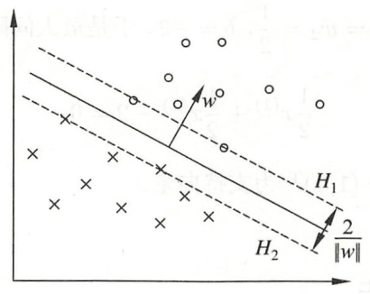
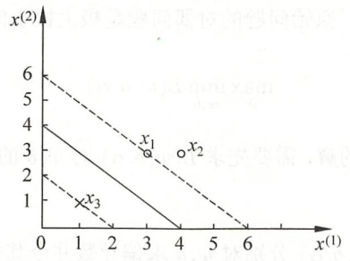
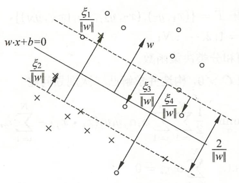

# 支持向量机

> [《统计学习方法》 - 李航 - 第二版](https://1drv.ms/b/s!AkcJSyT7tq80f24rxQaaH3HMUWE?e=5vJQNK) 第七章，以及[《Python数据手册》 - Jake VanderPlas](https://1drv.ms/b/s!AkcJSyT7tq80gQBIJPqCGBXnxliQ?e=oCjr4e) 第五章的读书笔记，本文中的所有代码可在[GitHub仓库](https://github.com/LittleBee1024/learning_book/tree/main/docs/booknotes/ml/svm/code)中找到

## 概述

支持向量机分三种:

* 线性可分支持向量机
    * 通过硬间隔最大化(hard margin maximization)，分类可线性划分的数据(所有数据正确地分布在最大间隔两侧)
* 线性支持向量机
    * 通过软间隔最大化(soft margin maximization)，分类可线性划分的**大部分**数据(可能存在误分点，或在最大间隔之间)
* 非线性支持向量机
    * 通过使用核技巧(kernel trick)及软间隔最大化，分类非线性划分的数据

### 线性可分支持向量机

图中数据的证明可参考另一篇博文[《感知机》](../perceptron/README.md)，其中$H_{1}$和$H_{2}$称为间隔边界：

$$H_{1}: w \cdot x + b = 1，H_{2}: w \cdot x + b = -1$$

为了对最难分的实例点(离超平面最近的点)也有足够大的确信度将它们分开，我们需要在保证无误分点的情况下，使$H_{1}$和$H_{2}$的间隔最大：

$$\max _{w, b} \frac{\|w\|}{2}$$

而此间隔最大的问题，可以转化为凸二次规划问题，其原始最优化问题可表示为：

$$\min _{w, b} \frac{1}{2}\|w\|^{2}$$

$$s.t. \quad y_{i}\left(w \cdot x_{i}+b\right)-1 \geqslant 0, \quad i=1,2, \cdots, N$$

求得最优化问题的解为$w^*$，$b^*$，得到线性可分支持向量机，分离超平面是：

$$w^{*} \cdot x+b^{*}=0$$

分类决策函数是：

$$f(x)=\operatorname{sign}\left(w^{*} \cdot x+b^{*}\right)$$

利用拉格朗日对偶性可将上述原始问题转化为对偶问题([参考](https://zhuanlan.zhihu.com/p/77560876))：

$$\min \frac{1}{2} \sum_{i=1}^{N} \sum_{j=1}^{N} \alpha_{i} \alpha_{j} y_{i} y_{j}\left(x_{i} \cdot x_{j}\right)-\sum_{i=1}^{N} \alpha_{i}$$

$$s.t. \quad \sum_{i=1}^{N} \alpha_{i} y_{i}=0$$

$$\alpha_{i} \geqslant 0, \quad i=1,2, \cdots, N$$

通过求解对偶问题学习线性可分支持向量机，即首先求解对偶问题的最优值$a^*$，然后求最优值$w^*$和$b^*$，得出分离超平面和分类决策函数：

$$w^* = \sum_{i=1}^{N} \alpha_{i}^* y_{i} x_{i}$$

$$b^* = y_{j} - \sum_{i=1}^{N} \alpha_{i}^* y_{i} (x_{i} \cdot x_{j})$$

#### 支持向量

由KKT互补条件可证明(参见《统计学习方法》的定义7.4)，$\alpha_{i}^*>0$的样本点$x_i$是支持向量，而其他$\alpha_{i}^*=0$的样本点对分离超平面并无影响。

#### 算法例子

已知一个如下图所示的训练数据集，其正例点是$x_{1}=(3,3)^T$，$x_{2}=(4,3)^T$，负例点是$x_{3}=(1,1)^T$。试用线性可分支持向量机的对偶问题，求解分离超平面。

**解** 根据所给数据，对偶问题是

$$\begin{align*}
\min _{\alpha}\quad
&\frac{1}{2} \sum_{i=1}^{N} \sum_{j=1}^{N} \alpha_{i} \alpha_{j} y_{i} y_{j}\left(x_{i} \cdot x_{j}\right)-\sum_{i=1}^{N} \alpha_{i} \\
&= \frac{1}{2} (18\alpha_{1}^2 + 25\alpha_{2}^2 + 2\alpha_{3}^2 + 42\alpha_{1}\alpha_{2} - 12\alpha_{1}\alpha_{3} - 14\alpha_{2}\alpha_{3}) - \alpha_{1} - \alpha_{2} - \alpha_{3} \\
s.t. \quad
&\alpha_{1} + \alpha_{2} - \alpha_{3} = 0 \\
&\alpha_{i} \geqslant 0, \quad i=1,2,3
\end{align*}$$

将$\alpha_{3}=\alpha_{1}+\alpha_{2}$代入目标函数，求$s(\alpha_{1},\alpha_{2})$最小值：

$$s(\alpha_{1},\alpha_{2}) = 4\alpha_{1}^2+\frac{13}{2}\alpha_{2}^2+10\alpha_{1}\alpha_{2}-2\alpha_{1}-2\alpha_{2}$$

对$\alpha_{1},\alpha_{2}$求偏导数并令其为0，易知$s(\alpha_{1},\alpha_{2})$在点$(\frac{3}{2},-1)^T$取极值，但该点不满足约束条件$\alpha_{2} \geqslant 0$，所以最小值应在边界上达到。

* 当$\alpha_{1} = 0$时，最小值是$s(0,\frac{2}{13})=-\frac{2}{13}$

* 当$\alpha_{1} = 0$时，最小值是$s(\frac{1}{4},0)=-\frac{1}{4}$

因此，$s(\alpha_{1},\alpha_{2})$在$(\frac{1}{4},0)^T$达到最小，此时$\alpha_{3}=\frac{1}{4}$。

这样，$\alpha_{1}^*=\alpha_{3}^*=\frac{1}{4}$对应的实例点$x_{1},x_{3}$是支持向量。

根据$\alpha_{1}^*,\alpha_{2}^*,\alpha_{3}^*$的值求$w^*$，并选取正分量$\alpha_{1}^*$求$b^*$：

$$\begin{align*}
w^{(1)*} &= \sum_{i=1}^{3} \alpha_{i}^* y_{i} x_{i}^
{(1)} = \frac{1}{4}*3 -  \frac{1}{4}*1 = \frac{1}{2} \\
w^{(2)*} &= \sum_{i=1}^{3} \alpha_{i}^* y_{i} x_{i}^
{(2)} = \frac{1}{4}*3 -  \frac{1}{4}*1 = \frac{1}{2} \\
b^* &= y_{1} - \sum_{i=1}^{3} \alpha_{i}^* y_{i} (x_{i} \cdot x_{1}) \\
&= 1 - (\frac{1}{4}*18 - \frac{1}{4}*6) = -2
\end{align*}$$

因此，分离超平面为：

$$\frac{1}{2}x^{(1)}+\frac{1}{2}x^{(2)}-2 = 0$$

### 线性支持向量机

现实中训练数据使线性可分的情形较少，大部分训练数据往往使近似线性可分的。此时，就需要采用线性支持向量机，修改硬间隔最大化，使其成为软间隔最大化。

线性不可分意味着某些样本点不能满足函数间隔大于等于1的约束条件。为了解决这个问题，引入了松弛变量$\xi_i \geqslant 0$，使约束条件变为：

$$s.t. \quad y_{i}\left(w \cdot x_{i}+b\right) \geqslant 1 - \xi_i, \quad i=1,2, \cdots, N$$

同时，对每个松弛变量$\xi_i$，需要支付一个代价。目标函数变为：

$$\min _{w, b, \xi} \frac{1}{2}\|w\|^{2}+C \sum_{i=1}^{N} \xi_{i}$$

这里，$C > 0$称为惩罚参数，一般由应用问题决定。$C$值越大对误分类的惩罚越大，误分点越少。

引入松弛变量$\xi_i$后，硬间隔最大化问题转化为软间隔最大化的问题，其原始问题的对偶问题变为：

$$\min _{\alpha} \frac{1}{2} \sum_{i=1}^{N} \sum_{j=1}^{N} \alpha_{i} \alpha_{j} y_{i} y_{j}\left(x_{i} \cdot x_{j}\right)-\sum_{i=1}^{N} \alpha_{i}$$

$$s.t. \quad \sum_{i=1}^{N} \alpha_{i} y_{i}=0$$

$$0 \leqslant \alpha_{i} \leqslant C, \quad i=1,2, \cdots, N$$

和线性可分支持向量机一样，求得对偶问题的最优值$a^*$后，通过如下公式求$w^*$和$b^*$，最终得出分离超平面和分类决策函数。

$$w^* = \sum_{i=1}^{N} \alpha_{i}^* y_{i} x_{i}$$

$$b^* = y_{j} - \sum_{i=1}^{N} \alpha_{i}^* y_{i} (x_{i} \cdot x_{j})$$

和线性可分支持向量机不同的是，线性支持向量机的$w$是唯一的，但$b$的解可能不唯一(根据选择的$\alpha_j^*$不同可能不同)，而是存在于一个区间。

#### 支持向量

和线性可分支持向量机一样，$\alpha_{i}^*>0$的样本点$x_i$是支持向量。不同的是，这里的支持向量不一定在间隔边界上。如下图，支持向量(带箭头的点)可能在间隔边界内，也可能在分类超平面误分一侧。

* 若$0< \alpha_{i}^* < C$
    * 则$\xi_i = 0$，表明支持向量$x_i$恰好落在间隔边界上
* 若$\alpha_{i}^* = C，0 < \xi_i < 1$
    * 则分类正确，支持向量$x_i$在间隔边界与分离超平面之间
* 若$\alpha_{i}^* = C，\xi_i = 1$
    * 则支持向量$x_i$在分离超平面上
* 若$\alpha_{i}^* = C，\xi_i > 1$
    * 则支持向量$x_i$在分离超平面误分一侧

### 非线性支持向量机

