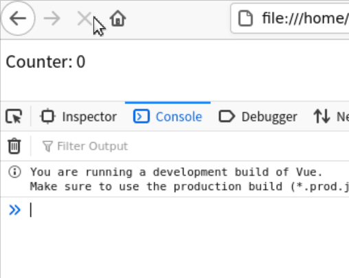

# Vue3简介

> 介绍`Vue3.0`的基本用法，所有样例可在[GitHub仓库](https://github.com/LittleBee1024/learning_book/tree/main/docs/demos/vue/code)中找到

## 声明式渲染
### [代码实例](./code/decl_render)


* [HTML代码](./code/decl_render/index.html)
    * Vue.js使用了基于HTML的模板语法，允许开发者声明式地将DOM绑定至底层组件实例的数据，具体语法可参考[“模板语法”官方文档](https://v3.cn.vuejs.org/guide/template-syntax.html)
    * 最常见的绑定DOM和数据的方法是：双大括号`{{ }}`
        * 例如，实例中的`{{ counter }}`就将`<div>`中的文本和根组件实例`vm`的`counter`数据绑定。当`vm.counter`发生变化时，`<div>`中的文本也会相应变化
        ```html
        <div id="app">
            Counter: {{ counter }}
        </div>
        ```

* [JS代码](./code/decl_render/index.js)
    * 每个Vue应用都是通过全局API`createApp`函数创建的一个新**应用实例**开始的，传递给`createApp`的选项用于配置**根组件**，当我们**挂载**应用时，该组件被用作渲染的起点
        * 例如，实例中 `RootComponent`被作为根组件选项传给`createApp`创建出应用实例`app`。通过应用API`mount`，根组件实例`vm`被创建，并挂载到id是`app`的`<div>`标签，开始渲染
        ```js
        const RootComponent = {
            data() {
                return {
                    counter: 0
                }
            },
            mounted() {
                setInterval(() => {
                    this.counter++
                }, 1000)
            }
        }

        const app = Vue.createApp(RootComponent)
        const vm = app.mount('#app')
        ```

### 深入理解响应性原理
Vue最独特的特性是其非入侵性的[响应性系统](https://v3.cn.vuejs.org/guide/reactivity.html)，响应性系统需要解决以下几个问题：

* 什么是响应性？
    * 简单来说，响应性系统中的各组件能感知到其他相关组件的变化，更新自己的状态。例如：`sum = val1 + val2`作为一个响应系统，我们需要在读写时做额外的事情(**副作用**)，从而将`sum`和`val1, val2`绑定：
        * 当一个值被读取时进行追踪
            * 响应性系统的读操作是有**副作用**的。例如，当读取`sum`的值时，需要追踪读操作的依赖`val1`和`val2`，记录依赖关系
        * 当某个值改变时进行检测，重新运行代码来读取原始值
            * 同样，响应系统的写操作也有同样的**副作用**。例如，当`val1`或者`val2`发生变化时，需要检测这个写操作的依赖`sum`，再次运行`sum = val1 + val2`来更新`sum`的值

* Vue如何指定哪些代码在执行？
    * 上面的例子中的**副作用**`sum = val1 + val2`被包裹在一个函数`updateSum`中。当在数值变化时，响应性系统能随时执行相应的**副作用**
    ```js
    const updateSum = () => {
        sum = val1 + val2
    }
    ```

* Vue如何跟踪变化？
    * **副作用**按照上述方法被准备好后，需要解决的问题是：Vue是如何知道哪个**副作用**，应该在何时运行，并能在需要时再次执行它？
    * Vue会将一个组件的`data`函数返回的对象包裹在一个带有`get`和`set`处理程序的[Proxy](https://developer.mozilla.org/en-US/docs/Web/JavaScript/Reference/Global_Objects/Proxy)中，Proxy 是一个对象，它包装了另一个对象，并允许你拦截对该对象的任何交互。
    ```js
    const dinner = {
        meal: 'tacos'
    }

    const handler = {
        get(target, property, receiver) {
            track(target, property)
            return Reflect.get(...arguments)
        },
        set(target, property, value, receiver) {
            trigger(target, property)
            return Reflect.set(...arguments)
        }
    }

    const proxy = new Proxy(dinner, handler)
    console.log(proxy.meal)
    ```
    * 以上面的代码为例，
        * 当一个值被读取时进行追踪：
            * proxy的`get`处理函数中`track`函数记录了该property和当前副作用
        * 当某个值改变时进行检测，重新运行代码来读取原始值：
            * proxy的`set`处理函数中`trigger`函数查找哪些副作用依赖于该property并执行它们

* 如何让渲染响应变化？

## 参考
* [Vue官方文档](https://v3.cn.vuejs.org/guide/introduction.html)
