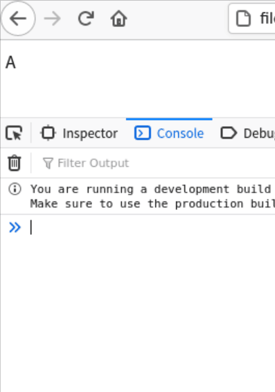
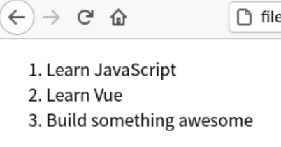

# 组件复用

> 介绍`Vue3.0`中组件复用技术，所有样例可在[GitHub仓库](https://github.com/LittleBee1024/learning_book/tree/main/docs/demos/vue/code/components)中找到

## 渲染控制
### [条件渲染v-if实例](./code/components/v-if)


* [HTML代码](./code/components/v-if/index.html)
    * `v-if`指令根据表达式的真假值来有条件地渲染元素
    ```html
    <div v-if="type === 'A'">
        A
    </div>
    <div v-else-if="type === 'B'">
        B
    </div>
    <div v-else-if="type === 'C'">
        C
    </div>
    <div v-else>
        Not A/B/C
    </div>
    ```

### [循环渲染v-for实例](./code/components/v-for)


* [HTML代码](./code/components/v-for/index.html)
    * `v-for`基于源数据多次渲染元素或模板块，必须使用特定语法`alias in expression`
    ```html
    <li v-for="todo in todos">
         {{ todo.text }}
    </li>
    ```

## 父组件向子组件传递数据

### [v-bind和props实例](./code/components/v-bind)

## 子组件向父组件传送事件

### [v-on和$emit实例](./code/components/v-on)

## 数据监控

### [computed实例](./code/components/computed)

### [watch实例](./code/components/watch)

## 内容分发插槽Slot

### [代码实例](./code/components/slot)

