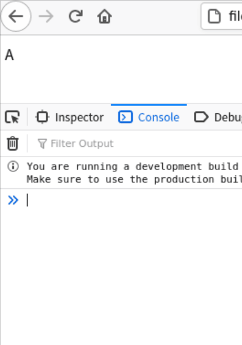
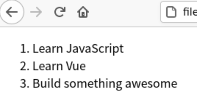
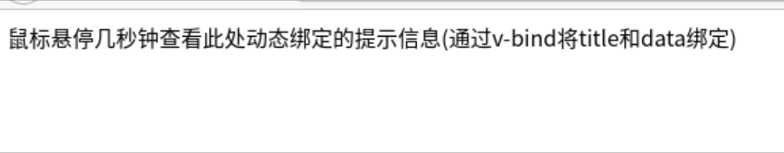

# 组件复用

> 介绍`Vue3.0`中组件复用技术，所有样例可在[GitHub仓库](https://github.com/LittleBee1024/learning_book/tree/main/docs/demos/vue/components/code/)中找到

## 渲染控制
### [条件渲染v-if实例](./code/v-if)


* `v-if`指令根据表达式的真假值来有条件地渲染元素
```html
<div v-if="type === 'A'">
    A
</div>
<div v-else-if="type === 'B'">
    B
</div>
<div v-else-if="type === 'C'">
    C
</div>
<div v-else>
    Not A/B/C
</div>
```

### [循环渲染v-for实例](./code/v-for)


* `v-for`基于源数据多次渲染元素或模板块，必须使用特定语法`alias in expression`
```html
<li v-for="todo in todos">
    {{ todo.text }}
</li>
```

## 数据传递

### [v-bind实例](./code/v-bind)


* `v-bind`可以地绑定一个或多个attribute，或绑定一个组件prop到表达式，可以通过`:`进行缩写，详情参考[文档](https://v3.cn.vuejs.org/api/directives.html#v-bind)
* 以下是常见的`v-bind`例子：
```html
<!-- 绑定 attribute -->


<!-- 动态 attribute 名 -->
<button v-bind:[key]="value"></button>

<!-- 缩写 -->


<!-- 动态 attribute 名缩写 -->
<button :[key]="value"></button>

<!-- 内联字符串拼接 -->


<!-- class 绑定 -->
<div :class="{ red: isRed }"></div>
<div :class="[classA, classB]"></div>
<div :class="[classA, { classB: isB, classC: isC }]"></div>

<!-- style 绑定 -->
<div :style="{ fontSize: size + 'px' }"></div>
<div :style="[styleObjectA, styleObjectB]"></div>

<!-- 绑定一个全是 attribute 的对象 -->
<div v-bind="{ id: someProp, 'other-attr': otherProp }"></div>

<!-- prop 绑定。"prop" 必须在 my-component 声明 -->
<my-component :prop="someThing"></my-component>

<!-- 将父组件的 props 一起传给子组件 -->
<child-component v-bind="$props"></child-component>
```

### [props实例](./code/props)
* 我们可以在组件内定义`props`，用以接受父组件通过`v-bind`传入的数据，从而更好地实现组件的复用，所有的`prop`都使得其父子 prop 之间形成了一个**单向下行绑定**，详细例子可以参考[官方文档](https://v3.cn.vuejs.org/guide/component-props.html)

### [v-model实例](./code/v-model)
* 在Vue3中，自定义组件上的`v-model`相当于传递了`modelValue`prop并接收抛出的`update:modelValue`事件
    * 下面的[例子](./code/v-model/internal)中，`CustomInput`会接受`input`事件，向父组件抛出`update:modelValue`事件，并附加input内容`$event.target.value`，其中`$event`是原始的DOM事件。这样HTML代码就可以通过`<custom-input v-model="searchText"></custom-input>`将`searchText`和`input`的内容及事件进行绑定。
    ```js
    const CustomInput = {
        props: ['modelValue'],
        emits: ['update:modelValue'],
        template:`
            <input
                :value="modelValue"
                @input="$emit('update:modelValue', $event.target.value)"
            />
        `
    }
    ```
* [v-model实例](./code/v-model)展示了`v-model`绑定不同input组件的方式

## 事件传送

### [v-on实例](./code/v-on)
* [`v-on`](https://v3.cn.vuejs.org/api/directives.html#v-on)指令用于绑定事件监听器，绑定的监听器可以接受原生的DOM事件`$event`作为参数，并通过事件修饰符控制触发事件行为
```html
<!-- 阻止单击事件继续冒泡 -->
<button @click.stop="say($event, 'button_clicked')">Click_With_Stop</button>
```

### [$emit实例](./code/emits)
通过`v-bind和props`，父组件可以将数据传递到子组件；同样，通过`v-on和emits`，子组件可以抛出事件到父组件

* [JS代码](docs/demos/vue/components/code/emits/index.js)
    * `this.$emit("increment-count")`抛出了`increment-count`事件，可以通过`v-on:increment-count`绑定事件监听器
    ```js
    const ChildComponent = {
    emits: ['increment-count'],
    template: `
        <div>
            <button @click='this.$emit("increment-count")'>click me</button>
        </div>
    `
    }
    ```

## 数据监控

### [computed实例](./code/computed)

### [watch实例](./code/watch)

## 内容分发

### [slot实例](./code/slot)

