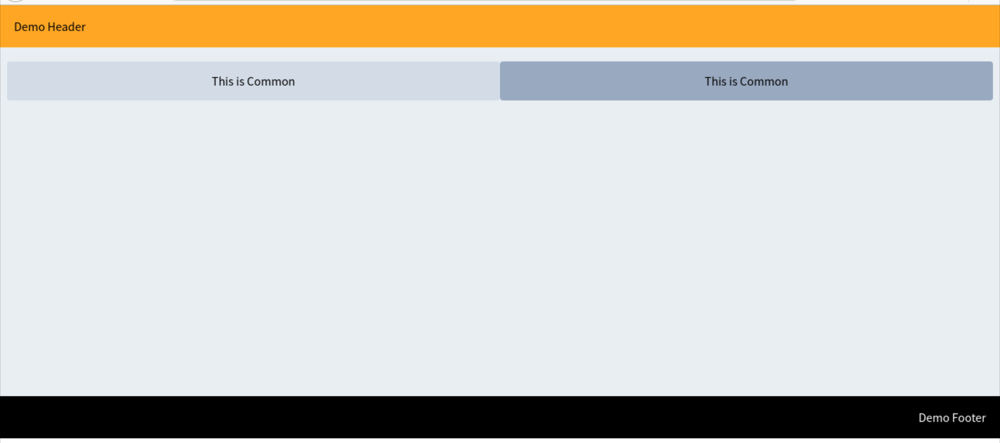
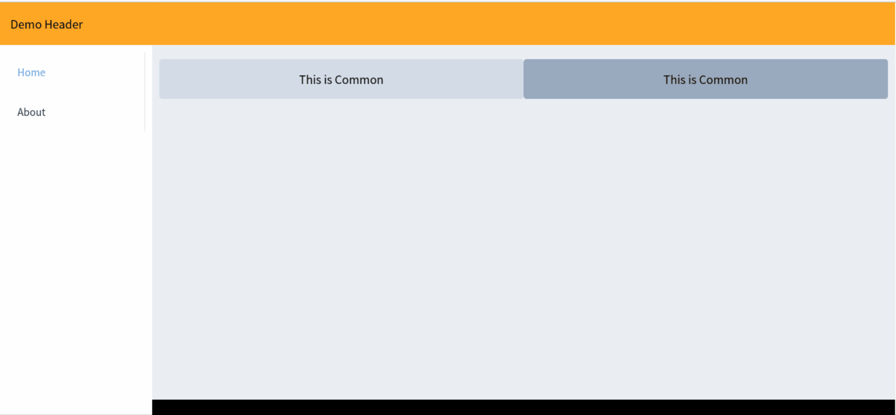

# 样例模板

> 基于[Vue3.0](https://v3.cn.vuejs.org/)+[Element Plus](https://element-plus.gitee.io/zh-CN/)的模板，所有代码可在[GitHub仓库](https://github.com/LittleBee1024/learning_book/tree/main/docs/demos/vue/demo/code)中找到

## [单页面模板](./code/single_page)



### 代码组织
```sh
└── single_page                 # 根目录
    ├── css                     # CSS目录
    │   └── index.css
    ├── index.html              # HTML主页
    ├── index.js                # JS代码入口
    └── js                      # JS代码目录
        ├── common              # 公共组件
        │   ├── index.html
        │   └── index.js
        ├── footer              # 页脚组件
        │   ├── index.html
        │   └── index.js
        ├── header              # 页眉组件
        │   ├── index.html
        │   └── index.js
        ├── home                # 主页面
        │   ├── index.html
        │   └── index.js
        └── index.js            # 根组件
```

## [多页面模板](./code/multi_page)



### 代码组织
```sh
.
└── multi_page              # 根目录
    ├── css                 # CSS目录
    │   └── index.css
    ├── index.html          # HTML主页
    ├── index.js            # JS代码入口
    └── js                  # JS代码目录
        ├── about           # About页面
        │   ├── index.html
        │   └── index.js
        ├── common          # 公共组件
        │   ├── index.html
        │   └── index.js
        ├── footer          # 页脚组件
        │   ├── index.html
        │   └── index.js
        ├── header          # 页眉组件
        │   ├── index.html
        │   └── index.js
        ├── home            # Home页面
        │   ├── index.html
        │   └── index.js
        └── index.js        # 根组件
```
