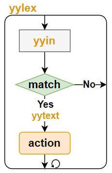
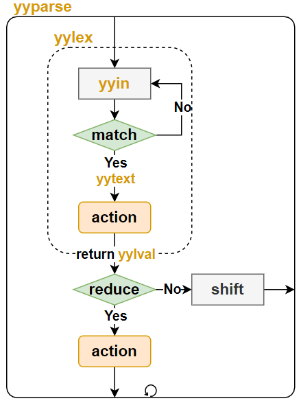

# Flex和Bison

> Flex和Bison工具的样例，所有样例可在[GitHub仓库](https://github.com/LittleBee1024/learning_book/tree/main/docs/topics/flex_bison/code)中找到

## 简介

在编译器领域，分为两个部分：

* 词法分析(lexical analysis, 或scanning)
    * 把输入分割成一个个有意义的词块
* 语法分析(syntax analysis, 或parsing)
    * 确定这些记号是如何彼此关联的

Flex用于词法分析，而Bison用于语法分析。

### Flex

Flex的目的是将输入分割成一个个有意义的词块，用户通过调用Flex自动生成的`yylex`函数，即可启动词法分析工作。下图是其常见的工作流程：

* 通过`yyin`读入用户的输入，默认情况下是标准输入`stdin`，用户可以自定义为其他输入源
* 将输入和用户定义的词法规则(正则表达式)进行比较`match`
* 如果输入匹配某条规则，触发用户定义的动作`action`，用户可通过`yytext`获取匹配的字符串
* 如果输入没有匹配的规则，或则`action`完成(没有退出`yylex`函数的语句)，重新处理新的输入
* `yylex`函数会一直循环上面的步骤，直到没有更多的输入(遇到EOF)



当遇到多个规则同时匹配时，Flex遵循以下规则选择最合适的规则：

* 匹配尽可能多给的字符串
* 如果匹配字符串长度相同，选择在程序中更早出现的规则

### Bison

Bison的目的是将相关的词块进行规约`reduce`，得到新的语义。语法分析依赖于词法分析，用户通过调用Bison自动生成的`yyparse`函数，即可同时启动词法/语法分析工作。下图是其常见的工作流程：

* `yyparse`调用`yylex`，在匹配到某个期望的词块后，通过`yylval`传递此词块内容
    * 语法分析器会定义其期望的记号`token`，当发生匹配时，`yylex`会在其动作`action`中返回此记号`token`，从而将工作流程交给语法分析器
* 语法分析器将新的记号`token`和栈中先前的记号结合，去匹配用户定义的语法规则
* 如果某条语法规则匹配，则开始归约`reduce`动作
    * 此时会调用用户定义的语法动作，将多个记号规约为一个新的记号
    * 新的记号也会触发语法规则匹配，直到无法匹配任何语法规则
* 如果没有语法规则匹配，则开始移进`shift`动作，将新的符号入栈，结束此次语法分析
* `yyparse`函数会一直循环上面的步骤，直到没有更多的输入(遇到EOF)，或发现语法错误



当同一个记号可以匹配两条不同规则的时候，就发生了归约错误。默认情况下，Bison采用LALR(1)算法来分析语法，即自左向右向前查看一个记号。因此，默认情况下，不能处理需要向前查看多个记号才能确定匹配规则的语法。
```
phrase: cart_animal AND CART
      | work_animal AND PLOW
cart_animal: HORSE | GOAT
work_animal: HORSE | OX
```
例如，上面的语法虽然没有歧义，但是对于`HORSE AND CART`输入，在看到`CART`之前无法确定`HORSE`是一个`cart_animal`还是一个`work_animal`，从而发生语法错误。但是，如果将上述语法修改如下，就不会出现归约错误：
```
phrase: cart_animal CART
      | work_animal PLOW
cart_animal: HORSE | GOAT
work_animal: HORSE | OX
```

## Flex例子

[例子"flex_c_wc"](https://github.com/LittleBee1024/learning_book/tree/main/docs/topics/flex_bison/code/flex_c_wc)利用Flex实现了一个C代码分析器，可以统计某段C代码的代码行数、注释行数、`if`语句数等。

### 词法规则

```cpp
%{
#include "lexer.h"
#define YY_DECL int c_wc_lex(Lexer *lex)   // flex C API is wrapped Lexer class
%}

%option noyywrap
%option nounput

LineCommentStart     \/\/
BlockCommentStart    \/\*
BlockCommentEnd      \*\/
If                   if
Loop                 for|while
NewLine              \n
Blank                [ \t]

%x LINE_CMT
%x BLOCK_CMT

%%

<INITIAL>{LineCommentStart}            { BEGIN LINE_CMT; }
<INITIAL>{BlockCommentStart}           { BEGIN BLOCK_CMT; }

<INITIAL>{If}                          { lex->upIfNum(); }
<INITIAL>{Loop}                        { lex->upLoopNum(); }

<INITIAL>^{NewLine}                    |
<INITIAL>^{Blank}*{NewLine}            { lex->upEmptyLineNum(); }
<INITIAL>{NewLine}                     { lex->upCodeLineNum(); }

<LINE_CMT>{NewLine}                    { lex->upCommentLineNum(); BEGIN INITIAL; }

<BLOCK_CMT>{BlockCommentEnd}{NewLine}? { lex->upCommentLineNum(); BEGIN INITIAL; }
<BLOCK_CMT>{NewLine}                   { lex->upCommentLineNum(); }

<INITIAL,LINE_CMT,BLOCK_CMT>.          ; // any character (byte) except newline

%%
```
上面是这个例子的词法规则，由`%%`符号分成三个部分：

* 定义部分
    * `%{`和`%}`的内容会被拷贝到`yylex`之前，用于包含相关头文件和声明相关变量
        * 例子中，利用`YY_DECL`宏修给`yylex`函数添加了`Lexer`类指针参数。因此，我们可以将所有词法操作都封装在`Lexer`类中，以简化用户接口
    * `%option`提供了不同的配置选项
        * `%option noyywrap`表示不需要自定义的`yywarp`函数，进行依次文件扫描
        * `%option noinput`表示不添加`input`函数，以消除编译警告`warning: ‘input’ defined but not used`
        * `%option nounput`表示不添加`yyunput`函数，以消除编译警告`warning: ‘yyunput’ defined but not used`
    * `<NAME> <expression>`可以对正则表达式进行命名
    * 定义状态，对规则进行状态分类，只匹配当前状态的规则
        * 词法分析器从状态0开始，也称为`INITIAL`状态
        * 其他状态通过`%x`或者`%s`来命名，两者的区别参考[文档](https://www.cs.virginia.edu/~cr4bd/flex-manual/Start-Conditions.html#Start-Conditions)
        * 通过`BEGIN <satename>`可切换状态
* 规则部分
    * 每条规则都有自己对于的状态，默认状态为`INITIAL`状态
        * 例子中大部分规则都是互斥了，只有最后一条规则被三个状态共享
    * 当规则满足时，对应的动作被触发
        * 例子中将对应动作都封装在了`LEXER`类的成员函数中了
* 用户例程
    * 此部分的内容会被原样拷贝到C文件中
        * 例子中将代码单独放到了其他文件中，所以此部分为空

## Bison例子

## 参考

* [《flex与bison》](https://1drv.ms/b/s!AkcJSyT7tq80eo_xy7LTpX6PPs4)
* [Flex Manual](https://www.cs.virginia.edu/~cr4bd/flex-manual/index.html#SEC_Contents)
* [Bison Manual](https://www.gnu.org/software/bison/manual/bison.html)
