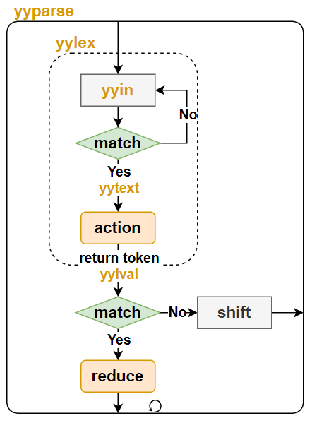

# Flex和Bison

> Flex和Bison工具的样例，所有样例可在[GitHub仓库](https://github.com/LittleBee1024/learning_book/tree/main/docs/topics/flex_bison/code)中找到

## 简介

在编译器领域，分析工作分为两个部分：

* 词法分析(lexical analysis, 或scanning)
    * 把输入分割成一个个有意义的词块
* 语法分析(syntax analysis, 或parsing)
    * 确定这些记号是如何彼此关联的

Flex用于词法分析，而Bison用于语法分析。

### Flex

Flex的目的是将输入分割成一个个有意义的词块，用户通过调用Flex自动生成的`yylex`函数，即可启动词法分析工作。下图是其常见的工作流程：

* 通过`yyin`读入用户的输入，默认情况下是标准输入`stdin`，用户可以自定义为其他输入源
* 将输入和用户定义的词法规则(正则表达式)进行比较`match`
* 如果输入匹配某条规则，触发用户定义的动作`action`，用户可通过`yytext`获取匹配的字符串
* 如果输入没有匹配的规则，或则`action`完成(没有退出`yylex`函数的语句)，重新处理新的输入
* `yylex`函数会一直循环上面的步骤，直到没有更多的输入(遇到EOF)


当遇到多个规则同时匹配时，Flex遵循以下规则选择最合适的规则：

* 匹配尽可能多给的字符串
* 如果匹配字符串长度相同，选择在程序中更早出现的规则

### Bison

Bison的目的是将相关的词块进行规约`reduce`，得到新的语义。语法分析依赖于词法分析，用户通过调用Bison自动生成的`yyparse`函数，即可同时启动词法/语法分析工作。下图是其常见的工作流程：

* `yyparse`调用`yylex`，在匹配到某个期望的词块后，通过`yylval`传递此词块内容
    * 语法分析器会定义其期望的记号`token`，当发生匹配时，`yylex`会在其动作`action`中返回此记号`token`，从而将工作流程交给语法分析器
* 语法分析器将新的记号`token`和栈中先前的记号结合，去匹配用户定义的语法规则
* 如果某条语法规则匹配，则开始归约`reduce`动作
    * 此时会调用用户定义的语法动作，将多个记号规约为一个新的记号
    * 新的记号也会触发语法规则匹配，直到无法匹配任何语法规则
* 如果没有语法规则匹配，则开始移进`shift`动作，将新的符号入栈，结束此次语法分析
* `yyparse`函数会一直循环上面的步骤，直到没有更多的输入(遇到EOF)，或发现语法错误



当同一个记号可以匹配两条不同规则的时候，就发生了归约错误。默认情况下，Bison采用LALR(1)算法来分析语法，即自左向右向前查看一个记号。因此，默认情况下，不能处理需要向前查看多个记号才能确定匹配规则的语法。
```
phrase: cart_animal AND CART
      | work_animal AND PLOW
cart_animal: HORSE | GOAT
work_animal: HORSE | OX
```
例如，上面的语法虽然没有歧义，但是对于`HORSE AND CART`输入，在看到`CART`之前无法确定`HORSE`是一个`cart_animal`还是一个`work_animal`，从而发生语法错误。但是，如果将上述语法修改如下，就不会出现归约错误：
```
phrase: cart_animal CART
      | work_animal PLOW
cart_animal: HORSE | GOAT
work_animal: HORSE | OX
```

## Flex例子

[例子"flex_c_wc"](https://github.com/LittleBee1024/learning_book/tree/main/docs/topics/flex_bison/code/flex_c_wc)利用Flex实现了一个C代码分析器，可以统计某段C代码的代码行数、注释行数、`if`语句数等。

### 词法规则

```cpp title="c_wc.lex"
%{
#include "lexer.h"
#define YY_DECL int c_wc_lex(Lexer *lex)   // flex C API is wrapped Lexer class
%}

%option noyywrap
%option nounput

LineCommentStart     \/\/
BlockCommentStart    \/\*
BlockCommentEnd      \*\/
If                   if
Loop                 for|while
NewLine              \n
Blank                [ \t]

%x LINE_CMT
%x BLOCK_CMT

%%

<INITIAL>{LineCommentStart}            { BEGIN LINE_CMT; }
<INITIAL>{BlockCommentStart}           { BEGIN BLOCK_CMT; }

<INITIAL>{If}                          { lex->upIfNum(); }
<INITIAL>{Loop}                        { lex->upLoopNum(); }

<INITIAL>^{NewLine}                    |
<INITIAL>^{Blank}*{NewLine}            { lex->upEmptyLineNum(); }
<INITIAL>{NewLine}                     { lex->upCodeLineNum(); }

<LINE_CMT>{NewLine}                    { lex->upCommentLineNum(); BEGIN INITIAL; }

<BLOCK_CMT>{BlockCommentEnd}{NewLine}? { lex->upCommentLineNum(); BEGIN INITIAL; }
<BLOCK_CMT>{NewLine}                   { lex->upCommentLineNum(); }

<INITIAL,LINE_CMT,BLOCK_CMT>.          ; // any character (byte) except newline

%%
```
上面的代码是例子中的词法规则([c_wc.lex](./code/flex_c_wc/c_wc.lex))，由`%%`符号分成三个部分：

* 定义部分
    * `%{`和`%}`的内容会被拷贝到`yylex`之前，用于包含相关头文件和声明相关变量
        * 例子中，利用`YY_DECL`宏修给`yylex`函数添加了`Lexer`类指针参数。因此，我们可以将所有词法操作都封装在`Lexer`类中，以简化用户接口
    * `%option`提供了不同的配置选项
        * `%option noyywrap`表示不需要自定义的`yywarp`函数，进行依次文件扫描
        * `%option noinput`表示不添加`input`函数，以消除编译警告`warning: ‘input’ defined but not used`
        * `%option nounput`表示不添加`yyunput`函数，以消除编译警告`warning: ‘yyunput’ defined but not used`
    * `<NAME> <expression>`可以对正则表达式进行命名
    * 定义状态，对规则进行状态分类，只匹配当前状态的规则
        * 词法分析器从状态0开始，也称为`INITIAL`状态
        * 其他状态通过`%x`或者`%s`来命名，两者的区别参考[文档](https://www.cs.virginia.edu/~cr4bd/flex-manual/Start-Conditions.html#Start-Conditions)
        * 通过`BEGIN <statename>`可切换状态
* 规则部分
    * 每条规则都有自己对于的状态，默认状态为`INITIAL`状态
        * 例子中大部分规则都是互斥了，只有最后一条规则被三个状态共享
    * 当规则满足时，对应的动作被触发
        * 例子中将对应动作都封装在了`LEXER`类的成员函数中了
* 用户例程
    * 此部分的内容会被原样拷贝到C文件中
        * 例子中将代码单独放到了其他文件中，所以此部分为空

### 用户代码

```cpp title="lexer.cpp/h" hl_lines="2 4 9 15"
// c_wc_in是yyin的别名，由Flex工具自动生成
extern FILE *c_wc_in;
// c_wc_lex是yylex的别名，由Flex工具自动生成
extern int c_wc_lex(Lexer *lex);

Lexer::Lexer(const char *fname)
{
    // 指定输入来自文件`fname`
    c_wc_in = fopen(fname, "r");
}

void Lexer::count()
{
    // 启动词法分析
    c_wc_lex(this);
}

// 下面的函数会在对应规则(查看词法规则文件)匹配时被调用
void Lexer::upCodeLineNum() { m_codeLineNum++; };
void Lexer::upCommentLineNum() { m_commentLineNum++; };
void Lexer::upEmptyLineNum() { m_emptyLineNum++; };
void Lexer::upIfNum() { m_ifNum++; }
void Lexer::upLoopNum() { m_loopNum++; }
```

上面是例子中的用户代码["lexer.cpp"](./code/flex_c_wc/lexer.cpp)，通过`Lexer`类，封装了所有的词法分析操作。从而，在使用词法分析器时，只需要如下操作即可：
```cpp title="main.cpp" hl_lines="4 5"
int main(int argc, char *argv[])
{
    ...
    Lexer lex(filename);
    lex.count();
    return 0;
}
```
```bash
> ./main test.c 
The statistics of the source code:
        Code line number: 10, comment line number: 5, empty line number: 5
        If number: 2, loop number: 1
```

## Bison例子

[例子"bison_calc"](https://github.com/LittleBee1024/learning_book/tree/main/docs/topics/flex_bison/code/bison_calc)利用Bison和Flex实现了一个计算器，支持加、减、乘、除、括号等符号的算术运算。

### 语法规则

```cpp title="calc.y"
%{
#include <stdio.h>
#include <stdlib.h>
#include <string.h>

#include "calc.h"

// 定义token的类型为NodePtr，即yylval的类型
#define YYSTYPE NodePtr
// 声明词法分析函数，calc_lex是yylex的别名
extern int calc_lex(Calc*);
// calc_lineno是yylineno的别名，表示行号
// 通过`%option yylineno`使能后，由词法分析器自动生成
extern int calc_lineno;
// calc_error是yyerror的别名，语法分析器在遇到错误时被调用，需要用户自定义
void calc_error(Calc *calc, const char *str)
{
   fprintf(stderr, "Error at line %d: %s\n", calc_lineno, str);
}

%}

%lex-param { Calc *calc }
%parse-param { Calc *calc }

%token ADD SUB MUL DIV LBRACE RBRACE NUM EOL

/* All operators are left associative. Listed from lowest to highest */
%left ADD SUB
%left MUL DIV

%%

calclist: /* empty */
   | calclist exp EOL   { calc->evalExpr($2); }
   | calclist EOL       ;
   ;

exp: factor
   | exp ADD factor { $$ = calc->createNode(t_ADD, $1, $3); }
   | exp SUB factor { $$ = calc->createNode(t_SUB, $1, $3); }
   ;

factor: term
   | factor MUL term { $$ = calc->createNode(t_MUL, $1, $3); }
   | factor DIV term { $$ = calc->createNode(t_DIV, $1, $3); }
   ;

term: NUM { $$ = $1; }
   | LBRACE exp RBRACE { $$ = $2; }
   | SUB term { $$ = calc->createNode(t_MINUS, $2, nullptr); }
   ;

%%

```

上面的代码是例子中的语法规则([calc.y](./code/bison_calc/calc.y))，由`%%`符号分成三个部分：

* 定义部分
    * `%{`和`%}`内定义C代码
    * `%lex-param`为`yylex`函数添加参数
    * `%parse-param`为`yyparse`函数添加参数
    * `%token`定义记号
        * 在语法分析器的规则部分，可引用此记号
        * 词法分析器匹配到此词块时，返回此记号
    * `%left`表示左结合，详情参见["优先级和结合性"](#_5)章节
* 规则部分
    * 语义动作可以通过一个美元符号加上一个数字来使用规则中语法符号所关联的值
    * `$$`指向左部符号，也就是规则中冒号左边的符号的值
    * 没有语义动作的规则，使用默认动作：`{ $$ = $1;}`
* 用户例程
    * 例子中将代码单独放到了其他文件中，所以此部分为空

#### 优先级和结合性

`%left`、`%right`和`%nonassoc`分别使得一个操作符遵循左结合、右结合或者没有结合性的操作。在同一行的所有操作符具有相同的优先级。例如，
```
%left '+' '-'
%left '*' '/'
%right POW
```
优先级最低的操作符是+和-，其次是*和/，POW优先级最高。

每条规则也有各自的优先级和结合性，通过`%prec`来声明，如果没有`%prec`子句的话，由最右边的记号的优先级决定。例如，
```
exp: ...
    | exp '-' exp
    ...
    | '-' exp %prec UMINUS
```
`'-' exp`规则的优先级由`UMINUS`的优先级决定，从而和`exp '-' exp`规则的优先级区分开来。

当在存在**移进/归约冲突**时，

* 如果记号的优先级更高，那么就移进
* 如果规则的优先级更高，那么就归约
* 如果两者具有相同的优先级，将检查结合性
    * 左结合，就归约
    * 右结合，就移进

例如，
```
e: 'X'
   | e '+' e
   ;
```
对于`X+X+X`输入，有两种可能的语法分析：

* 先选择归约 - `(X+X)+X`
    * `+`优先级高于`X`优先级
    * 或者，优先级相同，左结合
* 先选择移进操作 - `X+(X+X)`
    * `X`优先级高于`+`优先级
    * 或者，优先级相同，右结合

### 词法规则

```cpp title="calc.lex"
%{
#include "calc.h"
#include "stdlib.h"

// Has to define YYSTYPE before "hcl_yacc_gen.hpp"
#define YYSTYPE NodePtr
#include "calc_yacc_gen.hpp"

extern YYSTYPE calc_lval;
#define YY_DECL int calc_lex(Calc *calc)
%}

%option noinput
%option nounput
%option noyywrap
%option yylineno

EXP ([Ee][-+]?[0-9]+)

%%

[ \r\t\f]               ;
"+"                     { return ADD; }
"-"                     { return SUB; }
"*"                     { return MUL; }
"/"                     { return DIV; }
"("                     { return LBRACE; }
")"                     { return RBRACE; }
[0-9]+"."[0-9]*{EXP}?   |
"."?[0-9]+{EXP}?        { calc_lval = calc->createNode(t_NUM, nullptr, nullptr, atof(calc_text)); return NUM; }
\n                      { return EOL; }
.                       { calc->fail("Bad input character '%s'", calc_text); }
```

上面的代码是例子中的词法规则([calc.lex](./code/bison_calc/calc.lex))，组成部分和[Flex例子](#flex_1)中的词法规则相同。两者的不同点在于，此处每个规则的动作都会通过`return`返回一个记号给语法分析器，从而触发语法分析器进行语法分析。

对于下面这个动作，词法分析器不仅要传递`NUM`类型给语法分析器，还需要通过`calc_lval`（`yylval`的别名）将具体的数值内容传递语法分析器。默认情况下，`yylval`是`int`类型。例子中通过`extern YYSTYPE calc_lval`，将`yylval`定义成了自定义指针类型`NodePtr`，以传递更多的信息：

* `calc_lval = calc->createNode(t_NUM, nullptr, nullptr, atof(calc_text)); return NUM;`

### 用户代码

定义好了语法/词法规则后，还需要对应的规则动作，即当语法/词法规则匹配时，需要触发的函数。为了方便使用，例子中将所有的动作都封装在了`Calc`类中。同时，每个记号的内容统一由`NodePtr`指针记录。

```cpp title="calc.h"
// 六种需要记录内容的记号
enum NodeType : int
{
    t_ADD,
    t_SUB,
    t_MUL,
    t_DIV,
    t_NUM,
    t_MINUS
};
class Node;
typedef Node *NodePtr;
class Node
{
public:
    Node(NodeType t, NodePtr l, NodePtr r, double n) : type(t), left(l), right(r), num(n) {}
    NodeType type;
    NodePtr left;
    NodePtr right;
    double num;
};

class Calc
{
public:
    // 调用yyparse开启语法分析
    void compute();
    // 在语法/词法规则匹配时被调用，用于创建新的记号
    NodePtr createNode(NodeType type, NodePtr left, NodePtr right, double num = 0);
    // 在语法分析的最后阶段被调用，参见语法规则
    void evalExpr(NodePtr expr);
    ...
};
```

一切准备就绪后，用户需要利用`Calc`这个类，就可以完成算术运算：

```cpp title="main.cpp" hl_lines="5 6"
int main(int argc, char *argv[])
{
    ...
    const char *filename = (argc == 1) ? nullptr : argv[1];
    Calc calc(filename);
    calc.compute();
    return 0;
}
```
```bash
> ./main test.txt 
(2.01+(1.01*0.1)) = 2.111
((1+2)*3) = 9
```


## 参考

* [《flex与bison》](https://1drv.ms/b/s!AkcJSyT7tq80eo_xy7LTpX6PPs4)
* [Flex Manual](https://www.cs.virginia.edu/~cr4bd/flex-manual/index.html#SEC_Contents)
* [Bison Manual](https://www.gnu.org/software/bison/manual/bison.html)
