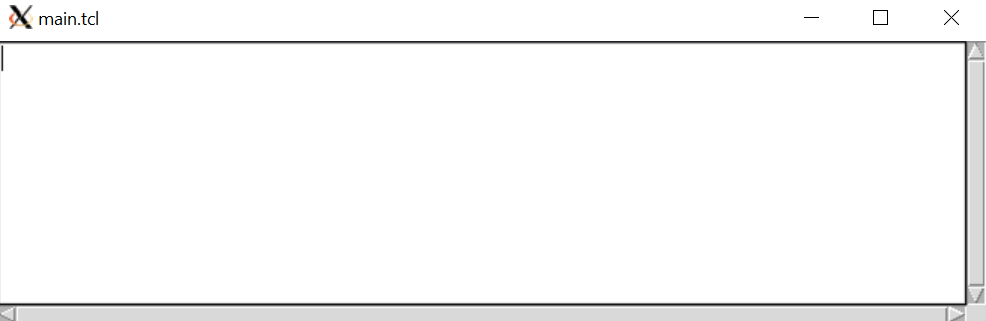
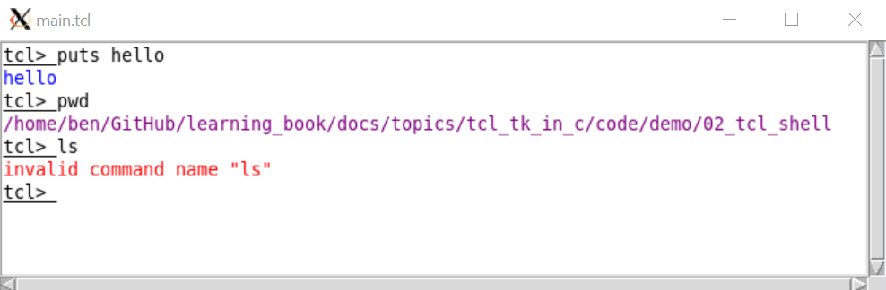
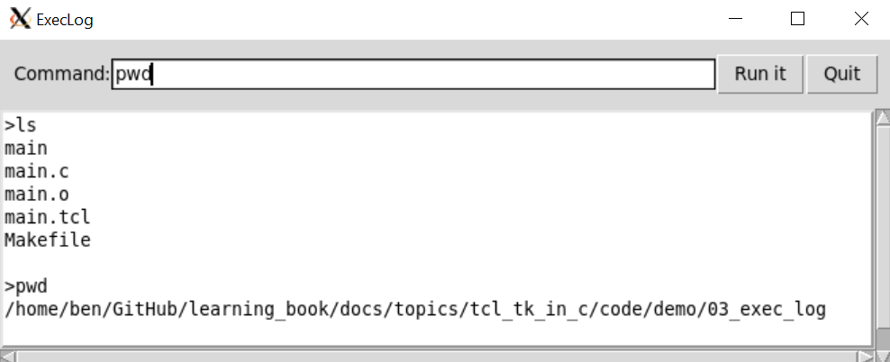
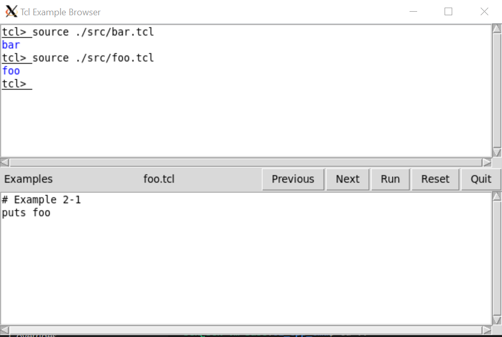

# Tcl/Tk in C

> 本文包含将`tcl/tk`集成进C代码的简单样例。样例依赖`tcl/tk8.6`开发库，如发现编译错误，需要安装`tcl-dev`和`tk-dev`，并在`Makefile`中修改对应的头文件和库文件路径。例如，在`ubuntu20`下通过`sudo apt install tcl tk tcl-dev tk-dev`即可完成安装。所有样例可在[GitHub仓库](https://github.com/LittleBee1024/learning_book/tree/main/docs/topics/tcl_tk_in_c/code)中找到，大部分代码都参考了[《Practical Programming in Tcl and Tk》](https://1drv.ms/u/s!AkcJSyT7tq80feibH0jz3d0nn7s)中的例子

## C接口

### Tcl_Main
[例子"Tcl_Main"](https://github.com/LittleBee1024/learning_book/tree/main/docs/topics/tcl_tk_in_c/code/api/Tcl_Main)在`main`函数中调用了`Tcl_Main`启动了一个TCL解释器，会解析并运行`argv`中传入的TCL文件"hello.tcl"，在终端打印“hello”字样：

```cpp title="main.c" hl_lines="3 11"
int Tcl_AppInit(Tcl_Interp *interp)
{
    if (Tcl_Init(interp) == TCL_ERROR)
        return TCL_ERROR;

    return TCL_OK;
}

int main(int argc, char *argv[])
{
    Tcl_Main(argc, argv, Tcl_AppInit);
    return 0;
}
```
```bash
# hello.tcl:
#   puts "hello"
> ./main hello.tcl
hello
```

### Tk_Main
[例子"Tk_Main"](https://github.com/LittleBee1024/learning_book/tree/main/docs/topics/tcl_tk_in_c/code/api/Tk_Main)在`main`函数中调用了`Tk_Main`启动了一个TCL/TK解释器，会解析并运行`argv`中传入的TCL/TK文件"hello.tcl"，打开一个带“Hello, world!”字样的按钮：
```cpp title="main.c" hl_lines="3 5 13"
int AppInit(Tcl_Interp *interp)
{
    if (Tcl_Init(interp) == TCL_ERROR)
        return TCL_ERROR;
    if (Tk_Init(interp) == TCL_ERROR)
        return TCL_ERROR;

    return TCL_OK;
}

int main(int argc, char *argv[])
{
    Tk_Main(argc, argv, AppInit);
    return 0;
}
```
```bash
# hello.tcl:
#   button .b -text "Hello, world!" -command exit
#   pack .b
> ./main hello.tcl
```


### Tcl_EvalFile
[例子"Tcl_EvalFile"](https://github.com/LittleBee1024/learning_book/tree/main/docs/topics/tcl_tk_in_c/code/api/Tcl_EvalFile)和[例子"Tcl_Main"](https://github.com/LittleBee1024/learning_book/tree/main/docs/topics/tcl_tk_in_c/code/api/Tcl_Main)功能相同，都会产生一个可执行TCL命令的C程序。不同的是，例子"Tcl_EvalFile"不是利用`Tcl_Main`函数实现的，而是利用了更底层的`Tcl_CreateInterp`和`Tcl_EvalFile`函数：
```cpp title="main.c" hl_lines="3 4"
int main(int argc, char *argv[])
{
   Tcl_Interp *interp = Tcl_CreateInterp();
   int code = Tcl_EvalFile(interp, argv[1]);
   const char *result = Tcl_GetStringResult(interp);
   printf("Result was: %s\n", result);
   Tcl_DeleteInterp(interp);
   return 0;
}
```
```bash
# hello.tcl
#   proc helloWorld {} {
#       puts "Hello, World!"
#       return 1
#   }
#   helloWorld
> ./main hello.tcl
Hello, World!
Result was: 1
```

### Tcl_CreateCommand
[例子"Tcl_CreateCommand"](https://github.com/LittleBee1024/learning_book/tree/main/docs/topics/tcl_tk_in_c/code/api/Tcl_CreateCommand)利用C库的`random`函数，创建了一个TCL命令`random`，可在TCL文件中使用此命令，完成了C代码和TCL代码的交互：

```cpp title="main.c" hl_lines="15 21"
// 参考:《Practical Programming in Tcl and Tk》第47章的"A C Command Procedure"
int RandomCmd(ClientData clientData, Tcl_Interp *interp, int argc, CONST char *argv[])
{
    int range = 0;
    char buffer[20];
    ...
    printf("[  C] Process random()\n");
    int rand = random();
    if (range != 0)
    {
        rand = rand % range;
    }
    sprintf(buffer, "%d", rand);
    // TCL_VOLATILE用于局部遍历的析构，将结果以字符串的形式返回
    Tcl_SetResult(interp, buffer, TCL_VOLATILE);
    return TCL_OK;
}

int Random_Init(Tcl_Interp *interp)
{
    Tcl_CreateCommand(interp, "random", RandomCmd, (ClientData)NULL, (Tcl_CmdDeleteProc *)NULL);
    return TCL_OK;
}

int main(int argc, char *argv[])
{
    Tcl_Main(argc, argv, Random_Init);
    return 0;
}
```
```bash
# cmd.tcl:
#   set result [random 5]
#   puts "\[TCL\] random result: ${result}"
#   set result [random 100]
#   puts "\[TCL\] random result: ${result}"
> ./main cmd.tcl
[  C] Process random()
[TCL] random result: 3
[  C] Process random()
[TCL] random result: 86
```

### Tcl_CreateObjCommand
[例子"Tcl_CreateObjCommand"](https://github.com/LittleBee1024/learning_book/tree/main/docs/topics/tcl_tk_in_c/code/api/Tcl_CreateObjCommand)和[例子"Tcl_CreateCommand"](https://github.com/LittleBee1024/learning_book/tree/main/docs/topics/tcl_tk_in_c/code/api/Tcl_CreateCommand)功能类似，但使用了另一种创建TCL命令的方式`Tcl_CreateObjCommand`：
```cpp title="main.c" hl_lines="6 12 13 19"
// 参考:《Practical Programming in Tcl and Tk》第47章的"A C Command Procedure"
int RandomObjCmd(ClientData clientData, Tcl_Interp *interp, int objc, Tcl_Obj *CONST objv[])
{
    Tcl_Obj *resultPtr;
    int range = 0;
    Tcl_GetIntFromObj(interp, objv[1], &range);
    int rand = random();
    if (range != 0)
    {
        rand = rand % range;
    }
    resultPtr = Tcl_GetObjResult(interp);
    Tcl_SetIntObj(resultPtr, rand);
    return TCL_OK;
}

int Random_Init(Tcl_Interp *interp)
{
    Tcl_CreateObjCommand(interp, "orandom", RandomObjCmd, (ClientData)NULL, (Tcl_CmdDeleteProc *)NULL);
    return TCL_OK;
}
```
```bash
# cmd.tcl:
#   set result [orandom 5]
#   puts "orandom result: ${result}"
#   set result [orandom 100]
#   puts "orandom result: ${result}"
> ./main cmd.tcl
orandom result: 3
orandom result: 86
```

## Tk组件

### 布局

[例子“pack”](https://github.com/LittleBee1024/learning_book/tree/main/docs/topics/tcl_tk_in_c/code/tk/02_pack)利用`pack`命令将Tk组件显示在屏幕上，是最常见的布局方式：
```bash title="main.tcl"
# 参考:《Practical Programming in Tcl and Tk》第23章"The Pack Geometry Manager"
# 1.普通布局
. config -bg black
frame .one -width 40 -height 40 -bg white
pack .one -side top
labelframe .split1 -labelanchor n -text split1 -width 200 -height 20 -bg grey50
pack .split1 -side top

# 2.存在子布局
frame .three -bg white
foreach b {alpha beta gamma} {
   button .three.$b -text $b
   pack .three.$b -side left
}
pack .three -side top
labelframe .split2 -text split2 -width 100 -height 20 -bg grey50
pack .split2 -side top

# 3.存在三层布局
frame .five -bg white
foreach b {alpha beta} {
   button .five.$b -text $b
   pack .five.$b -side left
}
frame .five.right
foreach b {delta epsilon} {
   button .five.right.$b -text $b
   pack .five.right.$b -side bottom
}
pack .five.right -side right
pack .five -side top
labelframe .split3 -text split3 -width 200 -height 20 -bg grey50
pack .split3 -side top

# 4. fill填充
frame .menubar -bg white
foreach b {alpha beta} {
   button .menubar.$b -text $b
}
pack .menubar.alpha -side left
pack .menubar.beta -side right
pack .menubar -side top -fill x
labelframe .split4 -text split4 -height 20 -bg grey50
pack .split4 -fill x
```


除了`pack`布局方式外，还可以用`grid`进行布局，如[例子“grid”](https://github.com/LittleBee1024/learning_book/tree/main/docs/topics/tcl_tk_in_c/code/tk/03_grid)

```bash title="main.tcl"
# 参考:《Practical Programming in Tcl and Tk》第26章"The Grid Geometry Manager"

foreach color {red orange yellow green blue purple} {
   label .l1$color -text $color -bg white
   frame .f1$color -background $color -width 100 -height 5
   # 放置label和frame
   grid .l1$color .f1$color
   # 调整对齐方式：west
   grid .l1$color -sticky w
   # north south
   grid .f1$color -sticky ns
}

label .lsplit -text --------
frame .fsplit -width 100 -height 20
grid .lsplit .fsplit

foreach color {red orange yellow green blue purple} {
   label .l2$color -text $color -bg white
   frame .f2$color -background $color -width 100 -height 5
   grid .l2$color .f2$color
   # 外部和内部边框
   grid .l2$color -column 1 -sticky w -padx 10 -ipady 5
   grid .f2$color -column 0 -sticky ns -pady 5
}
```


### button

[例子“button”](https://github.com/LittleBee1024/learning_book/tree/main/docs/topics/tcl_tk_in_c/code/tk/01_button)实现了一个简单的按键功能，点击按键可在终端显示“Hello, World!”：

```bash title="main.tcl"
# 将按钮实例存于“$hello_button”，后面对按钮的操作都可以通过“$hello_button”完成
set hello_button [button .hello -text "Hello, world!" -command {puts stdout "Hello, World!"}]
# 配置按钮背景色
$hello_button config -background green
# 将按钮在屏幕上显示
pack $hello_button -padx 20 -pady 10
# 获取按钮的属性
set color [$hello_button cget -background]
puts "hello buttton background: $color"
```


### text

[例子“text"](https://github.com/LittleBee1024/learning_book/tree/main/docs/topics/tcl_tk_in_c/code/tk/04_text)利用`text`Tk组件，实现了一个带滚动条的文本框：
```bash title="main.tcl"
proc Scrolled_Text { f args } {
   frame $f
   eval {text $f.text -wrap none \
      -xscrollcommand [list $f.xscroll set] \
      -yscrollcommand [list $f.yscroll set]} $args
   scrollbar $f.xscroll -orient horizontal -command [list $f.text xview]
   scrollbar $f.yscroll -orient vertical -command [list $f.text yview]
   grid $f.text $f.yscroll -sticky news
   grid $f.xscroll -sticky news
   grid rowconfigure $f 0 -weight 1
   grid columnconfigure $f 0 -weight 1
   return $f.text
}

set log [Scrolled_Text .l -width 80 -height 10]
pack .l
```


## 自定义命令实例

[例子“cpp_cmd"](https://github.com/LittleBee1024/learning_book/tree/main/docs/topics/tcl_tk_in_c/code/demo/01_cpp_cmd)在`C++`中创建了`blob`TCL命令以及其子命令，实现了`C++`和`TCL`的交互编程：
```cpp title="main.cpp" hl_lines="7 8 26 29 39 47"
// 参考:《Practical Programming in Tcl and Tk》第47章的The blob Command Example
int Blob_Init(Tcl_Interp *interp)
{
   if (Tcl_Init(interp) == TCL_ERROR)
      return TCL_ERROR;

   Blob *blobPtr = new Blob();
   Tcl_CreateObjCommand(interp, "blob", BlobCmd, (ClientData)blobPtr, BlobCleanup);

   return TCL_OK;
}

int BlobCmd(ClientData data, Tcl_Interp *interp, int objc, Tcl_Obj *CONST objv[])
{
   const char *subCmds[] = {"add", "find", "remove", nullptr};
   enum BlobIx
   {
      AddIx,   // 4 args
      FindIx,  // 3 args
      RemoveIx // 3 args
   };

   ...
   int index = 0;
   Tcl_GetIndexFromObj(interp, objv[1], subCmds, "option", 0, &index);
   Blob *blobPtr = (Blob *)data;
   switch (index)
   {
   case AddIx:
   {
      const char *name = Tcl_GetString(objv[2]);
      int age = 0;
      if (Tcl_GetIntFromObj(interp, objv[3], &age) != TCL_OK)
         return TCL_ERROR;
      if (blobPtr->add(name, age))
         return TCL_ERROR;
      return TCL_OK;
   }
   case FindIx:
   {
      const char *name = Tcl_GetString(objv[2]);
      int age = blobPtr->find(name);
      Tcl_Obj *resultPtr = Tcl_GetObjResult(interp);
      Tcl_SetIntObj(resultPtr, age);
      return TCL_OK;
   }
   case RemoveIx:
   {
      const char *name = Tcl_GetString(objv[2]);
      blobPtr->remove(name);
      return TCL_OK;
   }
   default:
   {
      Tcl_WrongNumArgs(interp, 1, objv, "wrong sub-cmd");
      return TCL_ERROR;
   }
   }

   return TCL_OK;
}
```
```bash title="main.tcl"
# 执行自定义的“blob”命令
blob add Jack 100
set res1 [blob find Jack]
puts "\[  TCL\] Jack's age is ${res1}"
blob find Tim
blob remove Jack
blob find Jack
blob remove Jack
# 无效命令
blob clear
```
```bash
> ./main cmd.tcl
[ INFO] Construct Blob
[ INFO] Add Jack to the Blob, his age is 100
[ INFO] Find Jack in the Blob, his age is 100
[  TCL] Jack's age is 100
[ WARN] Fail to find Tim in the Blob
[ INFO] Remove Jack from the Blob, his age is 100
[ WARN] Fail to find Jack in the Blob
[ WARN] Cannot remove Jack from the Blob because it doesn't exist
bad option "clear": must be add, find, or remove
    while executing
"blob clear"
    (file "cmd.tcl" line 10)
```


## TCL Shell实例

[例子“tcl_shell"](https://github.com/LittleBee1024/learning_book/tree/main/docs/topics/tcl_tk_in_c/code/demo/02_tcl_shell)实现了一个带界面的TCL解释器：
```bash title="main.tcl"
# 创建一个可以执行TCL命令的窗口，主要涉及的章节有：
#  Chapter 36. The Text Widget
#  Chapter 29. Binding Commands to Events

# 带滚动条的文本输入框，传入frame名称和text的配置参数，返回text实例
proc Scrolled_Text { f args } {
   frame $f
   eval {text $f.text -wrap none \
      -xscrollcommand [list $f.xscroll set] \
      -yscrollcommand [list $f.yscroll set]} $args
   scrollbar $f.xscroll -orient horizontal -command [list $f.text xview]
   scrollbar $f.yscroll -orient vertical -command [list $f.text yview]
   grid $f.text $f.yscroll -sticky news
   grid $f.xscroll -sticky news
   grid rowconfigure $f 0 -weight 1
   grid columnconfigure $f 0 -weight 1
   return $f.text
}
# 创建Scrolled_Text实例，返回的是text组件
set t [Scrolled_Text .win -width 80 -height 10]
# 需要放置frame，而不是返回的$t
pack .win -fill both -expand true

# 为text输入框创建不同类型的标签，用于格式化，参见“Text Tags”章节
$t tag configure prompt -underline true
$t tag configure result -foreground purple
$t tag configure error -foreground red
$t tag configure output -foreground blue

# 创建数组eval，其中，以“prompt”为键值的内容为“tcl> ”
set eval(prompt) "tcl> "
# 在输入框的“insert”位置，插入$eval(prompt)内容，它的格式是标签prompt
$t insert insert $eval(prompt) prompt
# 设置limit标记为当前输入位置，limit和end之间的内容是要执行的TCL命令
$t mark set limit insert
# 设置limit标记的gravity属性为left，这样insert动作就不会改变limit位置
# 默认是right，limit的位置会随insert增加，参见“Mark Gravity”章节
$t mark gravity limit left
# 将光标聚焦在输入框
focus $t
# 设置变量“eval(text)”
set eval(text) $t

# 绑定动作和事件
# 绑定回车事件，触发TCL命令执行动作“EvalTypein”
bind $t <Return> {EvalTypein ; break}
# 绑定回退事件，用于删除字符
bind $t <BackSpace> {
   # %W代表组件的全名称，参见“The bind Command”章节
   # 打印所有标签：[%W tag names] -> sel prompt result error output
   # 判断sel标签在1.0和end范围内是否为空，参见“Text Operations”章节
   if {[%W tag nextrange sel 1.0 end] != ""} {
      # 删除选择的多个字符
      %W delete sel.first sel.last
   } elseif {[%W compare insert > limit]} {
      # 删除当前字符
      %W delete insert-1c
      # 修改显示位置，否则窗口不会滚动显示最新的结果
      %W see insert
   }
   # 不满足上述条件时，不删除任何字符
   break
}
# 绑定输入事件，控制不同位置输入的情况
bind $t <Key> {
   # 判断插入位置是否在活动窗口内(当前行)，参见“Text Indices”章节
   if [%W compare insert < limit] {
      # 插入位置不在当前行，设置插入位置到末尾，这样后面的输入都会添加在最后
      %W mark set insert end
   }
}

# 处理用户输入(TCL命令)，输入为limit标记和end标记间的内容
proc EvalTypein {} {
   global eval
   # 在回车位置换行符
   $eval(text) insert insert \n
   # limit和end之间的所有内容为输入命令，包括上面的换行符号
   set command [$eval(text) get limit end]
   # 判断是否为完整的TCL命令
   if [info complete $command] {
      # 更新limit位置为插入位，前面设置了所有的命令输出结果都会显示在limit位置的左侧
      $eval(text) mark set limit insert
      Eval $command
   }
}

# 执行命令并显示结果
proc Eval {command} {
   global eval
   # 调整插入位置
   $eval(text) mark set insert end
   # 利用“eval(slave)”执行TCL命令
   if [catch {$eval(slave) eval $command} result] {
      # 执行命令出错，用error标签格式化输出
      $eval(text) insert insert $result error
   } else {
      # 正常执行命令，用result标签格式化输出
      $eval(text) insert insert $result result
   }
   # 如果不是行起始位(例如错误命令时)，换行
   if {[$eval(text) compare insert != "insert linestart"]} {
      $eval(text) insert insert \n
   }
   # 输出prompt
   $eval(text) insert insert $eval(prompt) prompt
   $eval(text) see insert
   # 更新limit为当前位置
   $eval(text) mark set limit insert
   return
}

# 创建TCL子解释器
proc SlaveInit {slave} {
   interp create $slave
   interp alias $slave reset {} ResetAlias $slave
   # 通过PutsAlias重写puts命令，将结果输出到界面中，默认是输出到terminal窗口
   interp alias $slave puts {} PutsAlias $slave
   return $slave
}

proc ResetAlias {slave} {
   global eval
   interp delete $slave
   SlaveInit $slave
   # 清空输入框中的所有内容
   $eval(text) delete 1.0 end
}

# 定制化puts命令，将puts的结果输出到当前窗口
proc PutsAlias {slave args} {
   if {[llength $args] > 3} {
      error "invalid arguments"
   }
   set newline "\n"
   if {[string match "-nonewline" [lindex $args 0]]} {
      set newline ""
      set args [lreplace $args 0 0]
   }
   if {[llength $args] == 1} {
      set chan stdout
      set string [lindex $args 0]$newline
   } else {
      set chan [lindex $args 0]
      set string [lindex $args 1]$newline
   }
   if [regexp (stdout|stderr) $chan] {
      # 输出puts的结果
      global eval
      $eval(text) insert limit $string output
      $eval(text) see limit
   } else {
      puts -nonewline $chan $string
   }
}

# 创建TCL解释器，用于执行TCL命令
set eval(slave) [SlaveInit shell]
```


## Exec Log实例

[例子“exec_log"](https://github.com/LittleBee1024/learning_book/tree/main/docs/topics/tcl_tk_in_c/code/demo/03_exec_log)实现了终端执行界面，可运行系统支持的命令，并打印结果：
```bash title="main.tcl"
# 设置窗口标题
wm title . ExecLog

# frame用户组件布局，创建“.top”框架
frame .top -borderwidth 10
# 将“.top”框架水平平铺在顶部
pack .top -side top -fill x

# 在“.top”框架内放置按钮
# “Quit”按钮绑定退出动作
button .top.quit -text Quit -command exit
# “Run it”按钮绑定“Run”动作
set button_run [button .top.run -text "Run it" -command Run]
# 将按钮放置在“.top”框架的右侧
pack .top.quit .top.run -side right

# 在“.top”框架内放置输入框：label + entry
label .top.l -text Command: -padx 0
# 将entry组件输入的内容，绑定在变量“in_command”中
entry .top.cmd -width 20 -relief sunken -textvariable in_command
pack .top.l -side left
# "-expand true"配置可将输入框自动拉伸
pack .top.cmd -side left -fill x -expand true

# 将快捷键绑定在组件，并触发相应动作
bind .top.cmd <Return> Run
bind .top.cmd <Control-c> Stop
# 开始程序后，主动聚焦在.top.cmd上，否则需要先用鼠标聚焦
focus .top.cmd

# 创建“.text”框架，用于文字布局
frame .text
# 在文字布局中，创建text组件，包括水平和竖直方向的滚动条
set log [text .text.log -width 80 -height 10 \
   -borderwidth 2 -relief raised -setgrid true -state normal -wrap none \
   -yscrollcommand {.text.scrolly set} -xscrollcommand {.text.scrollx set}]
scrollbar .text.scrolly -orient vertical -command {.text.log yview}
scrollbar .text.scrollx -orient horizontal -command {.text.log xview}
pack .text.scrolly -side right -fill y
pack .text.scrollx -side bottom -fill x
pack .text.log -side left -fill both -expand true
pack .text -side top -fill both -expand true

# 执行命令
proc Run {} {
   global in_command input log button_run
   # 通过管道执行命令
   if [catch {open "|$in_command"} input] {
      # 发生错误
      $log insert end $input\n
      # 修改显示位置，否则窗口不会滚动显示最新的结果
      $log see insert
   } else {
      # $input是一个文件描述符，设置其可读回调函数Log，用于将执行的结果输出，此步骤为异步
      fileevent $input readable Log
      # 恢复显示框可写
      $log config -state normal
      # 打印执行的命令，由于此时命令还没执行完成，下面的话会打印在命令结果之前
      $log insert end ">$in_command\n"
      # 设置显示框只读
      $log config -state disabled
      # 将按钮文字显示为Stop，表明正则执行命令
      $button_run config -text Running -command Close
   }
}

# 从结果文件描述符$input中读出命令的结果，并打印
# 由于此动作被设置为可读回调函数，只要有结果没有被读出，会一直调用
proc Log {} {
   global input log
   if [eof $input] {
      # 调用结束动作，改变按钮显示内容
      Close
   } else {
      # 恢复显示框可写
      $log config -state normal
      # 从文件描述符中读取一行
      gets $input line
      # 打印一行内容
      $log insert end $line\n
      # 修改显示位置到末尾，否则窗口不会滚动显示最新的结果
      $log see end
      # 设置显示框只读
      $log config -state disabled
   }
}

# 关闭结果文件描述符$input，并恢复按钮显示
proc Close {} {
   global input button_run
   catch {close $input}
   $button_run config -text "Run it" -command Run
}
```



## Browser实例

[例子“browser"](https://github.com/LittleBee1024/learning_book/tree/main/docs/topics/tcl_tk_in_c/code/demo/04_browser)实现了某一目录下的TCL文件浏览器，并结合[“tcl_shell"](https://github.com/LittleBee1024/learning_book/tree/main/docs/topics/tcl_tk_in_c/code/demo/02_tcl_shell)的功能，在一个TCL解释器中运行当前TCL文件：

```bash title="main.tcl"
# 浏览“./src”目录中所有的TCL文件，并可通过一个TCL解释器执行，涉及的章节有：
#  Chapter 30. Buttons and Menus

# 依赖“02_tcl_shell”中的TCL解释器，用于执行目录中的TCL文件
source ../02_tcl_shell/main.tcl
set browse(dir) ./src
wm minsize . 30 5
wm title . "Tcl Example Browser"

# 创建菜单栏
set f [frame .menubar]
pack $f -fill x
button $f.quit -text Quit -command exit
button $f.next -text Next -command Next
button $f.prev -text Previous -command Previous
button $f.load -text Run -command Run
button $f.reset -text Reset -command Reset
pack $f.quit $f.reset $f.load $f.next $f.prev -side right

# 创建标签，用于显示当前打开的TCL文件名
label $f.label -textvariable browse(current)
pack $f.label -side right -fill x -expand true

# 创建多级菜单
menubutton $f.ex -text Examples -menu $f.ex.m
pack $f.ex -side left
set m [menu $f.ex.m]

# 创建文件内容显示窗口
set browse(text) [Scrolled_Text .body -width 80 -height 10 -setgrid true]
pack .body -fill both -expand true

# 遍历文件夹，并记录文件名和标题等
foreach f [lsort -dictionary [glob [file join $browse(dir) *]]] {
   if [catch {open $f} in] {
      puts stderr "Cannot open $f: $in"
      continue
   }
   while {[gets $in line] >= 0} {
      if [regexp {^# Example ([0-9]+)-([0-9]+)} $line \
             x chap ex] {
         lappend examples($chap) $ex
         lappend browse(list) $f
         # 从文件的第一行注释中找到菜单标题
         gets $in line
         set title($chap-$ex) [string trim $line "# "]
         set file($chap-$ex) $f
         close $in
         break
      }
   }
}

# 关闭子菜单的弹出按钮
option add *Menu.tearOff 0
set limit 8
set c 0; set i 0
# 根据上面遍历的结果，创建出多级子菜单
foreach chap [lsort -integer [array names examples]] {
   if {$i == 0} {
      $m add cascade -label "Chapter $chap..." \
         -menu $m.$c
      set sub1 [menu $m.$c]
      incr c
   }
   set i [expr ($i +1) % $limit]
   $sub1 add cascade -label "Chapter $chap" -menu $sub1.sub$i
   set sub2 [menu $sub1.sub$i]
   foreach ex [lsort -integer $examples($chap)] {
      $sub2 add command -label "$chap-$ex $title($chap-$ex)" \
         -command [list Browse $file($chap-$ex)]
   }
}

# 显示文件内容
proc Browse { file } {
   global browse
   set browse(current) [file tail $file]
   set browse(curix) [lsearch $browse(list) $file]
   set t $browse(text)
   # 恢复为可写
   $t config -state normal
   $t delete 1.0 end
   if [catch {open $file} in] {
      $t insert end $in
   } else {
      $t insert end [read $in]
      close $in
   }
   # 更改为只读
   $t config -state disabled
}

# 记录当前显示文件的标号
set browse(curix) -1
# 显示下一个文件
proc Next {} {
   global browse
   if {$browse(curix) < [llength $browse(list)] - 1} {
      incr browse(curix)
   }
   Browse [lindex $browse(list) $browse(curix)]
}
# 显示上一个文件
proc Previous {} {
   global browse
   if {$browse(curix) > 0} {
      incr browse(curix) -1
   }
   Browse [lindex $browse(list) $browse(curix)]
}

# 利用“source <file>.tcl”命令，运行TCL文件
proc Run {} {
   global browse
   EvalEcho [list source [file join $browse(dir) $browse(current)]]
}

# 重置TCL解释器，并清空记录
proc Reset {} {
   EvalEcho reset
}

# 在TCL解释器中执行TCL命令，并打印结果
proc EvalEcho {command} {
   global eval
   $eval(text) mark set insert end
   $eval(text) insert insert $command\n
   $eval(text) mark set limit insert
   Eval $command
}
```


## 参考
* [《Practical Programming in Tcl and Tk》- 4th, Brent Welch, Ken Jones](https://1drv.ms/u/s!AkcJSyT7tq80feibH0jz3d0nn7s)，"Part VI: C Programming"
* [《Tcl and the Tk Toolkit》- John K. Ousterhout](https://1drv.ms/b/s!AkcJSyT7tq80fFnaE5hYkCST6oI)，"PART III Writing Tcl Applications in C"
* [《Tcl/Tk A Developers Guide》- Clif Flynt](https://1drv.ms/b/s!AkcJSyT7tq80e-BG7QjXcXKSlEA)，"Chapter 15 Extending Tcl"

