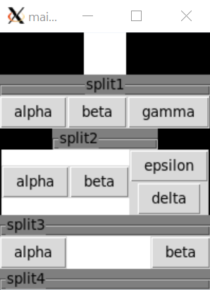
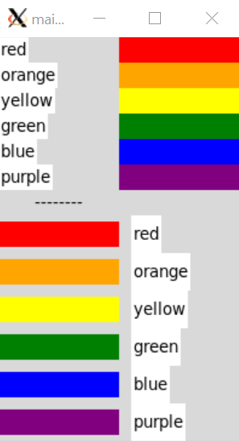
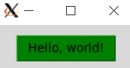

# Tcl/Tk in C

> 本文包含将`tcl/tk`集成进C代码的简单样例。样例依赖`tcl/tk8.6`开发库，如发现编译错误，需要安装`tcl-dev`和`tk-dev`，并在`Makefile`中修改对应的头文件和库文件路径。例如，在`ubuntu20`下通过`sudo apt install tcl tk tcl-dev tk-dev`即可完成安装。所有样例可在[GitHub仓库](https://github.com/LittleBee1024/learning_book/tree/main/docs/topics/tcl_tk_in_c/code)中找到，大部分代码都参考了[《Practical Programming in Tcl and Tk》](https://1drv.ms/u/s!AkcJSyT7tq80feibH0jz3d0nn7s)中的例子

## C接口

### Tcl_Main
[例子"Tcl_Main"](https://github.com/LittleBee1024/learning_book/tree/main/docs/topics/tcl_tk_in_c/code/api/Tcl_Main)在`main`函数中调用了`Tcl_Main`启动了一个TCL解释器，会解析并运行`argv`中传入的TCL文件"hello.tcl"，在终端打印“hello”字样：

```cpp title="main.c" hl_lines="3 11"
int Tcl_AppInit(Tcl_Interp *interp)
{
    if (Tcl_Init(interp) == TCL_ERROR)
        return TCL_ERROR;

    return TCL_OK;
}

int main(int argc, char *argv[])
{
    Tcl_Main(argc, argv, Tcl_AppInit);
    return 0;
}
```
```bash
# hello.tcl:
#   puts "hello"
> ./main hello.tcl
hello
```

### Tk_Main
[例子"Tk_Main"](https://github.com/LittleBee1024/learning_book/tree/main/docs/topics/tcl_tk_in_c/code/api/Tk_Main)在`main`函数中调用了`Tk_Main`启动了一个TCL/TK解释器，会解析并运行`argv`中传入的TCL/TK文件"hello.tcl"，打开一个带“Hello, world!”字样的按钮：
```cpp title="main.c" hl_lines="3 5 13"
int AppInit(Tcl_Interp *interp)
{
    if (Tcl_Init(interp) == TCL_ERROR)
        return TCL_ERROR;
    if (Tk_Init(interp) == TCL_ERROR)
        return TCL_ERROR;

    return TCL_OK;
}

int main(int argc, char *argv[])
{
    Tk_Main(argc, argv, AppInit);
    return 0;
}
```
```bash
# hello.tcl:
#   button .b -text "Hello, world!" -command exit
#   pack .b
> ./main hello.tcl
```


### Tcl_EvalFile
[例子"Tcl_EvalFile"](https://github.com/LittleBee1024/learning_book/tree/main/docs/topics/tcl_tk_in_c/code/api/Tcl_EvalFile)和[例子"Tcl_Main"](https://github.com/LittleBee1024/learning_book/tree/main/docs/topics/tcl_tk_in_c/code/api/Tcl_Main)功能相同，都会产生一个可执行TCL命令的C程序。不同的是，例子"Tcl_EvalFile"不是利用`Tcl_Main`函数实现的，而是利用了更底层的`Tcl_CreateInterp`和`Tcl_EvalFile`函数：
```cpp title="main.c" hl_lines="3 4"
int main(int argc, char *argv[])
{
   Tcl_Interp *interp = Tcl_CreateInterp();
   int code = Tcl_EvalFile(interp, argv[1]);
   const char *result = Tcl_GetStringResult(interp);
   printf("Result was: %s\n", result);
   Tcl_DeleteInterp(interp);
   return 0;
}
```
```bash
# hello.tcl
#   proc helloWorld {} {
#       puts "Hello, World!"
#       return 1
#   }
#   helloWorld
> ./main hello.tcl
Hello, World!
Result was: 1
```

### Tcl_CreateCommand
[例子"Tcl_CreateCommand"](https://github.com/LittleBee1024/learning_book/tree/main/docs/topics/tcl_tk_in_c/code/api/Tcl_CreateCommand)利用C库的`random`函数，创建了一个TCL命令`random`，可在TCL文件中使用此命令，完成了C代码和TCL代码的交互：

```cpp title="main.c" hl_lines="15 21"
// 参考:《Practical Programming in Tcl and Tk》第47章的"A C Command Procedure"
int RandomCmd(ClientData clientData, Tcl_Interp *interp, int argc, CONST char *argv[])
{
    int range = 0;
    char buffer[20];
    ...
    printf("[  C] Process random()\n");
    int rand = random();
    if (range != 0)
    {
        rand = rand % range;
    }
    sprintf(buffer, "%d", rand);
    // TCL_VOLATILE用于局部遍历的析构，将结果以字符串的形式返回
    Tcl_SetResult(interp, buffer, TCL_VOLATILE);
    return TCL_OK;
}

int Random_Init(Tcl_Interp *interp)
{
    Tcl_CreateCommand(interp, "random", RandomCmd, (ClientData)NULL, (Tcl_CmdDeleteProc *)NULL);
    return TCL_OK;
}

int main(int argc, char *argv[])
{
    Tcl_Main(argc, argv, Random_Init);
    return 0;
}
```
```bash
# cmd.tcl:
#   set result [random 5]
#   puts "\[TCL\] random result: ${result}"
#   set result [random 100]
#   puts "\[TCL\] random result: ${result}"
> ./main cmd.tcl
[  C] Process random()
[TCL] random result: 3
[  C] Process random()
[TCL] random result: 86
```

### Tcl_CreateObjCommand
[例子"Tcl_CreateObjCommand"](https://github.com/LittleBee1024/learning_book/tree/main/docs/topics/tcl_tk_in_c/code/api/Tcl_CreateObjCommand)和[例子"Tcl_CreateCommand"](https://github.com/LittleBee1024/learning_book/tree/main/docs/topics/tcl_tk_in_c/code/api/Tcl_CreateCommand)功能类似，但使用了另一种创建TCL命令的方式`Tcl_CreateObjCommand`：
```cpp title="main.c" hl_lines="6 12 13 19"
// 参考:《Practical Programming in Tcl and Tk》第47章的"A C Command Procedure"
int RandomObjCmd(ClientData clientData, Tcl_Interp *interp, int objc, Tcl_Obj *CONST objv[])
{
    Tcl_Obj *resultPtr;
    int range = 0;
    Tcl_GetIntFromObj(interp, objv[1], &range);
    int rand = random();
    if (range != 0)
    {
        rand = rand % range;
    }
    resultPtr = Tcl_GetObjResult(interp);
    Tcl_SetIntObj(resultPtr, rand);
    return TCL_OK;
}

int Random_Init(Tcl_Interp *interp)
{
    Tcl_CreateObjCommand(interp, "orandom", RandomObjCmd, (ClientData)NULL, (Tcl_CmdDeleteProc *)NULL);
    return TCL_OK;
}
```
```bash
# cmd.tcl:
#   set result [orandom 5]
#   puts "orandom result: ${result}"
#   set result [orandom 100]
#   puts "orandom result: ${result}"
> ./main cmd.tcl
orandom result: 3
orandom result: 86
```

## Tk组件

### 布局

[例子“pack”](https://github.com/LittleBee1024/learning_book/tree/main/docs/topics/tcl_tk_in_c/code/tk/02_pack)利用`pack`命令将Tk组件显示在屏幕上，是最常见的布局方式：
```bash title="main.tcl"
# 参考:《Practical Programming in Tcl and Tk》第23章"The Pack Geometry Manager"
# 1.普通布局
. config -bg black
frame .one -width 40 -height 40 -bg white
pack .one -side top
labelframe .split1 -labelanchor n -text split1 -width 200 -height 20 -bg grey50
pack .split1 -side top

# 2.存在子布局
frame .three -bg white
foreach b {alpha beta gamma} {
   button .three.$b -text $b
   pack .three.$b -side left
}
pack .three -side top
labelframe .split2 -text split2 -width 100 -height 20 -bg grey50
pack .split2 -side top

# 3.存在三层布局
frame .five -bg white
foreach b {alpha beta} {
   button .five.$b -text $b
   pack .five.$b -side left
}
frame .five.right
foreach b {delta epsilon} {
   button .five.right.$b -text $b
   pack .five.right.$b -side bottom
}
pack .five.right -side right
pack .five -side top
labelframe .split3 -text split3 -width 200 -height 20 -bg grey50
pack .split3 -side top

# 4. fill填充
frame .menubar -bg white
foreach b {alpha beta} {
   button .menubar.$b -text $b
}
pack .menubar.alpha -side left
pack .menubar.beta -side right
pack .menubar -side top -fill x
labelframe .split4 -text split4 -height 20 -bg grey50
pack .split4 -fill x
```


除了`pack`布局方式外，还可以用`grid`进行布局，如[例子“grid”](https://github.com/LittleBee1024/learning_book/tree/main/docs/topics/tcl_tk_in_c/code/tk/03_grid)

```bash title="main.tcl"
# 参考:《Practical Programming in Tcl and Tk》第26章"The Grid Geometry Manager"

foreach color {red orange yellow green blue purple} {
   label .l1$color -text $color -bg white
   frame .f1$color -background $color -width 100 -height 5
   # 放置label和frame
   grid .l1$color .f1$color
   # 调整对齐方式：west
   grid .l1$color -sticky w
   # north south
   grid .f1$color -sticky ns
}

label .lsplit -text --------
frame .fsplit -width 100 -height 20
grid .lsplit .fsplit

foreach color {red orange yellow green blue purple} {
   label .l2$color -text $color -bg white
   frame .f2$color -background $color -width 100 -height 5
   grid .l2$color .f2$color
   # 外部和内部边框
   grid .l2$color -column 1 -sticky w -padx 10 -ipady 5
   grid .f2$color -column 0 -sticky ns -pady 5
}
```



### button

[例子“button”](https://github.com/LittleBee1024/learning_book/tree/main/docs/topics/tcl_tk_in_c/code/tk/01_button)实现了一个简单的按键功能，点击按键可在终端显示“Hello, World!”：

```bash title="main.tcl"
# 将按钮实例存于“$hello_button”，后面对按钮的操作都可以通过“$hello_button”完成
set hello_button [button .hello -text "Hello, world!" -command {puts stdout "Hello, World!"}]
# 配置按钮背景色
$hello_button config -background green
# 将按钮在屏幕上显示
pack $hello_button -padx 20 -pady 10
# 获取按钮的属性
set color [$hello_button cget -background]
puts "hello buttton background: $color"
```



### text

## 自定义命令实例

## TCL Shell实例

## Exec Log实例

## Browser实例

## 参考
* [《Practical Programming in Tcl and Tk》- 4th, Brent Welch, Ken Jones](https://1drv.ms/u/s!AkcJSyT7tq80feibH0jz3d0nn7s)，"Part VI: C Programming"
* [《Tcl and the Tk Toolkit》- John K. Ousterhout](https://1drv.ms/b/s!AkcJSyT7tq80fFnaE5hYkCST6oI)，"PART III Writing Tcl Applications in C"
* [《Tcl/Tk A Developers Guide》- Clif Flynt](https://1drv.ms/b/s!AkcJSyT7tq80e-BG7QjXcXKSlEA)，"Chapter 15 Extending Tcl"

