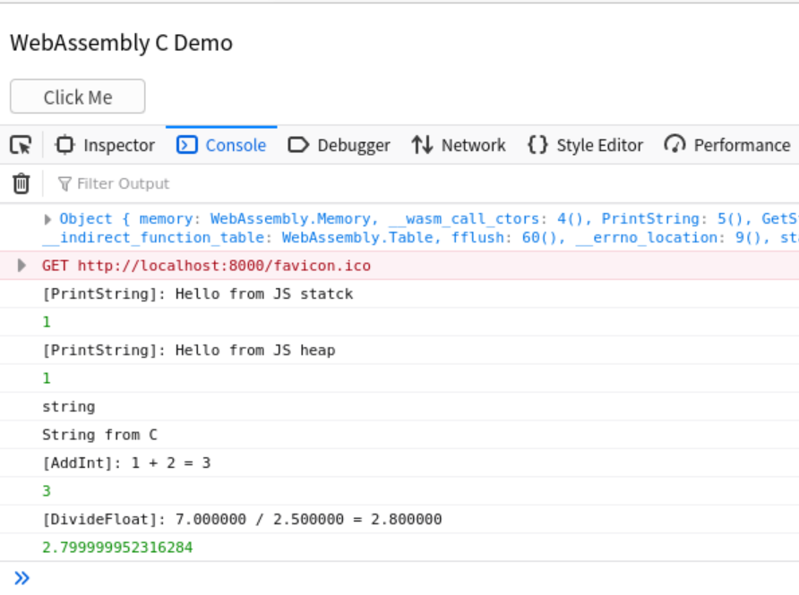

# WebAssembly

> 简单的“WebAssembly + C/Cpp”样例，所有样例可在[GitHub仓库](https://github.com/LittleBee1024/learning_book/tree/main/docs/topics/webassembly/code)中找到

## WebAssembly with C
### [代码实例](./code/hello_c)


* [C代码](./code/hello_c/api.c)
    * 通过`EMSCRIPTEN_KEEPALIVE`宏将C函数输出给JS代码
    * 支持字符串、整型和浮点数在C代码和JS代码之间传递
    ```c
    #include <stdio.h>

    #include <emscripten.h>

    EMSCRIPTEN_KEEPALIVE
    int PrintString(const char* str)
    {
        printf("[%s]: %s\n", __func__, str);
        return 1;
    }

    EMSCRIPTEN_KEEPALIVE
    const char* GetString()
    {
        static const char str[] = "String from C";
        return str;
    }

    EMSCRIPTEN_KEEPALIVE
    int AddInt(int a, int b)
    {
        int res = a + b;
        printf("[%s]: %d + %d = %d\n", __func__, a, b, res);
        return res;
    }

    EMSCRIPTEN_KEEPALIVE
    float DivideFloat(float a, float b)
    {
        float res = a / b;
        printf("[%s]: %f / %f = %f\n", __func__, a, b, res);
        return res;
    }
    ```

* [HTML代码](./code/hello_c/index.html)
    * JS中字符串可以创建在堆或者栈上，在堆上创建的字符串需要手动释放
    * 由于emcc默认不输出`malloc`和`free`，如果需要在堆上创建字符串，需要在编译时加入`-s "EXPORTED_FUNCTIONS=['_malloc', '_free']"`编译选项
    ```html
    <script>
        // Set up wasm module callback function to print info
        Module = {};
        Module.onRuntimeInitialized = function () {
            console.log(Module)
            // Print C function, malloc and free can be printed here
            // if they are exported intentionally when compiling
            console.log(Module['asm'])
        }
        // Set up button function
        function button() {
            // Pass string from JS to C
            strOnStack = allocateUTF8OnStack("Hello from JS stack");
            console.log(Module._PrintString(strOnStack));
            strOnHeap = allocateUTF8("Hello from JS heap");
            console.log(Module._PrintString(strOnHeap));
            Module._free(strOnHeap);

            // Get string from C to JS
            var str = UTF8ToString(Module._GetString());
            console.log(typeof (str));
            console.log(str);

            // Process Integer in C
            console.log(Module._AddInt(1, 2));

            // Process Float in C
            console.log(Module._DivideFloat(7, 2.5));
        }
    </script>
    ```

## WebAssembly with Cpp
### [代码实例](./code/hello_cpp)


* [Cpp代码](./code/hello_cpp/api.cpp)
    * 为了防止C++的`name mangling`，所有的API都通过`extern "C"`修饰后，以C API的形式传给JS
    * 支持C++多态，STL库
    ```cpp
    EMSCRIPTEN_KEEPALIVE extern "C"
    int CppPoly()
    {
        std::unique_ptr<CPP::Animal> a_dog = std::make_unique<CPP::Dog>("wang wang");
        std::unique_ptr<CPP::Animal> a_bird = std::make_unique<CPP::Bird>("zha zha");

        a_dog->set_weight(10);
        a_bird->set_weight(2);

        a_dog->dump();
        a_bird->dump();

        return 1;
    }

    EMSCRIPTEN_KEEPALIVE extern "C"
    const char* ConvertString(const char* input)
    {
        static std::string s_str;
        s_str.clear();
        s_str.append(input);
        std::cout << "Append CPP to the string: " << s_str << std::endl;
        s_str.append(" CPP");
        std::cout << "Return: " << s_str << std::endl;
        return s_str.c_str();
    }
    ```
* [HTML代码](./code/hello_cpp/index.html)
    * 用法和上面的C代码例子类似，此处不再细述

## WebAssembly的内存模型
Emscripten提供了一个`ArrayBuffer`对象，用于C/C++和JS代码共享内存，默认内存大小为：16MB (2^24 = 16777216)。我们可以在浏览器终端通过`Module['asm']['memory'].buffer`得到`ArrayBuffer`对象。

对象 | TypedArray | 对应C数据类型
---- | ------- | -------
Module.HEAP8 | Int8Array | int8
Module.HEAP16 | Int16Array | int16
Module.HEAP32 | Int32Array | int32
Module.HEAPU8 | Uint8Array | uint8
Module.HEAPU16 | Uint16Array | uint16
Module.HEAPU32 | Uint32Array | uint32
Module.HEAPF32 | Float32Array | float
Module.HEAPF64 | Float64Array | double

针对这16MB的内存空间，Emscripten在其上面创建了8种view(如上表)，分别对应8种数据类型。例如，`Module['HEAP8'] = new Int8Array(Module['asm']['memory'].buffer)`就在`ArrayBuffer`对象上创建了一个`HEAP8`的view。下图中，所有view的空间内存空间是一样的(下图中内存的起始内容都是一样的，大小也都是16MB)，由编译器确保不同变量的地址不冲突。


### 基本数据类型的传递
基本数据类型按值传递不需要考虑内存模型，直接用JS变量就可以传递和接收数据。

如果基本数据类型按指针传递，可以通过`Module.HEAP_[addr]`的方式在JS中直接获取内存的值，其中`addr`就是C代码返回的变量指针。C代码中的非局部变量都构建在`ArrayBuffer`对象上，因此JS可以通过相应的view进行访问。JS代码拿到C代码返回的内存指针后，经过偏移计算，就可以得到变量在view中的偏移。在JS中将内存内容拷贝到本地，就完成了从C代码项JS代码传数据的功能。

[例子"mem"](https://github.com/LittleBee1024/learning_book/tree/main/docs/topics/webassembly/code/mem)实现了C代码和JS代码对基本数据类型的读写：

* [Cpp代码](./code/mem/api.c)
    * C代码中的全局变量存在于`ArrayBuffer`对象，在JS中可通过对应的View加地址访问
    * 函数返回的指针，在JS代码中对应View上的地址
    ```c
    int g_int = 42;
    double g_double = 3.1415926;

    EMSCRIPTEN_KEEPALIVE
    int* GetIntPtr()
    {
        return &g_int;
    }

    EMSCRIPTEN_KEEPALIVE
    double* GetDoublePtr() {
        return &g_double;
    }

    EMSCRIPTEN_KEEPALIVE
    void PrintData() {
        printf("[%s]: g_int addr = %p, val = %d\n", __func__, &g_int, g_int);
        printf("[%s]: g_double addr = %p, val = %lf\n", __func__, &g_double, g_double);
    }
    ```

* [HTML代码](./code/mem/index.html)
    * 通过`Module.HEAP32[addr]`可以访问内存中的`int32`变量，其他类型方法雷同
    ```html
    <script>
        function button() {
            // HEAP32 heap
            var int_ptr = Module._GetIntPtr();
            // right shift 2 because sizeof(int) == 4(2^2)
            var int_value = Module.HEAP32[int_ptr >> 2];
            // Console output: Module.HEAP32[256] = 42
            console.log("Module.HEAP32[" +(int_ptr >> 2) + "] = " + int_value);

            // HEAPF64 heap
            var double_ptr = Module._GetDoublePtr();
            // right shift 2 because sizeof(double) == 8(2^3)
            var double_value = Module.HEAPF64[double_ptr >> 3];
            // Console output: Module.HEAPF64[201] = 3.1415926
            console.log("Module.HEAPF64[" +(double_ptr >> 3) + "] = " + double_value);

            // Modify the memory
            Module.HEAP32[int_ptr >> 2] = 13;
            Module.HEAPF64[double_ptr >> 3] = 123456.789
            // Console output: C{g_int:13} C{g_double:123456.789000}
            Module._PrintData()
        }
    </script>
    ```

* 实验结果

    

### 64位数据类型的传递

上面的`HEAP_`函数没有针对64位数据的操作，但是`emcc`提供了更上一层的方法`setValue`和`getValue`，支持`i8`, `i16`, `i32`, `i64`, `float`, `double`中的任意类型，详情可参考[手册](https://emscripten.org/docs/api_reference/preamble.js.html?highlight=heap32#accessing-memory)。默认情况下，这两个函数不会被export，因此在编译时需要添加`"EXPORTED_FUNCTIONS=[getValue, setValue]"`选项。

> 注意：当前版本的`emcc`的`getValue`对于64位整数的读取和32位整数的读取完全一样，因此如果当前数据超过`2^32`大小会存在问题，请通过分别读取低32位和高32位获取完整的64位数据。而`setValue`没有此问题。

[例子"mem_64"](https://github.com/LittleBee1024/learning_book/tree/main/docs/topics/webassembly/code/mem_64)实现了C代码和JS代码对64位整数的读写：
```c title="api.c" hl_lines="2"
EMSCRIPTEN_KEEPALIVE
int64_t* GetInt64Ptr()
{
   return &g_int64;
}

EMSCRIPTEN_KEEPALIVE
void PrintData() {
   printf("[%s]: g_int64 addr = %p, val = %lld\n", __func__, &g_int64, g_int64);
}
```
```html title="index.html" hl_lines="5 6 7 11"
<script>
    function button() {
        // Get 64-bit data
        const int64_ptr = Module._GetInt64Ptr();
        const int64_low32 = BigInt(Module.HEAP32[int64_ptr >> 2])
        const int64_high32 = BigInt(Module.HEAP32[(int64_ptr + 4) >> 2])
        const int64_value = (int64_high32 << BigInt(32)) + int64_low32
        console.log("Module.getValue[" + int64_ptr + "] = " + int64_value.toString(16));

        // Set 64-bit data
        Module.setValue(int64_ptr, -1 * Math.pow(2, 33), "i64")
        Module._PrintData()
    }
</script>
```

### 数组类型的传递
和基本数据类型指针传递不同，数组类型传递需要知道数组大小。在JS代码中拿到数组的起始地址和长度后，将全部内容拷贝到JS本地变量中。同时，JS应该负责内存的释放。

[例子"web_mem_arr"](https://github.com/LittleBee1024/learning_book/tree/main/docs/topics/webassembly/code/web_mem_arr)实现了C代码和JS代码对基本数组类型的读写：

* [Cpp代码](./code/mem_arr/api.c)
    * C代码接收JS传过来的数组起始地址和数组大小，并创建了一个新的数组返回给JS
    * 这里虽然C代码在堆上建立了一个新的数组，但是将释放的权限转交给了JS
    ```c
    EMSCRIPTEN_KEEPALIVE
    int* DoubleArr(const int* buf, const int len) {
        int* ret_buf = (int*)malloc(len * sizeof(int));

        for (int i = 0; i < len; i++) {
            //printf("[%s]: Array from JS buf[%d] = %d\n", __func__, i, buf[i]);
            ret_buf[i] = buf[i] * 2;
        }

    return ret_buf;
    }
    ```

* [HTML代码](./code/mem_arr/index.html)
    * 从打印的结果可以看出，虽然我们释放了内存，但是每次按下按钮，构建的内存地址都是不变的，说明编译器对其做了优化。
    ```html
    <script>
        // Set up button function
        function button() {
            const len = 10;
            const elem_bytes = Int32Array.BYTES_PER_ELEMENT;
            const js_arr_on_heap = Module._malloc(elem_bytes * len);
            console.log("Address of JS buffer: " + js_arr_on_heap);

            for (let i = 0; i < len; i++){
                Module.HEAP32[js_arr_on_heap / elem_bytes + i] = i + 1;
            }

            // Pass buffer from JS to C
            console.log(Module._SumArray(js_arr_on_heap, len));
            // Return buffer from C to JS
            const c_arr_on_heap = Module._DoubleArr(js_arr_on_heap, len);
            console.log("Address of C buffer: " + c_arr_on_heap);

            const data = []
            for (let i = 0; i < len; i++) {
                data.push(Module.HEAP32[c_arr_on_heap / elem_bytes + i]);
            }
            console.log(data);

            Module._free(js_arr_on_heap);
            Module._free(c_arr_on_heap);
        }
    </script>
    ```

* 实验结果

    


### 64位数组类型的传递

[例子"mem_64_arr"](https://github.com/LittleBee1024/learning_book/tree/main/docs/topics/webassembly/code/mem_64_arr)和64位整数类型一样，利用`getValue/setValue`就可以对64位数组类型进行了读写：

```c title="api.c" hl_lines="2"
EMSCRIPTEN_KEEPALIVE
int64_t* DoubleArr64(const int64_t* buf, const int len) {
    int64_t* ret_buf = (int64_t*)malloc(len * sizeof(int64_t));

    for (int i = 0; i < len; i++) {
        printf("[%s]: Array from JS buf[%d] = %lld(0x%llx)\n", __func__, i, buf[i], buf[i]);
        ret_buf[i] = buf[i] * 2;
    }

    return ret_buf;
}
```
```html title="index.html" hl_lines="10 14 20"
<script>
    ...
    function button() {
        const len = 10;
        const js_arr_on_heap = Module._malloc(BigInt64Array.BYTES_PER_ELEMENT * len);
        console.log("Address of JS buffer: " + js_arr_on_heap);

        for (let i = 0; i < len; i++){
            let addr = js_arr_on_heap + i * BigInt64Array.BYTES_PER_ELEMENT
            Module.setValue(addr, i + 1, "i64")
        }

        // Return buffer from C to JS
        const c_arr_on_heap = Module._DoubleArr64(js_arr_on_heap, len);
        console.log("Address of C buffer: " + c_arr_on_heap);

        for (let i = 0; i < len; i++) {
            let addr = c_arr_on_heap + i * BigInt64Array.BYTES_PER_ELEMENT
            const int64_low32 = BigInt(Module.HEAP32[addr >> 2])
            const int64_high32 = BigInt(Module.HEAP32[(addr + 4) >> 2])
            const int64_value = (int64_high32 << BigInt(32)) + int64_low32
            console.log(int64_value.toString(16))
        }

        Module._free(js_arr_on_heap);
        Module._free(c_arr_on_heap);
    }
</script>
```

## 参考
* [Emscripten编译选项](https://emscripten.org/docs/tools_reference/emcc.html)

